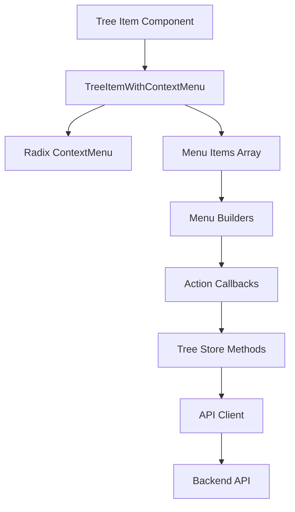

# Context Menu Implementation Guide

Technical guide for implementing context menus using the TreeItemWithContextMenu pattern.

## Architecture Overview



**Flow:**
1. Tree item wrapped in TreeItemWithContextMenu
2. Menu items generated by builder functions
3. User interaction triggers callback
4. Callback invokes tree store method
5. Store calls API client
6. API request sent to backend
7. Response updates local state
8. Tree re-renders with updated data

## Component Implementation

### TreeItemWithContextMenu Component

**Location:** `frontend/src/shared/components/TreeItemWithContextMenu.tsx`

```tsx
interface MenuItem {
  icon: LucideIcon;
  label: string;
  onClick: () => void;
  danger?: boolean;
  disabled?: boolean;
  shortcut?: string;
}

interface Props {
  trigger: React.ReactNode;
  menuItems: MenuItem[];
}

export function TreeItemWithContextMenu({ trigger, menuItems }: Props) {
  return (
    <ContextMenu>
      <ContextMenuTrigger asChild>
        {trigger}
      </ContextMenuTrigger>

      <ContextMenuContent className="w-56">
        {menuItems.map((item, index) => (
          <ContextMenuItem
            key={index}
            onClick={item.onClick}
            disabled={item.disabled}
            className={cn(
              item.danger && "text-destructive focus:text-destructive"
            )}
          >
            <item.icon className="mr-2 h-4 w-4" />
            <span>{item.label}</span>
            {item.shortcut && (
              <ContextMenuShortcut>{item.shortcut}</ContextMenuShortcut>
            )}
          </ContextMenuItem>
        ))}
      </ContextMenuContent>
    </ContextMenu>
  );
}
```

**Design decisions:**
- `asChild` on trigger: Prevents wrapping div (better for tree structure)
- `w-56` width: Consistent menu width across all contexts
- Danger styling: Red text for destructive actions
- Shortcut display: Visual hint for keyboard shortcuts (future)

### Menu Builder Pattern

**Location:** `frontend/src/features/documents/utils/menuBuilders.ts`

```typescript
import { Pencil, Trash2, FilePlus, FolderPlus, Upload } from 'lucide-react';

export function createDocumentMenuItems(
  document: Document,
  callbacks: {
    onRename: () => void;
    onDelete: () => void;
  }
): MenuItem[] {
  return [
    {
      icon: Pencil,
      label: 'Rename',
      onClick: callbacks.onRename,
    },
    {
      icon: Trash2,
      label: 'Delete',
      onClick: callbacks.onDelete,
      danger: true,
    },
  ];
}

export function createFolderMenuItems(
  folder: Folder,
  callbacks: {
    onCreateDocument: () => void;
    onCreateFolder: () => void;
    onRename: () => void;
    onDelete: () => void;
    onImport: () => void;
  }
): MenuItem[] {
  return [
    {
      icon: FilePlus,
      label: 'Create Document',
      onClick: callbacks.onCreateDocument,
    },
    {
      icon: FolderPlus,
      label: 'Create Folder',
      onClick: callbacks.onCreateFolder,
    },
    { icon: Pencil, label: 'Rename', onClick: callbacks.onRename },
    { icon: Trash2, label: 'Delete', onClick: callbacks.onDelete, danger: true },
    { icon: Upload, label: 'Import', onClick: callbacks.onImport },
  ];
}

export function createRootMenuItems(
  projectId: string,
  callbacks: {
    onCreateDocument: () => void;
    onCreateFolder: () => void;
    onImport: () => void;
  }
): MenuItem[] {
  return [
    {
      icon: FilePlus,
      label: 'Create Document',
      onClick: callbacks.onCreateDocument,
    },
    {
      icon: FolderPlus,
      label: 'Create Folder',
      onClick: callbacks.onCreateFolder,
    },
    {
      icon: Upload,
      label: 'Import',
      onClick: callbacks.onImport,
    },
  ];
}
```

**Why separate builders?**
- Different contexts need different actions
- Easier to test individual builders
- Centralized menu logic (don't repeat in every component)
- Type-safe callbacks (TypeScript infers correct callback shape)

## Integration with Tree Components

### Document Tree Item

```tsx
function DocumentTreeItem({ document }: { document: Document }) {
  const [isRenameDialogOpen, setIsRenameDialogOpen] = useState(false);
  const { deleteDocument, renameDocument } = useTreeStore();

  const handleRename = () => {
    setIsRenameDialogOpen(true);
  };

  const handleDelete = () => {
    if (confirm(`Delete "${document.name}"?`)) {
      deleteDocument(document.id);
    }
  };

  const menuItems = createDocumentMenuItems(document, {
    onRename: handleRename,
    onDelete: handleDelete,
  });

  return (
    <>
      <TreeItemWithContextMenu
        trigger={
          <div className="flex items-center gap-2 p-2 hover:bg-accent rounded-md">
            <FileText className="h-4 w-4" />
            <span>{document.name}</span>
          </div>
        }
        menuItems={menuItems}
      />

      <RenameDialog
        open={isRenameDialogOpen}
        onOpenChange={setIsRenameDialogOpen}
        initialName={document.name}
        onRename={(newName) => renameDocument(document.id, newName)}
      />
    </>
  );
}
```

### Folder Tree Item

```tsx
function FolderTreeItem({ folder }: { folder: Folder }) {
  const [isCreateDocDialogOpen, setIsCreateDocDialogOpen] = useState(false);
  const [isCreateFolderDialogOpen, setIsCreateFolderDialogOpen] = useState(false);
  const [isRenameDialogOpen, setIsRenameDialogOpen] = useState(false);
  const [isImportDialogOpen, setIsImportDialogOpen] = useState(false);

  const { deleteFolder, renameFolder } = useTreeStore();

  const menuItems = createFolderMenuItems(folder, {
    onCreateDocument: () => setIsCreateDocDialogOpen(true),
    onCreateFolder: () => setIsCreateFolderDialogOpen(true),
    onRename: () => setIsRenameDialogOpen(true),
    onDelete: () => {
      if (confirm(`Delete folder "${folder.name}"?`)) {
        deleteFolder(folder.id);
      }
    },
    onImport: () => setIsImportDialogOpen(true),
  });

  return (
    <>
      <TreeItemWithContextMenu
        trigger={
          <div className="flex items-center gap-2 p-2 hover:bg-accent rounded-md">
            <Folder className="h-4 w-4" />
            <span>{folder.name}</span>
          </div>
        }
        menuItems={menuItems}
      />

      {/* Dialogs */}
      <CreateDocumentDialog
        open={isCreateDocDialogOpen}
        onOpenChange={setIsCreateDocDialogOpen}
        folderId={folder.id}
      />
      {/* ... other dialogs ... */}
    </>
  );
}
```

### Root Level (Project)

```tsx
function ProjectTreeRoot({ project }: { project: Project }) {
  const [isCreateDocDialogOpen, setIsCreateDocDialogOpen] = useState(false);
  const [isCreateFolderDialogOpen, setIsCreateFolderDialogOpen] = useState(false);
  const [isImportDialogOpen, setIsImportDialogOpen] = useState(false);

  const menuItems = createRootMenuItems(project.id, {
    onCreateDocument: () => setIsCreateDocDialogOpen(true),
    onCreateFolder: () => setIsCreateFolderDialogOpen(true),
    onImport: () => setIsImportDialogOpen(true),
  });

  return (
    <>
      <TreeItemWithContextMenu
        trigger={
          <div className="flex items-center gap-2 p-2 hover:bg-accent rounded-md font-semibold">
            <FolderTree className="h-4 w-4" />
            <span>{project.name}</span>
          </div>
        }
        menuItems={menuItems}
      />

      {/* Dialogs */}
      <CreateDocumentDialog
        open={isCreateDocDialogOpen}
        onOpenChange={setIsCreateDocDialogOpen}
        projectId={project.id}
      />
      {/* ... other dialogs ... */}
    </>
  );
}
```

## State Management

### Tree Store Methods

**Location:** `frontend/src/core/stores/useTreeStore.ts`

```typescript
interface TreeStore {
  // ... other fields ...

  // Document actions
  createDocument: (projectId: string, folderId: string | null, name: string, content: string) => Promise<void>;
  deleteDocument: (documentId: string) => Promise<void>;
  renameDocument: (documentId: string, newName: string) => Promise<void>;

  // Folder actions
  createFolder: (projectId: string, parentId: string | null, name: string) => Promise<void>;
  deleteFolder: (folderId: string) => Promise<void>;
  renameFolder: (folderId: string, newName: string) => Promise<void>;

  // Tree refresh
  reloadTree: (projectId: string) => Promise<void>;
}
```

**Implementation example (deleteDocument):**
```typescript
deleteDocument: async (documentId: string) => {
  try {
    await api.documents.delete(documentId);

    // Optimistic update: Remove from local tree immediately
    set(state => ({
      tree: removeDocumentFromTree(state.tree, documentId)
    }));

    // Reload tree to ensure consistency
    const projectId = get().currentProjectId;
    if (projectId) {
      await get().reloadTree(projectId);
    }
  } catch (error) {
    console.error('Failed to delete document:', error);
    // Show error toast
  }
}
```

**Pattern:**
1. Call API to perform action
2. Optimistic update (instant feedback)
3. Reload tree from server (ensure consistency)
4. Handle errors with user notification

### API Client

**Location:** `frontend/src/core/lib/api.ts`

```typescript
export const api = {
  documents: {
    delete: async (id: string): Promise<void> => {
      const response = await fetch(`/api/documents/${id}`, {
        method: 'DELETE',
      });

      if (!response.ok) {
        throw new Error('Failed to delete document');
      }
    },
  },
  folders: {
    create: async (projectId: string, name: string, parentId: string | null): Promise<Folder> => {
      const response = await fetch('/api/folders', {
        method: 'POST',
        headers: { 'Content-Type': 'application/json' },
        body: JSON.stringify({ project_id: projectId, name, parent_id: parentId }),
      });

      if (!response.ok) {
        throw new Error('Failed to create folder');
      }

      return response.json();
    },
    // ... other methods ...
  },
};
```

## Dialog Components

### Rename Dialog

```tsx
interface RenameDialogProps {
  open: boolean;
  onOpenChange: (open: boolean) => void;
  initialName: string;
  onRename: (newName: string) => Promise<void>;
}

export function RenameDialog({ open, onOpenChange, initialName, onRename }: RenameDialogProps) {
  const [name, setName] = useState(initialName);
  const [isLoading, setIsLoading] = useState(false);

  const handleSubmit = async (e: React.FormEvent) => {
    e.preventDefault();
    setIsLoading(true);

    try {
      await onRename(name);
      onOpenChange(false);
    } catch (error) {
      console.error('Rename failed:', error);
    } finally {
      setIsLoading(false);
    }
  };

  return (
    <Dialog open={open} onOpenChange={onOpenChange}>
      <DialogContent>
        <DialogHeader>
          <DialogTitle>Rename</DialogTitle>
        </DialogHeader>

        <form onSubmit={handleSubmit}>
          <Input
            value={name}
            onChange={(e) => setName(e.target.value)}
            placeholder="Enter new name"
            autoFocus
          />

          <DialogFooter>
            <Button type="button" variant="outline" onClick={() => onOpenChange(false)}>
              Cancel
            </Button>
            <Button type="submit" disabled={isLoading || !name.trim()}>
              {isLoading ? 'Renaming...' : 'Rename'}
            </Button>
          </DialogFooter>
        </form>
      </DialogContent>
    </Dialog>
  );
}
```

### Create Dialog

```tsx
interface CreateDocumentDialogProps {
  open: boolean;
  onOpenChange: (open: boolean) => void;
  projectId?: string;
  folderId?: string | null;
}

export function CreateDocumentDialog({ open, onOpenChange, projectId, folderId }: CreateDocumentDialogProps) {
  const [name, setName] = useState('');
  const { createDocument } = useTreeStore();

  const handleSubmit = async (e: React.FormEvent) => {
    e.preventDefault();

    if (!projectId) return;

    await createDocument(projectId, folderId || null, name, '');
    setName('');
    onOpenChange(false);
  };

  return (
    <Dialog open={open} onOpenChange={onOpenChange}>
      <DialogContent>
        <DialogHeader>
          <DialogTitle>Create Document</DialogTitle>
        </DialogHeader>

        <form onSubmit={handleSubmit}>
          <Input
            value={name}
            onChange={(e) => setName(e.target.value)}
            placeholder="Document name"
            autoFocus
          />

          <DialogFooter>
            <Button type="button" variant="outline" onClick={() => onOpenChange(false)}>
              Cancel
            </Button>
            <Button type="submit" disabled={!name.trim()}>
              Create
            </Button>
          </DialogFooter>
        </form>
      </DialogContent>
    </Dialog>
  );
}
```

## Advanced Patterns

### Conditional Menu Items

**Example:** Disable "Delete" if folder is not empty:

```typescript
export function createFolderMenuItems(
  folder: Folder,
  callbacks: { /* ... */ },
  options: { isEmpty: boolean }
): MenuItem[] {
  return [
    // ... other items ...
    {
      icon: Trash2,
      label: 'Delete',
      onClick: callbacks.onDelete,
      danger: true,
      disabled: !options.isEmpty,
    },
  ];
}
```

**Usage:**
```tsx
const menuItems = createFolderMenuItems(
  folder,
  callbacks,
  { isEmpty: folder.children.length === 0 }
);
```

### Menu Item Dividers

**Grouping related actions:**

```typescript
// Add divider to MenuItem type
interface MenuItem {
  type?: 'item' | 'separator';
  // ... other fields ...
}

// Use in builder
export function createFolderMenuItems(/* ... */): MenuItem[] {
  return [
    { icon: FilePlus, label: 'Create Document', onClick: callbacks.onCreateDocument },
    { icon: FolderPlus, label: 'Create Folder', onClick: callbacks.onCreateFolder },
    { type: 'separator' },  // Divider
    { icon: Pencil, label: 'Rename', onClick: callbacks.onRename },
    { icon: Trash2, label: 'Delete', onClick: callbacks.onDelete, danger: true },
  ];
}

// Render in component
{menuItems.map((item, index) =>
  item.type === 'separator' ? (
    <ContextMenuSeparator key={index} />
  ) : (
    <ContextMenuItem key={index} {...item} />
  )
)}
```

### Sub-Menus (Nested Menus)

**Example:** "Move to" sub-menu for relocating documents:

```tsx
<ContextMenuSub>
  <ContextMenuSubTrigger>
    <FolderOpen className="mr-2 h-4 w-4" />
    <span>Move to</span>
  </ContextMenuSubTrigger>

  <ContextMenuSubContent>
    {folders.map(folder => (
      <ContextMenuItem key={folder.id} onClick={() => moveToFolder(folder.id)}>
        <Folder className="mr-2 h-4 w-4" />
        <span>{folder.name}</span>
      </ContextMenuItem>
    ))}
  </ContextMenuSubContent>
</ContextMenuSub>
```

## Testing

### Unit Tests (Menu Builders)

```typescript
import { createDocumentMenuItems } from './menuBuilders';

describe('createDocumentMenuItems', () => {
  it('should create menu items with correct labels', () => {
    const mockDocument = { id: '1', name: 'Test Doc' };
    const mockCallbacks = {
      onRename: jest.fn(),
      onDelete: jest.fn(),
    };

    const items = createDocumentMenuItems(mockDocument, mockCallbacks);

    expect(items).toHaveLength(2);
    expect(items[0].label).toBe('Rename');
    expect(items[1].label).toBe('Delete');
    expect(items[1].danger).toBe(true);
  });

  it('should call onRename callback when rename item is clicked', () => {
    const mockCallbacks = {
      onRename: jest.fn(),
      onDelete: jest.fn(),
    };

    const items = createDocumentMenuItems({}, mockCallbacks);
    items[0].onClick();

    expect(mockCallbacks.onRename).toHaveBeenCalledTimes(1);
  });
});
```

### Integration Tests (Component)

```typescript
import { render, fireEvent, screen } from '@testing-library/react';
import { DocumentTreeItem } from './DocumentTreeItem';

describe('DocumentTreeItem Context Menu', () => {
  it('should show context menu on right-click', () => {
    const document = { id: '1', name: 'Test Document' };
    render(<DocumentTreeItem document={document} />);

    const treeItem = screen.getByText('Test Document');
    fireEvent.contextMenu(treeItem);

    expect(screen.getByText('Rename')).toBeInTheDocument();
    expect(screen.getByText('Delete')).toBeInTheDocument();
  });

  it('should call delete handler when delete is clicked', async () => {
    const mockDelete = jest.fn();
    jest.spyOn(useTreeStore, 'getState').mockReturnValue({
      deleteDocument: mockDelete,
    });

    const document = { id: '1', name: 'Test Document' };
    render(<DocumentTreeItem document={document} />);

    fireEvent.contextMenu(screen.getByText('Test Document'));
    fireEvent.click(screen.getByText('Delete'));

    // Confirm dialog
    expect(window.confirm).toHaveBeenCalled();
    expect(mockDelete).toHaveBeenCalledWith('1');
  });
});
```

## Key Files

- `frontend/src/shared/components/TreeItemWithContextMenu.tsx` - Core component
- `frontend/src/features/documents/utils/menuBuilders.ts` - Menu builders
- `frontend/src/components/ui/context-menu.tsx` - Radix UI primitives
- `frontend/src/core/stores/useTreeStore.ts` - Tree actions
- `frontend/src/core/lib/api.ts` - API client

## Dependencies

- `@radix-ui/react-context-menu` - Context menu primitives
- `lucide-react` - Icons
- `class-variance-authority` (cvn) - Conditional styling
