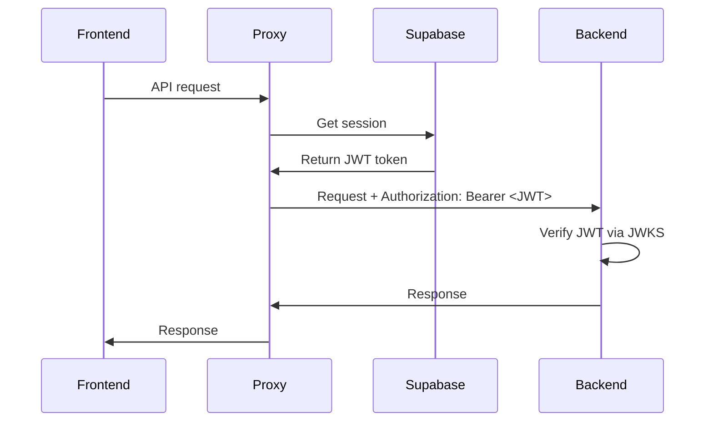

# Supabase Auth Integration

**Cookie-based authentication with Supabase Auth and automatic JWT injection.**

## Status:  Complete (Frontend + Backend)

---

## Frontend Implementation

### Supabase Client

**Files**:
- `/Users/jimmyyao/gitrepos/meridian/frontend/src/core/supabase/client.ts` - Browser client
- `/Users/jimmyyao/gitrepos/meridian/frontend/src/core/supabase/server.ts` - Server client

**Features**:
- Cookie-based session storage
- Automatic token refresh
- Browser and Server client factories
- PKCE flow support

**Client Creation**:
```typescript
// Browser client (client components)
import { createClient } from '@/core/supabase/client'
const supabase = createClient()

// Server client (server components/actions)
import { createClient } from '@/core/supabase/server'
const supabase = await createClient()
```

### Login Flow

**File**: `/Users/jimmyyao/gitrepos/meridian/frontend/src/app/login/page.tsx`

**OAuth Flow**:
1. User clicks "Sign in with Google"
2. Redirects to Supabase Auth with PKCE challenge
3. User authenticates with Google
4. Callback to `/auth/callback` with authorization code
5. Exchange code for session (stored in cookies)
6. Redirect to `/projects`

**UI**: Clean interface with Google OAuth button (shadcn Card component)

### Session Management

**Automatic Features**:
- Session refresh on expiry (handled by Supabase client)
- Token extraction for API calls
- Session expiry detection

**JWT Injection**: All API calls automatically include JWT token via proxy

---

## Backend Integration

### JWT Verification

**Backend receives JWT from frontend via `Authorization` header**:
- Frontend proxy adds `Authorization: Bearer <token>` to all API requests
- Backend validates JWT via JWKS (see [jwt-validation.md](jwt-validation.md))

### JWKS Endpoint

**Supabase provides public keys**:
- Endpoint: `{SUPABASE_URL}/auth/v1/.well-known/jwks.json`
- Backend fetches keys automatically
- Keys cached and refreshed based on HTTP headers

---

## Configuration

### Frontend Environment Variables
```env
NEXT_PUBLIC_SUPABASE_URL=https://xxx.supabase.co
NEXT_PUBLIC_SUPABASE_ANON_KEY=eyJhbGciOiJIUzI1NiIsInR5cCI6IkpXVCJ9...
```

### Backend Environment Variables
```env
SUPABASE_URL=https://xxx.supabase.co
SUPABASE_KEY=eyJhbGciOiJIUzI1NiIsInR5cCI6IkpXVCJ9... (service role key)
```

---

## OAuth Configuration

**Supabase Dashboard** ’ Authentication ’ Providers ’ Google:
- Enable Google provider
- Add OAuth credentials (Client ID, Client Secret)
- Configure redirect URLs:
  - `http://localhost:3000/auth/callback` (dev)
  - `https://app.meridian.com/auth/callback` (prod)

---

## Session Storage

**Cookie-based** (not localStorage):
- More secure (HttpOnly, SameSite)
- Works with Server Components
- Automatic expiry handling

**Cookie Names**:
- `sb-access-token`
- `sb-refresh-token`

---

## Auth Callback Handler

**File**: `/Users/jimmyyao/gitrepos/meridian/frontend/src/app/auth/callback/route.ts`

**Flow**:
1. Receive authorization code from OAuth provider
2. Exchange code for session via Supabase
3. Store session in cookies
4. Redirect to `/projects`

---

## API Request Flow



---

## Row Level Security (RLS)

**Supabase Database**:
- RLS enabled on all tables
- `block_postgrest` policy prevents direct PostgREST access
- Backend bypasses RLS (uses postgres superuser connection)
- Frontend never accesses database directly

**Purpose**: Ensure all data access goes through backend API

---

## Known Limitations

1. **Google OAuth only** - No email/password authentication
2. **No social providers** - Only Google configured
3. **No MFA** - Multi-factor authentication not enabled
4. **No account management** - No UI for email change, password reset, etc.

---

## Security Features

1. **Cookie-based sessions** - More secure than localStorage
2. **Automatic token refresh** - No manual refresh logic needed
3. **PKCE flow** - Protects against authorization code interception
4. **HttpOnly cookies** - JavaScript cannot access tokens
5. **SameSite cookies** - CSRF protection

---

## Related

- See [jwt-validation.md](jwt-validation.md) for backend JWT verification
- See [protected-routes.md](protected-routes.md) for route protection
- See `/_docs/technical/auth-overview.md` (cross-stack auth flow)
