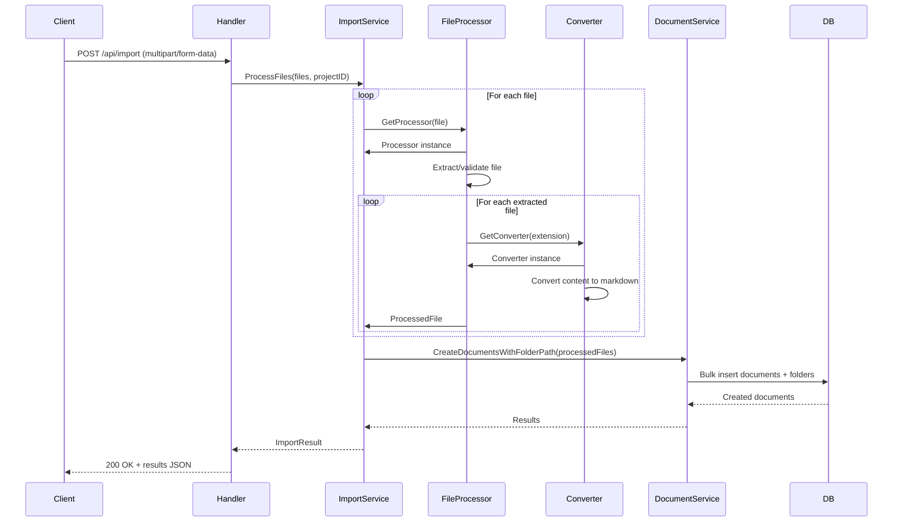

# Import System Backend Architecture

SOLID-compliant architecture using Strategy and Factory patterns for extensible document import.

## Design Patterns

### Strategy Pattern - File Processors

**Problem:** Different file types (zip vs individual) require different extraction logic.

**Solution:** `FileProcessor` interface with strategy implementations.

```go
type FileProcessor interface {
    ProcessFiles(files []*multipart.FileHeader, projectID uuid.UUID) ([]ProcessedFile, error)
}

// Strategies:
// - ZipFileProcessor: Extracts zip archive → individual files
// - IndividualFileProcessor: Passes through individual files
```

**Registry-based routing:**
```go
func (r *FileProcessorRegistry) GetProcessor(file *multipart.FileHeader) (FileProcessor, error) {
    if isZipFile(file) {
        return r.zipProcessor, nil
    }
    return r.individualProcessor, nil
}
```

### Factory Pattern - Content Converters

**Problem:** Different file formats (.md, .txt, .html) need different conversion logic.

**Solution:** `ContentConverter` interface with format-specific implementations.

```go
type ContentConverter interface {
    Convert(content string, metadata map[string]string) (string, error)
    SupportedExtensions() []string
}

// Implementations:
// - MarkdownConverter: Pass-through (no conversion)
// - TextConverter: Wraps in markdown code block if needed
// - HTMLConverter: HTML → Markdown + XSS sanitization
```

**Registry-based routing:**
```go
func (r *ConverterRegistry) GetConverter(ext string) (ContentConverter, error) {
    converter, ok := r.converters[strings.ToLower(ext)]
    // Routes .md → MarkdownConverter, .html → HTMLConverter, etc.
}
```

## Import Flow



## Component Details

### FileProcessorRegistry

**Location:** `internal/service/docsystem/file_processor_registry.go`

**Responsibilities:**
- Route files to appropriate processor (zip vs individual)
- Validate file types before processing
- Return errors for unsupported file types

**Key Methods:**
- `GetProcessor(file) (FileProcessor, error)` - Routes based on file type
- `ProcessFiles(files, projectID) ([]ProcessedFile, error)` - Orchestrates processing

### ZipFileProcessor

**Location:** `internal/service/docsystem/zip_file_processor.go`

**Responsibilities:**
- Extract zip archive contents
- Preserve folder hierarchy from zip structure
- Route each extracted file to appropriate converter
- Handle nested zips (flatten or reject)

**Key Logic:**
```go
// Extract zip → iterate files → convert each → collect ProcessedFiles
for _, zipFile := range zipReader.File {
    folderPath := extractFolderPath(zipFile.Name)  // "dir/subdir/file.md" → "dir/subdir"
    fileName := extractFileName(zipFile.Name)       // "file.md"
    content := readContent(zipFile)

    converter := converterRegistry.GetConverter(filepath.Ext(fileName))
    convertedContent := converter.Convert(content, metadata)

    processedFiles = append(processedFiles, ProcessedFile{
        Name: fileName,
        Content: convertedContent,
        FolderPath: folderPath,
    })
}
```

### IndividualFileProcessor

**Location:** `internal/service/docsystem/individual_file_processor.go`

**Responsibilities:**
- Process single uploaded files
- Route to converter based on file extension
- Return single ProcessedFile

**Simpler than zip processor:**
```go
content := readContent(file)
converter := converterRegistry.GetConverter(filepath.Ext(file.Filename))
convertedContent := converter.Convert(content, metadata)

return []ProcessedFile{{
    Name: file.Filename,
    Content: convertedContent,
    FolderPath: "",  // Root level
}}
```

### ConverterRegistry

**Location:** `internal/service/docsystem/converter/registry.go`

**Responsibilities:**
- Map file extensions to converters (.md → MarkdownConverter, .html → HTMLConverter)
- Validate extensions before conversion
- Return errors for unsupported formats

**Registration:**
```go
func NewConverterRegistry() *ConverterRegistry {
    registry := &ConverterRegistry{converters: make(map[string]ContentConverter)}

    // Register converters
    registry.Register(NewMarkdownConverter())  // .md
    registry.Register(NewTextConverter())      // .txt
    registry.Register(NewHTMLConverter())      // .html, .htm

    return registry
}
```

### HTMLConverter (Security-Critical)

**Location:** `internal/service/docsystem/converter/html_converter.go`

**Responsibilities:**
- Sanitize HTML to prevent XSS attacks
- Convert sanitized HTML to markdown
- Preserve semantic structure (headings, lists, links)

**Two-stage pipeline:**
```go
func (c *HTMLConverter) Convert(content string, metadata map[string]string) (string, error) {
    // Stage 1: Sanitize (XSS prevention)
    policy := bluemonday.UGCPolicy()  // User-generated content policy
    sanitized := policy.Sanitize(content)

    // Stage 2: Convert to markdown
    markdown := md.Convert(sanitized)

    return markdown, nil
}
```

**Allowed HTML tags (bluemonday UGC policy):**
- Text: `<p>, <b>, <i>, <u>, <strong>, <em>`
- Structure: `<h1>-<h6>, <ul>, <ol>, <li>, <blockquote>`
- Links: `<a>` (href validated)
- No scripts: `<script>, <iframe>, <object>` are stripped

## Error Handling

### Per-File Errors

Import continues even if individual files fail:

```go
for _, file := range files {
    result, err := processor.ProcessFile(file)
    if err != nil {
        results.Failed = append(results.Failed, FileResult{
            Name: file.Filename,
            Error: err.Error(),
        })
        continue  // Continue processing other files
    }
    results.Succeeded = append(results.Succeeded, result)
}
```

**Error types:**
- `ErrUnsupportedFormat` - File extension not recognized
- `ErrFileTooLarge` - Exceeds size limit
- `ErrInvalidZip` - Corrupted zip archive
- `ErrConversionFailed` - Converter error (e.g., invalid HTML)

### Partial Success Response

```json
{
  "succeeded": [
    {"name": "chapter1.md", "id": "uuid-1"},
    {"name": "chapter2.txt", "id": "uuid-2"}
  ],
  "failed": [
    {"name": "corrupted.html", "error": "invalid HTML structure"}
  ]
}
```

Frontend shows summary: "2 of 3 files imported successfully"

## Extensibility

### Adding a New Converter

1. **Create converter:**
```go
// internal/service/docsystem/converter/pdf_converter.go
type PDFConverter struct{}

func (c *PDFConverter) Convert(content string, metadata map[string]string) (string, error) {
    // Convert PDF to markdown
}

func (c *PDFConverter) SupportedExtensions() []string {
    return []string{".pdf"}
}
```

2. **Register in registry:**
```go
registry.Register(NewPDFConverter())
```

3. **No changes needed** - Routing happens automatically

### Adding a New File Processor

Example: Google Drive import

1. **Implement FileProcessor interface:**
```go
type GoogleDriveProcessor struct{}

func (p *GoogleDriveProcessor) ProcessFiles(files []*multipart.FileHeader, projectID uuid.UUID) ([]ProcessedFile, error) {
    // Fetch from Google Drive API
}
```

2. **Add to registry:**
```go
registry.AddProcessor("google-drive", NewGoogleDriveProcessor())
```

## Performance Considerations

### Streaming Large Zips

Current implementation loads entire zip into memory. For production with large files:

```go
// TODO: Stream zip processing
for _, zipFile := range zipReader.File {
    reader := zipFile.Open()
    defer reader.Close()

    // Process in chunks instead of loading entire file
    buffer := make([]byte, 4096)
    for {
        n, err := reader.Read(buffer)
        // Process chunk
    }
}
```

### Concurrent Conversion

For large imports, convert files concurrently:

```go
// TODO: Parallel conversion with worker pool
var wg sync.WaitGroup
resultsChan := make(chan ProcessedFile, len(files))

for _, file := range files {
    wg.Add(1)
    go func(f *multipart.FileHeader) {
        defer wg.Done()
        result := convertFile(f)
        resultsChan <- result
    }(file)
}
```

## Testing Strategy

### Unit Tests

- **ConverterRegistry:** Test extension routing
- **Each Converter:** Test content transformation
- **FileProcessors:** Test file extraction logic
- **HTMLConverter:** Test XSS prevention (attempt script injection)

### Integration Tests

- Upload sample zip with nested folders → verify folder structure
- Upload HTML with script tags → verify sanitization
- Upload mixed formats (.md + .txt + .html) → verify all converted

### Edge Cases

- Empty zip archive → return empty results
- Zip with no valid files → return error
- HTML with only disallowed tags → return empty markdown
- File extension mismatch (e.g., .txt contains HTML) → convert as text

## Security Considerations

### XSS Prevention

**Critical:** HTML imports MUST be sanitized before storage.

**Implementation:** `bluemonday.UGCPolicy()` allows only safe HTML tags.

**Test:** Attempt to upload HTML containing:
```html
<script>alert('XSS')</script>

<iframe src="malicious.com"></iframe>
```

All should be stripped, resulting in safe markdown.

### File Size Limits

**Backend validation:**
```go
const MaxFileSize = 100 * 1024 * 1024  // 100MB

if file.Size > MaxFileSize {
    return ErrFileTooLarge
}
```

**Frontend validation:** (see frontend-ui.md)

### Zip Bomb Protection

**Risk:** Malicious zip that extracts to enormous size (e.g., 1MB zip → 1GB extracted).

**Mitigation:** (TODO for production)
```go
const MaxExtractedSize = 500 * 1024 * 1024  // 500MB

totalSize := 0
for _, zipFile := range zipReader.File {
    totalSize += zipFile.UncompressedSize64
    if totalSize > MaxExtractedSize {
        return ErrZipTooLarge
    }
}
```

## Key Files

- `backend/internal/service/docsystem/import.go` - Main import service
- `backend/internal/service/docsystem/file_processor_registry.go` - Processor routing
- `backend/internal/service/docsystem/zip_file_processor.go` - Zip extraction
- `backend/internal/service/docsystem/individual_file_processor.go` - Single file handling
- `backend/internal/service/docsystem/converter/registry.go` - Converter routing
- `backend/internal/service/docsystem/converter/html_converter.go` - HTML → Markdown + XSS
- `backend/internal/service/docsystem/converter/text_converter.go` - Text → Markdown
- `backend/internal/service/docsystem/converter/markdown_converter.go` - Markdown pass-through
- `backend/internal/handler/document.go:ImportDocuments()` - HTTP handler

## Dependencies

- `github.com/JohannesKaufmann/html-to-markdown` (v1.6.0) - HTML → Markdown conversion
- `github.com/microcosm-cc/bluemonday` (v1.0.27) - HTML sanitization (XSS prevention)
- `github.com/PuerkitoBio/goquery` (v1.9.2) - HTML parsing (transitive via html-to-markdown)
