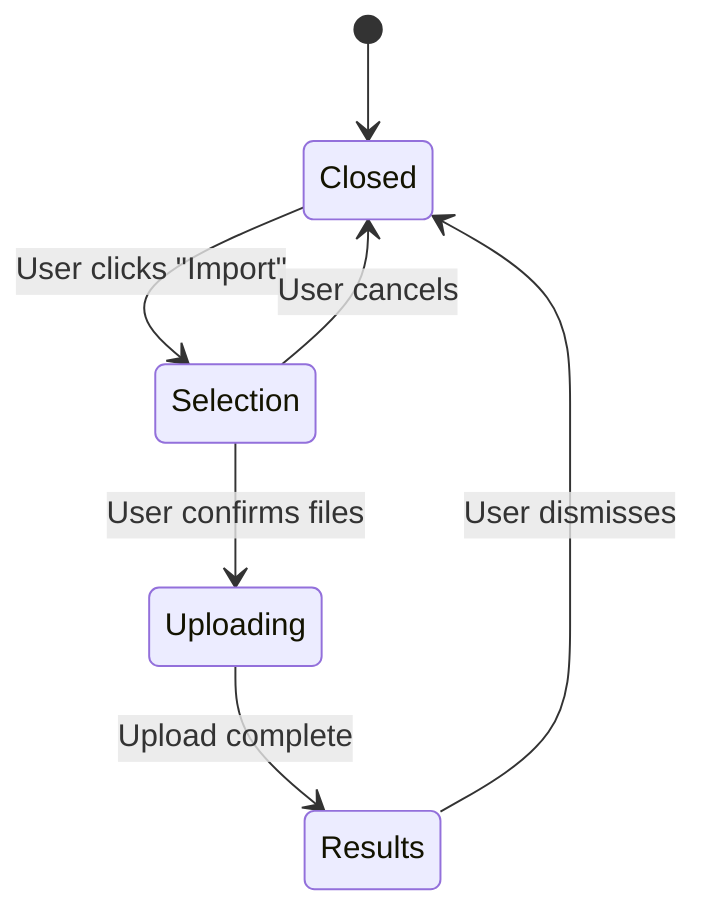

# Import UI - Frontend

Multi-phase dialog with file validation, drag-and-drop upload, and detailed error reporting.

## Component Architecture

**Main Component:** `ImportDocumentDialog`

**Location:** `frontend/src/features/documents/components/ImportDocumentDialog.tsx`

### Phase Flow



### Sub-Components

1. **ImportFileSelector** - File picker with drag-and-drop
2. **ImportProgress** - Loading spinner during upload
3. **ImportResults** - Success/failure summary

## User Flow

### Phase 1: File Selection

**UI:**
- Drag-and-drop zone with visual feedback
- "Browse files" button for traditional file picker
- Live file list with individual remove buttons
- Validation errors displayed per-file

**User actions:**
- Drag files onto drop zone
- Click "Browse files" to select via file dialog
- Remove individual files from list
- Click "Import" to proceed (disabled if no valid files)
- Click "Cancel" to close dialog

**Code:**
```tsx
<ImportFileSelector
  selectedFiles={selectedFiles}
  onFilesSelected={handleFilesSelected}
  onFileRemove={handleFileRemove}
  accept=".zip,.md,.txt,.html,.htm"
  maxTotalSize={100 * 1024 * 1024}  // 100MB
/>
```

### Phase 2: Uploading

**UI:**
- Loading spinner
- "Uploading files..." message
- No user interaction available (modal blocks)

**Backend call:**
```tsx
const formData = new FormData();
selectedFiles.forEach(file => formData.append('files', file));
formData.append('project_id', projectId);

const result = await api.documents.import(formData);
```

**Duration:** Typically <2 seconds for small files, up to 30 seconds for large zips.

### Phase 3: Results

**UI - Success (all files imported):**
```
✅ All 3 files imported successfully

• chapter1.md
• chapter2.txt
• notes.html

[Close]
```

**UI - Partial Success:**
```
⚠️ 2 of 3 files imported successfully

Succeeded:
• chapter1.md
• chapter2.txt

Failed:
• corrupted.html
  Error: invalid HTML structure

[Close]
```

**UI - Complete Failure:**
```
❌ Import failed

Errors:
• file.pdf
  Error: unsupported format
• file.zip
  Error: corrupted archive

[Close]
```

**User action:** Click "Close" to dismiss and return to document tree.

## File Validation

**Location:** `frontend/src/features/documents/utils/fileValidation.ts`

### Validation Rules

| Rule | Limit | Error Message |
|------|-------|---------------|
| File type | .zip, .md, .txt, .html, .htm | "Unsupported file type: {ext}" |
| Individual file size | 100MB | "File too large: {name} ({size})" |
| Total size | 100MB | "Total size exceeds 100MB" |
| File count | No limit | (Backend may impose limit) |

### Validation Timing

**Client-side (immediate feedback):**
- File extension check on file selection
- Size check on file selection
- Total size check when adding files

**Server-side (authoritative):**
- File content validation (e.g., is .zip actually a zip?)
- Conversion validation (e.g., is .html valid HTML?)
- Business rules (e.g., duplicate document names)

### Error Display

```tsx
{validationError && (
  <Alert variant="destructive">
    <AlertCircle className="h-4 w-4" />
    <AlertDescription>{validationError}</AlertDescription>
  </Alert>
)}
```

Errors appear above file list, user must fix before proceeding.

## Drag-and-Drop Implementation

### Drop Zone Component

```tsx
<div
  onDrop={handleDrop}
  onDragOver={handleDragOver}
  onDragLeave={handleDragLeave}
  className={cn(
    "border-2 border-dashed rounded-lg p-8 text-center",
    isDragging && "border-primary bg-primary/5"
  )}
>
  {isDragging ? (
    <p>Drop files here</p>
  ) : (
    <p>Drag files here or click Browse</p>
  )}
</div>
```

### Event Handlers

```tsx
const handleDrop = (e: React.DragEvent) => {
  e.preventDefault();
  setIsDragging(false);

  const files = Array.from(e.dataTransfer.files);
  validateAndAddFiles(files);
};

const handleDragOver = (e: React.DragEvent) => {
  e.preventDefault();
  setIsDragging(true);
};
```

### Visual Feedback

- **Idle:** Gray dashed border
- **Drag over:** Blue border + light blue background
- **Drop:** Flash animation, then return to idle
- **Error:** Red border + error message

## API Integration

**Location:** `frontend/src/core/lib/api.ts`

### API Client Method

```typescript
documents: {
  import: async (formData: FormData): Promise<ImportResult> => {
    const response = await fetch('/api/import', {
      method: 'POST',
      body: formData,
      // Note: Do NOT set Content-Type header - browser sets it with boundary
    });

    if (!response.ok) {
      throw new Error('Import failed');
    }

    return response.json();
  }
}
```

### FormData Construction

```typescript
const formData = new FormData();

// Add files
selectedFiles.forEach(file => {
  formData.append('files', file);  // Key name: "files" (backend expects this)
});

// Add project ID
formData.append('project_id', projectId);

// Add merge mode (optional)
formData.append('mode', 'merge');  // or 'replace'
```

### Response Type

```typescript
interface ImportResult {
  succeeded: Array<{
    name: string;
    id: string;
  }>;
  failed: Array<{
    name: string;
    error: string;
  }>;
}
```

## State Management

### Local Component State

```tsx
const [phase, setPhase] = useState<'selection' | 'uploading' | 'results'>('selection');
const [selectedFiles, setSelectedFiles] = useState<File[]>([]);
const [importResult, setImportResult] = useState<ImportResult | null>(null);
const [validationError, setValidationError] = useState<string | null>(null);
```

**Why local state?**
- Import is a one-time operation (no caching needed)
- Results are transient (dismissed after viewing)
- No need for global state pollution

### Post-Import Tree Refresh

After successful import, refresh the document tree:

```tsx
const handleImportComplete = async (result: ImportResult) => {
  setImportResult(result);
  setPhase('results');

  // Refresh tree to show new documents
  if (result.succeeded.length > 0) {
    await useTreeStore.getState().reloadTree(projectId);
  }
};
```

**Tree store handles:**
- Fetching updated tree from backend
- Merging new documents into existing structure
- Preserving expand/collapse state where possible

## Error Handling

### Network Errors

```tsx
try {
  const result = await api.documents.import(formData);
  handleImportComplete(result);
} catch (error) {
  setPhase('results');
  setImportResult({
    succeeded: [],
    failed: [{
      name: 'Network error',
      error: 'Failed to upload files. Please try again.'
    }]
  });
}
```

### Validation Errors

```tsx
const validateFiles = (files: File[]): string | null => {
  // Check file types
  const invalidFiles = files.filter(f => !ALLOWED_EXTENSIONS.includes(getExtension(f.name)));
  if (invalidFiles.length > 0) {
    return `Unsupported file types: ${invalidFiles.map(f => f.name).join(', ')}`;
  }

  // Check individual file sizes
  const largeFiles = files.filter(f => f.size > MAX_FILE_SIZE);
  if (largeFiles.length > 0) {
    return `Files too large: ${largeFiles.map(f => f.name).join(', ')}`;
  }

  // Check total size
  const totalSize = files.reduce((sum, f) => sum + f.size, 0);
  if (totalSize > MAX_TOTAL_SIZE) {
    return `Total size exceeds ${formatBytes(MAX_TOTAL_SIZE)}`;
  }

  return null;  // Valid
};
```

### Backend Error Response

```tsx
if (!response.ok) {
  const errorData = await response.json();
  throw new Error(errorData.error || 'Import failed');
}
```

## Accessibility

### Keyboard Navigation

- **Tab:** Navigate between "Browse files", "Remove" buttons, "Import", "Cancel"
- **Enter:** Activate focused button
- **Escape:** Close dialog (if in selection phase)

### Screen Reader Support

```tsx
<div
  role="button"
  tabIndex={0}
  aria-label="Drag and drop files to import"
  onKeyDown={handleKeyDown}
>
  {/* Drop zone content */}
</div>
```

**Announcements:**
- "File added: {name}" when file selected
- "File removed: {name}" when file removed
- "{count} files selected" when list changes
- "Import in progress" during upload
- "{succeeded} files imported successfully, {failed} failed" on completion

### Focus Management

- Dialog opens → Focus on "Browse files" button
- Upload completes → Focus on "Close" button in results
- Dialog closes → Focus returns to element that opened it (Import menu item)

## Performance Considerations

### Large File Uploads

**Problem:** Uploading 100MB zip can block UI.

**Solution:** Multipart upload happens in background (Promise-based), UI remains responsive with loading state.

**Future optimization:** Chunked upload with progress percentage.

### File List Rendering

**Problem:** Rendering 1000+ files in selection list can be slow.

**Solution:** (Current implementation renders all files, acceptable for MVP)

**Future optimization:** Virtual scrolling for large file lists.

## Testing Scenarios

### Happy Path
1. User drags 3 markdown files onto drop zone
2. Files appear in list with green checkmarks
3. User clicks "Import"
4. Loading spinner appears
5. Results show "All 3 files imported successfully"
6. User clicks "Close"
7. Tree refreshes, new documents appear

### Error Scenarios

**Client-side validation error:**
1. User drags .pdf file
2. Error appears: "Unsupported file type: .pdf"
3. File not added to list
4. User cannot proceed

**Server-side error:**
1. User imports corrupted .html file
2. Upload succeeds, conversion fails
3. Results show partial success: "1 of 2 files imported"
4. Failed file shows error: "invalid HTML structure"

**Network error:**
1. User clicks "Import"
2. Network request fails (e.g., offline)
3. Results show: "Network error: Failed to upload files"
4. User can retry by closing and reopening dialog

### Edge Cases
- Empty zip archive → Backend returns "No valid files found"
- Duplicate file names → Backend handles uniqueness (append counter or reject)
- Mixed valid/invalid files → Valid files imported, invalid files in failed list

## Key Files

- `frontend/src/features/documents/components/ImportDocumentDialog.tsx` - Main dialog
- `frontend/src/features/documents/components/ImportFileSelector.tsx` - File picker + drag-drop
- `frontend/src/features/documents/components/ImportProgress.tsx` - Loading state
- `frontend/src/features/documents/components/ImportResults.tsx` - Results display
- `frontend/src/features/documents/utils/fileValidation.ts` - Validation logic
- `frontend/src/core/lib/api.ts:documents.import()` - API client

## Dependencies

- `@radix-ui/react-dialog` - Dialog primitive
- `lucide-react` - Icons (AlertCircle, Upload, Check, X)
- Built-in browser APIs: FileReader, FormData, drag events
