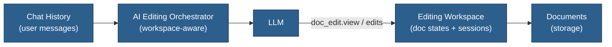
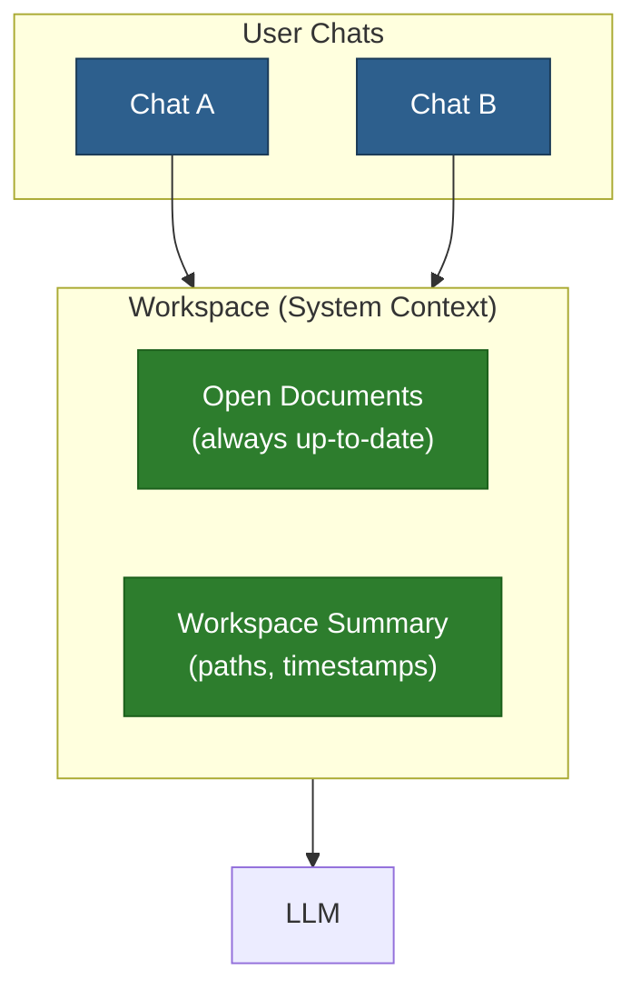

# AI Editing Workspace Mode

## Overview

Treat AI document editing as an explicit "workspace" to improve consistency and reduce token costs. Instead of accumulating many `view` outputs in chat history, maintain a concise server-side view of each document's current AI editing state and let the LLM rely on `doc_edit.view` + workspace summaries.

## Idea

- When entering "editing mode" for one or more documents, the orchestrator:
  - Prunes old `view` outputs from the chat history.
  - Injects a short workspace summary (which docs are open, paths, session IDs).
  - Encourages the LLM to rely on `doc_edit.view` for fresh context instead of re-describing document content in normal messages.
- The workspace tracks:
  - Active AI sessions per document.
  - Last known AI version hash / length.
  - Lightweight metadata used to detect stale edits.

## Benefits

- **Consistency**: LLM always bases edits on the authoritative AI version from `doc_edit.view`, not on stale text in the conversation.
- **Lower Costs**: Fewer large document dumps in chat history; most content flows through tools and short workspace summaries.
- **Clearer Semantics**: Editing flows are separated from general conversation; easier to reason about failures and retries.

## Enhanced Concept: System Chat with Deduplicated Reads

A more advanced workspace idea that solves multiple problems at once:

### Concept

Instead of each chat having its own context, introduce a "system chat" or workspace layer:

### Key Features

1. **Open documents are always fresh**
   - Documents marked "open" in workspace are always current
   - LLM sees latest `ai_version` (or `content` if no ai_version)
   - No stale copies in chat history

2. **Deduplicated reads in history**
   - When AI reads a document, history shows: `"read /Chapter 5.md at 2024-01-15T10:30:00Z"`
   - Full content NOT stored in chat history
   - Multiple reads of same doc don't bloat context

3. **Concurrent edit conflict resolution**
   - Workspace tracks which chat last edited each document
   - Before overwriting `ai_version`, can warn: "Chat B has pending suggestions"
   - User decides whether to merge, replace, or cancel

4. **Shared context across chats**
   - All chats in a project share the workspace
   - AI in Chat B knows what AI in Chat A suggested
   - Enables collaborative multi-chat workflows

### Benefits

- **Token efficiency**: No duplicate document content in history
- **Freshness**: AI always sees current state
- **Conflict awareness**: Know when multiple sources are editing
- **Simpler mental model**: "Workspace" is the shared editing context

### Implementation Notes

- Requires changes to how chat history is built for LLM requests
- Need to track "open documents" per project/workspace
- Tool results would store references, not full content
- Frontend would need workspace UI (open documents panel)

---

## When to Revisit

- After baseline AI inline editing is stable and we see:
  - Repeated tool failures due to stale `old_str` patterns, or
  - Significant token use from large `view` outputs in conversation history.
  - Confusion from multiple chats editing same documents.

