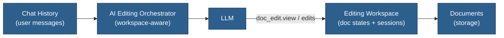

# AI Editing Workspace Mode

## Overview

Treat AI document editing as an explicit "workspace" to improve consistency and reduce token costs. Instead of accumulating many `view` outputs in chat history, maintain a concise server-side view of each document's current AI editing state and let the LLM rely on `doc_edit.view` + workspace summaries.

## Idea

- When entering "editing mode" for one or more documents, the orchestrator:
  - Prunes old `view` outputs from the chat history.
  - Injects a short workspace summary (which docs are open, paths, session IDs).
  - Encourages the LLM to rely on `doc_edit.view` for fresh context instead of re-describing document content in normal messages.
- The workspace tracks:
  - Active AI sessions per document.
  - Last known AI version hash / length.
  - Lightweight metadata used to detect stale edits.

## Benefits

- **Consistency**: LLM always bases edits on the authoritative AI version from `doc_edit.view`, not on stale text in the conversation.
- **Lower Costs**: Fewer large document dumps in chat history; most content flows through tools and short workspace summaries.
- **Clearer Semantics**: Editing flows are separated from general conversation; easier to reason about failures and retries.

## When to Revisit

- After baseline AI inline editing is stable and we see:
  - Repeated tool failures due to stale `old_str` patterns, or
  - Significant token use from large `view` outputs in conversation history.

