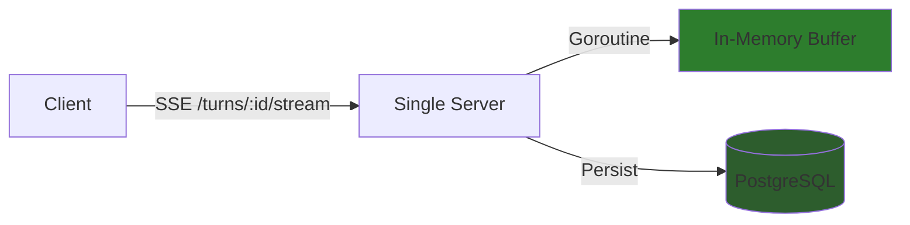
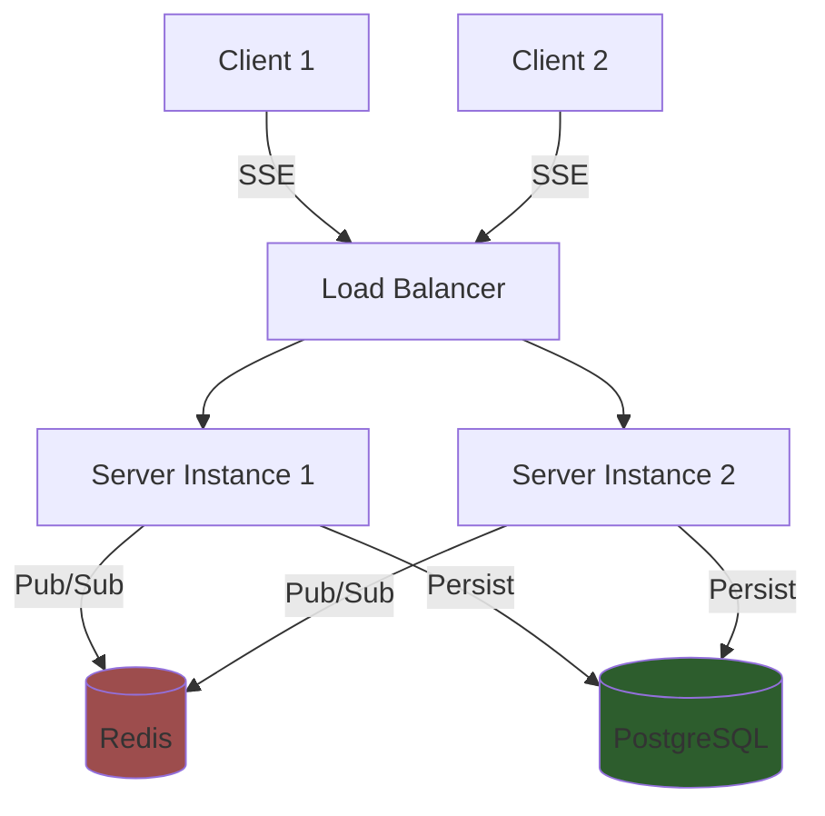

# Redis-Based Distributed Streaming

## Overview

Current implementation uses in-memory caching for SSE stream catchup. This works well for single-server deployments but won't scale horizontally.

**When to consider**: Multi-server deployment with load balancing.

## Current Architecture (In-Memory)



**Benefits:**
- Simple implementation
- No external dependencies
- Low latency

**Limitations:**
- Single point of failure
- Cannot scale horizontally
- Reconnects must hit same server

## Future: Redis-Based Architecture



**Benefits:**
- Horizontal scaling
- Any server can handle reconnects
- Distributed stream state
- High availability

**Trade-offs:**
- Added infrastructure complexity (Redis cluster)
- Network latency for pub/sub
- More failure modes to handle

## Implementation Notes

### Redis Streams API

Use Redis Streams (not Pub/Sub) for better reliability:

```go
// Producer (TurnExecutor)
func (e *TurnExecutor) publishBlock(block *Block) error {
    streamKey := fmt.Sprintf("turn:%s:stream", e.turnID)

    // Add to Redis Stream (trimmed to last 1000 entries)
    _, err := redisClient.XAdd(ctx, &redis.XAddArgs{
        Stream: streamKey,
        MaxLen: 1000,
        Approx: true,
        Values: map[string]interface{}{
            "block": marshalBlock(block),
        },
    }).Result()

    return err
}

// Consumer (SSE Handler)
func (h *SSEHandler) streamTurn(w http.ResponseWriter, turnID string, lastEventID string) {
    streamKey := fmt.Sprintf("turn:%s:stream", turnID)

    // Start from last seen event or beginning
    startID := "0-0"
    if lastEventID != "" {
        startID = lastEventID
    }

    // Read from Redis Stream
    streams, err := redisClient.XRead(ctx, &redis.XReadArgs{
        Streams: []string{streamKey, startID},
        Block:   5000, // 5s timeout
    }).Result()

    for _, msg := range streams[0].Messages {
        block := unmarshalBlock(msg.Values["block"])
        sendSSE(w, block, msg.ID)
    }
}
```

### Fallback Strategy

1. **Try Redis first** for recent events (last 1000)
2. **Fall back to PostgreSQL** for older events
3. **Return 404** if turn doesn't exist

```go
func (h *SSEHandler) getTurnBlocks(turnID, lastEventID string) ([]Block, error) {
    // Try Redis Stream
    blocks, err := h.redis.GetBlocks(turnID, lastEventID)
    if err == nil && len(blocks) > 0 {
        return blocks, nil
    }

    // Fallback to PostgreSQL
    return h.repo.GetTurnBlocks(turnID)
}
```

### Cleanup Strategy

- **TTL**: Expire Redis streams after 1 hour
- **Completion**: Delete stream when turn completes
- **Database**: Keep full history in PostgreSQL

## Migration Path

### Phase 1: Single Server (Current)
- In-memory buffer
- Database persistence

### Phase 2: Redis Optional
- Add Redis adapter
- Feature flag: `USE_REDIS_STREAMING=true`
- Graceful fallback to in-memory

### Phase 3: Redis Required
- Remove in-memory implementation
- Require Redis for production deployments

## References

- Current implementation: `_docs/technical/llm/streaming/README.md`
- Redis Streams docs: https://redis.io/docs/data-types/streams/
- Chat pagination caching idea: `_docs/technical/backend/chat/pagination.md:972`
