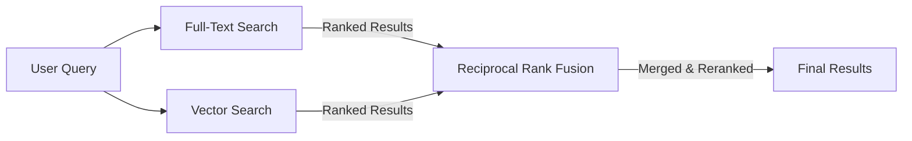

# Hybrid Search (FTS + Vector + Reranking)

**Status:** Not yet implemented
**Strategy:** `SearchStrategyHybrid`
**Requires:** Vector search must be implemented first

## Overview

Combines full-text search (FTS) and vector search using Reciprocal Rank Fusion (RRF) to get the best of both approaches.



**Benefits:**
- Balances precision (FTS) and recall (vector)
- Handles typos and synonyms while preserving exact matches
- Best for general user queries (mix of keywords and concepts)

**Trade-offs:**
- Higher cost (2x searches + merging overhead)
- More complex implementation
- Not ideal for pure keyword or pure semantic searches

## Implementation

### 1. Execute Both Searches in Parallel

```go
func (r *PostgresDocumentRepository) hybridSearch(ctx context.Context, opts *SearchOptions) (*SearchResults, error) {
    // Execute FTS and vector search concurrently
    var ftsResults, vectorResults *SearchResults
    var ftsErr, vectorErr error

    var wg sync.WaitGroup
    wg.Add(2)

    go func() {
        defer wg.Done()
        ftsResults, ftsErr = r.fullTextSearch(ctx, opts)
    }()

    go func() {
        defer wg.Done()
        vectorResults, vectorErr = r.vectorSearch(ctx, opts)
    }()

    wg.Wait()

    if ftsErr != nil {
        return nil, fmt.Errorf("fts search failed: %w", ftsErr)
    }
    if vectorErr != nil {
        return nil, fmt.Errorf("vector search failed: %w", vectorErr)
    }

    // Merge using RRF
    merged := r.reciprocalRankFusion(ftsResults, vectorResults, 60)
    return merged, nil
}
```

### 2. Reciprocal Rank Fusion Algorithm

```go
// RRF Score = Σ (1 / (k + rank))
// k = constant (typically 60)
// Lower rank = higher score
func (r *PostgresDocumentRepository) reciprocalRankFusion(
    ftsResults, vectorResults *SearchResults,
    k int,
) *SearchResults {
    scores := make(map[string]float64)

    // Add FTS scores
    for i, result := range ftsResults.Results {
        rank := i + 1
        scores[result.Document.ID] += 1.0 / float64(k+rank)
    }

    // Add vector scores
    for i, result := range vectorResults.Results {
        rank := i + 1
        scores[result.Document.ID] += 1.0 / float64(k+rank)
    }

    // Sort by combined score
    var merged []SearchResult
    for docID, score := range scores {
        // Find document in either result set
        doc := findDocument(docID, ftsResults, vectorResults)
        merged = append(merged, SearchResult{
            Document: doc,
            Score:    score,
            Metadata: map[string]interface{}{
                "rrf_score": score,
                "strategy":  "hybrid",
            },
        })
    }

    sort.Slice(merged, func(i, j int) bool {
        return merged[i].Score > merged[j].Score
    })

    return &SearchResults{
        Results:  merged[:min(len(merged), opts.Limit)],
        Strategy: SearchStrategyHybrid,
    }
}
```

## When to Use

**Best for:**
- General user queries (mix of keywords and concepts)
- Balancing precision (FTS) and recall (vector)
- Handling typos and synonyms while preserving exact matches

**Not ideal for:**
- Pure keyword searches → use FTS (faster)
- Pure semantic searches → use vector (better conceptual matching)
- High-frequency queries → higher cost (2x searches + merging)

## Alternative: ML-Based Reranking

For better accuracy, replace RRF with ML-based reranking:

```go
// internal/service/reranking/reranker.go
type Reranker interface {
    Rerank(ctx context.Context, query string, results []SearchResult) ([]SearchResult, error)
}

// Cohere Rerank API
type CohereReranker struct {
    client *cohere.Client
}

func (r *CohereReranker) Rerank(ctx context.Context, query string, results []SearchResult) ([]SearchResult, error) {
    // Use Cohere Rerank API to reorder results
    // Better accuracy than RRF for semantic queries
}
```

## References

- RRF Paper: https://plg.uwaterloo.ca/~gvcormac/cormacksigir09-rrf.pdf
- Cohere Rerank: https://cohere.com/rerank
- Current search implementation: `_docs/technical/backend/search-architecture.md`
- Vector search: `./vector-search.md`
