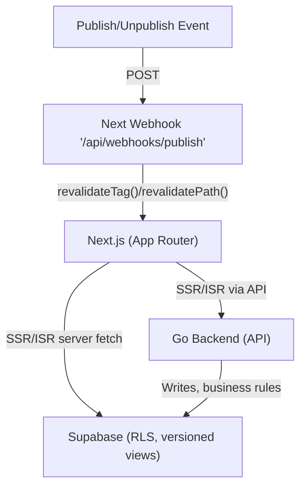

This document captures a potential (not decided) future. It outlines options for how the frontend might serve public, "published" content using Next.js server-side data fetching, while the Go backend continues to own writes and business rules. Nothing here is binding; it is for future evaluation.

**Goals**
- Fast, cacheable public pages (SSG/ISR preferred).
- Keep writes, workflows, and authorization logic in Go.
- Simple revalidation on publish/unpublish without heavy coupling.
- Minimize churn if the data model evolves.

**Non-Goals (for now)**
- Moving core business logic into Next.js.
- Committing to GraphQL or major backend refactors.

## Options

### Option A: Next.js reads Supabase directly (public reads only)
- Query with `supabase-js` from Server Components using the anon key; enforce RLS.
- Expose only stable, versioned views (e.g., `public.published_articles_v1`) to decouple the frontend from base tables.
- Use ISR with tags: `fetch(..., { next: { revalidate, tags } })` for list/detail pages.
- On publish/unpublish, trigger on-demand revalidation via a small Next webhook.

Pros
- Lowest latency and least moving parts.
- No Go changes required for simple public reads.
- Versioned DB views reduce frontend breakage when schemas change.

Cons
- Frontend knows about DB shapes (even if via views).
- Complex reads needing service-role or custom auth must go through Go.

### Option B: Next.js reads via Go API (gateway)
- Next calls Go for both simple and complex reads; Go joins, denormalizes, and enforces policy.
- Define slim DTOs and an OpenAPI contract; generate a typed TS client in the frontend.
- Keep ISR and revalidation in Next, but the data source is the Go API.

Pros
- Cleaner decoupling from schema changes; single read surface for web/mobile.
- Centralized caching, rate limiting, and audit.

Cons
- More API work per UI change; slightly higher latency.
- Still need a webhook or TTL to refresh ISR pages.

## High-Level Flow (Potential)

Notes
- The diagram shows two alternative read paths; a given page uses one or the other.
- Revalidation path is illustrative; exact tags/paths to be determined.

## Revalidation Strategy
- Default: ISR with a conservative TTL (e.g., minutes). Good enough if near-real-time is not critical.
- Precise: On publish/unpublish, POST to a Next route handler that calls `revalidateTag('articles')` or a per-article tag like `revalidateTag('article:'+slug)` and optionally `revalidatePath('/articles')`.

## Security & Data Shape
- Never expose the Supabase service key to client or Edge code.
- Enforce RLS that only permits rows where content is truly published (e.g., `is_published` and `published_at IS NOT NULL`).
- Prefer stable, versioned views or DTOs:
  - Direct DB: `public.published_articles_v1 (id, slug, title, excerpt, published_at, updated_at)`
  - API: `/articles` and `/articles/:slug` returning the same shape

## Today vs Later
- Today (no commitment): Keep Go as-is. If useful, add a small Next webhook that accepts a signed POST and revalidates tags/paths.
- Later (if we pursue this):
  - Option A path: add versioned views + RLS policies; query via Server Components.
  - Option B path: define a minimal read API contract in Go; generate a TS client.

## Migration & Compatibility
- Version views/DTOs (`..._v1`, then `..._v2`). Migrate the frontend on its own schedule; drop old versions after deprecation.
- Keep mutations and complex reads in Go to avoid duplicating business rules.

## Open Questions (Intentionally Deferred)
- What freshness target do we need for publish? Seconds via webhook, or minutes via TTL?
- Do we expect per-tenant or per-user personalization on public pages (which would push toward SSR or Go)?
- Is a same-origin proxy/rewrite desired to hide the API base and avoid CORS?

---

Status: Potential — not a decision. This document records possibilities to revisit when "published" features move closer to implementation.

