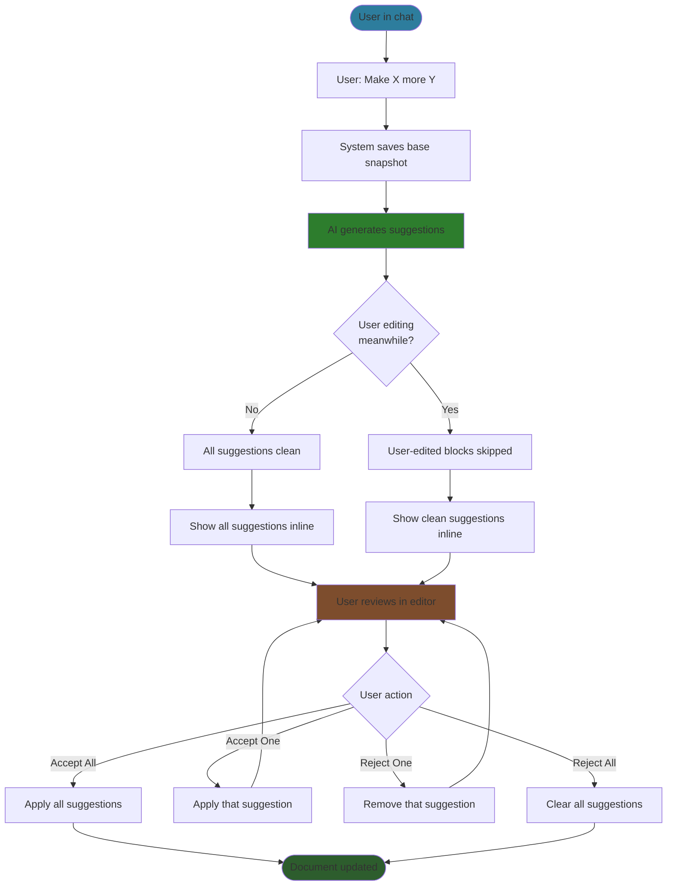
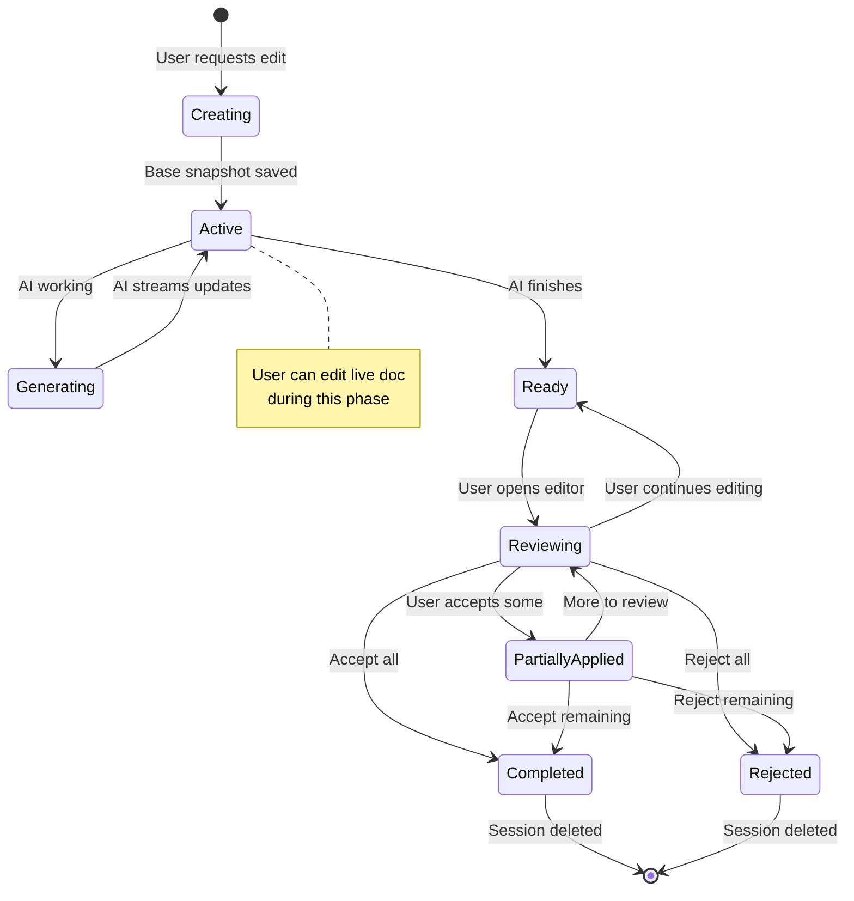
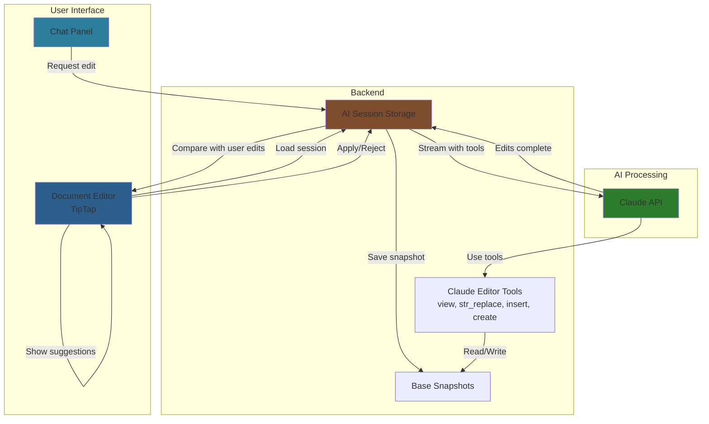

# AI Document Editing - MVP0 Design

**Status**: Planned for MVP0 (Tasks 9-10)

**Philosophy**: AI as collaborative editing partner through chat. User always wins. Simple, intuitive, non-blocking.

---

## What We're Building

An AI-assisted document editing system where:
- Users request edits through chat ("make this more vivid", "add more detail")
- AI uses Claude text editor tools to suggest changes
- Users continue editing the live document while AI works
- AI suggestions appear inline (Google Docs style) for parts user didn't touch
- Users review and accept/reject suggestions individually or in bulk

---

## Core Design Decisions

### 1. Shadow State Editing

**Decision**: AI works on a snapshot (shadow state), not the live document.

**Why**:
- **Enables concurrent editing** - User can continue working while AI generates suggestions
- **No blocking** - User doesn't wait for AI to finish before making their own edits
- **Safe exploration** - User sees what AI suggests before it affects their work
- **Clean rollback** - If user rejects all suggestions, document stays unchanged

**Workflow**:
```
User requests edit → Save base snapshot → AI works on snapshot
                           ↓
                    User continues editing live doc
                           ↓
                    AI finishes → Show suggestions
```

### 2. User Always Wins

**Decision**: When user edits a section while AI is working on it, user's version takes priority. AI's suggestion for that section is dropped.

**Why**:
- **Preserves user intent** - User made a deliberate edit; their judgment matters most
- **No conflicts** - By dropping AI's suggestion for edited sections, we avoid complex merge conflicts
- **Simpler UX** - No warning dialogs, no "choose user vs AI" decisions
- **Natural workflow** - User's live edits are already in the document; AI fills in the gaps

**Example**:
```
Document has paragraphs: A, B, C

AI starts working (snapshot: A, B, C)
User edits paragraph B while AI works
AI finishes with suggestions for A, B, C

Result:
- Paragraph A: Show AI suggestion ✨
- Paragraph B: Skip (user edited)
- Paragraph C: Show AI suggestion ✨
```

### 3. Block-Level Conflict Detection

**Decision**: Track which paragraphs/blocks user edited, not character-level changes.

**Why** (MVP0):
- **Simplicity** - Block tracking is straightforward; character-level diff is complex
- **Good enough** - 90% of cases: user edits different sections than AI
- **Editor support** - TipTap already tracks which blocks changed via transactions
- **Fast to implement** - No diff algorithm libraries, no position mapping
- **Deferrable complexity** - Can upgrade to character-level in post-MVP if needed

**Why NOT character-level** (for MVP0):
- Requires diff algorithm (Myers, fast-myers-diff)
- Position mapping through edits (complex edge cases)
- More testing surface area
- Over-engineering for initial validation

### 4. Inline Suggestion UI

**Decision**: Show AI suggestions as inline marks in the editor (Google Docs style), not in a separate panel.

**Why**:
- **Familiar** - Users know this pattern from Google Docs, Word Track Changes
- **Contextual** - See suggestion in place, not detached in sidebar
- **Low friction** - Accept/reject right where you're reading
- **Multi-suggestion** - Can see all suggestions at once in context

**Alternatives considered**:
- Side-by-side diff view: Better for large changes, but more context switching
- Sidebar list: Good for overview, but loses context
- Chat-based suggestions: Too manual (copy/paste)

**Future**: May add side-by-side as alternative view mode.

### 5. Claude Text Editor Tools

**Decision**: AI uses familiar tools: `view`, `str_replace`, `insert`, `create`.

**Why**:
- **Proven pattern** - Claude Code already uses these tools successfully
- **Natural for LLM** - Claude understands this editing paradigm
- **Precise** - `str_replace` is deterministic (exact match required)
- **Transparent** - Tools create clear edit operations that map to UI suggestions
- **Extensible** - Easy to add more tools later (delete, move, etc.)

### 6. No Complex Three-Way Merge (MVP0)

**Decision**: Drop AI suggestions for user-edited blocks. No automatic merging.

**Why**:
- **MVP validation** - Need to prove core value before adding complexity
- **Simpler implementation** - No merge algorithm, no conflict resolution UI
- **Clear behavior** - User always knows what happened (their edit stayed)
- **Upgrade path** - Can add character-level merge post-MVP (see `_docs/technical/post-mvp/ai-suggestions.md`)

**When we'll upgrade**:
- User feedback shows they want AI + user edits combined
- After MVP0 validates core editing workflow
- When we have time for proper character-level diff implementation

---

## User Workflows

### Happy Path: No Concurrent Edits

```mermaid
sequenceDiagram
    participant User
    participant Chat
    participant AI
    participant Editor
    participant Backend

    User->>Chat: "Make chapter 5 more suspenseful"
    Chat->>Backend: Save base snapshot (chapter 5 content)
    Chat->>AI: Request edits with context

    Note over AI: AI uses view/str_replace<br/>to generate suggestions<br/>(working on snapshot)

    AI-->>Backend: Store AI edits in session
    AI-->>Chat: "I've suggested some changes"

    User->>Editor: Opens chapter 5
    Editor->>Backend: Load doc + AI session
    Editor->>Editor: Apply inline marks (all clean)
    Editor->>User: Shows 5 inline suggestions ✨

    User->>Editor: Click "Accept All"
    Editor->>Backend: Apply all edits, delete session
    Editor->>User: Chapter updated ✓

    style AI fill:#2d7d2d
    style Editor fill:#2d5f8d
```

### Concurrent Editing: User Edits While AI Works

```mermaid
sequenceDiagram
    participant User
    participant Chat
    participant AI
    participant Editor
    participant Tracker as Edit Tracker
    participant Backend

    User->>Chat: "Make this more vivid"
    Chat->>Backend: Save base snapshot
    Chat->>AI: Request edits

    Note over User,Editor: User continues editing while AI works

    User->>Editor: Edits paragraph 2 ("tavern" → "dimly lit tavern")
    Editor->>Tracker: Mark paragraph 2 as user-modified
    Editor->>Backend: Auto-save user's edit

    AI-->>Backend: Store AI edits (includes paragraph 2)
    AI-->>Chat: "I've suggested some changes"

    User->>Editor: Views document
    Editor->>Backend: Load doc + AI session
    Editor->>Editor: Compare AI edits vs user-modified blocks

    Note over Editor: Paragraph 2: User edited (skip AI)<br/>Paragraphs 1,3,4: Clean (show AI)

    Editor->>User: Shows 3 inline suggestions ✨<br/>(paragraph 2 already has user's version)

    User->>Editor: Click "Accept All"
    Editor->>Backend: Apply remaining clean edits
    Editor->>User: All applied ✓

    style AI fill:#2d7d2d
    style Tracker fill:#7d4d2d
    style Editor fill:#2d5f8d
```

### User Experience Flow



---

## Data Flow

### AI Session Lifecycle



### System Components



---

## What User Sees

### 1. Requesting Edit
- User types in chat: "Make chapter 5 more suspenseful"
- Chat shows: "Working on chapter 5..."
- User can continue editing document (not blocked)

### 2. AI Working
- Chat shows AI's streaming response: "I'm enhancing the tavern scene to build more tension..."
- Document remains editable
- If user edits, changes save normally

### 3. Suggestions Ready
- Chat shows: "I've suggested 5 changes to chapter 5"
- Document editor shows inline suggestions with colored underlines/highlights
- Each suggestion has hover tooltip with description
- Accept/Reject buttons on each suggestion
- "Accept All" / "Reject All" buttons at top

### 4. Reviewing
- User hovers suggestion → sees "Add sensory details about the tavern's atmosphere"
- Suggestion shows as green highlight (clean edit)
- If user already edited that section → no suggestion shown there (user's version already in doc)

### 5. Accepting/Rejecting
- Click "Accept" → suggestion applies, highlight removes, content updates
- Click "Reject" → suggestion removes, original stays
- Click "Accept All" → all suggestions apply at once
- Session clears after all accepted or rejected

---

## Future Evolution

### Post-MVP Enhancements

See `_docs/technical/post-mvp/ai-suggestions.md` for full three-way merge design.

**Character-Level Diff** (vs current block-level):
- Detect when user edited middle of paragraph
- Show AI suggestion for unedited parts of same paragraph
- Requires diff algorithm (Myers), position mapping

**Conflict Resolution UI**:
- When user + AI both edited same text
- Show both versions side-by-side
- Let user choose or manually merge

**Side-by-Side View Mode**:
- Alternative to inline suggestions
- Better for large refactors
- Diff panel showing before/after

**Iterative Refinement**:
- "Make it even more suspenseful" on top of previous suggestion
- AI works on its own suggestion, not original
- Chain of suggestions before applying

**Multi-Document Edits**:
- AI suggests changes across multiple files
- Batch review and apply

---

## Success Criteria for MVP0

### Must Have
- ✅ User can request edits through chat
- ✅ AI suggestions appear inline in editor
- ✅ User can accept/reject individual suggestions
- ✅ User can accept/reject all at once
- ✅ User edits while AI works (non-blocking)
- ✅ User-edited sections skip AI suggestions (no conflicts)

### Nice to Have (Can Defer)
- Character-level diff (block-level is sufficient for MVP0)
- Conflict resolution UI (user-wins approach avoids conflicts)
- Side-by-side diff view (inline is sufficient for MVP0)
- Iterative refinement (can ask AI again in new turn)

---

## Design Principles Applied

From `CLAUDE.md`:

**1. Start Simple, Stay Simple**
- Block-level tracking vs character-level (simplest that works)
- User-wins approach vs complex conflict resolution
- Defer three-way merge to post-MVP

**2. Make Correctness Obvious**
- User always wins = no ambiguity
- Inline suggestions = clear what's AI vs user
- Explicit accept/reject = no automatic changes

**3. One Thing At A Time**
- MVP0: Prove AI editing is valuable
- Post-MVP: Add sophisticated merge algorithms

**4. Explicit Over Implicit**
- "User edited paragraph 2" (explicit flag)
- Not: "Detect if text changed" (implicit detection)
- Clear suggestion states: pending, accepted, rejected

**5. Treat Empty as Valid**
- Empty suggestions array = user edited everything
- Empty edit = valid AI choice (no changes needed)

---

## References

- **Full three-way merge design**: `_docs/technical/post-mvp/ai-suggestions.md`
- **Task breakdown**: `_docs/hidden/tasks/mvp0-chat/backend-9-version-snapshots.md`
- **Task breakdown**: `_docs/hidden/tasks/mvp0-chat/backend-10-suggest-edits.md`
- **LLM streaming**: `_docs/technical/llm/streaming/README.md`
- **Product vision**: `_docs/high-level/1-overview.md`
