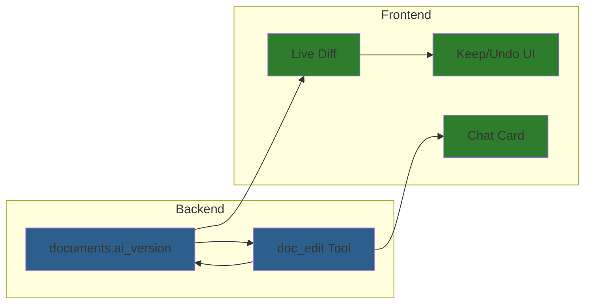
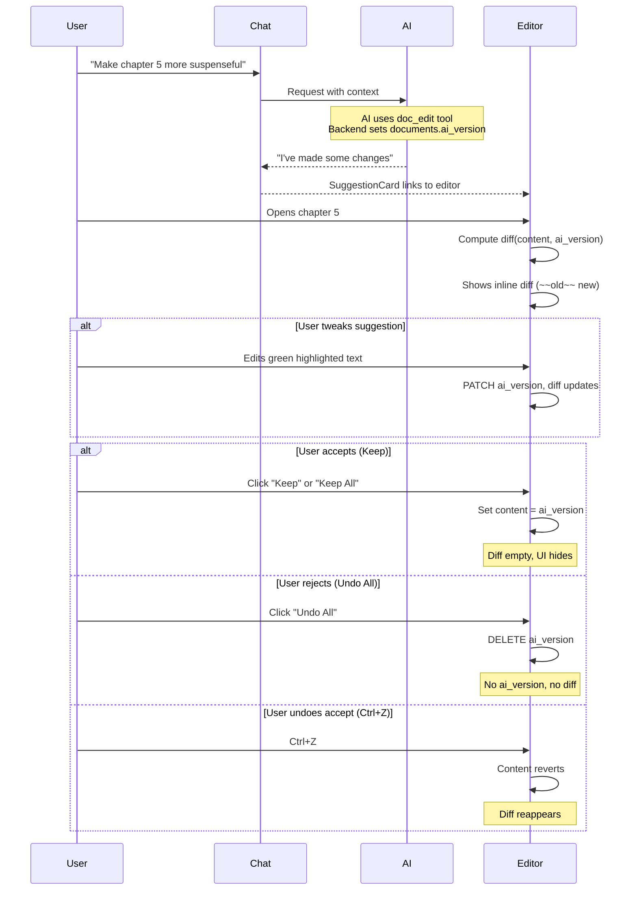

# AI Document Editing Implementation Plan

**Goal**: Inline AI suggestions (Google Docs style) for collaborative writing

**Philosophy**: AI as collaborative editing partner through chat. User always wins. Simple, intuitive, non-blocking.

---

## Overview



**Key Architecture**:
- `documents.ai_version` column stores AI's suggested version
- Frontend computes `diff(content, ai_version)` live
- User can edit `ai_version` directly (tweak before accepting)
- No separate tables, no session state machine

---

## Data Model (Simplified)

| What | Where | Notes |
|------|-------|-------|
| User content | `documents.content` | Frontend owns, synced via auto-save |
| AI suggestions | `documents.ai_version` | Backend owns (AI writes), user can edit |
| Edit history | `turn_blocks` | Tool calls preserved in chat |

**Key insight**: No separate tables needed. Just one nullable column on documents.

### Live Diff Model

```
documents.content   = what user has (frontend source of truth)
documents.ai_version = what AI suggests (nullable, editable by user)

DIFF = diff(content, ai_version) computed live by frontend
     = Shows inline word-level diff: ~~old~~ new
     = Empty when content equals ai_version (no UI shown)
```

---

## Implementation Phases

| Phase | File | Description | Status |
|-------|------|-------------|--------|
| **0** | [codemirror-migration/](codemirror-migration/) | Frontend: TipTap → CodeMirror 6 | ✅ Complete |
| **1** | [phase-1-version-db.md](phase-1-version-db.md) | Backend: Add `ai_version` column to documents | Ready |
| **2** | [phase-2-suggest-tool.md](phase-2-suggest-tool.md) | Backend: `doc_edit` tool writes to ai_version | Depends on 1 |
| **3** | [phase-3-version-api.md](phase-3-version-api.md) | Backend: PATCH/DELETE endpoints for ai_version | Depends on 1 |
| **4** | [phase-4-live-diff.md](phase-4-live-diff.md) | Frontend: Live diff display (~~old~~ new) | Depends on 0, 3 |
| **5** | [phase-5-accept-ui.md](phase-5-accept-ui.md) | Frontend: Keep/Undo UI | Depends on 4 |
| **6** | [phase-6-chat-card.md](phase-6-chat-card.md) | Frontend: SuggestionCard in chat | Depends on 2 |

### Reference Documents

| File | Description |
|------|-------------|
| [editing-flow.md](editing-flow.md) | Visual flows with mermaid diagrams |
| [architecture-solid.md](architecture-solid.md) | SOLID patterns and abstractions |

---

## Core Design Decisions

### 1. `ai_version` on Document (Not Separate Tables)
- Single nullable column: `documents.ai_version TEXT`
- No `ai_sessions` table, no `ai_edits` table
- Dramatically simpler schema and code

### 2. User Can Edit `ai_version`
- User can tweak AI suggestions before accepting
- PATCH endpoint for user edits
- Prevents "accept then fix" workflow

### 3. Frontend Owns `content`, Backend Owns `ai_version`
- Avoids race conditions with auto-save
- Frontend sets editor content, syncs to backend
- Backend handles AI tool writes to ai_version

### 4. No Explicit Accept/Reject State
- "Accept" = user makes content match ai_version (Ctrl+Z reverses)
- "Reject" = user deletes ai_version (sets null)
- Diff just shows difference, no state machine

### 5. Last Write Wins
- Multiple AI edits overwrite ai_version
- Future workspace feature handles multi-source conflicts
- See `_docs/future/ideas/ai-behaviors/ai-editing-workspace.md`

### 6. Pattern-Based Editing
- `doc_edit` tool uses `str_replace` commands (not positions)
- AI sees `ai_version` if exists, else `content`

### 7. Unix-Style Paths
- Documents referenced by paths (`/Chapter 5.md`), not UUIDs

---

## User Flow



---

## Success Criteria

- [ ] `ai_version` column on documents table
- [ ] AI can edit via `doc_edit` tool (writes to ai_version)
- [ ] `doc_edit` supports: view, str_replace, insert, append
- [ ] User can PATCH ai_version (tweak suggestions)
- [ ] User can DELETE ai_version (reject all)
- [ ] Frontend computes live diff(content, ai_version)
- [ ] Inline word-level diff shown (~~old~~ new)
- [ ] Per-hunk Keep/Undo buttons
- [ ] Keep All / Undo All buttons
- [ ] Ctrl+Z reverses accept (diff reappears)
- [ ] User can edit freely while suggestions pending

---

## Related Documentation

- **Tool calling**: `_docs/features/b-tool-calling/`
- **CodeMirror editor**: `frontend/src/core/editor/`
- **Future workspace**: `_docs/future/ideas/ai-behaviors/ai-editing-workspace.md`
