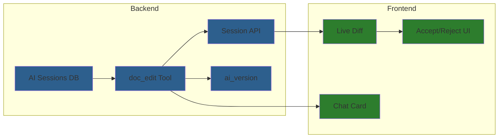
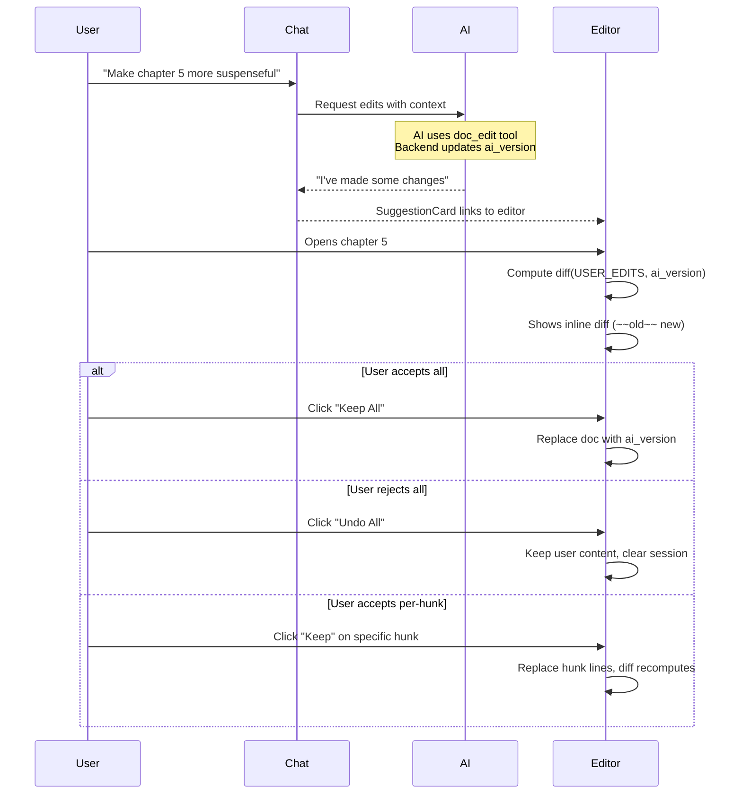

# AI Document Editing Implementation Plan

**Goal**: Inline AI suggestions (Google Docs style) with conflict resolution for collaborative writing

**Philosophy**: AI as collaborative editing partner through chat. User always wins. Simple, intuitive, non-blocking.

---

## Overview



**Key Architecture**: Frontend computes `diff(USER_EDITS, ai_version)` live for display. No position hints or complex mark matching needed.

---

## Data Model

### Storage (Markdown-Centric)

| What | Where | Format |
|------|-------|--------|
| User content | `documents.content` | Pure markdown (auto-saved) |
| AI suggestions | `ai_sessions.ai_version` | Pre-computed document with AI edits |
| Edit history | `ai_edits` table | Operations (old_str, new_str) for audit |

**Key insight**: Frontend computes `diff(USER_EDITS, ai_version)` live. No position hints needed.

### Status Values

| Entity | Values | Notes |
|--------|--------|-------|
| Session | `active` \| `accepted` \| `rejected` | Kept for history/restore |
| Edit | `pending` \| `accepted` \| `rejected` | For audit only |

### Two-Way Version Model (Simplified!)

```
documents.content = USER_EDITS (always, auto-saved markdown)

BASE (base_snapshot - doc when AI session started)
├── + User edits during session ──► USER_EDITS (in documents.content)
│
└── + ALL AI edits ────────────────► AI_VERSION (pre-computed in ai_sessions)

DIFF = diff(USER_EDITS, ai_version) computed live by frontend
     = Shows inline word-level diff: ~~old~~ new
```

---

## Implementation Phases

| Phase | File | Description | Dependencies | Parallel With |
|-------|------|-------------|--------------|---------------|
| - | [editing-flow.md](editing-flow.md) | Visual reference: All editing flows with mermaid diagrams | - | - |
| - | [architecture-solid.md](architecture-solid.md) | SOLID patterns: registries, interfaces, abstractions | - | - |
| **0** | [codemirror-migration/](codemirror-migration/) | **Frontend: Migrate TipTap → CodeMirror 6 with live preview** (8 subphases) | None | Phase 1 |
| 1 | [phase-1-version-db.md](phase-1-version-db.md) | Backend: ai_sessions + ai_edits tables (with ai_version) | None | Phase 0 |
| 2 | [phase-2-suggest-tool.md](phase-2-suggest-tool.md) | Backend: doc_edit tool (updates ai_version) | Phase 1 | Phase 3 |
| 3 | [phase-3-version-api.md](phase-3-version-api.md) | Backend: Session API endpoints | Phase 1 | Phase 2 |
| 4 | [phase-4-live-diff.md](phase-4-live-diff.md) | Frontend: Live diff with inline display (~~old~~ new) | Phase 0, Phase 3 | - |
| 5 | [phase-5-accept-ui.md](phase-5-accept-ui.md) | Frontend: Keep/Undo UI for diff hunks | Phase 4 | - |
| 6 | [phase-6-chat-card.md](phase-6-chat-card.md) | Frontend: SuggestionCard in chat | Phase 2 | Phase 4, 5 |

### Phase 0 Subphases (CodeMirror Migration)

| Subphase | Description | SOLID Focus |
|----------|-------------|-------------|
| [0.1](codemirror-migration/phase-0.1-core-shell.md) | Core Editor Shell | Single Responsibility |
| [0.2](codemirror-migration/phase-0.2-extension-architecture.md) | Extension Architecture (Facets, Compartments) | Open/Closed, Interface Segregation |
| [0.3](codemirror-migration/phase-0.3-toolbar.md) | Toolbar Integration | Single Responsibility |
| [0.4](codemirror-migration/phase-0.4-live-preview.md) | Live Preview (Obsidian-style) | Open/Closed (Registry) |
| [0.5](codemirror-migration/phase-0.5-clipboard.md) | Copy/Paste Handling | Single Responsibility |
| [0.6](codemirror-migration/phase-0.6-caching.md) | Editor Caching | - |
| [0.7](codemirror-migration/phase-0.7-ai-integration.md) | AI Integration Points | Dependency Inversion |
| [0.8](codemirror-migration/phase-0.8-migration-complete.md) | Migration Complete | - |

> **Note**: Live diff approach simplifies everything - frontend computes `diff(USER_EDITS, ai_version)` on-the-fly. No position hints, no mark matching, no Model B.

---

## Core Design Decisions

### 1. Live Diff Approach
- Frontend computes `diff(USER_EDITS, ai_version)` on-the-fly using `diffLines()` + `diffWords()`
- Shows inline word-level diff: ~~old~~ new (Google Docs style)
- No position hints, mark matching, or fallback logic needed

### 2. Explicit Accept/Reject Only (No Model B)
User must explicitly Keep or Undo each hunk. No implicit accept when editing inside suggestions.

### 3. Backend Pre-Computes `ai_version`
Backend maintains `ai_version` (BASE + all AI edits) after each edit for efficiency.

### 4. Backend Doesn't Validate Against DB
DB may be stale due to debounced saves. Frontend has source of truth (editor state).

### 5. Pattern-Based Editing
`doc_edit` tool uses Anthropic-style `str_replace` commands (not position-based).

### 6. Unix-Style Paths
Documents referenced by human-readable paths (`/Chapter 5.md`), not UUIDs.

---

## User Flow



---

## Success Criteria

- [ ] AI can suggest edits via chat using `doc_edit` tool
- [ ] `doc_edit` supports: view, str_replace, insert, append, create
- [ ] Documents referenced by human-readable Unix-style paths
- [ ] Suggestions shown as inline word-level diff (~~old~~ new)
- [ ] User can edit freely while suggestions pending
- [ ] Keep All replaces doc with ai_version
- [ ] Undo All keeps user content, clears session
- [ ] Per-hunk Keep/Undo buttons work
- [ ] Backend pre-computes ai_version for efficiency
- [ ] Ctrl+Z works (CodeMirror native undo)

---

## Related Documentation

- **Tool calling docs**: `_docs/features/b-tool-calling/`
- **CodeMirror extensions**: `frontend/src/core/editor/` (after Phase 0)
