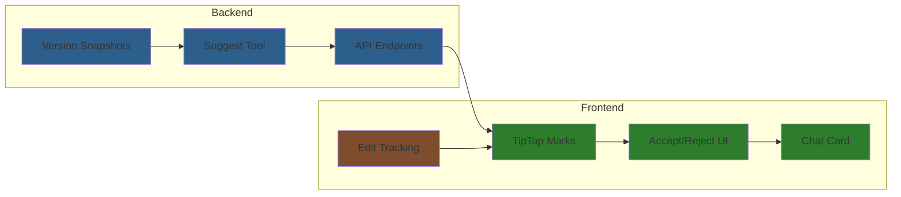

# AI Document Editing Implementation Plan

**Goal**: Inline AI suggestions (Google Docs style) for Reddit demo of "agentic writing"

**Philosophy**: AI as collaborative editing partner through chat. User always wins. Simple, intuitive, non-blocking.

---

## Overview



---

## Implementation Phases

| Phase | File | Description | Dependencies |
|-------|------|-------------|--------------|
| 1 | [phase-1-version-db.md](phase-1-version-db.md) | Backend: document_versions table | None |
| 2 | [phase-2-suggest-tool.md](phase-2-suggest-tool.md) | Backend: suggest_document_edits tool | Phase 1 |
| 3 | [phase-3-version-api.md](phase-3-version-api.md) | Backend: Accept/reject endpoints | Phase 1 |
| 4 | [phase-4-tiptap-marks.md](phase-4-tiptap-marks.md) | Frontend: TipTap suggestion marks | Phase 3 |
| 5 | [phase-5-accept-ui.md](phase-5-accept-ui.md) | Frontend: Accept/reject UI | Phase 4 |
| 6 | [phase-6-chat-card.md](phase-6-chat-card.md) | Frontend: SuggestionCard in chat | Phase 2 |
| 7 | [phase-7-edit-tracking.md](phase-7-edit-tracking.md) | Frontend: User-wins conflict handling | Phase 4 |

---

## Core Design Decisions

### 1. Shadow State Editing
AI works on a snapshot, not the live document. Enables concurrent editing.

### 2. User Always Wins
When user edits a section while AI is working on it, user's version takes priority. AI's suggestion for that section is dropped.

### 3. Block-Level Conflict Detection
Track which paragraphs/blocks user edited, not character-level changes. Simpler for MVP.

### 4. Inline Suggestion UI
Show AI suggestions as inline marks in the editor (Google Docs style).

### 5. Claude Text Editor Tools
AI uses familiar tools: `view`, `str_replace`, `insert` pattern.

---

## User Flow

```mermaid
sequenceDiagram
    participant User
    participant Chat
    participant AI
    participant Editor

    User->>Chat: "Make chapter 5 more suspenseful"
    Chat->>AI: Request edits with context
    Note over AI: AI uses suggest_document_edits<br/>to create version snapshot

    AI-->>Chat: "I've suggested some changes"
    Chat-->>Editor: SuggestionCard links to editor

    User->>Editor: Opens chapter 5
    Editor->>Editor: Shows inline suggestions (green highlights)

    User->>Editor: Click "Accept" on suggestion
    Editor->>Editor: Apply change, remove highlight

    style AI fill:#2d7d2d
    style Editor fill:#2d5f8d
```

---

## Success Criteria

- [ ] AI can suggest edits via chat
- [ ] Suggestions appear as inline highlights in editor
- [ ] User can accept/reject individual suggestions
- [ ] User can accept/reject all at once
- [ ] User edits while AI works (non-blocking)
- [ ] User-edited sections skip AI suggestions
- [ ] Iterative refinement works (AI can refine its own suggestions)

---

## Related Documentation

- **High-level design**: `_docs/plans/ai-editing-mvp0.md`
- **Existing task breakdowns**: `_docs/hidden/tasks/mvp0-chat/backend-9-*.md`, `backend-10-*.md`
- **Tool calling docs**: `_docs/features/b-tool-calling/`
- **TipTap extensions**: `frontend/src/core/editor/extensions.ts`
