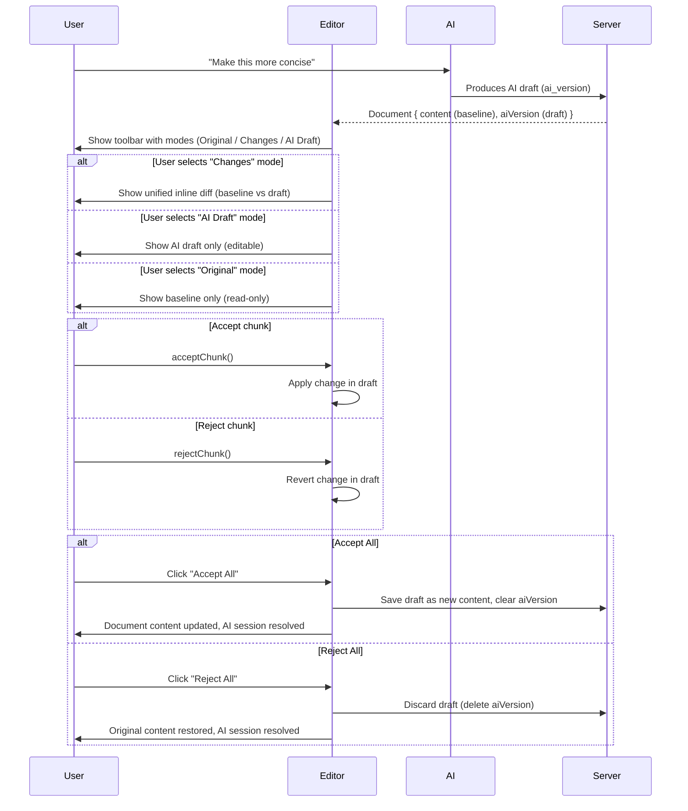

# AI Inline Suggestions (Merge View)

## 1. Overview

### What

Inline AI suggestions using CodeMirror’s **`@codemirror/merge` unifiedMergeView**:

- Single editable **AI draft** (the “result” document)
- **Original** user content used as a read‑only baseline
- **Changes view** shows a unified inline diff with per‑chunk Accept/Reject
- Optional **Draft‑only** and **Original‑only** views for focused editing/reading

### Why

Writers need granular control over AI suggestions while keeping implementation simple and robust:

- Review each change in context
- Accept good suggestions and reject bad ones, chunk by chunk
- See exactly what will change before committing to the main document
- Rely on CodeMirror’s built‑in diff, position tracking, and undo/redo instead of a custom projection layer

### Why `@codemirror/merge`

| Feature                 | Custom Projection Plan       | `@codemirror/merge`            |
|-------------------------|-----------------------------|---------------------------------|
| Inline diff display     | Custom decorations           | ✅ Built‑in unified view        |
| Accept/reject per chunk | Custom widgets + routing     | ✅ `acceptChunk()` / `rejectChunk()` |
| Position tracking       | Manual projection + mapping  | ✅ Automatic                    |
| Undo/redo semantics     | Complex (dual sources)       | ✅ Native history support       |
| LOC / complexity        | ~200+ lines + tests          | ~20 lines of config             |

**Key insight:** `unifiedMergeView` treats the **primary editor document as the editable result** and the **original as a read‑only baseline**. This matches “edit the AI draft while seeing how it differs from my original” and avoids a hand‑rolled projection system.

---

## 2. Modes & UX

We keep a simple mental model:

- One editable **AI draft** (`draft`) – what the user is actively editing during AI review
- One read‑only **Original** (`baseline`) – the user’s content at the start of the AI session

In addition to inline diffs, we use a **floating hunk navigator pill** (Cursor‑style) for fast navigation between suggestions and documents.

### Modes (Header Area)

Mode switching is part of the **AI session UI**, not normal editing:

- The AI header strip (with mode buttons + summary) only renders when `aiVersion` exists.
- In normal editing (no AI draft), the header shows only the standard document header; there is no mode toggle.

When active, mode switching lives in the existing sticky header area (just under the document header), not in the floating pill.

Contents of the AI header strip:

- Centered segmented control: `[Original]   [Changes]   [AI Draft]`
- No per-document or cross-document counts or actions here; this strip is purely for **view mode switching** during an AI session.

```
┌──────────────────────────────────────────────────────────────────────┐
│ Document Header                                                      │
├──────────────────────────────────────────────────────────────────────┤
│  AI Session Mode Strip                                               │
│  ┌──────────────────────────────┐                                    │
│  │  Original   Changes   Draft  │                                    │
│  └──────────────────────────────┘                                    │
└──────────────────────────────────────────────────────────────────────┘
```

| Mode        | Shows                       | Editable | Source of truth for undo/redo |
|-------------|-----------------------------|----------|--------------------------------|
| Original    | Baseline user content       | ❌ No    | N/A                            |
| Changes     | Unified diff (baseline vs draft) | ✅ Yes (draft only) | ✅ Draft history             |
| AI Draft    | Draft only (no diff)        | ✅ Yes   | ✅ Draft history               |

Notes:

- Only the **draft** is editable while an AI review is active.
- The **Original** view is purely for reading (baseline snapshot).
- Undo/redo always operates on the **draft** document, regardless of view.

### Floating Hunk Navigator (Pill)

A pair of small floating pills appears inside the editor content area when there are AI suggestions:

```
              ┌───────────────────────────────┐   ┌──────────────────────┐
              │  ↑   change   ↓  Reject Accept│   │ ⟨ 1 / N documents ⟩ │
              └───────────────────────────────┘   └──────────────────────┘
                        ⬆ bottom‑center of editor
```

A pill row is **navigation and document-level actions**, not mode switching:

- Anchored to the **bottom‑center of the editor pane**, floating above content.
- Left pill (hunks):
  - Previous / next hunk controls (`↑` / `↓`), wired to merge navigation (e.g., `goToNextChunk` / `goToPreviousChunk`).
  - Primary actions for the current document: **Reject All** / **Accept All** (affect all hunks in this document; language explicitly matches suggestion semantics).
  - (Future) optional `current / total` hunk label based on the frontend diff for the active document.
- Right pill (documents):
  - Previous / next document with suggestions: `⟨ 1 / N documents ⟩` where `N` comes from documents with `aiVersion != null` and `aiPendingSuggestions = TRUE`.
  - Navigating updates the active document and keeps the current mode (Original/Changes/AI Draft).
- Clicking hunk prev/next:
  - Scrolls the inline diff to the corresponding chunk.
  - Moves the editor selection/cursor into that chunk.
- Clicking document prev/next:
  - Switches to the previous/next document that has an AI draft.
  - Loads that document in Changes/AI Draft view (preserving current mode).
- In Changes mode, the pill mirrors keyboard shortcuts:
  - `Alt‑N` → next hunk
  - `Alt‑P` → previous hunk
  - `Cmd/Ctrl+Enter` → Accept current hunk
  - `Cmd/Ctrl+Backspace` → Reject current hunk

Scroll affordance:

- When the pill is visible, the editor’s scroll container adds an extra **bottom spacer** (e.g., `max(120px, 25vh)`).
- This allows users to scroll past the last line so the pill can sit over empty space instead of covering the final paragraph.

The pill is purely a **navigation and status layer**; the primary diff experience stays inline via `unifiedMergeView`.

#### Empty-document state: "Review next document"

When the current document has **no remaining hunks** (no visible changes in the unified diff), but other documents still have `aiPendingSuggestions = TRUE`:

- The left hunk pill hides (no per-hunk navigation or Accept/Reject All needed).
- A simplified right pill is shown:

```
              ┌───────────────────────────────┐
              │  Review next document   ▸    │
              └───────────────────────────────┘
                        ⬆ bottom‑center of editor
```

- Clicking the pill jumps directly to the next document with pending suggestions.
- The same “Review next document” CTA can also appear in the document sidebar (explorer) whenever **any** document has pending suggestions, even if the current document has none.

---

## 3. User Workflow

### High‑Level Flow



### States

1. **No AI draft** – Normal editing, `Document.content` is editable; no toolbar.
2. **AI draft present** – Toolbar visible, `Document.aiVersion` is editable, `content` is baseline.
3. **Partial acceptance** – Some chunks accepted/reverted in draft.
4. **Session resolved** – Either:
   - Accept All → `content` updated from draft, `aiVersion` cleared, or
   - Reject All → `aiVersion` cleared, baseline remains.

---

## 4. Technical Design

### 4.1 Data Model

For a document with suggestions:

- `content` (baseline) – user’s original content when the AI edit was requested.
- `aiVersion` (draft) – AI‑produced version that the user is reviewing and editing.
- `aiPendingSuggestions` (boolean, optional) – `true` if there are any pending suggestions for this document, `false` otherwise (for cross‑doc nav / badges).

Rules:

- When `aiVersion` is **present**:
  - Editing happens on `aiVersion` (draft) via:
    - AI Draft mode (plain editor)
    - Changes mode (unified diff vs `content`)
  - `content` is treated as **read‑only baseline** in the UI.
- When `aiVersion` is **absent**:
  - Normal editing; `content` is editable and auto‑saved as today.

Backend invariants:

- After any write that touches `content` or `aiVersion`:
  - If `content == aiVersion` → clear AI session:
    - Set `aiVersion = NULL`
    - Set `aiPendingSuggestions = FALSE` (if column exists)
  - Else:
    - Leave `aiVersion` as non‑null (AI session active).
- `aiPendingSuggestions` (if stored):
  - Is maintained on the backend whenever `aiVersion` is set or cleared (no frontend writes).
  - Is used only for “documents with suggestions” navigation and tree badges, not for core correctness.

### 4.2 CodeMirror Configuration

Base extensions for the markdown editor stay the same (keymaps, language, theme, etc.).

#### Draft‑only mode (AI Draft)

```ts
const draftExtensions = [
  ...baseExtensions,
  // no merge view
]
```

Editor doc = `aiVersion` (falling back to `content` if `aiVersion` is null).

#### Changes mode (Unified diff)

Use `unifiedMergeView` from `@codemirror/merge`:

```ts
import { unifiedMergeView, acceptChunk, rejectChunk, goToNextChunk, goToPreviousChunk } from '@codemirror/merge'

const changesExtensions = (baseline: string) => [
  ...baseExtensions,
  unifiedMergeView({
    original: baseline,
    highlightChanges: true,        // Strikethrough + highlights
    mergeControls: true,           // Per-chunk ✓/✗ buttons
    allowInlineDiffs: true,        // Small changes shown inline (6.10.0+)
    gutter: true,                  // Gutter markers for changed lines
    syntaxHighlightDeletions: true,
  }),
]
```

Key behaviors:

- **Editable side** = draft (`aiVersion`).
- **Original side** = `content` (baseline), read‑only.
- `acceptChunk` and `rejectChunk` mutate the draft; undo/redo works on these edits.

### 4.3 Mode Switching & Extensions

`EditorPanel` chooses extensions based on mode and whether an AI draft exists:

- If `!aiVersion` → normal "content" editor (no merge view, no toolbar).
- If `aiVersion` present:
  - Mode `aiDraft` → `draftExtensions`.
  - Mode `changes` → `changesExtensions(content)`.
  - Mode `original` → separate read‑only view (no editing).

#### History Preservation with Compartments

Both Changes and AI Draft modes edit the **same document** (the draft). Use CodeMirror's `Compartment` to swap extensions without recreating state:

```ts
import { Compartment } from '@codemirror/state'

// Compartment for mode-specific extensions (created once)
const modeCompartment = new Compartment()

// Initial editor setup
const state = EditorState.create({
  doc: draft,
  extensions: [
    ...baseExtensions,
    modeCompartment.of(changesExtensions(baseline)), // Default to Changes mode
  ]
})

// Switch modes - PRESERVES UNDO HISTORY
function switchMode(view: EditorView, newMode: 'changes' | 'aiDraft', baseline: string) {
  const extensions = newMode === 'changes'
    ? changesExtensions(baseline)
    : draftExtensions

  view.dispatch({
    effects: modeCompartment.reconfigure(extensions)
  })
}
```

| Switch | Same Doc? | History Preserved? |
|--------|-----------|-------------------|
| Changes ↔ AI Draft | ✅ Yes | ✅ Yes (via `reconfigure()`) |
| → Original | N/A | Original is read-only overlay |
| Original → back | ✅ Yes | Main editor untouched |

#### Original Mode Implementation

Original mode shows the baseline (read-only). Options:

1. **Overlay approach** (recommended): Render baseline in a separate read-only `EditorView` as an overlay. Main editor stays intact underneath, preserving state.
2. **Conditional render**: Swap which `EditorView` is visible via CSS/React.

```tsx
// Overlay approach
{mode === 'original' && (
  <div className="absolute inset-0 z-10 bg-background">
    <ReadOnlyEditor content={baseline} />
  </div>
)}
<MergeEditor draft={draft} baseline={baseline} /> {/* Always mounted */}
```

### 4.4 Persisting Draft Changes

When in an AI session (`aiVersion` present):

- The editable doc is the **draft string** in React/Zustand state.
- Changes are persisted by:
  - Debounced PATCH to `/api/documents/:id/ai-version` (similar to `saveDocument`).
  - Accept All:
    - `api.documents.update(id, draft)` → update `content`
    - `api.documents.deleteAIVersion(id)` → clear `aiVersion`
  - Reject All:
    - `api.documents.deleteAIVersion(id)` → discard draft

This keeps backend semantics aligned with the current API while shifting editing focus to `aiVersion` during AI review.

---

## 5. Implementation Plan (Incremental Migration)

This plan migrates from the current `diff-match-patch` approach to `@codemirror/merge` in small, safe steps. Each step should be a separate commit/PR.

**Detailed implementation steps are in:** `inline-suggestions-impl/`

| Phase | File | Steps | Goal |
|-------|------|-------|------|
| 1 | `01-foundation.md` | 1-4 | Install deps, store, extensions, hook |
| 2 | `02-ui-wiring.md` | 5-8 | Toolbar, merge view, mode switching |
| 3 | `03-polish.md` | 9-11 | Keyboard, navigator, styling |
| 4 | `04-cleanup.md` | 12 | Remove old implementation |

### Step Dependencies

```
Step 1 (deps) ─┐
Step 2 (store) ┼─→ Step 5 (UI)
Step 3 (ext)   ┤
Step 4 (hook) ─┼─→ Step 6 (wire) → Step 7 (modes) → Step 8 (original)
               │
               └─→ Step 9 (keys) → Step 10 (nav) → Step 11 (style)
                                                         │
                                                         ↓
                                                   Step 12 (cleanup)
```

Each step is independently testable and deployable.

---

## 6. Edge Cases

| Case                                | Handling                                               |
|-------------------------------------|--------------------------------------------------------|
| No `aiVersion`                      | No toolbar; normal content editing only                |
| `aiVersion === content`            | No visible chunks; can still show “No changes” state   |
| User types while in Changes view    | Edits apply to draft only; baseline untouched          |
| New AI draft arrives mid‑editing    | Only allowed when no active AI session; otherwise queued/future |
| Discard AI draft (Reject All)       | Deletes `aiVersion`, returns to normal content editing |

---

## 7. Future Enhancements

- **Keyboard shortcuts**: accept/reject chunk, switch modes.
- **Comments**: comment threads anchored to ranges in the draft, visible in Changes view.
- **Per‑chunk metadata**: show which edits were AI vs user refinements.
- **Session history**: multiple AI drafts or “compare to previous AI run”.

---

## 8. References

- CodeMirror merge docs (`@codemirror/merge`, `unifiedMergeView`)
- Google Docs Suggesting Mode UX
