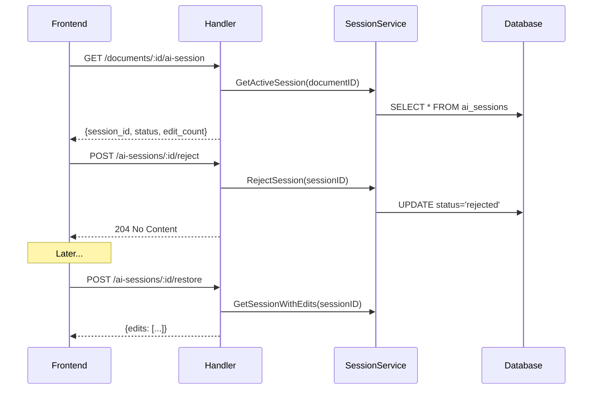

# Phase 3: AI Session API Endpoints

**Dependencies**: Phase 1 (AI Sessions Database)

---

## Overview

HTTP endpoints for frontend to interact with AI editing sessions. Enables accept/reject flows, provides pre-computed `ai_version` for conflict resolution, and allows updating individual edit status.



---

## Files to Create/Modify

| File | Action | Description |
|------|--------|-------------|
| `backend/internal/handler/ai_session_handler.go` | Create | Session endpoints |
| `backend/internal/handler/routes.go` | Modify | Register routes |

---

## Endpoints

### Get Active Session

Get the active AI session for a document (if any).

```
GET /api/documents/:documentId/ai-session
```

**Response**: `200 OK`
```json
{
  "session": {
    "id": "session-uuid",
    "document_id": "doc-uuid",
    "status": "active",
    "base_snapshot": "Original content when session started...",
    "ai_version": "Content with all AI edits applied...",
    "edit_count": 5,
    "created_at": "2025-01-16T10:00:00Z"
  }
}
```

**Key fields**:
- `base_snapshot`: Document content when AI session started
- `ai_version`: Pre-computed content with all AI edits applied (for conflict resolution)

**Response (no active session)**: `200 OK`
```json
{
  "session": null
}
```

---

### Get Session With Edits

Retrieve session details with all edits (for restore functionality).

```
GET /api/ai-sessions/:sessionId/edits
```

**Response**: `200 OK`
```json
{
  "session": {
    "id": "session-uuid",
    "document_id": "doc-uuid",
    "status": "accepted",
    "base_snapshot": "Original content...",
    "ai_version": "Content with all AI edits applied...",
    "created_at": "2025-01-16T10:00:00Z",
    "resolved_at": "2025-01-16T10:05:00Z"
  },
  "edits": [
    {
      "id": "edit-uuid-1",
      "edit_order": 0,
      "command": "str_replace",
      "path": "/Chapter 5.md",
      "old_str": "The man entered",
      "new_str": "The gentleman strode into",
      "status": "accepted"
    },
    {
      "id": "edit-uuid-2",
      "edit_order": 1,
      "command": "str_replace",
      "path": "/Chapter 5.md",
      "old_str": "the tavern.",
      "new_str": "the dimly lit tavern.",
      "status": "accepted"
    }
  ]
}
```

**Edit status values**:
- `pending`: Edit recorded, session still active
- `accepted`: User accepted the edit (via Accept All or per-hunk Accept)
- `rejected`: User rejected the edit (via Reject All or per-hunk Reject)

> **Note**: Frontend does NOT use `ai_edits` for display - it computes `diff(USER_EDITS, ai_version)` live. Edits are stored for history/audit only.

---

### Resolve Session

Resolve an AI session (accept or reject). Marks session as resolved.

```
POST /api/ai-sessions/:sessionId/resolve
```

**Response**: `204 No Content`

**Implementation notes**:
- Sets `status = 'resolved'`
- Sets `resolved_at = NOW()`
- Edits preserved in `ai_edits` for history
- Frontend determines whether user accepted or rejected

---

### Update Edit Status

Update the status of an individual edit (for per-hunk accept/reject tracking).

```
PATCH /api/ai-edits/:editId/status
```

**Request body**:
```json
{
  "status": "accepted"  // or "rejected"
}
```

**Response**: `204 No Content`

**Use cases**:
- Frontend marks edit as `accepted` when user clicks "Accept" on a hunk
- Frontend marks edit as `rejected` when user clicks "Reject" on a hunk

> **Note**: This is optional - the frontend uses live diff and doesn't need to track per-edit status. This endpoint is provided for audit/history purposes.

---

### Restore Session Edits

Get edits from a rejected session to re-apply them.

```
POST /api/ai-sessions/:sessionId/restore
```

**Response**: `200 OK`
```json
{
  "session_id": "session-uuid",
  "edits": [
    {
      "id": "edit-uuid-1",
      "edit_order": 0,
      "command": "str_replace",
      "path": "/Chapter 5.md",
      "old_str": "The man entered",
      "new_str": "The gentleman strode into"
    }
  ]
}
```

**Frontend behavior**:
- For each edit, attempt to find `old_str` in current document
- If found → apply mark with new text
- If not found → skip (document changed since rejection)
- Show user: "4 of 5 edits restored, 1 skipped"

---

### List Document Sessions (History)

Get all sessions for a document (for history view).

```
GET /api/documents/:documentId/ai-sessions
```

**Response**: `200 OK`
```json
{
  "sessions": [
    {
      "id": "session-uuid-1",
      "status": "accepted",
      "edit_count": 5,
      "created_at": "2025-01-16T10:00:00Z",
      "resolved_at": "2025-01-16T10:05:00Z"
    },
    {
      "id": "session-uuid-2",
      "status": "rejected",
      "edit_count": 3,
      "created_at": "2025-01-15T15:00:00Z",
      "resolved_at": "2025-01-15T15:02:00Z"
    }
  ]
}
```

---

## Handler Implementation

**File**: `backend/internal/handler/ai_session_handler.go`

```go
type AISessionHandler struct {
    sessionService llmSvc.AISessionService
    authorizer     *Authorizer
}

func NewAISessionHandler(
    sessionService llmSvc.AISessionService,
    authorizer *Authorizer,
) *AISessionHandler {
    return &AISessionHandler{
        sessionService: sessionService,
        authorizer:     authorizer,
    }
}

func (h *AISessionHandler) GetActiveSession(w http.ResponseWriter, r *http.Request) {
    userID := middleware.GetUserID(r.Context())
    docID := chi.URLParam(r, "documentId")

    // Verify document ownership
    if err := h.authorizer.Authorize(r.Context(), userID, docID); err != nil {
        httputil.Error(w, err)
        return
    }

    session, err := h.sessionService.GetActiveSession(r.Context(), docID)
    if err != nil {
        httputil.Error(w, err)
        return
    }

    httputil.JSON(w, http.StatusOK, map[string]interface{}{
        "session": session, // nil if no active session
    })
}

func (h *AISessionHandler) Resolve(w http.ResponseWriter, r *http.Request) {
    userID := middleware.GetUserID(r.Context())
    sessionID := chi.URLParam(r, "sessionId")

    // Get session and verify ownership
    session, err := h.sessionService.GetSession(r.Context(), sessionID)
    if err != nil {
        httputil.Error(w, err)
        return
    }

    if err := h.authorizer.Authorize(r.Context(), userID, session.DocumentID); err != nil {
        httputil.Error(w, err)
        return
    }

    if err := h.sessionService.ResolveSession(r.Context(), sessionID); err != nil {
        httputil.Error(w, err)
        return
    }

    w.WriteHeader(http.StatusNoContent)
}

func (h *AISessionHandler) UpdateEditStatus(w http.ResponseWriter, r *http.Request) {
    userID := middleware.GetUserID(r.Context())
    editID := chi.URLParam(r, "editId")

    var req struct {
        Status string `json:"status"`
    }
    if err := json.NewDecoder(r.Body).Decode(&req); err != nil {
        httputil.Error(w, err)
        return
    }

    // Validate status
    if !isValidEditStatus(req.Status) {
        httputil.Error(w, errors.New("invalid status"))
        return
    }

    // TODO: Verify ownership via session → document

    if err := h.sessionService.UpdateEditStatus(r.Context(), editID, llm.AIEditStatus(req.Status)); err != nil {
        httputil.Error(w, err)
        return
    }

    w.WriteHeader(http.StatusNoContent)
}

func isValidEditStatus(s string) bool {
    return s == "accepted" || s == "rejected"
}

func (h *AISessionHandler) Restore(w http.ResponseWriter, r *http.Request) {
    userID := middleware.GetUserID(r.Context())
    sessionID := chi.URLParam(r, "sessionId")

    // Get session with edits
    sessionWithEdits, err := h.sessionService.GetSessionWithEdits(r.Context(), sessionID)
    if err != nil {
        httputil.Error(w, err)
        return
    }

    // Verify ownership
    if err := h.authorizer.Authorize(r.Context(), userID, sessionWithEdits.Session.DocumentID); err != nil {
        httputil.Error(w, err)
        return
    }

    httputil.JSON(w, http.StatusOK, map[string]interface{}{
        "session_id": sessionID,
        "edits":      sessionWithEdits.Edits,
    })
}
```

---

## Route Registration

```go
// Document-scoped session routes
r.Route("/api/documents/{documentId}", func(r chi.Router) {
    // ... existing routes ...

    r.Get("/ai-session", h.AISession.GetActiveSession)
    r.Get("/ai-sessions", h.AISession.ListSessions)
})

// Session-scoped routes
r.Route("/api/ai-sessions/{sessionId}", func(r chi.Router) {
    r.Get("/edits", h.AISession.GetEdits)
    r.Post("/resolve", h.AISession.Resolve)
    r.Post("/restore", h.AISession.Restore)
})

// Edit-scoped routes
r.Route("/api/ai-edits/{editId}", func(r chi.Router) {
    r.Patch("/status", h.AISession.UpdateEditStatus)
})
```

---

## Success Criteria

- [ ] Get active session returns session with `ai_version` and `base_snapshot`
- [ ] Get edits returns edits (for history/audit)
- [ ] Resolve endpoint sets status to `accepted` or `rejected`
- [ ] Update edit status endpoint works for individual edits (`accepted`/`rejected`)
- [ ] Restore returns edits for frontend to re-apply
- [ ] List sessions returns history with edit counts
- [ ] Authorization enforced on all endpoints
- [ ] Edits preserved after resolution (for history)

> **Note**: Frontend does NOT use edits for display - it computes `diff(USER_EDITS, ai_version)` live.
