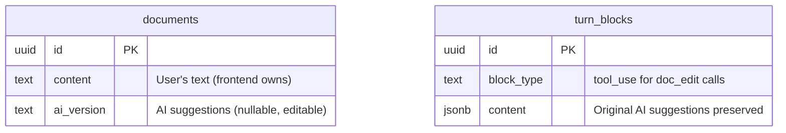

# Phase 1: AI Version Column

**Dependencies**: None

---

## Overview

Add `ai_version` column to the documents table. This is dramatically simpler than the original plan - no separate tables needed.

**Key Architecture**:
- `documents.content` = user's text (frontend owns, synced via auto-save)
- `documents.ai_version` = AI's suggested version (backend owns, AI writes via `doc_edit` tool)
- Frontend computes `diff(content, ai_version)` live for display
- User can edit `ai_version` directly (tweak suggestions before accepting)
- Individual edit history preserved in `turn_blocks` as tool calls



---

## Schema Change

```sql
-- Add ai_version to existing documents table
ALTER TABLE documents ADD COLUMN ai_version TEXT;
```

That's it. No new tables.

---

## Files to Modify

| File | Action | Description |
|------|--------|-------------|
| `backend/migrations/00002_ai_version.sql` | Create | Add ai_version column |
| `backend/internal/domain/models/docsystem/document.go` | Modify | Add `AIVersion *string` field |
| `backend/internal/repository/postgres/docsystem/document.go` | Modify | Include ai_version in queries |
| `backend/internal/handler/document.go` | Modify | Add PATCH/DELETE for ai_version |

---

## Model Change

**File**: `backend/internal/domain/models/docsystem/document.go`

```go
type Document struct {
    // ... existing fields ...
    AIVersion *string `json:"ai_version,omitempty" db:"ai_version"`
}
```

---

## API Endpoints

```
GET    /api/documents/:id              -- returns content + ai_version
PATCH  /api/documents/:id/ai-version   -- user tweaks suggestion
DELETE /api/documents/:id/ai-version   -- user rejects (sets null)
```

The `doc_edit` tool writes to `ai_version` internally (no public endpoint for AI writes).

---

## Data Flow

```
AI suggests edit:
  1. AI calls doc_edit tool with str_replace/insert/append
  2. Backend applies edit to documents.ai_version
  3. Tool call stored in turn_blocks (chat history shows original suggestion)

Frontend displays:
  1. Fetches document with content + ai_version
  2. Computes diff(content, ai_version)
  3. Shows inline diff: ~~user text~~ AI suggestion
  4. If ai_version is null or matches content, no diff shown

User tweaks suggestion:
  1. Edits the highlighted AI text directly
  2. Frontend PATCHes ai_version to backend
  3. Diff recomputes live

User accepts (Accept):
  1. Frontend sets editorContent = ai_version
  2. Auto-save syncs content to backend
  3. content now equals ai_version → diff empty → UI shows no suggestions

User undoes accept (Ctrl+Z):
  1. CodeMirror undo reverts editor to previous state
  2. content differs from ai_version again
  3. Diff reappears automatically

User rejects (Reject All):
  1. Frontend DELETEs ai_version (sets to null)
  2. No ai_version → no diff → suggestions gone
```

---

## AI Tool Behavior

When AI reads document via `doc_view`:
```go
func (t *DocViewTool) Execute(...) {
    doc := getDocument(path)
    // AI sees ai_version if it exists (includes AI's pending suggestions)
    // Otherwise sees user's content
    if doc.AIVersion != nil {
        return *doc.AIVersion
    }
    return doc.Content
}
```

When AI writes via `doc_edit`:
```go
func (t *DocEditTool) Execute(...) {
    doc := getDocument(path)
    // Apply edit to ai_version, or content if no ai_version yet
    base := doc.AIVersion
    if base == nil {
        base = &doc.Content
    }
    newVersion := applyEdit(*base, oldStr, newStr)
    doc.AIVersion = &newVersion
    save(doc)
}
```

---

## Key Design Decisions

1. **`ai_version` on document** - Not separate tables. Simpler, fewer joins.

2. **User can edit `ai_version`** - Allows tweaking suggestions before accepting.

3. **Frontend owns `content`** - Prevents race conditions with auto-save.

4. **No explicit accept/reject state** - Diff disappears when content matches ai_version. Ctrl+Z brings it back.

5. **Last write wins** - Multiple AI edits overwrite ai_version. Future workspace feature handles multi-source conflicts.

6. **Edit history in turn_blocks** - Original AI suggestions preserved as tool_use blocks in chat.

---

## What's NOT Needed (Removed from Original Plan)

- ❌ `ai_sessions` table
- ❌ `ai_edits` table
- ❌ `base_snapshot`
- ❌ Session status (active/accepted/rejected)
- ❌ AISessionService, AISessionRepository
- ❌ Complex state machine

---

## Success Criteria

- [ ] `ai_version` column added to documents table
- [ ] Document model includes AIVersion field
- [ ] Repository includes ai_version in all queries
- [ ] PATCH endpoint allows user to edit ai_version
- [ ] DELETE endpoint clears ai_version (reject)
- [ ] GET returns both content and ai_version

---

## Future Enhancement

For handling multiple AI sources editing the same document, see:
`_docs/future/ideas/ai-behaviors/ai-editing-workspace.md`
