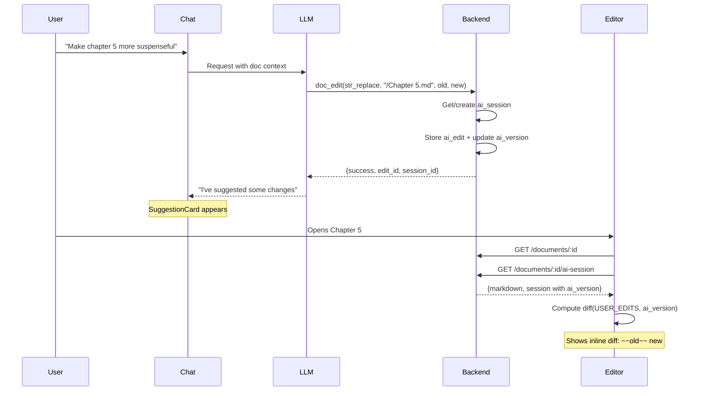
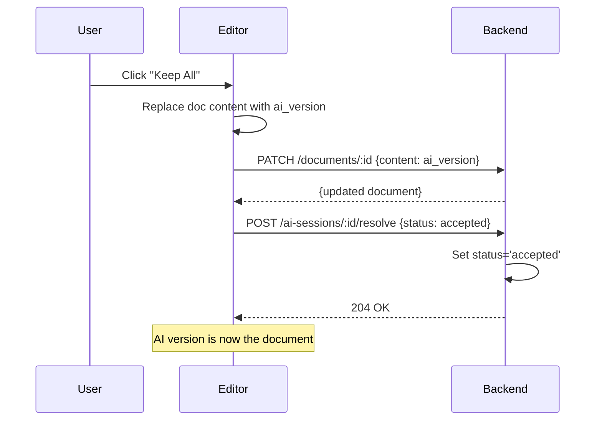
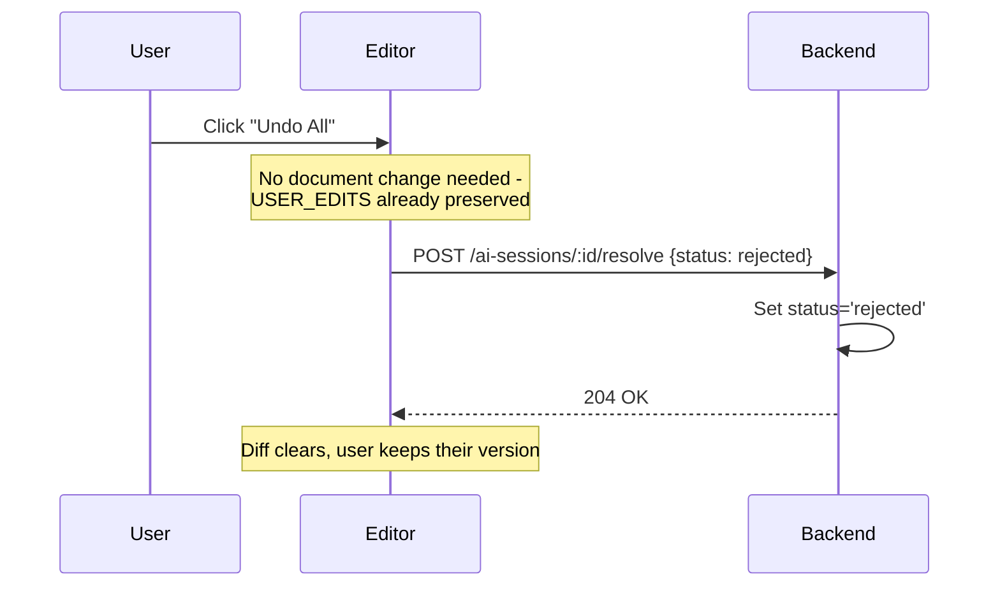
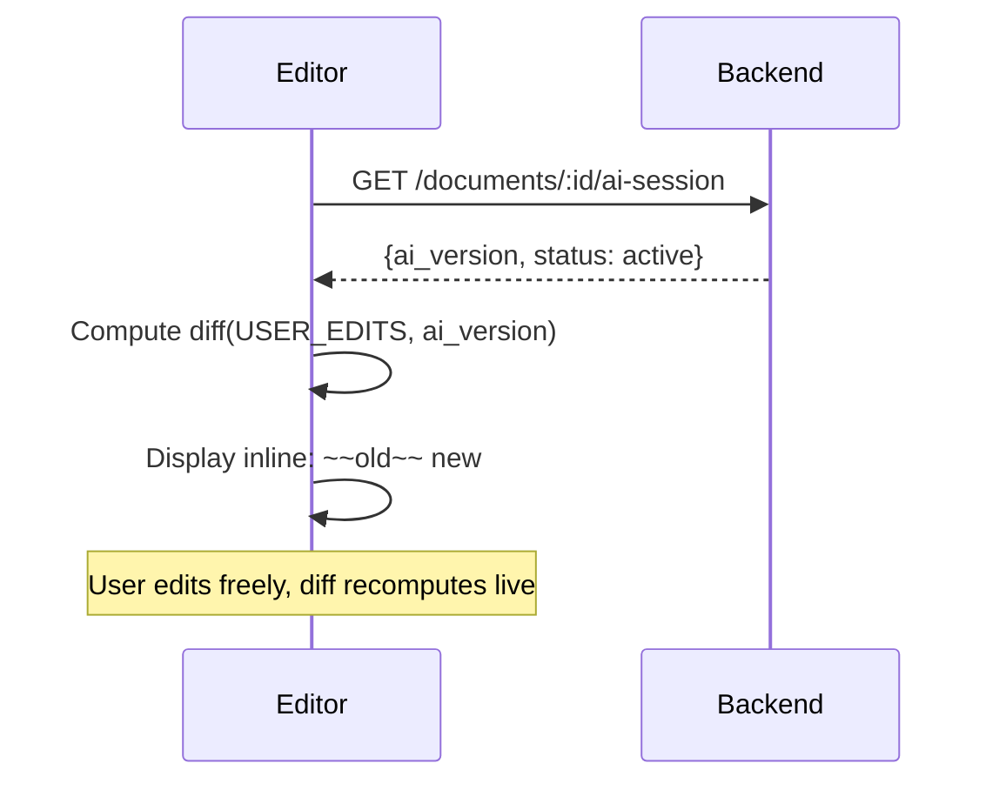
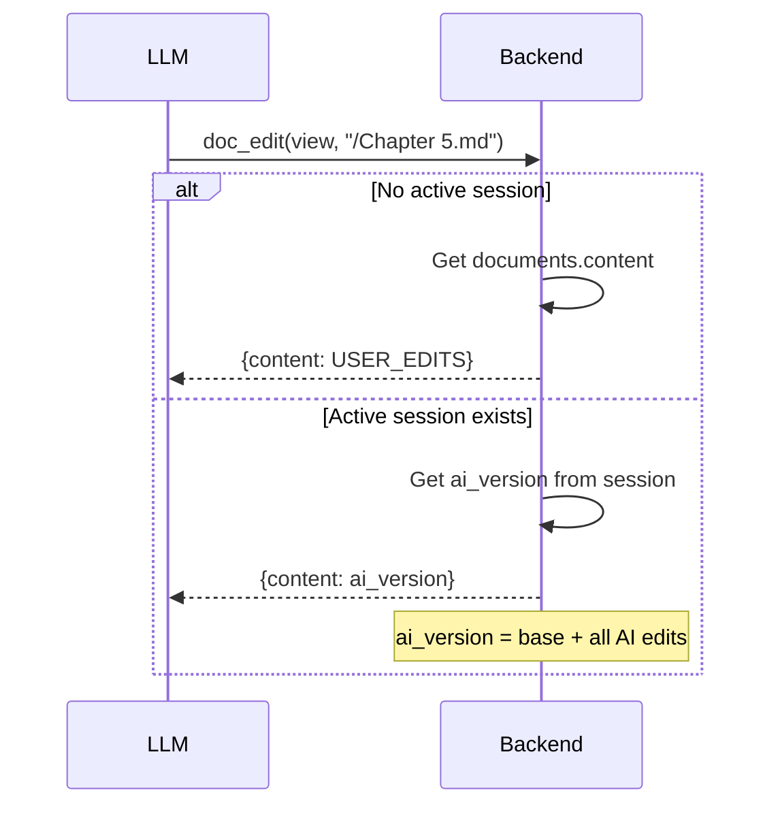
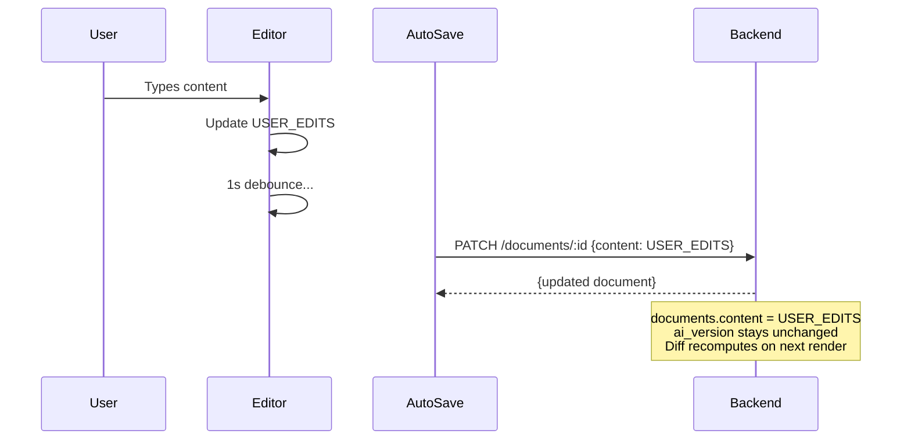

# AI Editing Flows

Visual reference for all AI editing scenarios.

---

## Data Model

### Storage

| What | Where | Format |
|------|-------|--------|
| User content | `documents.content` | Pure markdown (auto-saved) |
| AI version | `ai_sessions.ai_version` | Pre-computed document with all AI edits |
| Edit history | `ai_edits` table | Operations (old_str, new_str) for audit |

### Key Insight

```
documents.content = USER_EDITS (always, auto-saved)
ai_sessions.ai_version = Pre-computed document with all AI edits
Frontend computes diff(USER_EDITS, ai_version) live for display
```

### Status Values

**Session**: `active` | `accepted` | `rejected`
**Edit**: `pending` | `accepted` | `rejected`

---

## Flow 1: AI Makes Suggestion



---

## Flow 2: Keep All (Accept)

Replaces user content with ai_version, resolves session.



---

## Flow 3: Undo All (Reject)

Keeps user content unchanged, resolves session.



---

## Flow 4: Live Diff Display

Frontend computes diff on-the-fly. No position tracking or conflict detection needed.



### Key Behavior

1. **Always live**: Diff computed from `USER_EDITS` (editor state) vs `ai_version` (from session)
2. **No string matching**: No need to find `old_str` - diff handles everything
3. **No conflicts**: User's changes and AI changes shown side-by-side as diff hunks
4. **Recomputes on edit**: User types → diff updates instantly

### Why This Works

- `ai_version` is pre-computed by backend (base + all AI edits)
- Frontend only needs two strings to diff
- No position hints, mark matching, or fallback logic

---

## Flow 5: LLM Views Document

When LLM calls `view`, it sees USER_EDITS + all AI edits applied.



---

## Flow 6: Auto-Save Behavior

Auto-save always saves USER_EDITS (unchanged during AI session).



---

## Summary: What Gets Stored Where

```
+-------------------------------------------------------------+
|                    Frontend (CodeMirror)                    |
|  +-----------------------------------------------------+   |
|  |  USER_EDITS + live diff display                     |   |
|  |  diff(USER_EDITS, ai_version) computed on-the-fly   |   |
|  +-----------------------------------------------------+   |
+-------------------------------------------------------------+
                              |
                              v
+-------------------------------------------------------------+
|                      Backend (DB)                           |
|  +------------------+  +---------------------------------+ |
|  | documents.content|  | ai_sessions                     | |
|  | = USER_EDITS     |  |  - base_snapshot                | |
|  | (pure markdown)  |  |  - ai_version (precomputed)     | |
|  +------------------+  |  - status: active/accepted/rej  | |
|                        +---------------------------------+ |
|                        | ai_edits (history/audit only)   | |
|                        |  - old_str, new_str             | |
|                        |  - status: pending/accepted/rej | |
|                        +---------------------------------+ |
+-------------------------------------------------------------+
```
