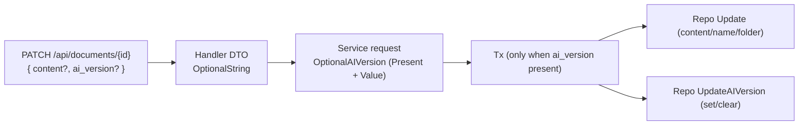

# Phase 0.1: Core — `PATCH /api/documents/{id}` tri-state `ai_version`

## Why

Inline suggestions must be able to save **both** `content` and `ai_version` in a single request without ambiguity:
- “don’t change `ai_version`” (field absent)
- “clear `ai_version`” (explicit `null`)
- “set `ai_version`” (string, including `""`)

If we get this wrong, autosave can silently overwrite or fail to clear AI suggestions, and we can’t safely build the merged-document diff UI on top.

## What

Add tri-state semantics for `ai_version` to the existing document PATCH endpoint, while preserving current behavior for all existing callers (e.g. content-only patch).

### Contract (source of truth)

| JSON field `ai_version` | Meaning | Server behavior |
|---|---|---|
| *(absent)* | Don’t change | Leave DB `ai_version` as-is |
| `null` | Clear | Set DB `ai_version = NULL` |
| `""` | Set empty | Set DB `ai_version = ""` |
| `"text"` | Set | Set DB `ai_version = "text"` |

### Non-goals

- No diff/PUA marker work.
- No client/UI changes beyond what is required to exercise the endpoint.

## Core decisions (correctness-first)

- **Explicit presence tracking** in JSON decoding (Go pointers can’t distinguish “absent” vs `null` in a PATCH DTO).
- **Atomic update** when both `content` and `ai_version` are provided (avoid partial state such as “content saved but AI suggestion not updated”).
- **Do not introduce new required fields** for this endpoint (do not start requiring `project_id` for content-only patches).

## Implementation outline (what to build)

### 0.1.1 Optional JSON field type

Create `backend/internal/httputil/optional_string.go`:
- A value-type `OptionalString` that tracks whether the field was present.
- Recommended shape: `Present bool` + `Value *string` (where `nil` means JSON `null`; non-nil can still be `""`).
- Harden `UnmarshalJSON` by trimming whitespace before checking for `null`.

### 0.1.2 Handler-level PATCH DTO (transport-only)

Update `backend/internal/handler/document.go`:
- Define a handler-local DTO for `UpdateDocument` that includes `ai_version` as `httputil.OptionalString`.
- Map into a service request that is transport-agnostic (do not put `json` tags on the “optional semantics” field).

### 0.1.3 Service request optional semantics (transport-agnostic)

Update `backend/internal/domain/services/docsystem/document.go`:
- Add `OptionalAIVersion` (e.g. `Present bool` + `Value *string`) and include it in `UpdateDocumentRequest` as a non-JSON field.
- This keeps the domain/service layer explicit and prevents “nil means multiple things” bugs.

### 0.1.4 Atomic update in service

Update `backend/internal/service/docsystem/document.go`:
- When `req.AIVersion.Present == true`, wrap the update in `txManager.ExecTx(...)`.
- In the transaction:
  - Apply the regular document update (existing repo `Update`).
  - Apply `ai_version` via repo `UpdateAIVersion` with `nil` (clear) or `&string` (set, including empty string).
- Return a document response that reflects DB truth (not stale `updated_at` / `ai_version`).
  - Option: re-fetch the document inside the transaction via `GetByIDOnly`.

### 0.1.5 Verification (minimum)

Prefer API-level verification (since the backend currently has no Go unit tests):
- PATCH with `{ "content": "x" }` does not clear `ai_version`.
- PATCH with `{ "ai_version": null }` clears.
- PATCH with `{ "ai_version": "" }` sets empty string.
- PATCH with `{ "ai_version": "hello" }` sets the value.
- PATCH with both `content` + `ai_version` updates both, with no partial state on error.

## Done when

- The contract table above matches real behavior.
- Existing frontend code that calls content-only `PATCH /api/documents/{id}` continues to work unchanged.
- Inline suggestions save path can rely on one request with tri-state semantics.

