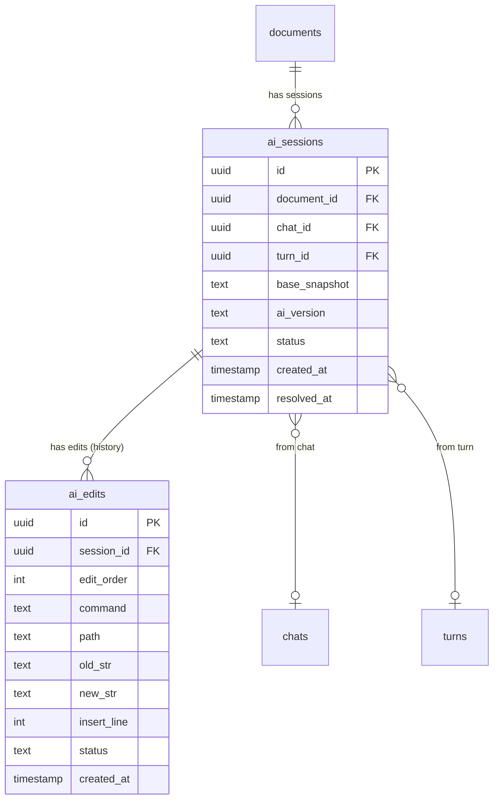

# Phase 1: AI Sessions Database

**Dependencies**: None

---

## Overview

Add `ai_sessions` and `ai_edits` tables to track AI editing sessions and pre-computed `ai_version` for live diff display.

**Key Architecture Note**:
- `documents.content` always contains USER_EDITS (pure markdown, auto-saved)
- `ai_version` stores the AI's intended document state (base + all AI edits)
- Frontend computes `diff(USER_EDITS, ai_version)` live for display
- `ai_edits` table kept for history/audit, but NOT used for display (diff handles everything)



**Simplification from original design**: No position hints needed (position_in_ai_version, line_number, context_before) - frontend computes diff on-the-fly.

---

## Files to Create/Modify

| File | Action | Description |
|------|--------|-------------|
| `backend/migrations/00002_ai_sessions.sql` | Create | Add ai_sessions, ai_edits tables |
| `backend/internal/domain/models/llm/ai_session.go` | Create | New models |
| `backend/internal/domain/repositories/llm/ai_session.go` | Create | Repository interface |
| `backend/internal/repository/postgres/llm/ai_session.go` | Create | Implementation |
| `backend/internal/service/llm/ai_session/service.go` | Create | Service layer |

---

## Database Schema

```sql
-- AI Sessions Table
-- Tracks AI editing sessions with base snapshot and pre-computed ai_version
CREATE TABLE ai_sessions (
    id UUID PRIMARY KEY DEFAULT uuid_generate_v4(),
    document_id UUID NOT NULL REFERENCES documents(id) ON DELETE CASCADE,
    chat_id UUID REFERENCES chats(id) ON DELETE SET NULL,
    turn_id UUID REFERENCES turns(id) ON DELETE SET NULL,
    base_snapshot TEXT NOT NULL,         -- Document content when AI session started
    ai_version TEXT NOT NULL,            -- PRE-COMPUTED: base + all ai_edits applied
    status TEXT NOT NULL DEFAULT 'active'
        CHECK (status IN ('active', 'accepted', 'rejected')),
    created_at TIMESTAMPTZ NOT NULL DEFAULT NOW(),
    resolved_at TIMESTAMPTZ              -- When session was accepted/rejected
);

-- AI Edits Table
-- Stores individual AI edit commands for history/audit
-- NOTE: Frontend does NOT use this for display - it computes diff(USER_EDITS, ai_version) live
CREATE TABLE ai_edits (
    id UUID PRIMARY KEY DEFAULT uuid_generate_v4(),
    session_id UUID NOT NULL REFERENCES ai_sessions(id) ON DELETE CASCADE,
    edit_order INT NOT NULL,             -- Order edits were applied (0-indexed)
    command TEXT NOT NULL                -- 'str_replace', 'insert', 'append'
        CHECK (command IN ('str_replace', 'insert', 'append')),
    path TEXT NOT NULL,                  -- Document path used in command
    old_str TEXT,                        -- For str_replace: text to find
    new_str TEXT,                        -- For str_replace/insert/append: new text
    insert_line INT,                     -- For insert: line number to insert after
    status TEXT NOT NULL DEFAULT 'pending'
        CHECK (status IN ('pending', 'accepted', 'rejected')),
    created_at TIMESTAMPTZ NOT NULL DEFAULT NOW(),

    UNIQUE(session_id, edit_order)       -- Prevent duplicate edit orders
);

-- Indexes
CREATE INDEX idx_ai_sessions_document_active ON ai_sessions(document_id, status)
    WHERE status = 'active';
CREATE INDEX idx_ai_sessions_document ON ai_sessions(document_id);
CREATE INDEX idx_ai_sessions_chat ON ai_sessions(chat_id) WHERE chat_id IS NOT NULL;
CREATE INDEX idx_ai_edits_session_order ON ai_edits(session_id, edit_order);
```

**Removed from original**: `position_in_ai_version`, `line_number`, `context_before`, `failed` status, `applied` status. Live diff handles everything.

---

## Model Definition

**File**: `backend/internal/domain/models/llm/ai_session.go`

```go
package llm

import "time"

type AISessionStatus string

const (
    AISessionStatusActive   AISessionStatus = "active"
    AISessionStatusAccepted AISessionStatus = "accepted"
    AISessionStatusRejected AISessionStatus = "rejected"
)

type AISession struct {
    ID           string          `json:"id" db:"id"`
    DocumentID   string          `json:"document_id" db:"document_id"`
    ChatID       *string         `json:"chat_id,omitempty" db:"chat_id"`
    TurnID       *string         `json:"turn_id,omitempty" db:"turn_id"`
    BaseSnapshot string          `json:"base_snapshot" db:"base_snapshot"`
    AIVersion    string          `json:"ai_version" db:"ai_version"`  // KEY: Frontend diffs against this
    Status       AISessionStatus `json:"status" db:"status"`
    CreatedAt    time.Time       `json:"created_at" db:"created_at"`
    ResolvedAt   *time.Time      `json:"resolved_at,omitempty" db:"resolved_at"`
}

type AIEditCommand string

const (
    AIEditCommandStrReplace AIEditCommand = "str_replace"
    AIEditCommandInsert     AIEditCommand = "insert"
    AIEditCommandAppend     AIEditCommand = "append"
)

type AIEditStatus string

const (
    AIEditStatusPending  AIEditStatus = "pending"
    AIEditStatusAccepted AIEditStatus = "accepted"
    AIEditStatusRejected AIEditStatus = "rejected"
)

// AIEdit - stored for history/audit only
// Frontend does NOT use these for display - it computes diff(USER_EDITS, ai_version) live
type AIEdit struct {
    ID         string        `json:"id" db:"id"`
    SessionID  string        `json:"session_id" db:"session_id"`
    EditOrder  int           `json:"edit_order" db:"edit_order"`
    Command    AIEditCommand `json:"command" db:"command"`
    Path       string        `json:"path" db:"path"`
    OldStr     *string       `json:"old_str,omitempty" db:"old_str"`
    NewStr     *string       `json:"new_str,omitempty" db:"new_str"`
    InsertLine *int          `json:"insert_line,omitempty" db:"insert_line"`
    Status     AIEditStatus  `json:"status" db:"status"`
    CreatedAt  time.Time     `json:"created_at" db:"created_at"`
}

// AISessionWithEdits - includes edits for history view
type AISessionWithEdits struct {
    Session AISession `json:"session"`
    Edits   []AIEdit  `json:"edits"`
}
```

**Removed**: `PositionInAIVersion`, `LineNumber`, `ContextBefore`, `Applied`/`Failed` statuses

---

## Repository Interfaces (SOLID: Interface Segregation)

**File**: `backend/internal/domain/repositories/llm/ai_session.go`

Split into focused interfaces for flexibility:

```go
// AISessionReader - read operations only
type AISessionReader interface {
    GetSession(ctx context.Context, sessionID string) (*llm.AISession, error)
    GetActiveSession(ctx context.Context, documentID string) (*llm.AISession, error)
    GetSessionWithEdits(ctx context.Context, sessionID string) (*llm.AISessionWithEdits, error)
    ListSessionsByDocument(ctx context.Context, documentID string) ([]llm.AISession, error)
}

// AISessionWriter - write operations only
type AISessionWriter interface {
    CreateSession(ctx context.Context, session *llm.AISession) error
    UpdateSessionStatus(ctx context.Context, sessionID string, status llm.AISessionStatus) error
    UpdateAIVersion(ctx context.Context, sessionID string, aiVersion string) error
}

// AIEditRepository - edit-specific operations
type AIEditRepository interface {
    AddEdit(ctx context.Context, edit *llm.AIEdit) error
    GetEdits(ctx context.Context, sessionID string) ([]llm.AIEdit, error)
    GetNextEditOrder(ctx context.Context, sessionID string) (int, error)
    UpdateEditStatus(ctx context.Context, editID string, status llm.AIEditStatus) error
}

// AISessionRepository - composite for services needing full access
type AISessionRepository interface {
    AISessionReader
    AISessionWriter
    AIEditRepository
}
```

**Benefits**:
- Components can depend on minimal interface they need
- Easier to mock in tests
- Clear separation of read vs write operations

---

## Service Interface

**File**: `backend/internal/domain/services/llm/ai_session.go`

```go
type AISessionService interface {
    // Create session when AI starts editing (returns existing if active)
    // NOTE: ai_version is initialized to base_snapshot
    CreateSession(ctx context.Context, req *CreateAISessionRequest) (*llm.AISession, error)

    // Get session by ID
    GetSession(ctx context.Context, sessionID string) (*llm.AISession, error)

    // Get active session for document (nil if none)
    GetActiveSession(ctx context.Context, documentID string) (*llm.AISession, error)

    // Add edit to session (called by doc_edit tool)
    // NOTE: This updates ai_version (no position hints - frontend computes diff)
    AddEdit(ctx context.Context, sessionID string, input *CreateAIEditInput) (*llm.AIEdit, error)

    // Get session with edits (for history view)
    GetSessionWithEdits(ctx context.Context, sessionID string) (*llm.AISessionWithEdits, error)

    // Resolve session (accept/reject)
    ResolveSession(ctx context.Context, sessionID string, status llm.AISessionStatus) error

    // List sessions for document (history)
    ListSessionsByDocument(ctx context.Context, documentID string) ([]llm.AISession, error)
}

type CreateAISessionRequest struct {
    DocumentID   string
    ChatID       *string
    TurnID       *string
    BaseSnapshot string
    // ai_version initialized to BaseSnapshot
}

type CreateAIEditInput struct {
    Command    llm.AIEditCommand
    Path       string
    OldStr     *string
    NewStr     *string
    InsertLine *int
    // No position hints needed - frontend computes diff(USER_EDITS, ai_version)
}
```

---

## Key Implementation Notes

### Session Creation
- If an active session exists for the document, return it instead of creating new
- **Initialize `ai_version = base_snapshot`** when creating session
- Session starts in `active` status
- Enforce at most one `active` session per document (partial unique index)

### Adding Edits (Simplified!)
After storing an edit, the service must:
1. Apply the edit to current `ai_version`
2. Store the edit (for history)
3. Update session's `ai_version`

**No position hints** - frontend computes `diff(USER_EDITS, ai_version)` on-the-fly.

```go
func (s *AISessionService) AddEdit(ctx context.Context, sessionID string, input *CreateAIEditInput) (*llm.AIEdit, error) {
    session, err := s.repo.GetSession(ctx, sessionID)
    if err != nil {
        return nil, err
    }

    // Apply edit to ai_version
    newAIVersion := applyEdit(session.AIVersion, input)

    // Get next edit order
    editOrder, _ := s.repo.GetNextEditOrder(ctx, sessionID)

    // Store edit for history (no position hints needed)
    edit := &llm.AIEdit{
        ID:         uuid.New().String(),
        SessionID:  sessionID,
        EditOrder:  editOrder,
        Command:    input.Command,
        Path:       input.Path,
        OldStr:     input.OldStr,
        NewStr:     input.NewStr,
        InsertLine: input.InsertLine,
        Status:     llm.AIEditStatusPending,
    }

    if err := s.repo.AddEdit(ctx, edit); err != nil {
        return nil, err
    }

    // Update session's ai_version - this is what frontend diffs against
    if err := s.repo.UpdateAIVersion(ctx, sessionID, newAIVersion); err != nil {
        return nil, err
    }

    return edit, nil
}
```

### Session Resolution
- `ResolveSession`: Set status to `accepted` or `rejected`, set `resolved_at`
- Edits remain in DB (for history/audit)

---

## Success Criteria

- [ ] `ai_sessions` table created with `base_snapshot` AND `ai_version`
- [ ] `ai_edits` table created (for history/audit)
- [ ] `ai_version` initialized to `base_snapshot` on session creation
- [ ] `ai_version` updated after each edit
- [ ] Can get active session for document
- [ ] Can add edits with auto-incrementing order
- [ ] Can resolve session (accept/reject)
- [ ] Repository and service layers complete

**Note**: No position hints needed - frontend computes `diff(USER_EDITS, ai_version)` live.
