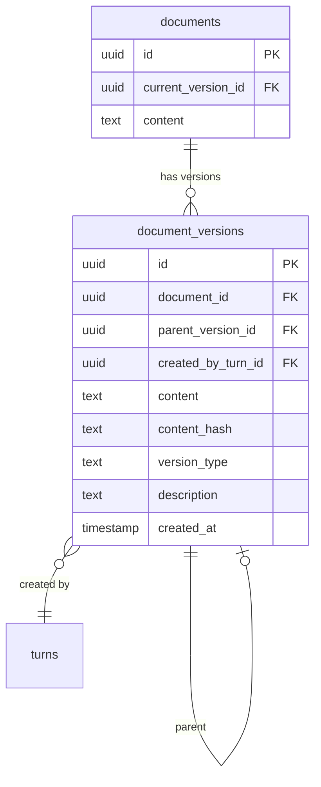

# Phase 1: Version Snapshots Database

**Dependencies**: None
**Estimated Time**: 2-3 hours

---

## Overview

Add `document_versions` table to track AI suggestions and document history.



---

## Files to Create/Modify

| File | Action | Description |
|------|--------|-------------|
| `backend/schema.sql` | Modify | Add document_versions table |
| `backend/internal/domain/models/document_version.go` | Create | New model |
| `backend/internal/domain/repositories/docsystem/version.go` | Create | Repository interface |
| `backend/internal/repository/postgres/version_repository.go` | Create | Implementation |
| `backend/internal/domain/services/docsystem/version.go` | Create | Service layer |

---

## Database Schema

```sql
-- Migration: Add document_versions table
CREATE TABLE document_versions (
    id UUID PRIMARY KEY DEFAULT uuid_generate_v4(),
    document_id UUID NOT NULL REFERENCES documents(id) ON DELETE CASCADE,
    parent_version_id UUID REFERENCES document_versions(id),
    created_by_turn_id UUID REFERENCES turns(id),
    content TEXT NOT NULL,
    content_hash TEXT NOT NULL, -- SHA256 for quick comparison
    version_type TEXT NOT NULL CHECK (version_type IN ('user_edit', 'ai_suggestion', 'manual_snapshot')),
    description TEXT,
    created_at TIMESTAMP WITH TIME ZONE DEFAULT NOW(),

    CONSTRAINT valid_ai_suggestion CHECK (
        version_type != 'ai_suggestion' OR created_by_turn_id IS NOT NULL
    )
);

-- Indexes
CREATE INDEX idx_document_versions_document_id ON document_versions(document_id);
CREATE INDEX idx_document_versions_version_type ON document_versions(version_type);
CREATE INDEX idx_document_versions_parent ON document_versions(parent_version_id);
CREATE INDEX idx_document_versions_turn ON document_versions(created_by_turn_id);

-- Update documents table
ALTER TABLE documents ADD COLUMN current_version_id UUID REFERENCES document_versions(id);
```

---

## Model Definition

**File**: `backend/internal/domain/models/document_version.go`

```go
package models

type DocumentVersion struct {
    ID              string    `json:"id"`
    DocumentID      string    `json:"document_id"`
    ParentVersionID *string   `json:"parent_version_id,omitempty"`
    CreatedByTurnID *string   `json:"created_by_turn_id,omitempty"`
    Content         string    `json:"content"`
    ContentHash     string    `json:"content_hash"`
    VersionType     string    `json:"version_type"` // "user_edit", "ai_suggestion", "manual_snapshot"
    Description     *string   `json:"description,omitempty"`
    CreatedAt       time.Time `json:"created_at"`
}

// Version types
const (
    VersionTypeUserEdit       = "user_edit"
    VersionTypeAISuggestion   = "ai_suggestion"
    VersionTypeManualSnapshot = "manual_snapshot"
)
```

---

## Repository Interface

**File**: `backend/internal/domain/repositories/docsystem/version.go`

```go
type VersionRepository interface {
    Create(ctx context.Context, version *models.DocumentVersion) error
    GetByID(ctx context.Context, id string) (*models.DocumentVersion, error)
    GetHistory(ctx context.Context, documentID string, limit int) ([]*models.DocumentVersion, error)
    GetPendingSuggestions(ctx context.Context, documentID string) ([]*models.DocumentVersion, error)
    Delete(ctx context.Context, id string) error
}
```

---

## Service Interface

**File**: `backend/internal/domain/services/docsystem/version.go`

```go
type VersionService interface {
    // CreateVersion creates a new version with computed hash
    CreateVersion(ctx context.Context, req *CreateVersionRequest) (*models.DocumentVersion, error)

    // AcceptVersion applies suggestion to document
    AcceptVersion(ctx context.Context, userID, versionID string) error

    // RejectVersion removes suggestion (soft delete)
    RejectVersion(ctx context.Context, userID, versionID string) error

    // GetPendingSuggestions returns AI suggestions not yet accepted/rejected
    GetPendingSuggestions(ctx context.Context, userID, documentID string) ([]*models.DocumentVersion, error)
}

type CreateVersionRequest struct {
    DocumentID      string
    ParentVersionID *string
    CreatedByTurnID *string
    Content         string
    VersionType     string
    Description     *string
}
```

---

## Implementation Details

### Hash Calculation

```go
import "crypto/sha256"

func calculateContentHash(content string) string {
    hash := sha256.Sum256([]byte(content))
    return hex.EncodeToString(hash[:])
}
```

### Accept Version Flow

```go
func (s *versionService) AcceptVersion(ctx context.Context, userID, versionID string) error {
    version, err := s.versionRepo.GetByID(ctx, versionID)
    if err != nil {
        return err
    }

    // Verify ownership via document
    doc, err := s.docRepo.GetByID(ctx, version.DocumentID)
    if err != nil {
        return err
    }

    // Update document content and current_version_id
    return s.docRepo.Update(ctx, doc.ID, &UpdateDocumentRequest{
        Content:          &version.Content,
        CurrentVersionID: &versionID,
    })
}
```

---

## Testing Checklist

- [ ] Create version with valid parent
- [ ] Create version without parent (initial)
- [ ] Get version history (ordered by created_at DESC)
- [ ] Get pending suggestions (type = ai_suggestion, not current)
- [ ] Accept suggestion (updates document content + current_version_id)
- [ ] Reject suggestion (soft deletes or marks rejected)
- [ ] Content hash calculation correct
- [ ] Authorization: user can only access own documents' versions

---

## Success Criteria

- [ ] `document_versions` table created with proper constraints
- [ ] Version CRUD operations work
- [ ] Accept/reject flows update document correctly
- [ ] Pending suggestions queryable
- [ ] Hash comparison works for duplicate detection
