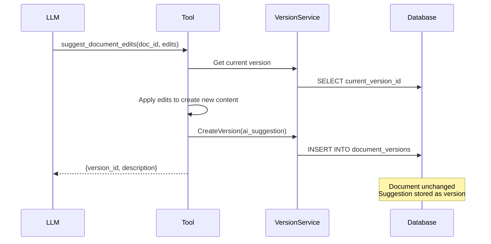

# Phase 2: Suggest Document Edits Tool

**Dependencies**: Phase 1 (Version Snapshots)
**Estimated Time**: 3-4 hours

---

## Overview

Implement `suggest_document_edits` tool for AI to create version snapshots without modifying the live document.



---

## Files to Create/Modify

| File | Action | Description |
|------|--------|-------------|
| `backend/internal/service/llm/tools/suggest_edits.go` | Create | Tool implementation |
| `backend/internal/domain/models/llm/tool_definition.go` | Modify | Add tool schema |
| `backend/internal/service/llm/tools/builder.go` | Modify | Register tool |

---

## Tool Definition

Add to `tool_definition.go`:

```go
func getSuggestDocumentEditsDefinition() ToolDefinition {
    return ToolDefinition{
        Type: "function",
        Function: &FunctionDetails{
            Name: "suggest_document_edits",
            Description: `Suggest edits to a document. Creates a version for the user to review.
User can accept, reject, or ask you to refine further.

IMPORTANT: When refining previous suggestions, your edits build on the last suggestion (not the live document).

Use this tool when the user asks you to edit, improve, rewrite, or modify their writing.`,
            Parameters: map[string]interface{}{
                "type": "object",
                "properties": map[string]interface{}{
                    "document_id": map[string]interface{}{
                        "type":        "string",
                        "description": "ID of the document to edit",
                    },
                    "edits": map[string]interface{}{
                        "type": "array",
                        "description": "List of edits to apply",
                        "items": map[string]interface{}{
                            "type": "object",
                            "properties": map[string]interface{}{
                                "type": map[string]interface{}{
                                    "type": "string",
                                    "enum": []string{"insert", "delete", "replace"},
                                },
                                "start": map[string]interface{}{
                                    "type":        "integer",
                                    "description": "Start character position (0-indexed)",
                                },
                                "end": map[string]interface{}{
                                    "type":        "integer",
                                    "description": "End character position (for delete/replace)",
                                },
                                "text": map[string]interface{}{
                                    "type":        "string",
                                    "description": "Text to insert or replace with",
                                },
                            },
                            "required": []string{"type", "start"},
                        },
                    },
                    "description": map[string]interface{}{
                        "type":        "string",
                        "description": "Brief description of what these edits accomplish",
                    },
                },
                "required": []string{"document_id", "edits", "description"},
            },
        },
    }
}
```

---

## Tool Implementation

**File**: `backend/internal/service/llm/tools/suggest_edits.go`

```go
type SuggestEditsTool struct {
    projectID      string
    versionService docsysSvc.VersionService
    docRepo        docsysRepo.DocumentRepository
    config         *ToolConfig
}

func NewSuggestEditsTool(
    projectID string,
    versionService docsysSvc.VersionService,
    docRepo docsysRepo.DocumentRepository,
    config *ToolConfig,
) *SuggestEditsTool {
    if config == nil {
        config = DefaultToolConfig()
    }
    return &SuggestEditsTool{
        projectID:      projectID,
        versionService: versionService,
        docRepo:        docRepo,
        config:         config,
    }
}

func (t *SuggestEditsTool) Execute(ctx context.Context, input map[string]interface{}) (interface{}, error) {
    // 1. Extract parameters
    docID, ok := input["document_id"].(string)
    if !ok || docID == "" {
        return nil, errors.New("document_id is required")
    }

    editsRaw, ok := input["edits"].([]interface{})
    if !ok {
        return nil, errors.New("edits array is required")
    }

    description, _ := input["description"].(string)

    // 2. Parse edits
    edits, err := parseEdits(editsRaw)
    if err != nil {
        return nil, fmt.Errorf("invalid edits: %w", err)
    }

    // 3. Get current document content
    doc, err := t.docRepo.GetByID(ctx, docID, t.projectID)
    if err != nil {
        return nil, fmt.Errorf("document not found: %w", err)
    }

    // 4. Apply edits to create new content
    newContent, err := applyEdits(doc.Content, edits)
    if err != nil {
        return nil, fmt.Errorf("failed to apply edits: %w", err)
    }

    // 5. Create AI suggestion version
    turnID := ctx.Value("turn_id").(string) // Set by streaming adapter
    version, err := t.versionService.CreateVersion(ctx, &docsysSvc.CreateVersionRequest{
        DocumentID:      docID,
        ParentVersionID: doc.CurrentVersionID,
        CreatedByTurnID: &turnID,
        Content:         newContent,
        VersionType:     models.VersionTypeAISuggestion,
        Description:     &description,
    })
    if err != nil {
        return nil, fmt.Errorf("failed to create version: %w", err)
    }

    // 6. Return version info (NOT updating live document!)
    return map[string]interface{}{
        "version_id":   version.ID,
        "description":  description,
        "edit_count":   len(edits),
        "char_delta":   len(newContent) - len(doc.Content),
    }, nil
}
```

---

## Edit Application Logic

```go
type Edit struct {
    Type  string // "insert", "delete", "replace"
    Start int
    End   int    // Only for delete/replace
    Text  string // Only for insert/replace
}

func applyEdits(content string, edits []Edit) (string, error) {
    // Sort edits by position (descending) to avoid offset issues
    sort.Slice(edits, func(i, j int) bool {
        return edits[i].Start > edits[j].Start
    })

    runes := []rune(content)

    for _, edit := range edits {
        if edit.Start < 0 || edit.Start > len(runes) {
            return "", fmt.Errorf("invalid start position: %d", edit.Start)
        }

        switch edit.Type {
        case "insert":
            // Insert text at position
            runes = insertAt(runes, edit.Start, []rune(edit.Text))

        case "delete":
            if edit.End < edit.Start || edit.End > len(runes) {
                return "", fmt.Errorf("invalid end position: %d", edit.End)
            }
            runes = append(runes[:edit.Start], runes[edit.End:]...)

        case "replace":
            if edit.End < edit.Start || edit.End > len(runes) {
                return "", fmt.Errorf("invalid end position: %d", edit.End)
            }
            runes = append(runes[:edit.Start], append([]rune(edit.Text), runes[edit.End:]...)...)

        default:
            return "", fmt.Errorf("unknown edit type: %s", edit.Type)
        }
    }

    return string(runes), nil
}

func insertAt(runes []rune, pos int, insert []rune) []rune {
    return append(runes[:pos], append(insert, runes[pos:]...)...)
}
```

---

## Builder Registration

**File**: `backend/internal/service/llm/tools/builder.go`

```go
func (b *ToolRegistryBuilder) WithSuggestEdits(
    projectID string,
    versionService docsysSvc.VersionService,
    docRepo docsysRepo.DocumentRepository,
) *ToolRegistryBuilder {
    tool := NewSuggestEditsTool(projectID, versionService, docRepo, b.config)
    b.registry.Register("suggest_document_edits", tool)
    return b
}
```

---

## Context Injection

The streaming adapter must inject `turn_id` into context:

**File**: `backend/internal/service/llm/streaming/mstream_adapter.go`

```go
// In executeToolsAndContinue or similar
toolCtx := context.WithValue(ctx, "turn_id", turn.ID)
results := toolRegistry.ExecuteParallel(toolCtx, toolCalls)
```

---

## Testing Checklist

- [ ] Tool parses input correctly
- [ ] Single edit (insert, delete, replace) applies correctly
- [ ] Multiple edits apply in correct order (descending positions)
- [ ] Version created with correct type and turn ID
- [ ] Live document NOT modified
- [ ] Error handling: invalid document ID, invalid positions, malformed edits

---

## Success Criteria

- [ ] AI can call `suggest_document_edits` tool
- [ ] Edits create version snapshot
- [ ] Live document unchanged
- [ ] Version linked to turn ID
- [ ] Tool returns version_id for frontend use
