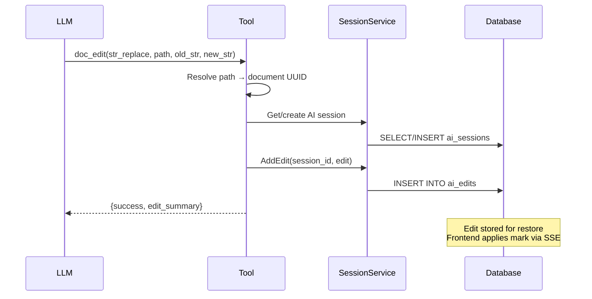

# Phase 2: doc_edit Tool

**Dependencies**: Phase 1 (AI Sessions Database)

---

## Overview

Implement `doc_edit` tool for AI to apply edits using Anthropic-style `str_replace` commands. Edits update `ai_version` in the session - frontend computes `diff(USER_EDITS, ai_version)` live for display.

**Key Design Decision**: Backend stores edits without validating against DB content. DB may be stale due to debounced saves (1 second). Frontend has source of truth (editor state). `success: true` means "edit recorded to ai_version", not "edit applied to document".

**Simplification**: No position hints needed. Frontend computes diff on-the-fly.



---

## Files to Create/Modify

| File | Action | Description |
|------|--------|-------------|
| `backend/internal/service/llm/tools/doc_edit.go` | Create | Tool implementation |
| `backend/internal/service/llm/tools/path_resolver.go` | Create | Path → UUID resolution |
| `backend/internal/domain/models/llm/tool_definition.go` | Modify | Add tool schema |
| `backend/internal/service/llm/tools/builder.go` | Modify | Register tool |

---

## Tool Design

Modeled after Anthropic's `text_editor` tool, adapted for creative writing documents.

### Commands

| Command | Parameters | Description |
|---------|------------|-------------|
| `view` | `path`, `view_range?` | View document content (with line numbers) |
| `str_replace` | `path`, `old_str`, `new_str` | Replace exact text (pattern-based) |
| `insert` | `path`, `insert_line`, `new_str` | Insert text after line N |
| `append` | `path`, `new_str` | Add to end of document |
| `create` | `path`, `file_text` | Create new document |

### Path Format (Unix-style)

```
/characters/protagonist.md     # Document in folder
/Chapter 5.md                  # Document at root
/characters/                   # View folder contents
```

**Rules:**
- `.md` extension required for documents
- Trailing `/` indicates folder (view contents)
- Paths are project-scoped
- Leading `/` preferred, but relative paths normalized

---

## Tool Definition

Add to `tool_definition.go`:

```go
func getDocEditDefinition() ToolDefinition {
    return ToolDefinition{
        Type: "function",
        Function: &FunctionDetails{
            Name: "doc_edit",
            Description: `Edit documents in the user's project. Use this when asked to modify, improve, or create writing.

Commands:
- view: Read document content (with line numbers)
- str_replace: Replace exact text (must match exactly)
- insert: Insert new text after a specific line
- append: Add text to end of document
- create: Create new document

Documents use Unix-style paths: /Chapter 5.md, /characters/protagonist.md`,
            Parameters: map[string]interface{}{
                "type": "object",
                "properties": map[string]interface{}{
                    "command": map[string]interface{}{
                        "type":        "string",
                        "enum":        []string{"view", "str_replace", "insert", "append", "create"},
                        "description": "The editing command to execute",
                    },
                    "path": map[string]interface{}{
                        "type":        "string",
                        "description": "Document path (e.g., /Chapter 5.md, /characters/protagonist.md)",
                    },
                    "old_str": map[string]interface{}{
                        "type":        "string",
                        "description": "For str_replace: exact text to find and replace",
                    },
                    "new_str": map[string]interface{}{
                        "type":        "string",
                        "description": "For str_replace/insert/append: new text to insert",
                    },
                    "insert_line": map[string]interface{}{
                        "type":        "integer",
                        "description": "For insert: line number to insert after (0 = start)",
                    },
                    "file_text": map[string]interface{}{
                        "type":        "string",
                        "description": "For create: initial document content",
                    },
                    "view_range": map[string]interface{}{
                        "type":        "array",
                        "items":       map[string]interface{}{"type": "integer"},
                        "description": "For view: [start_line, end_line] range (optional)",
                    },
                },
                "required": []string{"command", "path"},
            },
        },
    }
}
```

---

## Path Resolution

**File**: `backend/internal/service/llm/tools/path_resolver.go`

```go
type PathResolver struct {
    docRepo    docsysRepo.DocumentRepository
    folderRepo docsysRepo.FolderRepository
}

func NewPathResolver(
    docRepo docsysRepo.DocumentRepository,
    folderRepo docsysRepo.FolderRepository,
) *PathResolver {
    return &PathResolver{
        docRepo:    docRepo,
        folderRepo: folderRepo,
    }
}

// Resolve converts a Unix-style path to a document UUID
func (r *PathResolver) Resolve(ctx context.Context, projectID, path string) (string, error) {
    // Normalize path (ensure leading /)
    path = normalizePath(path)

    // Check for folder view (trailing /)
    if strings.HasSuffix(path, "/") {
        return "", ErrFolderView // Handle separately
    }

    // Split into folder path + document name
    folder, name := splitPath(path)

    // Get folder ID (or root if "/")
    var folderID *string
    if folder != "/" {
        f, err := r.folderRepo.GetByPath(ctx, projectID, folder)
        if err != nil {
            return "", fmt.Errorf("folder not found: %s", folder)
        }
        folderID = &f.ID
    }

    // Query document by folder and name
    doc, err := r.docRepo.GetByFolderAndName(ctx, projectID, folderID, name)
    if err != nil {
        return "", fmt.Errorf("document not found: %s", path)
    }

    return doc.ID, nil
}

func normalizePath(path string) string {
    path = strings.TrimSpace(path)
    if !strings.HasPrefix(path, "/") {
        path = "/" + path
    }
    return path
}

func splitPath(path string) (folder, name string) {
    path = strings.TrimPrefix(path, "/")
    lastSlash := strings.LastIndex(path, "/")
    if lastSlash == -1 {
        return "/", path
    }
    return "/" + path[:lastSlash], path[lastSlash+1:]
}
```

---

## Tool Implementation (SOLID: Open/Closed via Command Registry)

**File**: `backend/internal/service/llm/tools/doc_edit.go`

Uses command registry pattern - add new commands without modifying existing code:

```go
// EditCommand interface - each command type implements this
type EditCommand interface {
    Name() string
    Validate(input map[string]interface{}) error
    Execute(ctx context.Context, tool *DocEditTool, input map[string]interface{}) (interface{}, error)
    // For editing commands: how to apply this edit to ai_version
    ApplyToVersion(current string, input map[string]interface{}) (string, error)
}

// EditCommandRegistry - register and execute commands
type EditCommandRegistry struct {
    commands map[string]EditCommand
}

func NewEditCommandRegistry() *EditCommandRegistry {
    r := &EditCommandRegistry{commands: make(map[string]EditCommand)}
    // Register built-in commands
    r.Register(&ViewCommand{})
    r.Register(&StrReplaceCommand{})
    r.Register(&InsertCommand{})
    r.Register(&AppendCommand{})
    r.Register(&CreateCommand{})
    return r
}

func (r *EditCommandRegistry) Register(cmd EditCommand) {
    r.commands[cmd.Name()] = cmd
}

func (r *EditCommandRegistry) Get(name string) (EditCommand, bool) {
    cmd, ok := r.commands[name]
    return cmd, ok
}

// DocEditTool uses registry instead of switch
type DocEditTool struct {
    projectID      string
    sessionService llmSvc.AISessionService
    docRepo        docsysRepo.DocumentRepository
    pathResolver   *PathResolver
    registry       *EditCommandRegistry
    config         *ToolConfig
}

func NewDocEditTool(
    projectID string,
    sessionService llmSvc.AISessionService,
    docRepo docsysRepo.DocumentRepository,
    pathResolver *PathResolver,
    config *ToolConfig,
) *DocEditTool {
    if config == nil {
        config = DefaultToolConfig()
    }
    return &DocEditTool{
        projectID:      projectID,
        sessionService: sessionService,
        docRepo:        docRepo,
        pathResolver:   pathResolver,
        registry:       NewEditCommandRegistry(),
        config:         config,
    }
}

func (t *DocEditTool) Execute(ctx context.Context, input map[string]interface{}) (interface{}, error) {
    cmdName, _ := input["command"].(string)
    path, _ := input["path"].(string)

    if path == "" {
        return nil, errors.New("path is required")
    }

    cmd, ok := t.registry.Get(cmdName)
    if !ok {
        return nil, fmt.Errorf("unknown command: %s", cmdName)
    }

    if err := cmd.Validate(input); err != nil {
        return nil, err
    }

    return cmd.Execute(ctx, t, input)
}

func (t *DocEditTool) executeStrReplace(ctx context.Context, path string, input map[string]interface{}) (interface{}, error) {
    oldStr, _ := input["old_str"].(string)
    newStr, _ := input["new_str"].(string)

    if oldStr == "" {
        return nil, errors.New("old_str is required for str_replace")
    }

    // Resolve path to document
    docID, err := t.pathResolver.Resolve(ctx, t.projectID, path)
    if err != nil {
        return nil, err
    }

    // Get document content for base_snapshot (if creating new session)
    // NOTE: We do NOT validate old_str against DB content here.
    // DB may be stale due to debounced saves. Frontend validates against editor state.
    doc, err := t.docRepo.GetByID(ctx, docID, t.projectID)
    if err != nil {
        return nil, fmt.Errorf("document not found: %w", err)
    }

    // Get or create AI session
    session, err := t.getOrCreateSession(ctx, docID, doc.Content)
    if err != nil {
        return nil, err
    }

    // Add edit to session - this updates ai_version
    // No position hints needed - frontend computes diff(USER_EDITS, ai_version) live
    edit, err := t.sessionService.AddEdit(ctx, session.ID, &llmModels.CreateAIEditInput{
        Command: llmModels.AIEditCommandStrReplace,
        Path:    path,
        OldStr:  &oldStr,
        NewStr:  &newStr,
    })
    if err != nil {
        return nil, fmt.Errorf("failed to add edit: %w", err)
    }

    return map[string]interface{}{
        "success":    true,  // Means "edit recorded to ai_version", NOT "edit applied to document"
        "session_id": session.ID,
        "edit_id":    edit.ID,
        "path":       path,
        "message":    fmt.Sprintf("Suggested edit for %s", path),
    }, nil
}

func (t *DocEditTool) getOrCreateSession(ctx context.Context, docID, content string) (*llmModels.AISession, error) {
    // Check for existing active session
    session, err := t.sessionService.GetActiveSession(ctx, docID)
    if err != nil {
        return nil, err
    }
    if session != nil {
        return session, nil
    }

    // Create new session
    chatID := ctx.Value("chat_id").(string)
    turnID := ctx.Value("turn_id").(string)

    return t.sessionService.CreateSession(ctx, &llmSvc.CreateAISessionRequest{
        DocumentID:   docID,
        ChatID:       &chatID,
        TurnID:       &turnID,
        BaseSnapshot: content,
    })
}
```

---

## Builder Registration

**File**: `backend/internal/service/llm/tools/builder.go`

```go
func (b *ToolRegistryBuilder) WithDocEdit(
    projectID string,
    sessionService llmSvc.AISessionService,
    docRepo docsysRepo.DocumentRepository,
    folderRepo docsysRepo.FolderRepository,
) *ToolRegistryBuilder {
    pathResolver := NewPathResolver(docRepo, folderRepo)
    tool := NewDocEditTool(projectID, sessionService, docRepo, pathResolver, b.config)
    b.registry.Register("doc_edit", tool)
    return b
}
```

---

## Context Injection

The streaming adapter must inject `chat_id` and `turn_id` into context:

```go
// In executeToolsAndContinue
toolCtx := context.WithValue(ctx, "chat_id", chat.ID)
toolCtx = context.WithValue(toolCtx, "turn_id", turn.ID)
results := toolRegistry.ExecuteParallel(toolCtx, toolCalls)
```

---

## Key Implementation Notes

### No Backend Validation
- Backend does NOT validate `old_str` against DB content
- DB may be stale due to debounced saves (1 second delay)
- Frontend has source of truth (editor state)
- `success: true` means "edit recorded to ai_version", not "edit applied to document"
- Frontend computes `diff(USER_EDITS, ai_version)` live for display

### Pattern-Based Matching (AI Side)
- `str_replace` uses exact string matching (not regex)
- AI should use `view` command first to see current content
- Multiple matches: AI should provide more context in `old_str`

### Edit Storage (Simplified!)
- Each edit stored with `edit_order` for ordering (for history/audit)
- **No position hints needed** - frontend computes diff on-the-fly
- Edits preserved even after session resolved (for history)
- Edit commands: `str_replace`, `insert`, `append`

### Session Management
- First edit creates session with `base_snapshot`
- `ai_version` initialized to `base_snapshot`
- Each subsequent edit updates `ai_version`
- Subsequent edits reuse existing active session
- Session per document (not per turn)

### View Behavior
- When a session exists, `view` returns `ai_version` (base + all edits applied)
- If no session exists, `view` returns the current persisted document content
- `ai_version` is pre-computed, so no reconstruction needed per `view` call

### Result Shape & Error Codes
- All commands return a structured result with `success: boolean`
- Editing commands (`str_replace`, `insert`, `append`, `create`) return `session_id`, `edit_id`, `path`, and a short `message` for the LLM
- `view` returns `path`, `content`, `line_count`, and optional `view_range` metadata
- Failures use an `error_code` enum to guide the LLM:
  - `NO_MATCH` – `old_str` not found in the current AI version (suggests calling `view` first)
  - `AMBIGUOUS_MATCH` – `old_str` appears more than once
  - `DOC_NOT_FOUND` – path could not be resolved
  - `SESSION_NOT_FOUND` – session expired or missing

---

## Success Criteria

- [ ] AI can call `doc_edit` tool with str_replace command
- [ ] Path resolution works (Unix-style → UUID)
- [ ] Session created on first edit with `ai_version = base_snapshot`
- [ ] Edits stored in ai_edits table (for history)
- [ ] `ai_version` updated after each edit
- [ ] Edit order auto-incremented
- [ ] Backend does NOT validate old_str against DB (frontend computes diff)
- [ ] Error handling: document not found (but NOT old_str not found)
- [ ] Context injection for chat_id/turn_id

**Note**: No position hints needed - frontend computes `diff(USER_EDITS, ai_version)` live.
