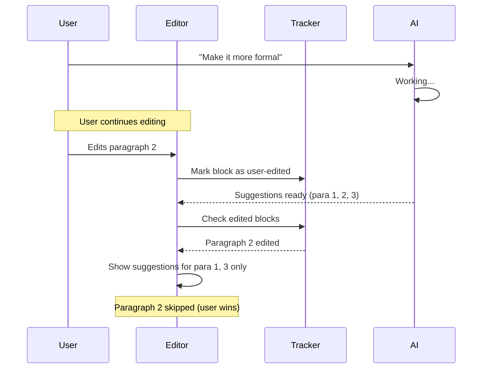

# Phase 7: Edit Tracking (User Wins)

**Dependencies**: Phase 4 (TipTap Marks)
**Estimated Time**: 2 hours

---

## Overview

Track which blocks user edited while AI was working. Skip AI suggestions for those blocks.



---

## Files to Create/Modify

| File | Action |
|------|--------|
| `frontend/src/features/documents/hooks/useEditTracking.ts` | Create |
| `frontend/src/core/stores/useEditorStore.ts` | Modify |

---

## Edit Tracking Hook

**File**: `frontend/src/features/documents/hooks/useEditTracking.ts`

```typescript
import { useEffect, useRef, useCallback } from 'react'
import { Editor } from '@tiptap/react'

interface EditSession {
  startedAt: number
  editedBlockIds: Set<string>
}

export function useEditTracking(editor: Editor | null, sessionActive: boolean) {
  const sessionRef = useRef<EditSession | null>(null)

  // Start tracking when AI starts working
  const startSession = useCallback(() => {
    sessionRef.current = {
      startedAt: Date.now(),
      editedBlockIds: new Set(),
    }
  }, [])

  // Stop tracking when suggestions are resolved
  const endSession = useCallback(() => {
    sessionRef.current = null
  }, [])

  // Get edited block IDs
  const getEditedBlockIds = useCallback(() => {
    return sessionRef.current?.editedBlockIds ?? new Set()
  }, [])

  // Track edits via TipTap transactions
  useEffect(() => {
    if (!editor || !sessionActive) return

    const handleTransaction = ({ transaction }: { transaction: any }) => {
      if (!transaction.docChanged || !sessionRef.current) return

      // Get affected node positions
      transaction.steps.forEach((step: any) => {
        const pos = step.from ?? step.pos
        if (pos === undefined) return

        // Resolve to block node
        const resolved = transaction.doc.resolve(pos)
        const blockNode = resolved.node(1) // Get parent block

        if (blockNode?.attrs?.id) {
          sessionRef.current?.editedBlockIds.add(blockNode.attrs.id)
        }
      })
    }

    editor.on('transaction', handleTransaction)
    return () => editor.off('transaction', handleTransaction)
  }, [editor, sessionActive])

  return {
    startSession,
    endSession,
    getEditedBlockIds,
  }
}
```

---

## Block ID Extension

Ensure TipTap blocks have IDs for tracking:

```typescript
// In Paragraph extension or a custom extension
import { Paragraph } from '@tiptap/extension-paragraph'
import { v4 as uuid } from 'uuid'

export const ParagraphWithId = Paragraph.extend({
  addAttributes() {
    return {
      ...this.parent?.(),
      id: {
        default: null,
        parseHTML: (element) => element.getAttribute('data-block-id'),
        renderHTML: (attributes) => {
          return { 'data-block-id': attributes.id || uuid() }
        },
      },
    }
  },
})
```

---

## Integration with Suggestions

**File**: `frontend/src/features/documents/hooks/useSuggestions.ts` (modify)

```typescript
export function useSuggestions(
  documentId: string,
  currentContent: string,
  editedBlockIds: Set<string>  // NEW: from useEditTracking
) {
  // ... existing logic ...

  // Filter out suggestions for user-edited blocks
  const filteredEdits = appliedEdits.map(({ versionId, edits }) => ({
    versionId,
    edits: edits.filter((edit) => {
      // Check if edit falls within an edited block
      const blockId = getBlockIdAtPosition(edit.start)
      return !editedBlockIds.has(blockId)
    }),
  }))

  return {
    suggestions,
    appliedEdits: filteredEdits,  // Use filtered edits
    // ...
  }
}
```

---

## Store Integration

**File**: `frontend/src/core/stores/useEditorStore.ts` (modify)

```typescript
interface EditorState {
  // ... existing ...

  // Edit tracking for AI suggestions
  aiSessionActive: boolean
  editedBlockIds: Set<string>

  startAISession: () => void
  endAISession: () => void
  markBlockEdited: (blockId: string) => void
}

export const useEditorStore = create<EditorState>((set, get) => ({
  // ... existing ...

  aiSessionActive: false,
  editedBlockIds: new Set(),

  startAISession: () => set({
    aiSessionActive: true,
    editedBlockIds: new Set(),
  }),

  endAISession: () => set({
    aiSessionActive: false,
    editedBlockIds: new Set(),
  }),

  markBlockEdited: (blockId) => set((state) => ({
    editedBlockIds: new Set([...state.editedBlockIds, blockId]),
  })),
}))
```

---

## Chat Integration

Start session when user sends edit request:

```typescript
// In TurnInput.tsx or chat submission handler
const handleSubmit = async (message: string) => {
  // Detect if message is likely an edit request
  const isEditRequest = /\b(edit|change|improve|rewrite|make|modify)\b/i.test(message)

  if (isEditRequest) {
    useEditorStore.getState().startAISession()
  }

  await sendMessage(message)
}
```

---

## Success Criteria

- [ ] Edit session starts when user requests edits
- [ ] User edits tracked during AI processing
- [ ] Edited blocks excluded from suggestion display
- [ ] Session ends after suggestions resolved
- [ ] Works with multiple paragraphs
