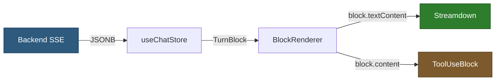
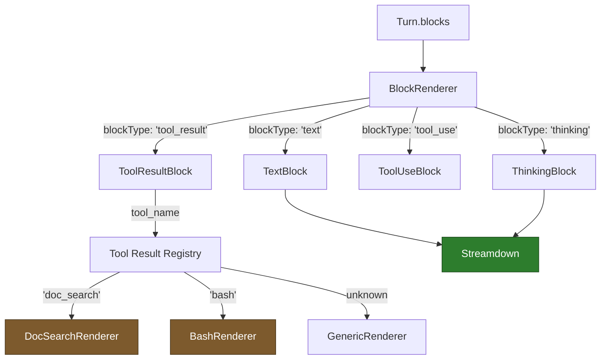
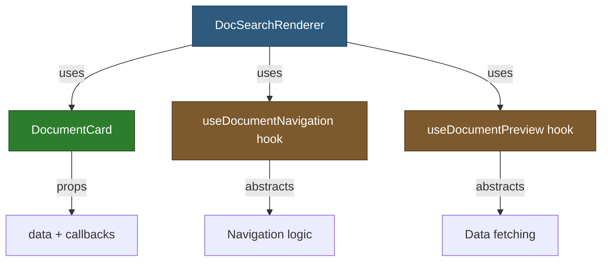
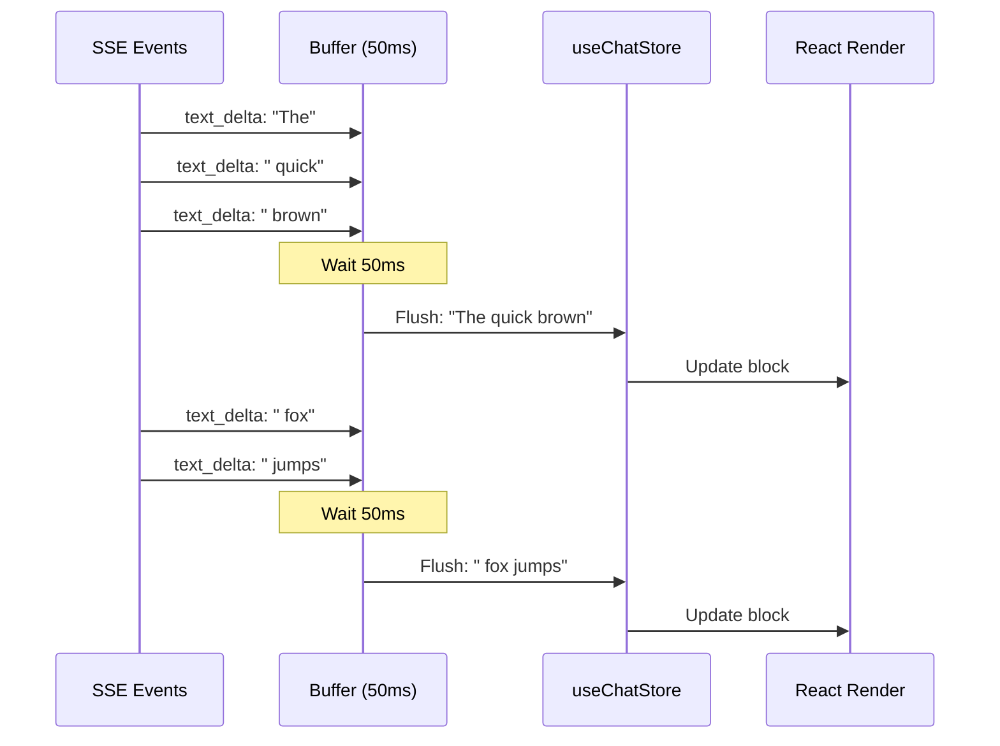
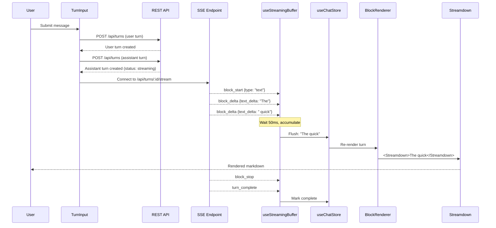

# Chat Streaming Markdown Rendering - Implementation Plan

**Status**: Planned (MVP0 Chat Rendering)

**Philosophy**: Stream markdown to users in real-time with proper rendering. Simple architecture. No over-engineering.

---

## The Problem We're Solving

### Current State
Chat frontend displays LLM responses as **plain text** with `whitespace-pre-wrap`:
```typescript
// Current: frontend/src/features/chats/components/blocks/TextBlock.tsx
<div className="whitespace-pre-wrap">{block.textContent}</div>
```

**Issues:**
1. **No markdown rendering** - Users see raw markdown: `**bold**`, `` `code` ``, `# heading`
2. **No streaming optimization** - Re-parsing entire text on every token → O(N²) complexity
3. **Performance degradation** - At ~500 lines, browser lags. With 100+ messages, exponentially worse.
4. **No syntax highlighting** - Code blocks render as plain text
5. **Block-based architecture unused** - We have tool blocks (tool_use, tool_result) but no custom rendering

---

## Why Streamdown?

### Evaluation of Alternatives

| Solution | Streaming Support | Performance | Incomplete Markdown | Bundle Size | Verdict |
|----------|------------------|-------------|---------------------|-------------|---------|
| **react-markdown** | ❌ No (re-parses all) | Poor (O(N²)) | ❌ Breaks on `` `code `` | ~60KB | ❌ Standard choice, wrong use case |
| **Custom renderer** | ⚠️ Manual | ⚠️ Manual | ⚠️ Must implement | 0KB | ❌ Too much work, likely buggy |
| **Streamdown** | ✅ Built for it | ✅ Incremental (O(N)) | ✅ Graceful | ~125KB | ✅ **Recommended** |

### What Streamdown Provides

1. **Incomplete Markdown Handling**
   - `` `code `` (unterminated) → renders gracefully
   - `**bold text` (no closing) → doesn't break layout
   - `[link](ht` (partial URL) → shows what's available

2. **Incremental Parsing**
   - Only parses new content (delta)
   - Memoizes previous render
   - O(N) instead of O(N²)

3. **Same API as react-markdown**
   - Component overrides work identically
   - Easy to add syntax highlighting
   - Familiar for developers

### Industry Validation
- **Vercel AI SDK** uses Streamdown for AI chat UIs
- **Battle-tested** in production streaming scenarios
- **Maintained** by Vercel (alongside Next.js)

**Decision**: Use Streamdown. Don't reinvent the wheel.

---

## Core Architecture Decisions

### 1. No Adapter Layer

**Decision**: Pass backend data directly to components. No transformation layer.

**Why**:


**Rationale:**
- Backend sends `content` as **JSONB** → JavaScript receives **parsed objects**
- `textContent` field is already markdown by design
- `content.input` for tool_use is already a parsed object, not string
- No transformation needed → no adapter

**Alternative considered** (rejected):
```typescript
// ❌ Don't do this - unnecessary complexity
function adaptBlock(backend: TurnBlock): ViewModel {
  return {
    markdown: backend.textContent,
    toolData: transformToolData(backend.content)
  }
}
```

**What if backend format changes?**
- Single update point: component that consumes the data
- Adapter wouldn't help - we'd update adapter instead of component (same effort)

---

### 2. Registry Pattern for Extensibility

**Decision**: Two-level registry - block types → components, tool names → renderers.

**Why**: Follows **Open/Closed Principle** (SOLID). Add new block/tool types without modifying existing code.



**Block Registry** (already exists):
```typescript
// frontend/src/features/chats/components/blocks/registry.ts
const BLOCK_RENDERERS: Record<string, BlockComponent> = {
  text: TextBlock,
  thinking: ThinkingBlock,
  tool_use: ToolUseBlock,      // New
  tool_result: ToolResultBlock, // New
};
```

**Tool Result Registry** (future - Phase 2):
```typescript
// frontend/src/features/chats/components/blocks/tool-results/registry.ts
const TOOL_RESULT_RENDERERS: Record<string, ToolRenderer> = {
  doc_search: DocSearchRenderer,  // Hover preview, click → navigate
  bash: BashRenderer,              // Syntax highlighted output
  // Default: GenericRenderer (JSON or markdown)
};
```

---

### 3. SOLID Compliance for Tool-Specific Rendering

**Problem**: Tool results need custom interactions:
- `doc_search` → Hover preview + click to navigate
- `bash` → Syntax highlighting
- `web_search` → Card UI with external links

**Anti-Pattern** (violates Single Responsibility):
```typescript
// ❌ DON'T DO THIS
function DocSearchRenderer({ block }) {
  const navigate = useNavigate();

  const handleClick = (docId) => {
    navigate(`/documents/${docId}`);  // ← Navigation logic in renderer
  };

  const [preview, setPreview] = useState(null);
  useEffect(() => {
    fetch(`/api/documents/${docId}/preview`)  // ← Data fetching in renderer
      .then(r => r.json())
      .then(setPreview);
  }, [docId]);

  return <DocumentCard onClick={handleClick} preview={preview} />;
}
```

**SOLID Pattern** (Separation of Concerns):



**Layers:**
1. **Presentation** (Dumb components) - `DocumentCard.tsx`
   - Receives: `document`, `onHover`, `onClick` props
   - Responsibility: Display UI only

2. **Composition** (Renderers) - `DocSearchRenderer.tsx`
   - Extracts data from `block.content.result`
   - Wires up hooks to presentation components
   - Responsibility: Data extraction + component composition

3. **Behavior** (Hooks) - `useDocumentNavigation.ts`, `useDocumentPreview.ts`
   - Handle routing, data fetching, caching
   - Responsibility: Business logic

**Benefits:**
- ✅ **Single Responsibility** - Each layer has one job
- ✅ **Testable** - Mock hooks in renderer tests, mock components in hook tests
- ✅ **Reusable** - `DocumentCard` can be used in search results, references, etc.
- ✅ **Maintainable** - Change navigation logic? Update hook only.

---

### 4. Buffering vs Adapting (SSE Optimization)

**Decision**: Buffer SSE deltas at 50ms intervals. This is **performance optimization**, not data transformation.

**Why 50ms?**
- Too fast (10ms) → excessive React re-renders
- Too slow (200ms) → feels sluggish
- 50-100ms → smooth, imperceptible batching



**Implementation**:
```typescript
// frontend/src/features/chats/hooks/useStreamingBuffer.ts
export function useStreamingBuffer({
  flushInterval = 50,
  onFlush
}: BufferOptions) {
  const bufferRef = useRef('');
  const timerRef = useRef<NodeJS.Timeout | null>(null);

  const append = (delta: string) => {
    bufferRef.current += delta;

    if (!timerRef.current) {
      timerRef.current = setTimeout(() => {
        onFlush(bufferRef.current);
        bufferRef.current = '';
        timerRef.current = null;
      }, flushInterval);
    }
  };

  return { append, flush };
}
```

**This is NOT an adapter** - we're accumulating strings, not transforming data structure.

---

### 5. Parsing: Do We Parse JSON?

**Question**: Does frontend need to parse `content.input` for tool_use blocks?

**Answer**: **No.** Backend already sends parsed objects.

**Evidence**:
1. Database: `content JSONB` (binary JSON in PostgreSQL)
2. API response: `{"content": {"input": {"command": "ls"}}}` ← Already object
3. Frontend receives: `block.content.input` is `Record<string, any>`, not `string`

**During streaming**:
- `json_delta` events contain string fragments: `"{\"cmd\":"` + `"\"ls\"}"`
- SSE hook **accumulates** strings: `buffer += delta.json_delta`
- On `block_stop` event, **parse once**: `JSON.parse(buffer)`
- Store receives parsed object

**After streaming** (REST API, catchup, reconnection):
- Backend sends complete blocks with pre-parsed `content`
- No parsing needed

**Decision**: Parse only during live streaming (in SSE hook). Otherwise, objects arrive pre-parsed.

---

## Implementation Phases

### Phase 1: Core Streaming Markdown (MVP - 2-3 days)

**Goal**: Render markdown in chat messages with basic tool blocks.

**Scope:**
1. Install Streamdown
2. Replace plain text with Streamdown in TextBlock, ThinkingBlock
3. Add generic ToolUseBlock, ToolResultBlock (display JSON)
4. Implement SSE streaming with buffering
5. Update store for real-time block deltas

**Files to Create:**
- `frontend/src/features/chats/hooks/useStreamingBuffer.ts`
- `frontend/src/features/chats/hooks/useChatSSE.ts`
- `frontend/src/features/chats/components/blocks/ToolUseBlock.tsx`
- `frontend/src/features/chats/components/blocks/ToolResultBlock.tsx`

**Files to Modify:**
- `frontend/package.json` - Add `streamdown` dependency
- `frontend/src/features/chats/components/blocks/TextBlock.tsx` - Use Streamdown
- `frontend/src/features/chats/components/blocks/ThinkingBlock.tsx` - Use Streamdown
- `frontend/src/features/chats/components/blocks/registry.ts` - Add tool blocks
- `frontend/src/core/stores/useChatStore.ts` - Add delta methods
- `frontend/src/features/chats/components/TurnInput.tsx` - Initiate SSE after turn creation

**Acceptance Criteria:**
- ✅ Markdown renders correctly (bold, italic, code, headings, links)
- ✅ Incomplete markdown during streaming doesn't break UI
- ✅ tool_use blocks show tool name + JSON input
- ✅ tool_result blocks show markdown or JSON output
- ✅ Performance: Smooth streaming at 50ms intervals, no lag

---

### Phase 2: Tool-Specific Renderers (Future - 2-3 days)

**Goal**: Rich interactions for tool results (hover, click, navigation).

**Scope:**
1. Create tool result renderer registry
2. Implement `doc_search` renderer (hover preview, click navigation)
3. Implement `bash` renderer (syntax highlighting)
4. Implement `web_search` renderer (card UI)
5. Extract navigation/preview logic into hooks (SOLID compliance)

**Files to Create:**
- `frontend/src/features/chats/components/blocks/tool-results/registry.ts`
- `frontend/src/features/chats/components/blocks/tool-results/DocSearchRenderer.tsx`
- `frontend/src/features/chats/components/blocks/tool-results/BashRenderer.tsx`
- `frontend/src/features/chats/components/blocks/tool-results/WebSearchRenderer.tsx`
- `frontend/src/features/chats/components/blocks/tool-results/GenericRenderer.tsx`
- `frontend/src/features/chats/components/presentation/DocumentCard.tsx` (reusable)
- `frontend/src/features/chats/hooks/useDocumentNavigation.ts` (behavior)
- `frontend/src/features/chats/hooks/useDocumentPreview.ts` (behavior)

**Files to Modify:**
- `frontend/src/features/chats/components/blocks/ToolResultBlock.tsx` - Use renderer registry

**Acceptance Criteria:**
- ✅ doc_search results show document cards
- ✅ Hovering document card fetches/shows preview
- ✅ Clicking document card navigates to document
- ✅ bash output has syntax highlighting
- ✅ web_search results show clickable links
- ✅ Unknown tool results fallback to generic renderer

---

### Phase 3: Optimizations (Future - 1-2 days)

**Goal**: Handle edge cases and performance for power users.

**Scope:**
1. Syntax highlighting for code blocks
2. Virtualization for 100+ message conversations
3. Memoization for completed messages
4. Handle reconnection edge cases

**Dependencies:**
- `react-syntax-highlighter` (~180KB)
- `@tanstack/react-virtual` (~50KB)

**Acceptance Criteria:**
- ✅ Code blocks have language-specific syntax highlighting
- ✅ 100+ message conversations scroll smoothly
- ✅ Completed messages don't re-render unnecessarily
- ✅ Reconnecting during streaming shows catchup correctly

---

## Data Flow Architecture

### Complete Flow (After Implementation)



### Component Hierarchy (After Implementation)

```
ChatView.tsx
└── AssistantTurn.tsx
    └── blocks.map((block) =>
        BlockRenderer.tsx (registry lookup)
        ├── TextBlock.tsx
        │   └── <Streamdown>{textContent}</Streamdown>
        ├── ThinkingBlock.tsx
        │   └── <Streamdown>{textContent}</Streamdown>
        ├── ToolUseBlock.tsx
        │   └── <pre>{JSON.stringify(content.input)}</pre>
        └── ToolResultBlock.tsx (Phase 1: generic)
            └── <Streamdown>{textContent}</Streamdown> OR <pre>{JSON}</pre>

            // Phase 2: tool-specific
            └── ToolResultRenderer (registry lookup)
                ├── DocSearchRenderer
                │   ├── useDocumentNavigation() hook
                │   ├── useDocumentPreview() hook
                │   └── DocumentCard (presentation)
                ├── BashRenderer
                │   └── SyntaxHighlighter (presentation)
                └── GenericRenderer (fallback)
```

---

## Open Questions

### Q1: Should we cache document previews?
**Answer**: Yes, in Phase 2. Use SWR or TanStack Query for preview fetching hook.

### Q2: What about image blocks?
**Answer**: Defer to Phase 3 or later. Current backend doesn't generate images yet.

### Q3: Do we need IndexedDB caching for chat messages?
**Answer**: Not in Phase 1-2. Network-first strategy is sufficient. Consider in Phase 3 if performance issues arise.

### Q4: How to handle syntax highlighting during streaming?
**Answer**: Phase 1 uses Streamdown's default code rendering (no highlighting). Phase 3 adds `react-syntax-highlighter` as Streamdown component override.

---

## Success Metrics

**Phase 1:**
- Zero markdown rendering bugs (bold, code, links work)
- Streaming feels smooth (subjective, but no visible lag)
- No performance degradation with 50+ message conversations

**Phase 2:**
- Document navigation works (click → open document)
- Hover previews load within 200ms
- Tool result UIs feel native to Meridian (not generic JSON dumps)

**Phase 3:**
- 100+ message conversations scroll at 60 FPS
- Code blocks have correct syntax highlighting for common languages

---

## Related Documentation

**Research:**
- `_docs/technical/frontend/architecture/chat-rendering-research.md` - Streamdown evaluation
- `_docs/technical/frontend/chat-rendering-guide.md` - Implementation guide

**Backend:**
- `_docs/technical/llm/streaming/` - SSE event structure
- `_docs/technical/backend/chat/turn-blocks.md` - Block types and schema

**Frontend:**
- `frontend/CLAUDE.md` - Frontend conventions
- `_docs/technical/frontend/architecture/` - Store architecture, caching patterns

---

## Risks & Mitigations

| Risk | Likelihood | Impact | Mitigation |
|------|-----------|--------|------------|
| Streamdown has bugs with incomplete markdown | Low | Medium | Use proven library (Vercel-maintained), test edge cases |
| SSE auth token handling | Medium | High | Verify backend accepts JWT in query params |
| Performance with 100+ messages | Medium | Medium | Phase 3 adds virtualization if needed |
| Tool-specific renderers become complex | Low | Medium | SOLID architecture limits coupling |
| Bundle size increase (~200KB) | Low | Low | TipTap already adds 2MB+, acceptable trade-off |

---

## Implementation Order

**Phase 1 (MVP):**
1. Install dependencies
2. Update TextBlock/ThinkingBlock (simple, low risk)
3. Create SSE hooks (complex, core feature)
4. Add generic tool blocks (medium complexity)
5. Test streaming end-to-end

**Phase 2 (Enhancement):**
1. Create tool result registry
2. Implement doc_search renderer (highest value)
3. Add navigation/preview hooks
4. Implement bash/web_search renderers

**Phase 3 (Optimization):**
1. Add syntax highlighting
2. Add virtualization
3. Performance profiling

---

## Decision Log

| Date | Decision | Rationale |
|------|----------|-----------|
| 2025-01-22 | Use Streamdown over react-markdown | Built for streaming, O(N) performance, handles incomplete markdown |
| 2025-01-22 | No adapter layer | Backend sends pre-parsed JSONB, no transformation needed |
| 2025-01-22 | Two-level registry (blocks + tools) | Follows Open/Closed Principle, extensible without modification |
| 2025-01-22 | 50ms buffering for SSE deltas | Balances performance (reduce re-renders) with responsiveness |
| 2025-01-22 | SOLID architecture for tool renderers | Separates concerns: presentation, composition, behavior |
| 2025-01-22 | Defer tool-specific rendering to Phase 2 | Get core streaming working first, add interactions later |
