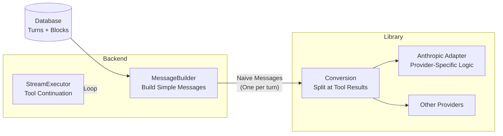
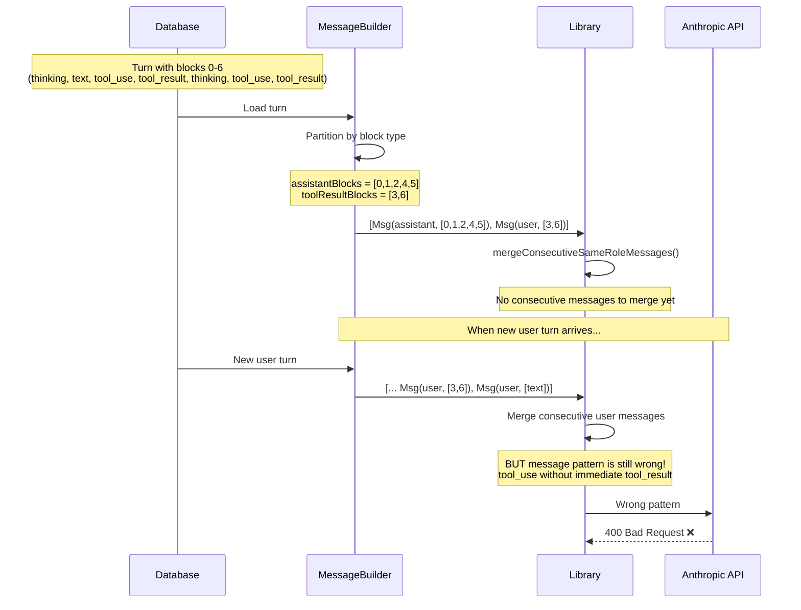
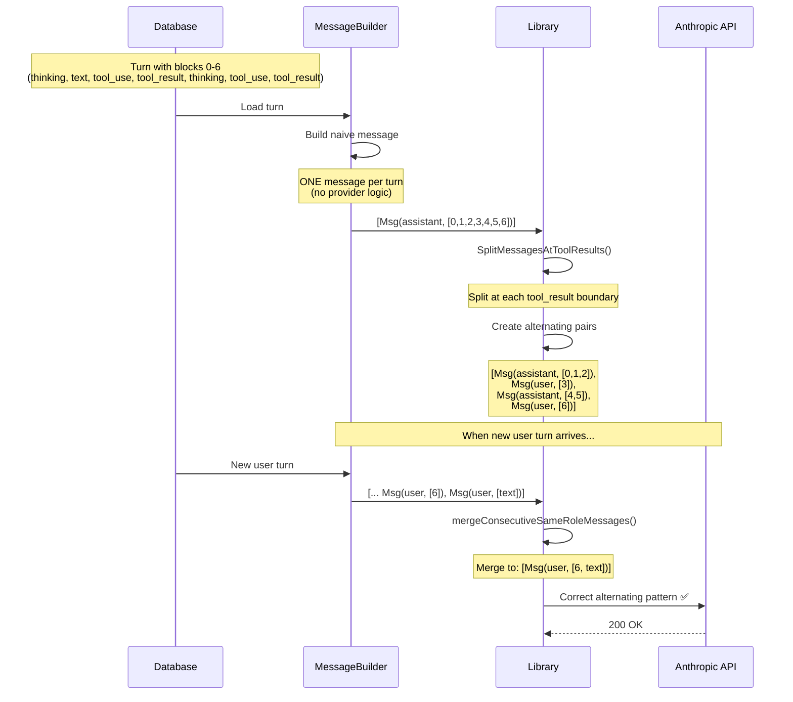
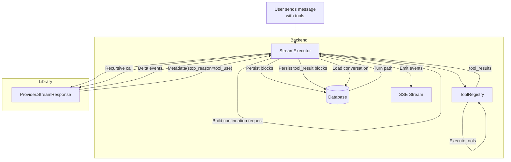

# Message Alternation Fix

**Problem:** Anthropic API rejects requests due to consecutive user messages created by backend MessageBuilder.

**Solution:** Backend builds simple naive messages, library handles ALL provider-specific conversion.

**Architecture Decision:** Tool continuation stays in backend (database, SSE, tool execution are backend concerns).

---

## Problem Statement

### What's Broken

After tool continuation, backend creates consecutive user messages that violate Anthropic's alternation requirement:

```
Assistant: [thinking, text, tool_use, thinking, tool_use, ...]
User: [tool_result, tool_result, ...]                          ← Consecutive user messages
User: [text: "New question"]                                   ← Rejected by Anthropic!
```

**Anthropic error:**
```
400 Bad Request: "tool_use ids were found without tool_result blocks immediately after"
```

### Why It Matters

1. **Anthropic API fails** - Cannot use Anthropic provider after tool continuation
2. **Provider logic in backend** - MessageBuilder has provider-specific conversion (violates separation of concerns)
3. **Architecture violation** - Backend should build simple messages, library should handle provider quirks

---

## Root Cause Analysis

### How Tool Continuation Works

When tools execute, backend's StreamExecutor:

1. **Initial stream:** Persists blocks 0-2 (thinking, text, tool_use)
2. **Tool execution:** Adds blocks 3 (tool_result) to database
3. **Continuation stream:** Persists blocks 4-6 (thinking, tool_use, tool_result)

Result: **Single assistant turn** in database with blocks from multiple rounds.

```
Turn in Database (sequence 0-6):
  Seq 0: thinking (Round 0)
  Seq 1: text (Round 0)
  Seq 2: tool_use (Round 0)
  Seq 3: tool_result (Round 1 - added by backend)
  Seq 4: thinking (Round 1 - from continuation stream)
  Seq 5: tool_use (Round 1)
  Seq 6: tool_result (Round 2 - added by backend)
```

### Current MessageBuilder Behavior (WRONG)

**File:** `backend/internal/service/llm/conversation/message_builder.go:63-95`

**Algorithm:**
```
FOR each turn:
  IF turn.Role == "assistant":
    Partition blocks into:
      assistantBlocks = [thinking, text, tool_use, thinking, tool_use, ...]
      toolResultBlocks = [tool_result, tool_result, ...]

    CREATE Message(role="assistant", content=assistantBlocks)
    CREATE Message(role="user", content=toolResultBlocks)
  END IF
END FOR
```

**Output:**
```json
[
  {"role": "assistant", "content": [thinking, text, tool_use, thinking, tool_use]},
  {"role": "user", "content": [tool_result, tool_result]}
]
```

**Then when new user turn arrives:**
```json
[
  ...,
  {"role": "user", "content": [tool_result, tool_result]},
  {"role": "user", "content": [text: "New question"]}  ← CONSECUTIVE USER MESSAGES
]
```

### What Anthropic Requires

Strict alternation for each tool use/result pair:

```json
[
  {"role": "assistant", "content": [thinking, text, tool_use]},
  {"role": "user", "content": [tool_result]},
  {"role": "assistant", "content": [thinking, tool_use]},
  {"role": "user", "content": [tool_result]}
]
```

---

## Architectural Decision

### Current Problem: Backend Has Provider Logic

MessageBuilder comment (line 63-64):
```go
// For assistant turns, split tool_result blocks into separate user message
// (required by Anthropic API and cleaner for other providers)
```

**This is provider-specific conversion logic in the backend!** ❌

### Principle: Separation of Concerns

| Layer | Responsibility | Examples |
|-------|----------------|----------|
| **Backend** | Business logic, data access, orchestration | Tool execution, persistence, SSE, conversation loading |
| **Library** | Provider communication, response normalization | API calls, format conversion, provider quirks |

**Provider-specific message formatting belongs in the library, not backend.**

### Decision: Two-Layer Architecture



**Backend responsibilities:**
- Build **one message per turn** (naive, no provider logic)
- Handle tool continuation loop (execute tools, persist results, load history)
- Manage SSE streaming and database persistence

**Library responsibilities:**
- Split assistant turns at tool_result boundaries
- Merge consecutive same-role messages
- All provider-specific conversions

---

## Solution Design

### Current Flow (WRONG)



### Proposed Flow (CORRECT)



### Implementation Layers

**Layer 1: Backend MessageBuilder Simplification**

Remove provider-specific logic. Build one message per turn:

```go
// backend/internal/service/llm/conversation/message_builder.go
func (mb *MessageBuilderService) BuildMessages(
    ctx context.Context,
    path []llmModels.Turn,
) ([]domainllm.Message, error) {
    messages := make([]domainllm.Message, 0, len(path))

    for _, turn := range path {
        // Skip empty turns
        if len(turn.Blocks) == 0 {
            continue
        }

        // Build ONE message per turn (naive approach)
        // No provider-specific splitting or formatting
        contentPtrs := make([]*llmModels.TurnBlock, len(turn.Blocks))
        for i := range turn.Blocks {
            contentPtrs[i] = &turn.Blocks[i]
        }

        messages = append(messages, domainllm.Message{
            Role:    turn.Role,  // "user" or "assistant"
            Content: contentPtrs,
        })
    }

    return messages, nil
}
```

**Benefits:**
- ✅ No provider-specific logic in backend
- ✅ Simple, naive message building
- ✅ Library handles all conversions

**Layer 2: Library Conversion (Anthropic Adapter)**

Add provider-specific conversion in library:

```go
// meridian-llm-go/providers/anthropic/adapter.go
func convertToAnthropicMessages(messages []llmprovider.Message) ([]anthropic.MessageParam, error) {
    // Phase 1: Split cross-provider server tools (existing)
    processed, _ := llmprovider.SplitMessagesAtCrossProviderTool(messages, ProviderAnthropic)

    // Phase 2: Split at tool_result boundaries (NEW)
    split := splitMessagesAtToolResults(processed)

    // Phase 3: Merge consecutive same-role messages (existing)
    merged := mergeConsecutiveSameRoleMessages(split)

    // Phase 4: Convert to Anthropic SDK format (existing)
    result := convertBlocksToAnthropicFormat(merged)

    return result, nil
}
```

**New helper function:**

```go
// splitMessagesAtToolResults splits assistant messages at each tool_result boundary.
// Input: [Msg(assistant, [thinking, text, tool_use, tool_result, thinking, tool_use, tool_result])]
// Output: [
//   Msg(assistant, [thinking, text, tool_use]),
//   Msg(user, [tool_result]),
//   Msg(assistant, [thinking, tool_use]),
//   Msg(user, [tool_result])
// ]
func splitMessagesAtToolResults(messages []llmprovider.Message) []llmprovider.Message {
    var result []llmprovider.Message

    for _, msg := range messages {
        if msg.Role != "assistant" {
            // User messages pass through unchanged
            result = append(result, msg)
            continue
        }

        // Split assistant messages at tool_result boundaries
        var currentBlocks []*llmprovider.Block

        for _, block := range msg.Blocks {
            if block.BlockType == llmprovider.BlockTypeToolResult {
                // Emit accumulated assistant blocks (if any)
                if len(currentBlocks) > 0 {
                    result = append(result, llmprovider.Message{
                        Role:    "assistant",
                        Blocks:  currentBlocks,
                    })
                    currentBlocks = nil
                }

                // Emit tool_result as user message
                result = append(result, llmprovider.Message{
                    Role:    "user",
                    Blocks:  []*llmprovider.Block{block},
                })
            } else {
                // Accumulate assistant blocks
                currentBlocks = append(currentBlocks, block)
            }
        }

        // Emit remaining assistant blocks (if any)
        if len(currentBlocks) > 0 {
            result = append(result, llmprovider.Message{
                Role:    "assistant",
                Blocks:  currentBlocks,
            })
        }
    }

    return result
}
```

---

## Tool Continuation Architecture Decision

### Question: Should tool continuation move to library?

**Answer: NO. Keep it in backend.**

### Rationale

**Library Design Philosophy** (from meridian-llm-go/README.md):
1. **Content-Only Types**: No database fields, no business logic
2. **Minimal Dependencies**: Only provider SDKs
3. **Provider-Agnostic**: Unified interface

**Tool continuation requires:**
- ❌ Database access (loading conversation history)
- ❌ SSE emission (streaming tool results)
- ❌ Tool execution (backend's ToolRegistry)
- ❌ Business logic (MAX_TOOL_ROUNDS configuration)
- ❌ Persistence (storing tool_result blocks)

**All of these are backend concerns, not library concerns.**

### Current Architecture (CORRECT)



**Backend responsibilities (KEEP):**
- Orchestrate tool continuation loop
- Execute tools via ToolRegistry
- Persist blocks to database
- Emit SSE events to frontend
- Load conversation history
- Control max iteration limit

**Library responsibilities (KEEP):**
- Stream LLM responses
- Normalize provider formats
- Convert messages for provider APIs

### Why This Is Correct

**Separation of Concerns:**

| Concern | Backend | Library |
|---------|---------|---------|
| Tool detection | ✅ Detect tool_use blocks | ❌ |
| Tool execution | ✅ Execute via ToolRegistry | ❌ |
| Persistence | ✅ Database writes | ❌ |
| SSE | ✅ Stream to frontend | ❌ |
| Continuation loop | ✅ Recursive streaming | ❌ |
| Provider communication | ❌ | ✅ StreamResponse |
| Format conversion | ❌ | ✅ Block normalization |
| Message splitting | ❌ | ✅ Provider-specific rules |

**Flexibility:**
- Different backends can implement different tool execution strategies
- Some backends might disable tool continuation entirely
- Backend-specific tool registries (project-specific tools)
- Backend-specific iteration limits and policies

**If tool continuation were in library:**
- ❌ All consumers forced into one pattern
- ❌ Library needs database callbacks
- ❌ Library needs SSE callbacks
- ❌ Library has business logic (violates design principles)
- ❌ Circular dependencies (library calls backend, backend calls library)

---

## Implementation Plan

### Phase 1: Backend Simplification

**File:** `backend/internal/service/llm/conversation/message_builder.go`

**Changes:**
1. Remove lines 63-95 (current assistant turn splitting logic)
2. Replace with naive one-message-per-turn approach
3. Remove `formatToolResultBlock()` method (move formatting to library if needed)
4. Keep token limit warning injection (backend-specific business logic)

**Result:** MessageBuilder builds simple messages, no provider logic.

### Phase 2: Library Conversion

**File:** `meridian-llm-go/providers/anthropic/adapter.go`

**Changes:**
1. Add `splitMessagesAtToolResults()` helper function
2. Integrate into `convertToAnthropicMessages()` flow (after cross-provider split, before merge)
3. Preserve existing `mergeConsecutiveSameRoleMessages()` (defense-in-depth)

**Result:** Library handles all provider-specific message conversion.

### Phase 3: Testing

**Backend Tests:**
- `message_builder_test.go` (NEW): Test naive message building
- Verify no provider logic in backend
- Test with normal conversations and tool continuations

**Library Tests:**
- `adapter_test.go`: Test `splitMessagesAtToolResults()`
- Test single tool round
- Test multiple tool rounds
- Test edge cases (no tools, empty blocks, turn ending with tool_result)

**Integration Tests:**
- Run existing chat API tests
- Test with Anthropic provider
- Test with OpenRouter provider (verify unaffected)
- Verify catchup mechanism still works

### Phase 4: Documentation

**Create:**
- This document (done!)
- Update `_docs/technical/backend/architecture/message-builder.md` if exists
- Update `_docs/technical/llm/streaming/block-types-reference.md` if needed

**Update:**
- `backend/CLAUDE.md` - Remove references to provider-specific logic
- `meridian-llm-go/README.md` - Document conversion responsibilities

---

## Testing Strategy

### Unit Tests

**Backend:** `backend/internal/service/llm/conversation/message_builder_test.go`

```go
func TestBuildMessages_NormalConversation(t *testing.T) {
    // Input: User turn, assistant turn
    // Expected: 2 messages (one per turn)
}

func TestBuildMessages_ToolContinuation(t *testing.T) {
    // Input: Assistant turn with tool_use + tool_result blocks
    // Expected: 1 message with all blocks (library handles splitting)
}
```

**Library:** `meridian-llm-go/providers/anthropic/adapter_test.go`

```go
func TestSplitMessagesAtToolResults_SingleRound(t *testing.T) {
    // Input: [Msg(assistant, [thinking, tool_use, tool_result])]
    // Expected: [Msg(assistant, [thinking, tool_use]), Msg(user, [tool_result])]
}

func TestSplitMessagesAtToolResults_MultipleRounds(t *testing.T) {
    // Input: [Msg(assistant, [tool_use, tool_result, thinking, tool_use, tool_result])]
    // Expected: 4 messages alternating (A, U, A, U)
}
```

### Integration Tests

1. **Anthropic API Test:**
   - Create turn with tool continuation
   - Send new user message
   - Verify Anthropic accepts request (no 400 error)

2. **OpenRouter Test:**
   - Same scenario
   - Verify OpenRouter still works (unaffected by changes)

3. **SSE Test:**
   - Verify streaming events still emit correctly
   - Verify catchup mechanism works

### Manual Verification

Use Insomnia collection `04-chat.json`:
1. Test request with tool_use
2. Verify tool execution
3. Send follow-up message
4. Verify Anthropic accepts the request

---

## Success Criteria

✅ **Anthropic API accepts requests** after tool continuation + new user message

✅ **No provider-specific logic in backend** MessageBuilder

✅ **Library handles all message conversion** (splitting, merging, formatting)

✅ **OpenRouter unaffected** (uses different adapter)

✅ **All tests pass** (unit + integration)

✅ **Tool continuation still works** (backend orchestrates, library streams)

✅ **Clean architecture** (backend: business logic, library: provider communication)

---

## Related Documentation

- `_docs/technical/backend/architecture/streaming-architecture.md` - Streaming system overview
- `_docs/technical/llm/streaming/block-types-reference.md` - Block types and semantics
- `backend/CLAUDE.md` - Backend development guide
- `meridian-llm-go/README.md` - Library design philosophy

---

## Appendix: Why Tool Result Formatting Matters

Current MessageBuilder has `formatToolResultBlock()` (lines 120-151) that:
- Converts tool results to LLM-consumable format
- Applies formatters for result filtering/transformation
- Handles token limit warnings

**Question:** Should this move to library or stay in backend?

**Answer:** **Move to library.** This is provider-specific formatting (how to present tool results to LLM). Different providers may want different formats.

**Implementation:** Add `FormatToolResultForProvider()` helper in library conversion layer.
