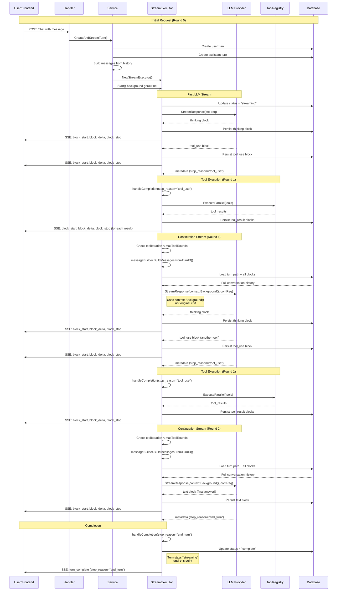
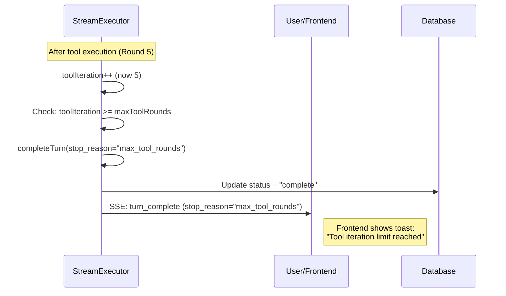

# Tool Continuation Implementation Plan

**Status:** Ready to implement
**Priority:** High
**Estimated effort:** 10-13 hours (3-4h Phase 1, 3-4h Phase 2, 2-3h Phase 3, 1-2h Phase 4)

## Recent Updates

### 2025-11-22 (v2) - Critical Architectural Refinements

Based on detailed code review, the following **critical corrections** were applied:

**✅ Major Fixes:**
1. **Context Management** - CORRECTED to use mstream's `ctx` (not `context.Background()`) for continuation streams
   - Goroutine-level already uses `context.Background()` (service.go:304) ✅
   - Stream-level must use mstream's context to prevent goroutine leaks ✅
   - Browser independence is maintained at goroutine level, not stream level

2. **MessageBuilder Simplification** - Refactored to follow Single Responsibility Principle
   - Interface simplified: `BuildMessages(ctx, path)` (pure conversion function)
   - Data loading responsibility moved to caller (StreamExecutor, Service)
   - StreamExecutor now has TurnNavigator for loading conversation path
   - Removed duplicate path-loading logic from MessageBuilder

3. **Block Sequencing Documentation** - Added explicit "Block Sequencing Invariant" section
   - Documented `maxBlockSequence` update rules (immediate after persist, not batched)
   - Explained two update locations: `processCompleteBlock` and `executeToolsAndContinue`
   - Added prevention of sequence reuse on error recovery

**✅ Documentation Improvements:**
4. **Context Usage Comments** - Clarified goroutine vs stream-level context handling
5. **Debug Logging** - Added `next_block_sequence` and `next_expected_block` to continuation logs
6. **SRP Compliance** - MessageBuilder is now testable pure function, data loading separated

### 2025-11-22 (v1) - Initial Plan

Based on code review and SOLID principles analysis, the following critical fixes were applied:

**✅ Critical Fixes:**
1. **Turn Status Management** - Clarified that turn remains "streaming" during all continuation rounds, only marked "complete" when `stop_reason != "tool_use"`
2. **Frontend UX for Max Iterations** - Added Phase 4 for frontend integration with toast notifications and visual indicators when max_tool_rounds limit is hit

**✅ Documentation Improvements:**
3. **Sequence Diagrams** - Added comprehensive multi-round continuation flow diagrams showing the full execution path
4. **Configuration Details** - Expanded MAX_TOOL_ROUNDS environment variable documentation
5. **Success Criteria** - Split into Backend and Frontend sections with explicit requirements

**✅ Architecture Validation:**
- SOLID principles compliance confirmed
- Responsibility distribution validated (Library → Backend → Frontend)
- No circular dependencies or architectural issues identified

## Problem Statement

Tools execute successfully but the LLM never sees the results. Conversations stop mid-stream after tool execution instead of continuing with the tool results.

**WHY this matters:**
- Violates product goal: "users wouldn't lose conversation if they closed browser"
- Tool-using conversations are incomplete in database
- Users never see final answers after tool execution

**Current behavior:**
```
User: "What files are in my project?"
Assistant: [thinking] → [tool_use: doc_tree]
Backend: Executes tool, persists tool_result
Backend: Sends turn_complete with stop_reason="tool_use"
❌ STOPS HERE (user never gets final answer)
```

**Expected behavior:**
```
User: "What files are in my project?"
Assistant: [thinking] → [tool_use: doc_tree]
Backend: Executes tool, persists tool_result
Backend: Continues streaming with tool results
Assistant: [text: "You have 3 files: a.txt, b.txt, c.txt"]
Backend: Sends turn_complete with stop_reason="end_turn"
✅ Complete conversation persisted
```

## Current State

### What Works ✅

**File:** `backend/internal/service/llm/streaming/mstream_adapter.go`

1. **Tool execution** (line 480): `toolRegistry.ExecuteParallel()` works
2. **Tool result persistence** (lines 492-522): Results saved to database
3. **Tool result streaming** (lines 529-558): SSE events sent to frontend

### What's Missing ❌

**File:** `backend/internal/service/llm/streaming/mstream_adapter.go:567-574`

```go
// TODO: Continue streaming with tool results
// This requires building a new GenerateRequest with the conversation history
// including the tool results, and calling the provider again
// For now, we'll complete the turn

se.logger.Warn("tool continuation not yet implemented, completing turn",
    "tool_count", len(toolResults),
)
```

**WHAT's needed:** Continuation loop after tool execution.

## Architecture Context

### Pattern A: Consumer-Side Tool Execution Loop

**WHY this pattern:** Backend controls the loop (not LLM provider), enabling:
- Browser-independent execution
- Backend tool execution
- Complete conversation persistence

**WHAT the loop does:**
```go
for iteration < maxToolRounds {
    resp := provider.StreamResponse(ctx, req)

    if resp.StopReason != "tool_use" {
        break // Done!
    }

    // Execute tools
    toolResults := executeTools(resp.ToolCalls)

    // Add results to conversation
    req.Messages = append(req.Messages, Message{
        Role: "user",
        Content: toolResults,
    })
    // Loop continues...
}
```

**Current gap:** Loop exists but continuation is stubbed out (see TODO above).

### Current Layers

**Library (meridian-llm-go):**
- Provider adapters (Anthropic, OpenRouter, Lorem)
- Stream event emission
- NO business logic, NO database access

**Backend Service:**
- `Service` - orchestrates turn creation, builds messages
- `StreamExecutor` - executes streaming, persists blocks
- `TurnNavigator`, `TurnReader`, `TurnWriter` - database access

**Gap:** StreamExecutor needs to build messages from conversation history for continuation, but message building logic is in `Service.buildMessagesFromPath()` (private method, line 392).

## Architecture Decision

### WHY We Need MessageBuilder Service

**Problem:** StreamExecutor needs to build messages from DB to continue after tools, but:
- Can't access Service's private `buildMessagesFromPath()` method
- Shouldn't duplicate the logic (tool formatting, splitting, warnings)
- Needs to be testable and reusable

**Options considered:**

**Option A (Rejected):** Pass callback from Service to StreamExecutor
- ❌ Coupling via closure
- ❌ Harder to test
- ❌ Not reusable

**Option B (Chosen):** Extract message building into shared service
- ✅ Clean abstraction
- ✅ Testable in isolation
- ✅ Reusable for future needs
- ✅ Follows SOLID (Single Responsibility, Dependency Inversion)

**Decision:** Create `MessageBuilder` interface + service.

## Flow Diagrams

### Multi-Round Tool Continuation Flow

This diagram shows how the continuation loop works when an LLM response includes tool use:



### Key Points in the Flow

1. **Turn Status**: Remains "streaming" from first stream start until final `stop_reason != "tool_use"`
2. **Context Handling**: Continuation streams use `context.Background()` to survive user disconnection
3. **Iteration Tracking**: `toolIteration` increments each round, enforces `maxToolRounds` limit
4. **Message Rebuilding**: Each continuation round loads full conversation history from database
5. **Recursive Processing**: `processProviderStream()` handles both initial and continuation streams
6. **Browser Independence**: Tool execution + continuation happen server-side, user can close browser

### Max Iterations Flow

If `toolIteration >= maxToolRounds`:



## Implementation Plan

### Phase 1: Create MessageBuilder Service (3-4 hours)

**WHAT:** Extract message building from Service into shared service.

**WHY:** Both Service and StreamExecutor need to build messages from conversation history.

#### Step 1.1: Create MessageBuilder Interface

**File:** `backend/internal/domain/services/llm/message_builder.go` (NEW)

```go
package llm

import (
    "context"
)

// MessageBuilder builds LLM messages from conversation history.
// The caller is responsible for loading the turn path and blocks using TurnNavigator/TurnReader.
type MessageBuilder interface {
    // BuildMessages converts a turn path (with blocks already loaded) to LLM messages
    // suitable for provider requests. The path should be ordered from oldest to newest.
    BuildMessages(ctx context.Context, path []Turn) ([]Message, error)
}
```

**Note:** This is a pure conversion function. Data loading happens in the caller (Service or StreamExecutor).

#### Step 1.2: Implement MessageBuilderService

**File:** `backend/internal/service/llm/conversation/message_builder.go` (NEW)

**WHAT to implement:**

```go
package conversation

import (
    "context"
    "fmt"
    "log/slog"

    "github.com/haowjy/meridian/backend/internal/capabilities"
    domainllm "github.com/haowjy/meridian/backend/internal/domain/services/llm"
    llmRepo "github.com/haowjy/meridian/backend/internal/domain/repositories/llm"
    llmModels "github.com/haowjy/meridian/backend/internal/domain/models/llm"
    "github.com/haowjy/meridian/backend/internal/service/llm/formatting"
)

type MessageBuilderService struct {
    formatterRegistry  *formatting.FormatterRegistry
    capabilityRegistry *capabilities.Registry
    logger             *slog.Logger
}

func NewMessageBuilderService(
    formatterRegistry *formatting.FormatterRegistry,
    capabilityRegistry *capabilities.Registry,
    logger *slog.Logger,
) *MessageBuilderService {
    return &MessageBuilderService{
        formatterRegistry:  formatterRegistry,
        capabilityRegistry: capabilityRegistry,
        logger:             logger,
    }
}

func (mb *MessageBuilderService) BuildMessages(
    ctx context.Context,
    path []llmModels.Turn,
) ([]domainllm.Message, error) {
    // Delegate to buildMessages (the actual conversion logic)
    return mb.buildMessages(path)
}

// buildMessages converts database turns to LLM messages.
// MOVE the existing logic from Service.buildMessagesFromPath (streaming/service.go:392-586)
// to this method. Keep ALL existing logic:
// - Tool result formatting via formatterRegistry
// - Splitting tool_result blocks into separate user messages
// - Token limit warning injection
// - Empty turn handling
//
// DO NOT reimplement - the existing code works and is production-tested.
func (mb *MessageBuilderService) buildMessages(path []llmModels.Turn) ([]domainllm.Message, error) {
    // TODO: Move streaming/service.go:392-586 here
    // The method signature and dependencies already match
    // Return type: []domainllm.Message where Message.Content is []*llm.TurnBlock
    panic("not implemented - move existing buildMessagesFromPath logic here")
}
```

**CRITICAL:**
- **MOVE** the existing `Service.buildMessagesFromPath()` logic (lines 392-586), don't rewrite it
- `domainllm.Message.Content` is `[]*llm.TurnBlock` (not `[]domainllm.Block` - that type doesn't exist)
- Keep all existing logic: formatting, tool result splitting, token warnings, empty turn handling

#### Step 1.3: Update Dependency Injection

**File:** `backend/internal/service/llm/setup.go`

**WHAT:** Create MessageBuilder and inject into StreamingService

```go
func SetupServices(
    chatRepo llmRepo.ChatRepository,
    turnRepo llmRepo.TurnRepository,
    // ... other params
) (*Services, *mstream.Registry, error) {
    // ... existing setup ...

    // Create MessageBuilder service (pure conversion, no data loading)
    messageBuilder := conversation.NewMessageBuilderService(
        formatterRegistry,
        capabilityRegistry,
        logger,
    )

    // Inject into StreamingService
    streamingService := streaming.NewService(
        db,
        turnWriter,
        turnReader,
        turnNavigator,
        conversationService,
        providerManager,
        systemPromptResolver,
        toolRegistry,
        messageBuilder, // NEW: inject MessageBuilder
        logger,
        cfg,
    )

    // ... rest of setup ...
}
```

**Note:** The dependency injection happens in `setup.go:SetupServices`, not `main.go`.

#### Step 1.4: Update Service to Use MessageBuilder

**File:** `backend/internal/service/llm/streaming/service.go`

**WHAT changes:**

1. Add `messageBuilder domainllm.MessageBuilder` field to Service struct
2. Add `messageBuilder` parameter to `NewService()` constructor
3. Replace the `buildMessagesFromPath()` call (line 353) with MessageBuilder:
   ```go
   // Service already loads path+blocks (lines 324-350), just needs to call MessageBuilder
   messages, err := s.messageBuilder.BuildMessages(ctx, path)
   if err != nil {
       // ... error handling
   }
   ```
4. Delete private method `buildMessagesFromPath()` (lines 392-586) - logic moved to MessageBuilderService.buildMessages()

**WHY:** Service no longer needs its own message building logic.

#### Step 1.5: Update StreamExecutor Constructor

**File:** `backend/internal/service/llm/streaming/mstream_adapter.go`

**WHAT changes:**

1. Add fields to StreamExecutor:
   ```go
   type StreamExecutor struct {
       // ... existing fields
       turnNavigator  llmRepo.TurnNavigator     // NEW: for loading conversation path
       messageBuilder domainllm.MessageBuilder // NEW: for converting path to messages
       toolIteration  int                       // NEW: track iterations
       maxToolRounds  int                       // NEW: max iterations (default 5)
   }
   ```

2. Update constructor signature:
   ```go
   func NewStreamExecutor(
       turnID string,
       model string,
       turnWriter llmRepo.TurnWriter,
       turnReader llmRepo.TurnReader,
       turnNavigator llmRepo.TurnNavigator,    // NEW: for loading turn path
       provider domainllm.LLMProvider,
       toolRegistry *tools.ToolRegistry,
       messageBuilder domainllm.MessageBuilder, // NEW: for message conversion
       logger *slog.Logger,
       maxToolRounds int,                       // NEW: from config
       debugMode bool,
   ) *StreamExecutor {
       return &StreamExecutor{
           // ... existing fields
           turnNavigator:  turnNavigator,    // NEW
           messageBuilder: messageBuilder,   // NEW
           toolIteration:  0,                // NEW
           maxToolRounds:  maxToolRounds,    // NEW: from config
           debugMode:      debugMode,
       }
   }
   ```

3. Update Service.startStreamingExecution() to pass all new dependencies:
   ```go
   executor := NewStreamExecutor(
       assistantTurn.ID,
       model,
       s.turnWriter,
       s.turnReader,
       s.turnNavigator,         // NEW: pass TurnNavigator
       llmProvider,
       toolRegistry,
       s.messageBuilder,        // NEW: pass MessageBuilder
       s.logger,
       s.config.MaxToolRounds,  // NEW: pass from config
       s.config.Debug,
   )
   ```

### Phase 2: Refactor StreamExecutor for Continuation (3-4 hours)

**WHAT:** Enable StreamExecutor to continue streaming after tool execution.

**WHY:** The continuation loop needs to be inside StreamExecutor (where tools execute) to handle browser disconnection.

#### Block Sequencing Invariant

**Critical for multi-round continuation:**

StreamExecutor maintains `maxBlockSequence` to track the highest block sequence number persisted to database. This field is updated in **two places**:

1. **`processCompleteBlock`** - For blocks received from the LLM provider (text, thinking, tool_use)
2. **`executeToolsAndContinue`** - For tool_result blocks created after tool execution

**Invariant rules:**
- `maxBlockSequence` is ONLY updated AFTER successful database persistence (never before)
- Each continuation round starts from `maxBlockSequence + 1`
- Updates must be immediate (not batched) to prevent sequence reuse on error recovery
- Tool result loop updates `maxBlockSequence` for each result individually (not at end of loop)

**Why this matters:** If tool execution fails mid-loop and the turn is retried, we must not reuse sequence numbers already persisted. Immediate updates ensure database consistency.

#### Step 2.1: Extract Stream Processing

**File:** `backend/internal/service/llm/streaming/mstream_adapter.go`

**WHAT:** Extract provider stream processing into reusable function (enables recursive calls for continuation).

**New function** (insert after workFunc, around line 200):

```go
// processProviderStream processes streaming events from the provider.
// This function can be called recursively for tool continuation.
func (se *StreamExecutor) processProviderStream(
    ctx context.Context,
    streamChan <-chan domainllm.StreamEvent,
    send func(mstream.Event),
) error {
    // Initialize block index from current max sequence (for continuation rounds)
    currentBlockIndex := se.maxBlockSequence

    for {
        select {
        case <-ctx.Done():
            return ctx.Err()

        case streamEvent, ok := <-streamChan:
            if !ok {
                // Stream closed unexpectedly
                return fmt.Errorf("provider stream closed unexpectedly")
            }

            // Handle error events
            if streamEvent.Error != nil {
                return se.handleError(ctx, send, streamEvent.Error)
            }

            // Handle delta events (streaming text/thinking)
            if streamEvent.Delta != nil {
                if err := se.processDelta(ctx, send, streamEvent.Delta, &currentBlockIndex); err != nil {
                    return err
                }
            }

            // Handle complete block events (tool_use blocks)
            if streamEvent.Block != nil {
                if err := se.processCompleteBlock(ctx, send, streamEvent.Block); err != nil {
                    return err
                }
            }

            // Handle completion metadata (stop_reason, token usage)
            if streamEvent.Metadata != nil {
                return se.handleCompletion(ctx, send, streamEvent.Metadata)
            }
        }
    }
}
```

**Update workFunc** (line 100) to delegate to processProviderStream:

```go
func (se *StreamExecutor) workFunc(ctx context.Context, send func(mstream.Event)) error {
    // Call provider to get stream
    streamChan, err := se.provider.StreamResponse(ctx, se.req)
    if err != nil {
        return se.handleError(ctx, send, err)
    }

    // Update turn status to streaming
    // NOTE: Turn stays "streaming" through all continuation rounds.
    // Only marked "complete" when handleCompletion receives stop_reason != "tool_use"
    if err := se.turnRepo.UpdateTurnStatus(ctx, se.turnID, "streaming", nil); err != nil {
        se.logger.Error("failed to update turn status", "error", err)
    }

    // Delegate to stream processor (reusable for continuation)
    return se.processProviderStream(ctx, streamChan, send)
}
```

**WHY:** Separating stream processing enables recursive calls for continuation without duplicating logic.

#### Step 2.2: Implement Continuation Logic

**File:** `backend/internal/service/llm/streaming/mstream_adapter.go`

**WHAT:** Replace TODO at line 567 with full continuation implementation.

**Replace** `executeToolsAndContinue` function with:

```go
func (se *StreamExecutor) executeToolsAndContinue(ctx context.Context, send func(mstream.Event)) error {
    se.logger.Info("tool execution detected, preparing continuation",
        "tool_count", len(se.collectedTools),
        "iteration", se.toolIteration,
    )

    // 1. Execute tools in parallel
    toolResults := se.toolRegistry.ExecuteParallel(ctx, se.collectedTools)

    // 2. Determine next block sequence
    nextSequence := se.maxBlockSequence + 1

    // 3. Persist and stream tool results
    for i, toolResult := range toolResults {
        sequence := nextSequence + i

        // Create tool_result block
        resultBlock := &llmModels.TurnBlock{
            TurnID:         se.turnID,
            Sequence:       sequence,  // Note: field is "Sequence" not "BlockIndex"
            BlockType:      "tool_result",
            ToolResultJSON: toolResult.ToJSON(),
        }

        // Persist to database
        if err := se.turnRepo.CreateTurnBlock(ctx, resultBlock); err != nil {
            return se.handleError(ctx, send, fmt.Errorf("failed to persist tool_result: %w", err))
        }

        // CRITICAL: Update maxBlockSequence IMMEDIATELY after successful persist
        // This ensures sequence numbers are not reused if we error mid-loop
        // (see Block Sequencing Invariant documentation above)
        se.maxBlockSequence = sequence

        // Stream to frontend (block_start, block_delta, block_stop)
        se.sendEvent(send, llmModels.SSEEventBlockStart, llmModels.BlockStartEvent{
            TurnID:     se.turnID,
            BlockIndex: sequence,
            BlockType:  "tool_result",
        })

        se.sendEvent(send, llmModels.SSEEventBlockDelta, llmModels.BlockDeltaEvent{
            TurnID:     se.turnID,
            BlockIndex: sequence,
            Delta:      toolResult.ToJSON(),
        })

        se.sendEvent(send, llmModels.SSEEventBlockStop, llmModels.BlockStopEvent{
            TurnID:     se.turnID,
            BlockIndex: sequence,
        })
    }

    // 4. Check iteration limit
    se.toolIteration++
    if se.toolIteration >= se.maxToolRounds {
        se.logger.Warn("max tool rounds reached, completing turn",
            "iterations", se.toolIteration,
            "max_rounds", se.maxToolRounds,
        )
        return se.completeTurn(ctx, send, "max_tool_rounds")
    }

    // 5. Load conversation history with tool results (using TurnNavigator + TurnReader)
    path, err := se.turnNavigator.GetTurnPath(ctx, se.turnID)
    if err != nil {
        return se.handleError(ctx, send, fmt.Errorf("failed to load turn path for continuation: %w", err))
    }

    // Load blocks for all turns in the path
    for i := range path {
        blocks, err := se.turnReader.GetTurnBlocks(ctx, path[i].ID)
        if err != nil {
            return se.handleError(ctx, send, fmt.Errorf("failed to load blocks for turn %s: %w", path[i].ID, err))
        }
        path[i].Blocks = blocks
    }

    // 6. Build messages using MessageBuilder (pure conversion)
    messages, err := se.messageBuilder.BuildMessages(ctx, path)
    if err != nil {
        return se.handleError(ctx, send, fmt.Errorf("failed to build continuation messages: %w", err))
    }

    se.logger.Debug("built continuation messages",
        "message_count", len(messages),
        "iteration", se.toolIteration,
        "next_block_sequence", se.maxBlockSequence + 1,
    )

    // 7. Create continuation request (reuse original params)
    contReq := &domainllm.GenerateRequest{
        Messages: messages,
        Model:    se.req.Model,
        Params:   se.req.Params, // Reuse original params (temperature, max_tokens, system prompt, etc.)
    }

    // 8. Call provider for continuation stream
    // NOTE: Use ctx from workFunc (NOT context.Background())
    // - The background goroutine already uses context.Background() (see service.go:304)
    // - This ctx comes from mstream, which manages stream lifecycle
    // - Browser disconnection doesn't cancel this ctx (goroutine-level protection)
    // - Using mstream's ctx prevents goroutine leaks and respects cancellation
    contStreamChan, err := se.provider.StreamResponse(ctx, contReq)
    if err != nil {
        return se.handleError(ctx, send, fmt.Errorf("continuation stream failed: %w", err))
    }

    se.logger.Info("continuation stream started",
        "iteration", se.toolIteration,
        "next_expected_block", se.maxBlockSequence + 1,
    )

    // 9. Reset tool collection for next iteration
    se.collectedTools = nil

    // 10. Process continuation stream (recursive call)
    // maxBlockSequence will be updated by processProviderStream -> processCompleteBlock
    return se.processProviderStream(ctx, contStreamChan, send)
}
```

**WHY each step:**
1. Execute tools - fulfill the tool requests in parallel
2. Determine sequence - continue from where we left off
3. Persist and stream - save to DB + send to frontend (update maxBlockSequence immediately)
4. Check limit - prevent infinite loops (max 5 rounds by default)
5. Load path - get conversation history from database
6. Build messages - convert path to provider-format messages (pure function)
7. Create request - prepare continuation with same params as original
8. Call provider - get next round of streaming (uses mstream's ctx, not Background)
9. Reset collection - prepare for potential next round
10. Process recursively - handles multi-round tool use via processProviderStream

**CRITICAL fixes applied:**
- Use `Sequence` field for database (not `BlockIndex` - that field doesn't exist in TurnBlock)
- Turn ID is already `string`, no `uuid.Parse` needed
- `maxBlockSequence` updated IMMEDIATELY after persist (not at end of loop) - prevents sequence reuse on error
- Use mstream's `ctx` for continuation (not `context.Background()`) - respects stream lifecycle
- StreamExecutor loads data via TurnNavigator, MessageBuilder only converts - follows SRP

#### Step 2.3: Add completeTurn Helper

**File:** `backend/internal/service/llm/streaming/mstream_adapter.go`

**WHAT:** Helper to mark turn complete (reduces duplication).

```go
// completeTurn marks the turn as complete and sends turn_complete event.
// This is called ONLY when stop_reason != "tool_use" (or max iterations hit).
// The turn remains "streaming" during all continuation rounds.
func (se *StreamExecutor) completeTurn(
    ctx context.Context,
    send func(mstream.Event),
    stopReason string,
) error {
    se.logger.Info("completing turn",
        "turn_id", se.turnID,
        "stop_reason", stopReason,
        "total_tool_iterations", se.toolIteration,
    )

    // Update turn status in database
    // NOTE: This marks the FINAL completion after all continuation rounds
    if err := se.turnRepo.UpdateTurnStatus(ctx, se.turnID, "complete", nil); err != nil {
        se.logger.Error("failed to update turn status", "error", err)
        // Continue despite error - SSE event is more important
    }

    // Send turn_complete SSE event
    se.sendEvent(send, llmModels.SSEEventTurnComplete, llmModels.TurnCompleteEvent{
        TurnID:     se.turnID,
        StopReason: stopReason,
    })

    return nil
}
```

**Update handleCompletion** to use completeTurn:

```go
func (se *StreamExecutor) handleCompletion(
    ctx context.Context,
    send func(mstream.Event),
    metadata *domainllm.StreamMetadata,
) error {
    // If stop_reason is "tool_use", call executeToolsAndContinue
    if metadata.StopReason == "tool_use" && len(se.collectedTools) > 0 {
        return se.executeToolsAndContinue(ctx, send)
    }

    // Otherwise, complete the turn normally
    return se.completeTurn(ctx, send, metadata.StopReason)
}
```

**WHY:** Centralizes turn completion logic, used by both normal completion and max iterations hit.

### Phase 3: Testing (2-3 hours)

**WHAT to test:**

#### 3.1: Unit Tests

**File:** `backend/internal/service/llm/conversation/message_builder_test.go` (NEW)

Test MessageBuilder in isolation:
- Simple user → assistant conversation
- Conversation with tool_use and tool_result
- Error handling (turn not found, blocks fail to load)

**File:** `backend/internal/service/llm/streaming/mstream_adapter_test.go`

Test StreamExecutor continuation:
- Single tool execution → final answer
- Multiple tool rounds work correctly
- Max iteration limit enforced
- Tool errors handled gracefully

#### 3.2: Integration Tests

**Test scenarios:**

1. **Single tool execution**
   - User asks question requiring one tool
   - Verify: thinking → tool_use → tool_result → text → turn_complete (end_turn)
   - Check: All blocks persisted, tool result correct, final text references results

2. **Multiple tool rounds**
   - User asks question requiring 2+ tools
   - Verify: First tool → result → thinking → second tool → result → final answer
   - Check: toolIteration = 2, all blocks persisted, correct order

3. **Max iteration limit**
   - Mock provider that always returns tool_use
   - Verify: Stops after 5 iterations, stop_reason = "max_tool_rounds"
   - Check: Warning logged, turn marked complete (not failed)

4. **Browser close during tool execution**
   - Start conversation with tool use
   - Close SSE connection after tool_use
   - Tool executes + continuation happens in background
   - Reopen browser, request catchup
   - Verify: Catchup delivers all blocks including continuation

5. **Tool execution error**
   - Tool that throws error
   - Verify: Error persisted in tool_result, turn marked failed, SSE sends error
   - Check: No infinite retry loop

#### 3.3: Manual Testing

```bash
# Run tests
cd backend
go test ./internal/service/llm/conversation/... -v
go test ./internal/service/llm/streaming/... -v

# Start server
make run

# Test with Insomnia collection: tests/insomnia/04-chat.json
# Look for requests with tool_use scenarios
```

**WHY manual testing:** Verify real provider integration (Anthropic, OpenRouter) and SSE streaming.

### Phase 4: Frontend Integration (1-2 hours)

**WHAT:** Add user feedback for max tool rounds limit.

**WHY:** Users need to know when tool continuation stops due to iteration limit.

#### Step 4.1: Handle max_tool_rounds Stop Reason

**File:** `frontend/src/features/chats/hooks/useChatSSE.ts`

**WHAT:** Detect `stop_reason="max_tool_rounds"` in `turn_complete` events.

```typescript
// In handleTurnComplete or similar handler
if (event.stop_reason === 'max_tool_rounds') {
  // Show toast notification to user
  toast.warning('Tool iteration limit reached', {
    description: 'The assistant used the maximum number of tool iterations (5). The conversation has been completed.',
    duration: 5000,
  });
}
```

**File:** `frontend/src/features/chats/components/ActiveChatView.tsx` (or similar)

**WHAT:** Add visual indicator in the chat UI when max iterations hit.

```typescript
// In turn rendering
{turn.stopReason === 'max_tool_rounds' && (
  <div className="text-sm text-amber-600 dark:text-amber-400 mt-2">
    ⚠️ Tool iteration limit reached (5 rounds)
  </div>
)}
```

#### Step 4.2: Update Chat Types

**File:** `frontend/src/features/chats/types/chat.ts`

**WHAT:** Add `max_tool_rounds` to stop reason types.

```typescript
export type StopReason =
  | 'end_turn'
  | 'max_tokens'
  | 'stop_sequence'
  | 'tool_use'
  | 'max_tool_rounds'; // NEW
```

**WHY:** Type safety for new stop reason.

## Dependencies

### New Interfaces

**MessageBuilder:**
```go
// backend/internal/domain/services/llm/message_builder.go
type MessageBuilder interface {
    BuildMessagesFromTurnID(ctx context.Context, turnID string) ([]Message, error)
}
```

### Existing Dependencies

**TurnNavigator:**
```go
type TurnNavigator interface {
    GetTurnPath(ctx context.Context, turnID string) ([]models.Turn, error)
}
```

**TurnReader:**
```go
type TurnReader interface {
    GetTurnBlocks(ctx context.Context, turnID string) ([]models.TurnBlock, error)
}
```

**Provider:**
```go
type LLMProvider interface {
    StreamResponse(ctx context.Context, req *GenerateRequest) (<-chan StreamEvent, error)
}
```

### No Schema Changes Required

Existing schema supports:
- ✅ Multiple blocks per turn (tool_use + tool_result + text in same turn)
- ✅ Block ordering (Sequence field)
- ✅ Turn status tracking

## Configuration

### MAX_TOOL_ROUNDS Configuration

The `maxToolRounds` limit (default: 5) prevents infinite loops when LLM repeatedly requests tool execution.

**Implementation Steps:**

**Step 1: Add to Config struct**

**File:** `backend/internal/config/config.go`

```go
type Config struct {
    // ... existing fields (Port, Database, etc.)
    MaxToolRounds int `env:"MAX_TOOL_ROUNDS" envDefault:"5"`
}
```

**Step 2: Pass Config to StreamExecutor**

Update `NewStreamExecutor` signature to accept config:

```go
// backend/internal/service/llm/streaming/mstream_adapter.go
func NewStreamExecutor(
    turnID string,
    model string,
    turnWriter llmRepo.TurnWriter,
    turnReader llmRepo.TurnReader,
    provider domainllm.LLMProvider,
    toolRegistry *tools.ToolRegistry,
    messageBuilder domainllm.MessageBuilder,
    logger *slog.Logger,
    maxToolRounds int, // NEW: from config
    debugMode bool,
) *StreamExecutor {
    return &StreamExecutor{
        // ... existing fields
        messageBuilder: messageBuilder,
        toolIteration:  0,
        maxToolRounds:  maxToolRounds, // Use config value
        debugMode:      debugMode,
    }
}
```

**Step 3: Update Service to pass config value**

```go
// backend/internal/service/llm/streaming/service.go
executor := NewStreamExecutor(
    assistantTurn.ID,
    model,
    s.turnWriter,
    s.turnReader,
    llmProvider,
    toolRegistry,
    s.messageBuilder,
    s.logger,
    s.config.MaxToolRounds, // NEW: pass from config
    s.config.Debug,
)
```

**Step 4: Environment variable**

Add to `.env` file:
```bash
MAX_TOOL_ROUNDS=5  # Default: 5 iterations
```

**Alternative (Future Enhancement): Chat-level configuration**

Instead of global environment variable, could store per-chat:
- Store in `chats` table as `max_tool_rounds` column
- Load when creating StreamExecutor
- Allows per-chat customization

**WHY environment variable first:** Simpler, good enough for MVP0. Chat-level config adds complexity without clear use case yet.

## Success Criteria

**Backend:**
- [ ] MessageBuilder service created and tested
- [ ] Service refactored to use MessageBuilder
- [ ] StreamExecutor refactored with processProviderStream
- [ ] Tool continuation implemented in executeToolsAndContinue
- [ ] Context.Background() used for continuation streams (browser-independent execution)
- [ ] Turn status remains "streaming" during continuation rounds
- [ ] Tool-using conversations complete automatically (end_turn not tool_use)
- [ ] Tool results visible in database (turn_blocks table)
- [ ] Final assistant response includes context from tool results
- [ ] Browser close doesn't lose conversation (continuation happens in background)
- [ ] Max 5 tool iterations enforced (configurable via MAX_TOOL_ROUNDS env var)
- [ ] SSE stream continues seamlessly across iterations
- [ ] Catchup works for tool continuation turns
- [ ] No regressions in non-tool conversations
- [ ] Unit tests pass for MessageBuilder
- [ ] Integration tests pass for continuation flow

**Frontend:**
- [ ] StopReason type includes 'max_tool_rounds'
- [ ] Toast notification shown when max_tool_rounds limit hit
- [ ] Visual indicator in chat UI for max_tool_rounds stop reason
- [ ] No visual regressions in tool interaction display

## Risks & Mitigations

| Risk | Mitigation |
|------|------------|
| Infinite tool loops | ✅ maxToolRounds limit (5) enforced via MAX_TOOL_ROUNDS env var |
| Context cancellation stops continuation | ✅ FIXED - Use context.Background() for continuation streams |
| Turn marked complete before continuation finishes | ✅ FIXED - Turn stays "streaming" until final stop_reason != "tool_use" |
| Users confused by max iterations limit | ✅ FIXED - Toast notification + visual indicator in chat UI |
| Memory leaks from long streams | Monitor goroutine counts, add stream timeouts |
| Provider rate limiting | Add exponential backoff, respect rate limits |
| Complex refactor breaks existing flows | Comprehensive test coverage before changes |
| Frontend SSE reconnection issues | Test catchup mechanism with tool turns |
| MessageBuilder adds latency | Profile and optimize block loading if needed |
| Circular dependency Service ↔ MessageBuilder | ✅ Avoided - MessageBuilder is standalone |

## Rollout Strategy

### Step 1: Develop and Test Locally

1. Implement Phase 1 (MessageBuilder service)
2. Run unit tests
3. Implement Phase 2 (StreamExecutor continuation)
4. Run integration tests
5. Manual testing with curl + Insomnia

### Step 2: Feature Flag (Optional)

Add environment variable for gradual rollout:
```go
// internal/config/config.go
type Config struct {
    EnableToolContinuation bool `env:"ENABLE_TOOL_CONTINUATION" envDefault:"true"`
}

// In mstream_adapter.go handleCompletion
if !se.config.EnableToolContinuation {
    se.logger.Warn("tool continuation disabled by config")
    return se.completeTurn(ctx, send, "tool_use")
}
```

**WHY:** Allows disabling if bugs found in production.

### Step 3: Deploy to Staging

1. Deploy backend with continuation enabled
2. Run full integration test suite
3. Monitor logs for warnings/errors
4. Test with real LLM providers (Anthropic, OpenRouter)
5. Verify catchup mechanism works

### Step 4: Deploy to Production

1. Enable for 10% of users (A/B test via feature flag)
2. Monitor error rates, latency, conversation completion rates
3. Compare tool-using conversations before/after
4. Roll out to 100% if metrics look good

## Monitoring

**Metrics to track:**

```go
// Add to metrics service
- tool_continuation_started (counter)
- tool_continuation_completed (counter)
- tool_continuation_iterations (histogram)
- tool_continuation_errors (counter)
- tool_continuation_duration_ms (histogram)
- message_builder_duration_ms (histogram)
```

**Log events:**

```go
se.logger.Info("tool continuation started",
    "turn_id", se.turnID,
    "iteration", se.toolIteration,
    "tool_count", len(toolResults),
)

se.logger.Info("continuation stream started",
    "turn_id", se.turnID,
    "iteration", se.toolIteration,
    "message_count", len(messages),
)

se.logger.Warn("max tool rounds reached",
    "turn_id", se.turnID,
    "iterations", se.toolIteration,
)
```

**WHY these metrics:** Track continuation success rate, detect infinite loops early, measure performance impact.

## Related Documentation

- `_docs/technical/llm/streaming/tool-execution.md` - Tool execution flow
- `_docs/technical/backend/chat/llm-providers.md` - Pattern A architecture
- `_docs/technical/llm/streaming/README.md` - Streaming overview
- `backend/CLAUDE.md` - Backend development guide
- `_docs/high-level/1-overview.md` - Product overview

## Next Steps After Implementation

1. **Optimize tool execution parallelization**
   - Currently tools execute, then continuation starts
   - Could start continuation stream while tools execute (advanced)

2. **Add tool execution metrics dashboard**
   - Track tool success rates
   - Measure tool latency
   - Monitor continuation performance

3. **Improve error messages for tool failures**
   - User-friendly error descriptions
   - Suggestions for fixing tool errors

4. **Consider tool result caching**
   - Avoid re-executing identical tool calls
   - Cache based on tool name + input hash

5. **Add streaming cancellation**
   - Allow users to stop mid-tool-execution
   - Gracefully handle cancellation during continuation

6. **Document tool continuation in user-facing docs**
   - Explain how tools work
   - Show expected behavior
   - Troubleshooting guide
