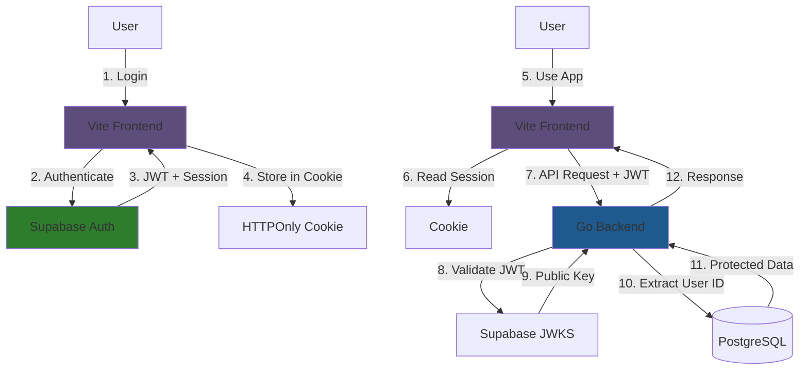
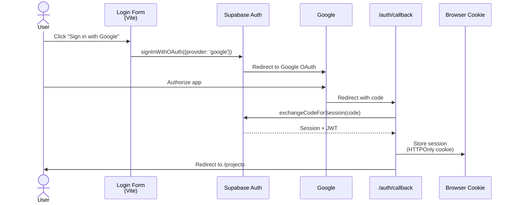
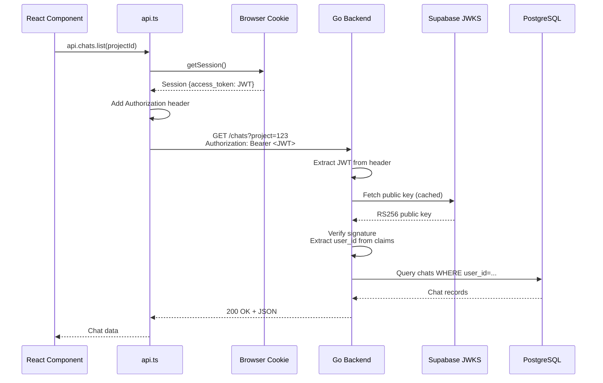
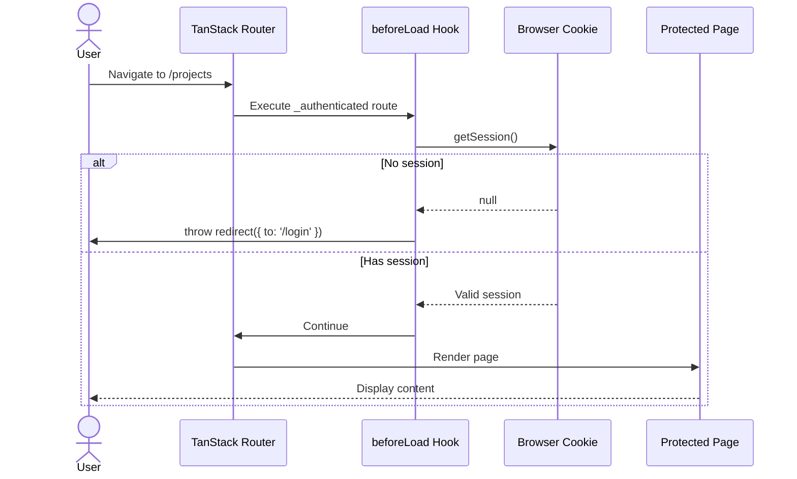

# Authentication Architecture

Complete authentication flow across the Meridian stack: Frontend (Vite + TanStack Router) → Supabase Auth → Backend (Go).

## System Overview



## Components

### Frontend (Vite + TanStack Router + Supabase Auth)
**Status**: ✅ Complete

**Responsibilities**:
- User authentication UI (Google OAuth only)
- Session management (cookie storage)
- Route protection via `beforeLoad` hooks
- Automatic JWT injection into API calls

**Key Files**:
- `src/core/supabase/client.ts` - Browser client
- `src/routes/_authenticated.tsx` - Route protection via `beforeLoad`
- `src/core/lib/api.ts` - JWT injection
- `src/features/auth/components/LoginForm.tsx` - Login UI
- `src/routes/auth/callback.tsx` - OAuth callback handler

**Docs**: [Frontend Auth Implementation](frontend/auth-implementation.md)

### Backend (Go + JWT Validation)
**Status**: ✅ Complete (JWT validation via JWKS)

**Responsibilities**:
- JWT signature validation via JWKS
- User ID extraction from JWT claims
- Request context injection
- Protected endpoint authorization

**Key Files**:
- `internal/middleware/auth.go` - JWT validation middleware
- `internal/auth/jwt_verifier.go` - JWKS-based token verification
- `internal/config/config.go` - Supabase JWKS URL config

**Docs**: [Backend Auth Implementation](backend/auth/supabase-jwt-implementation.md)

### Supabase (Auth Provider)
**Responsibilities**:
- User account management
- JWT token issuance (RS256)
- OAuth provider integration (GitHub, etc.)
- JWKS endpoint for public key distribution

**Configuration**:
- Project URL: `https://<project-id>.supabase.co`
- JWKS URL: `https://<project-id>.supabase.co/.well-known/jwks.json`

## Authentication Flows

### 1. Google OAuth Login Flow



### 2. API Request Flow (with JWT)



### 3. Route Protection Flow (TanStack Router)



## Security

### Frontend Security
- **Cookie Storage**: HTTPOnly, Secure, SameSite flags (handled by `@supabase/ssr`)
- **XSS Protection**: React automatic escaping
- **Token Exposure**: JWTs never exposed to JavaScript (in cookies only)

### Backend Security
- **JWT Validation**: RS256 signature verification via JWKS
- **Token Expiry**: Short-lived tokens (configurable in Supabase)
- **No Shared Secrets**: Backend doesn't store secrets, uses public key only

### Transport Security
- **HTTPS Required**: All production traffic over TLS
- **Token in Header**: JWTs sent in Authorization header (not URL)

## Configuration

### Frontend Environment Variables

```bash
# .env.local
VITE_SUPABASE_URL=https://<project-id>.supabase.co
VITE_SUPABASE_ANON_KEY=<anon-key>
```

### Backend Environment Variables

```bash
# .env
SUPABASE_URL=https://<project-id>.supabase.co
SUPABASE_KEY=<service-role-key>
# JWKS URL constructed from SUPABASE_URL: ${SUPABASE_URL}/auth/v1/.well-known/jwks.json
```

### Supabase Dashboard Configuration

1. **Authentication > URL Configuration**:
   - Site URL: `https://your-app.com`
   - Redirect URLs: `https://your-app.com/auth/callback`

2. **Authentication > Providers**:
   - Enable Google provider (configure OAuth app)

3. **API Settings**:
   - Copy project URL and anon key to frontend `.env.local`

## Deployment Checklist

### Frontend Deployment
- [ ] Set `VITE_SUPABASE_URL` in hosting environment (Vercel)
- [ ] Set `VITE_SUPABASE_ANON_KEY`
- [ ] Configure Supabase redirect URLs for production domain
- [ ] Verify HTTPS enforcement

### Backend Deployment
- [x] Set `SUPABASE_URL` in hosting environment (Railway)
- [x] Verify JWKS endpoint is reachable from backend
- [x] Test JWT validation with production tokens
- [x] JWT validation implemented (no TEST_USER_ID stubs)

### Supabase Configuration
- [ ] Add production domain to redirect URLs
- [ ] Configure OAuth providers with production callback URLs
- [ ] Review JWT expiry settings
- [ ] Enable RLS policies if needed

## Testing

### Manual End-to-End Test
1. **Login**: Google OAuth works
2. **Session Persistence**: Refresh page, still logged in
3. **API Calls**: Authenticated requests return 200 (not 401)
4. **Route Protection**: `/projects` without session → redirects to `/login`
5. **Logout**: Session cleared, redirected to `/login`

### Backend JWT Validation Test (When Implemented)
```bash
# Get JWT from frontend session
curl -H "Authorization: Bearer <JWT>" http://localhost:8080/chats?project=123

# Expected: 200 OK (not 401 Unauthorized)
```

## Current Status

| Component | Status | Notes |
|-----------|--------|-------|
| Frontend Auth | ✅ Complete | Supabase integration, middleware, JWT injection |
| Backend JWT Validation | ✅ Complete | JWKS-based RS256/ES256 validation |
| Supabase Setup | ✅ Complete | Project configured, OAuth enabled |

## References

- **Frontend Details**: [Frontend Auth Implementation](frontend/auth-implementation.md)
- **Backend Details**: [Backend Auth Implementation](backend/auth/supabase-jwt-implementation.md)
- **Backend Reference**: [Supabase JWT Full Reference](backend/auth/REFERENCE-supabase-jwt-full.md)
- **Supabase Docs**: https://supabase.com/docs/guides/auth
- **JWT RFC**: https://datatracker.ietf.org/doc/html/rfc7519
