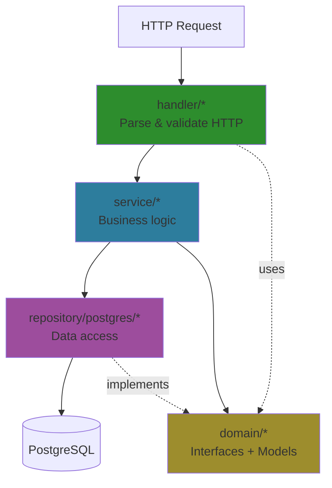
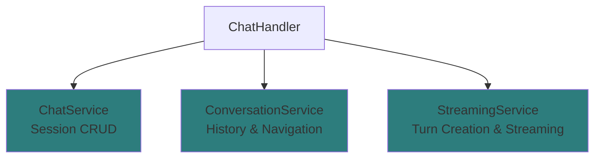
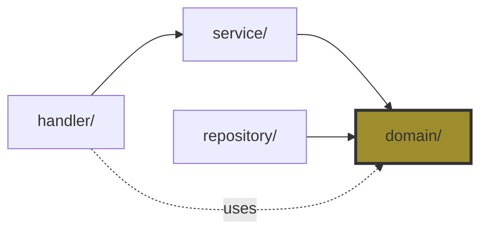
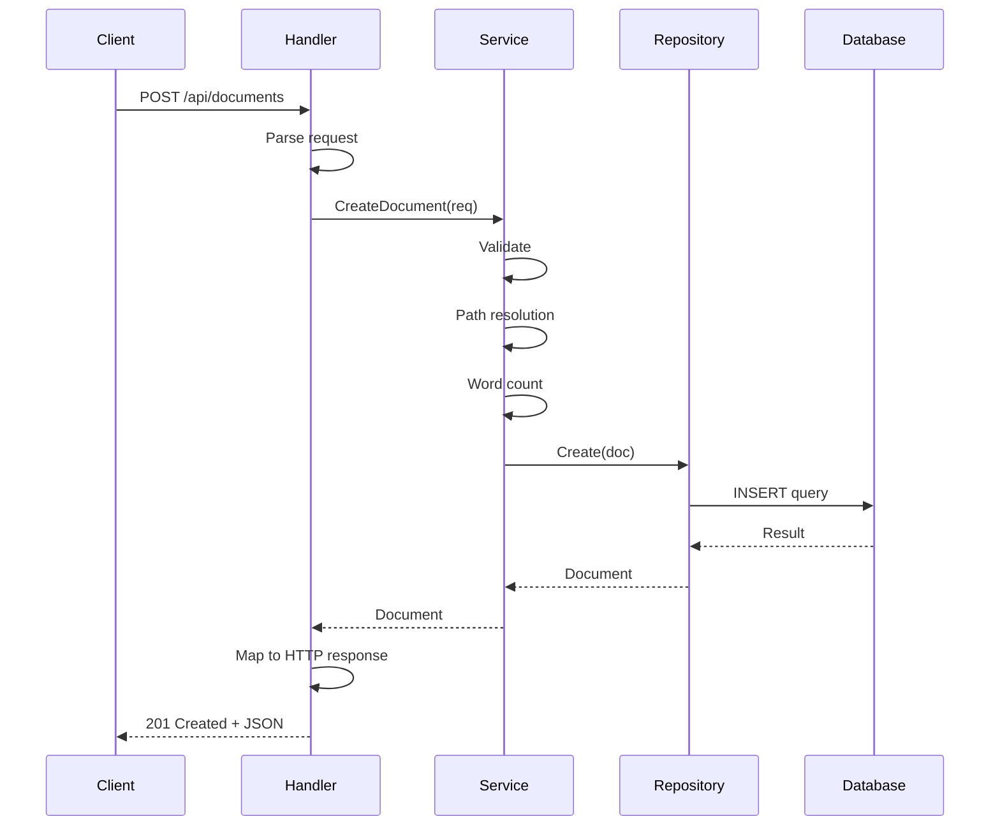

# Architecture Overview

Meridian backend uses Clean Architecture (also called Hexagonal Architecture) with clear layer separation.

## Core Principle

> **Business logic doesn't depend on external details like databases or HTTP frameworks.**

Dependencies point **inward**: Handler → Service → Repository → Database

## Quick Navigation

- **Layer details?** → [Layers Guide](layers.md)
- **Request flow?** → [Request Lifecycle](request-lifecycle.md)
- **Go patterns?** → [Go Patterns](go-patterns.md)

## Architecture Diagram



## The Three Layers

### 1. Handler Layer (`internal/handler/`)

**Responsibility:** HTTP concerns only

**Does:**
- Parse HTTP requests and route parameters
- Call services
- Map domain errors to HTTP status codes
- Return JSON responses

**Does NOT:**
- Business logic (validation, authorization)
- Database queries
- Create errors (only maps them)

**Example:** `internal/handler/document.go:27-47`

```go
func (h *DocumentHandler) CreateDocument(c *fiber.Ctx) error {
    // Parse HTTP body
    var req services.CreateDocumentRequest
    if err := c.BodyParser(&req); err != nil {
        return fiber.NewError(fiber.StatusBadRequest, "Invalid request body")
    }

    // Call service (business logic)
    doc, err := h.docService.CreateDocument(c.Context(), &req)
    if err != nil {
        return handleError(c, err)  // Map to HTTP status
    }

    // Return response
    return c.Status(fiber.StatusCreated).JSON(doc)
}
```

**Key pattern:** Handler is thin. All logic delegated to service.

### 2. Service Layer (`internal/service/`)

**Responsibility:** Business logic and orchestration

**Does:**
- Validate business rules (ozzo-validation)
- Validate parent resources exist and aren't soft-deleted (ResourceValidator, ChatValidator)
- Coordinate multiple repositories
- Transform data (word counting, path resolution)
- Enforce application rules
- Transaction management
- Return domain errors

**Does NOT:**
- HTTP concerns (status codes, headers)
- SQL queries (delegates to repository)
- Know about Fiber or web framework

**Example:** `internal/service/document.go:43-111`

```go
func (s *documentService) CreateDocument(ctx context.Context, req *CreateDocumentRequest) (*models.Document, error) {
    // 1. Validate
    if err := s.validateCreateRequest(req); err != nil {
        return nil, fmt.Errorf("%w: %v", domain.ErrValidation, err)
    }

    // 2. Path resolution (auto-create folders)
    folderID, err := s.pathResolver.ResolveOrCreate(ctx, req.ProjectID, req.FolderPath)
    if err != nil {
        return nil, err
    }

    // 3. Word counting
    wordCount := s.contentAnalyzer.CountWords(req.Content)

    // 4. Build domain model
    doc := &models.Document{
        ProjectID: req.ProjectID,
        FolderID:  folderID,
        Name:      req.Name,
        Content:   req.Content,
        WordCount: wordCount,
    }

    // 5. Persist via repository
    if err := s.docRepo.Create(ctx, doc); err != nil {
        return nil, err
    }

    return doc, nil
}
```

**Key pattern:** Service orchestrates. Uses repositories but doesn't know SQL.

### 3. Repository Layer (`internal/repository/postgres/`)

**Responsibility:** Data persistence only

**Does:**
- Execute SQL queries
- Map database rows to structs
- Handle database-specific errors
- Use dynamic table names
- Manage connections

**Does NOT:**
- Validation
- Business logic
- Know about HTTP requests

**Example:** `internal/repository/postgres/document.go:28-54`

```go
func (r *PostgresDocumentRepository) Create(ctx context.Context, doc *models.Document) error {
    // Build SQL with dynamic table name
    query := fmt.Sprintf(`
        INSERT INTO %s (project_id, folder_id, name, content, word_count, created_at, updated_at)
        VALUES ($1, $2, $3, $4, $5, $6, $7)
        RETURNING id, created_at, updated_at
    `, r.tables.Documents)

    // Execute query
    err := r.pool.QueryRow(ctx, query,
        doc.ProjectID,
        doc.FolderID,
        doc.Name,
        doc.Content,
        doc.WordCount,
        time.Now(),
        time.Now(),
    ).Scan(&doc.ID, &doc.CreatedAt, &doc.UpdatedAt)

    // Handle database errors
    if err != nil {
        if isPgDuplicateError(err) {
            return domain.ErrConflict
        }
        return fmt.Errorf("create document: %w", err)
    }

    return nil
}
```

**Key pattern:** Repository is dumb persistence. No business logic.

---

## LLM Service Layer Organization

The LLM service layer demonstrates advanced Clean Architecture with a **3-service split** following SOLID principles.

### Why Split Services?

A monolithic ChatService (1500+ lines) was split into 3 focused services:



### Service Responsibilities

**ChatService** (`service/llm/chat/`)
- Create/Read/Update/Delete chat sessions
- 5 methods, 150 lines
- Dependencies: ChatRepository, ProjectRepository

**ConversationService** (`service/llm/conversation/`)
- Get turn path (root to leaf)
- Get turn siblings (branching)
- Paginated turn loading
- 4 methods, 90 lines
- Dependencies: ChatRepository, TurnRepository

**StreamingService** (`service/llm/streaming/`)
- Create turn (user + assistant)
- Initiate LLM streaming
- 2 methods, 280 lines (+ supporting components)
- Dependencies: TurnRepository, ResponseGenerator, ExecutorRegistry

### SOLID Compliance

**Single Responsibility** - Each service has one reason to change
**Interface Segregation** - 3 focused interfaces instead of 1 fat interface (11 methods)
**Dependency Inversion** - Services depend on repository interfaces, not implementations

See [Service Layer Architecture](service-layer.md) for detailed explanation.

### Service Structure

```
internal/service/llm/
├── chat/
│   └── service.go              # ChatService implementation
├── conversation/
│   └── service.go              # ConversationService implementation
├── streaming/
│   ├── service.go              # StreamingService implementation
│   ├── mstream_adapter.go      # StreamExecutor + meridian-stream-go integration
│   ├── catchup.go              # DB-backed catchup for reconnection
│   ├── debug.go                # Debug helpers for internal streaming
│   └── response_generator.go   # LLM provider coordination
├── providers/
│   └── anthropic/              # Anthropic Claude provider
├── registry.go                 # Provider registry
└── setup.go                    # Dependency injection helper
```

---

## Dependency Flow



**Critical:** Service depends on `DocumentRepository` **interface** (domain), not `PostgresDocumentRepository` **implementation** (repository).

This enables:
- Testing with mocks
- Swapping databases without changing service
- Clear contracts between layers

## Request Flow Sequence



## Project Structure

```
backend/
├── cmd/
│   ├── server/main.go          # Entry point, dependency injection
│   └── seed/main.go            # Database seeder
│
├── internal/
│   ├── domain/                 # Core: interfaces + models + errors
│   │   ├── models/             # Document, Folder, Project structs
│   │   ├── repositories/       # Repository interfaces
│   │   ├── services/           # Service interfaces + request/response DTOs
│   │   └── errors.go           # Domain errors (ErrNotFound, ErrConflict)
│   │
│   ├── handler/                # HTTP layer (Fiber)
│   │   ├── document.go         # Document CRUD endpoints
│   │   ├── folder.go           # Folder CRUD endpoints
│   │   ├── tree.go             # Tree endpoint
│   │   ├── import.go           # Import endpoints
│   │   └── errors.go           # Error mapping (domain → HTTP)
│   │
│   ├── service/                # Business logic implementations
│   │   ├── document.go         # Document service
│   │   ├── folder.go           # Folder service
│   │   ├── tree.go             # Tree building
│   │   ├── import.go           # Import processing
│   │   ├── path_resolver.go   # Path → folder resolution
│   │   └── content_analyzer.go # Word counting
│   │
│   ├── repository/postgres/    # PostgreSQL implementations
│   │   ├── connection.go       # DB connection, table names
│   │   ├── document.go         # Document queries
│   │   ├── folder.go           # Folder queries
│   │   ├── project.go          # Project queries
│   │   └── transaction.go      # Transaction management
│   │
│   ├── middleware/             # HTTP middleware
│   │   ├── auth.go             # Auth stub (Phase 1)
│   │   └── error.go            # Error handling
│   │
│   └── config/                 # Configuration
│       └── config.go
│
└── schema.sql                  # Database schema
```

## Dependency Injection

Dependencies are wired up in `cmd/server/main.go`:

### Document System Example

```go
// 1. Create repositories (outermost layer)
docRepo := postgres.NewDocumentRepository(repoConfig)
folderRepo := postgres.NewFolderRepository(repoConfig)

// 2. Inject repositories into services
docService := service.NewDocumentService(
    docRepo,        // Repository interface
    folderRepo,     // Repository interface
    pathResolver,
    contentAnalyzer,
    logger,
)

// 3. Inject services into handlers
docHandler := handler.NewDocumentHandler(
    docService,     // Service interface
    logger,
)

// 4. Register routes
api.Post("/documents", docHandler.CreateDocument)
```

### LLM Services Example

LLM services use a setup helper for cleaner dependency injection:

```go
// Setup LLM provider registry
providerRegistry, err := serviceLLM.SetupProviders(cfg, logger)

// Setup all 3 LLM services at once
llmServices, executorRegistry, err := serviceLLM.SetupServices(
    chatRepo,
    turnRepo,
    projectRepo,
    providerRegistry,
    cfg,
    txManager,
    logger,
)

// Create handler with all 3 services
chatHandler := handler.NewChatHandler(
    llmServices.Chat,          // ChatService
    llmServices.Conversation,  // ConversationService
    llmServices.Streaming,     // StreamingService
    turnRepo,
    executorRegistry,
    logger,
)
```

See `internal/service/llm/setup.go` for implementation.

**Flow:** Database → Repository → Service → Handler → HTTP

## Adding New Features

### Decision Tree

Where does X belong?

- **HTTP concerns** (parsing, status codes, headers) → `handler/`
- **Business rules** (validation, authorization, orchestration) → `service/`
- **Data access** (SQL queries, DB operations) → `repository/`
- **Cross-cutting** (logging, auth, rate limiting) → `middleware/`

### Implementation Pattern

1. Define interface in `domain/repositories/` or `domain/services/`
2. Implement repository in `repository/postgres/`
3. Implement service in `service/`
4. Add handler in `handler/`
5. Wire up in `cmd/server/main.go`

### Example: Adding Comments Feature

```go
// 1. Domain interface (domain/repositories/comment.go)
type CommentRepository interface {
    Create(ctx context.Context, comment *Comment) error
    GetByDocumentID(ctx context.Context, docID string) ([]*Comment, error)
}

// 2. Repository (repository/postgres/comment.go)
type PostgresCommentRepository struct {
    pool   *pgxpool.Pool
    tables *TableNames
}

func (r *PostgresCommentRepository) Create(ctx context.Context, comment *Comment) error {
    query := fmt.Sprintf("INSERT INTO %s (...) VALUES (...)", r.tables.Comments)
    // SQL only
}

// 3. Service (service/comment.go)
type commentService struct {
    commentRepo repositories.CommentRepository
}

func (s *commentService) CreateComment(ctx context.Context, req *CreateCommentRequest) (*Comment, error) {
    // Validation
    // Authorization
    // Business logic
    // Call repository
}

// 4. Handler (handler/comment.go)
func (h *CommentHandler) CreateComment(c *fiber.Ctx) error {
    // Parse request
    // Call service
    // Return response
}

// 5. Wire up (cmd/server/main.go)
commentRepo := postgres.NewCommentRepository(repoConfig)
commentService := service.NewCommentService(commentRepo, logger)
commentHandler := handler.NewCommentHandler(commentService, logger)
api.Post("/comments", commentHandler.CreateComment)
```

## Key Technologies

**HTTP Framework:** Fiber v2 (fast, Express-like)
**Database Driver:** pgx v5 (native PostgreSQL, prepared statements)
**Validation:** ozzo-validation (service layer)
**Logging:** slog (structured logging)

## Error Handling

**Pattern:** Sentinel errors with `errors.Is`

```go
// Domain defines errors (domain/errors.go)
var ErrNotFound = errors.New("not found")
var ErrConflict = errors.New("conflict")
var ErrValidation = errors.New("validation error")

// Repository returns domain error
if noRows {
    return fmt.Errorf("document %s: %w", id, domain.ErrNotFound)
}

// Service propagates
if err != nil {
    return nil, err
}

// Handler maps to HTTP
func handleError(c *fiber.Ctx, err error) error {
    if errors.Is(err, domain.ErrNotFound) {
        return c.Status(404).JSON(fiber.Map{"error": err.Error()})
    }
    if errors.Is(err, domain.ErrConflict) {
        return c.Status(409).JSON(fiber.Map{"error": err.Error()})
    }
    // ...
}
```

## Benefits of Clean Architecture

### 1. Testability
```go
// Mock service for handler tests
type MockDocumentService struct{}

func (m *MockDocumentService) CreateDocument(...) (*Document, error) {
    return &Document{ID: "test-id"}, nil
}

handler := NewDocumentHandler(mockService, logger)
// Test handler without database
```

### 2. Swappable Implementations
```go
// Could swap PostgreSQL for MongoDB
mongoRepo := mongo.NewDocumentRepository(...)
docService := service.NewDocumentService(mongoRepo, ...)
// Service layer unchanged!
```

### 3. Clear Separation of Concerns

Each layer answers one question:
- Handler: "How do I talk to clients?"
- Service: "What are the business rules?"
- Repository: "How do I store data?"

### 4. Independent Development

- Frontend works against API contracts
- Database changes don't affect handlers
- Business logic changes don't affect HTTP layer

## References

**Interfaces:**
- Repository interfaces: `internal/domain/repositories/`
- Service interfaces: `internal/domain/services/`

**Models:**
- Domain models: `internal/domain/models/`
- Errors: `internal/domain/errors.go`

**Further Reading:**
- [Layers Guide](layers.md) - Detailed layer responsibilities
- [Request Lifecycle](request-lifecycle.md) - Complete request walkthrough
- [Go Patterns](go-patterns.md) - Common Go idioms
