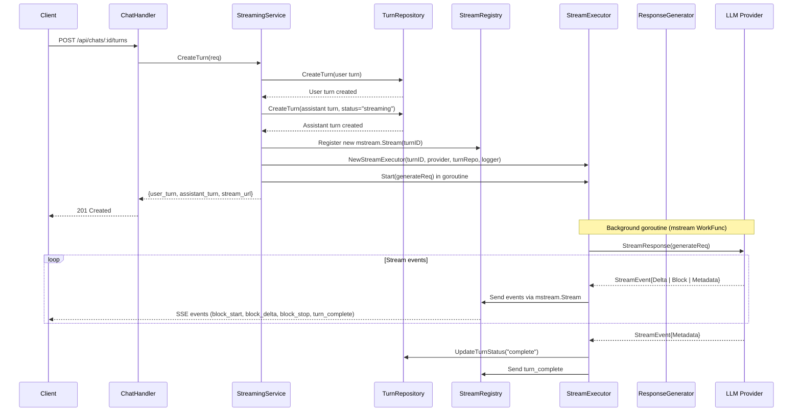
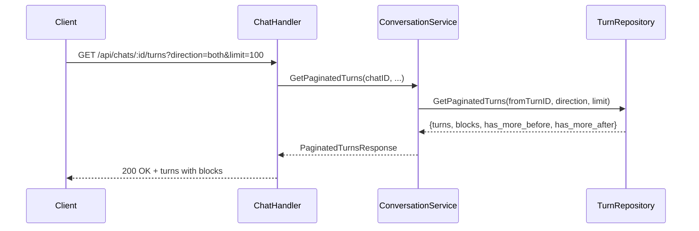
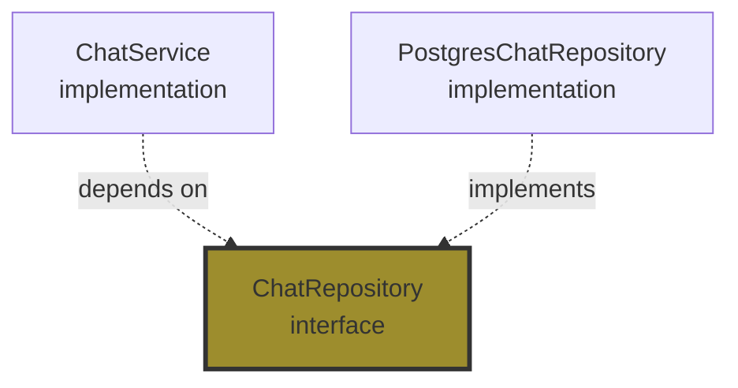

# Service Layer Architecture: LLM Services

The LLM service layer is organized into 3 focused services following SOLID principles, replacing a monolithic ChatService that previously contained 1500+ lines.

## Overview

```mermaid
graph TB
    Handler[Handler Layer<br/>chat.go]

    ChatSvc[ChatService<br/>CRUD Operations]
    ConvoSvc[ConversationService<br/>History & Navigation]
    StreamSvc[StreamingService<br/>Turn Creation & Streaming]

    ChatRepo[(ChatRepository)]
    TurnRepo[(TurnRepository)]
    ProjectRepo[(ProjectRepository)]

    Executor[StreamExecutor<br/>mstream Stream Worker]
    Generator[ResponseGenerator<br/>LLM Orchestration]
    Registry[StreamRegistry<br/>Active Streams (mstream)]

    Handler --> ChatSvc
    Handler --> ConvoSvc
    Handler --> StreamSvc

    ChatSvc --> ChatRepo
    ChatSvc --> ProjectRepo

    ConvoSvc --> ChatRepo
    ConvoSvc --> TurnRepo

    StreamSvc --> TurnRepo
    StreamSvc --> Generator
    StreamSvc --> Registry

    Registry --> Executor
    Generator --> Provider[LLM Provider]

    style ChatSvc fill:#2d7d7d
    style ConvoSvc fill:#2d7d7d
    style StreamSvc fill:#2d7d7d
    style Executor fill:#7d4d4d
    style Generator fill:#7d4d4d
```

## The Three Services

### 1. ChatService (`internal/service/llm/chat/service.go`)

**Single Responsibility:** Chat session management (CRUD only)

**Methods:**
- `CreateChat(ctx, req) (*Chat, error)` - Create new chat session
- `GetChat(ctx, chatID, userID) (*Chat, error)` - Retrieve chat by ID
- `ListChats(ctx, projectID, userID) ([]Chat, error)` - List user's chats
- `UpdateChat(ctx, chatID, userID, req) (*Chat, error)` - Update chat title
- `DeleteChat(ctx, chatID, userID) (*Chat, error)` - Soft-delete chat

**Dependencies:**
- `ChatRepository` - Chat data access
- `ProjectRepository` - Verify project exists

**Why Separate?**
- **Single Responsibility**: Only manages chat sessions
- **No knowledge** of turns, streaming, or LLM interactions
- **Independent use**: Can be used standalone for chat list UI
- **Clear boundaries**: Chat lifecycle is distinct from conversation flow

**File:** `internal/service/llm/chat/service.go` (~150 lines)

---

### 2. ConversationService (`internal/service/llm/conversation/service.go`)

**Single Responsibility:** Conversation history and navigation

**Methods:**
- `GetTurnPath(ctx, turnID) ([]Turn, error)` - Get path from root to turn
- `GetTurnSiblings(ctx, turnID) ([]Turn, error)` - Get all siblings (branching)
- `GetChatTree(ctx, chatID, userID) (*ChatTree, error)` - Get lightweight tree structure
- `GetPaginatedTurns(ctx, chatID, userID, fromTurnID, limit, direction) (*PaginatedTurnsResponse, error)` - Paginated turn loading

**Dependencies:**
- `ChatRepository` - Verify chat ownership
- `TurnRepository` - Turn navigation queries

**Why Separate?**
- **Single Responsibility**: Only handles navigation and history retrieval
- **No knowledge** of LLM calls, streaming, or turn creation
- **Optimized for reads**: Specialized recursive CTEs, N+1 query elimination
- **Pagination expertise**: Complex direction-based queries isolated here

**File:** `internal/service/llm/conversation/service.go` (~90 lines)

---

### 3. StreamingService (`internal/service/llm/streaming/service.go`)

**Single Responsibility:** Turn creation and streaming orchestration

**Methods:**
- `CreateTurn(ctx, req) (*CreateTurnResponse, error)` - Create user + assistant turns, initiate streaming
- `CreateAssistantTurnDebug(ctx, ...) (*Turn, error)` - Debug-only: Manual assistant turn creation

**Dependencies:**
- `TurnRepository` - Turn persistence
- `ChatValidator` - Validate chat exists and ownership
- `ResponseGenerator` - LLM response orchestration
- `*mstream.Registry` - Manage active streaming streams (SSE fan-out + catchup)
- `TransactionManager` - Atomic user+assistant turn creation

**Why Separate?**
- **Single Responsibility**: Only handles turn creation and streaming coordination
- **Complex orchestration**: Background goroutine management, SSE broadcasting
- **Isolated complexity**: Streaming logic doesn't pollute CRUD or navigation code
- **Testability**: Mock executor registry for testing without real streaming

**File:** `internal/service/llm/streaming/service.go` (~280 lines)

**Supporting Components:**
- `mstream_adapter.go` - StreamExecutor (adapts meridian-llm-go → TurnBlockDelta/TurnBlock + mstream.Stream)
- `catchup.go` - DB-backed catchup for reconnection
- `debug.go` - Debug helpers for internal streaming flows
- `response_generator.go` - LLM provider orchestration

---

## Service Interactions

### Flow: User Sends Message



### Flow: User Views Chat History



---

## SOLID Principles Compliance

### Single Responsibility Principle (SRP) ✅

**Before (Monolithic ChatService):**
- Chat CRUD
- Turn operations
- Conversation navigation
- Streaming coordination
- LLM integration
- **Result:** 1500+ lines, multiple reasons to change

**After (3 Services):**
- `ChatService`: Chat CRUD only (150 lines)
- `ConversationService`: Navigation only (90 lines)
- `StreamingService`: Streaming only (280 lines)
- **Result:** Each service has one reason to change

---

### Open/Closed Principle (OCP) ✅

**Extension without modification:**
```go
// Adding new LLM provider (no service modification required)
newProvider := openai.NewProvider(apiKey, logger)
providerRegistry.RegisterProvider(newProvider)
```

**New features:**
- Add new chat metadata field → Only update ChatService
- Add new navigation query → Only update ConversationService
- Add new streaming event type → Only update StreamingService

---

### Liskov Substitution Principle (LSP) ✅

**All services implement domain interfaces:**
```go
// Domain interface (internal/domain/services/llm/chat.go)
type ChatService interface {
    CreateChat(ctx context.Context, req *CreateChatRequest) (*Chat, error)
    // ...
}

// Implementation (internal/service/llm/chat/service.go)
type Service struct {
    chatRepo    llmRepo.ChatRepository
    projectRepo docsysRepo.ProjectRepository
    logger      *slog.Logger
}

func (s *Service) CreateChat(...) (*Chat, error) {
    // Implementation
}
```

**Mock for testing:**
```go
type MockChatService struct{}

func (m *MockChatService) CreateChat(...) (*Chat, error) {
    return &Chat{ID: "test-id"}, nil
}

// Can substitute real service with mock
handler := NewChatHandler(mockChatService, ..., logger)
```

---

### Interface Segregation Principle (ISP) ✅

**Before:** Fat interface with 11 methods
```go
// Old monolithic interface
type ChatService interface {
    CreateChat(...)
    GetChat(...)
    ListChats(...)
    UpdateChat(...)
    DeleteChat(...)
    CreateTurn(...)
    GetTurnPath(...)
    GetTurnSiblings(...)
    GetChatTree(...)
    GetPaginatedTurns(...)
    // ... even more methods
}
```

**After:** 3 focused interfaces
```go
// Chat CRUD (5 methods)
type ChatService interface {
    CreateChat(...)
    GetChat(...)
    ListChats(...)
    UpdateChat(...)
    DeleteChat(...)
}

// Conversation navigation (4 methods)
type ConversationService interface {
    GetTurnPath(...)
    GetTurnSiblings(...)
    GetChatTree(...)
    GetPaginatedTurns(...)
}

// Streaming (2 methods)
type StreamingService interface {
    CreateTurn(...)
    CreateAssistantTurnDebug(...)
}
```

**Benefits:**
- Handlers only depend on interfaces they use
- Testing mocks are simpler (fewer methods to implement)
- Changes to one interface don't affect unrelated code

---

### Dependency Inversion Principle (DIP) ✅

**Services depend on abstractions:**


**Example:**
```go
// Service depends on interface (domain)
type Service struct {
    chatRepo llmRepo.ChatRepository  // Interface!
}

// Repository implements interface
type PostgresChatRepository struct {
    pool *pgxpool.Pool
}

func (r *PostgresChatRepository) Create(...) error {
    // PostgreSQL-specific implementation
}
```

**Benefits:**
- Swap PostgreSQL for MongoDB without changing service
- Mock repository for unit tests
- Service doesn't know about SQL, pgx, or PostgreSQL

---

## Authorization Pattern

All services receive a `ResourceAuthorizer` dependency for ownership-based access control:

```go
type DocumentService struct {
    docRepo    docsysRepo.DocumentRepository
    authorizer services.ResourceAuthorizer  // Injected dependency
    logger     *slog.Logger
}

func (s *DocumentService) GetDocument(ctx context.Context, userID, docID string) (*Document, error) {
    // Auth check first
    if err := s.authorizer.CanAccessDocument(ctx, userID, docID); err != nil {
        return nil, err
    }
    // Then fetch
    return s.docRepo.GetByIDOnly(ctx, docID)
}
```

**Key Points:**
- Authorization at service layer (not handler)
- Consistent across all entry points
- Uses `GetByIDOnly` pattern after auth (no projectID needed)
- See [authorization.md](../auth/authorization.md) for details

---

## File Structure

```
internal/
├── domain/
│   ├── services/llm/
│   │   ├── chat.go                 # ChatService interface
│   │   ├── conversation.go         # ConversationService interface
│   │   ├── streaming.go            # StreamingService interface
│   │   └── provider.go             # LLMProvider interface
│   │
│   └── repositories/llm/
│       ├── chat.go                 # ChatRepository interface
│       └── turn.go                 # TurnRepository interface
│
├── service/llm/
│   ├── chat/
│   │   └── service.go              # ChatService implementation
│   │
│   ├── conversation/
│   │   └── service.go              # ConversationService implementation
│   │
│   ├── streaming/
│   │   ├── service.go              # StreamingService implementation
│   │   ├── mstream_adapter.go      # StreamExecutor + mstream integration
│   │   ├── catchup.go              # DB-backed catchup logic
│   │   ├── debug.go                # Streaming debug helpers
│   │   └── response_generator.go   # LLM orchestration
│   │
│   ├── providers/
│   │   ├── anthropic/              # Anthropic Claude provider
│   │   │   ├── client.go
│   │   │   ├── adapter.go
│   │   │   └── config.go
│   │   └── lorem/                  # Mock provider (dev/test)
│   │
│   ├── registry.go                 # Provider registry
│   ├── validation.go               # ChatValidator
│   └── setup.go                    # Dependency injection helper
│
├── handler/
│   ├── chat.go                     # ChatHandler (uses all 3 services)
│   ├── chat_debug.go               # Debug endpoints
│   └── sse_handler.go              # SSE streaming handler
│
└── repository/postgres/llm/
    ├── chat.go                     # PostgresChatRepository
    └── turn.go                     # PostgresTurnRepository
```

---

## Dependency Injection

### Setup Helper (`internal/service/llm/setup.go`)

```go
// Services struct holds all 3 services
type Services struct {
    Chat         llmSvc.ChatService
    Conversation llmSvc.ConversationService
    Streaming    llmSvc.StreamingService
}

// SetupServices initializes all LLM services with proper dependency injection
func SetupServices(
    chatRepo llmRepo.ChatRepository,
    turnRepo llmRepo.TurnRepository,
    projectRepo docsysRepo.ProjectRepository,
    providerRegistry *ProviderRegistry,
    cfg *config.Config,
    txManager repositories.TransactionManager,
    logger *slog.Logger,
) (*Services, *mstream.Registry, error) {
    // Create shared validator
    validator := NewChatValidator(chatRepo)

    // Create mstream registry (for SSE streaming)
    streamRegistry := mstream.NewRegistry()

    // Start cleanup goroutine for old streams
    go streamRegistry.StartCleanup(context.Background())

    // Create response generator
    responseGenerator := streaming.NewResponseGenerator(providerRegistry, turnRepo, logger)

    // Create chat service (CRUD only)
    chatService := chat.NewService(
        chatRepo,
        projectRepo,
        logger,
    )

    // Create conversation service (history/navigation)
    conversationService := conversation.NewService(
        chatRepo,
        turnRepo,
    )

    // Create streaming service (turn creation/orchestration)
    streamingService := streaming.NewService(
        turnRepo,
        validator,
        responseGenerator,
        streamRegistry,
        cfg,
        txManager,
        logger,
    )

    return &Services{
        Chat:         chatService,
        Conversation: conversationService,
        Streaming:    streamingService,
    }, streamRegistry, nil
}
```

### Usage in main.go (`cmd/server/main.go`)

```go
// Setup LLM services
llmServices, streamRegistry, err := serviceLLM.SetupServices(
    chatRepo,
    turnRepo,
    projectRepo,
    providerRegistry,
    cfg,
    txManager,
    logger,
)
if err != nil {
    log.Fatalf("Failed to setup LLM services: %v", err)
}

// Create handler with all 3 services
// Create SSE handler
sseHandler := handler.NewSSEHandler(
    streamRegistry,
    logger,
)
```

---

## Migration: Before vs After

### Before: Monolithic ChatService

**File:** `internal/service/llm/chat.go` (1500+ lines, deleted)

**Problems:**
- 11+ methods mixing different responsibilities
- Hard to test (large surface area)
- Difficult to navigate
- Changes to streaming affect chat CRUD
- Unclear dependencies

**Structure:**
```go
type ChatService struct {
    chatRepo        ChatRepository
    turnRepo        TurnRepository
    projectRepo     ProjectRepository
    validator       ChatValidator
    providerRegistry *ProviderRegistry
    executorRegistry *ExecutorRegistry
    responseGenerator *ResponseGenerator
    txManager        TransactionManager
    config           *Config
    logger           *slog.Logger
}

// Chat CRUD
func (s *ChatService) CreateChat(...)
func (s *ChatService) GetChat(...)
func (s *ChatService) ListChats(...)
func (s *ChatService) UpdateChat(...)
func (s *ChatService) DeleteChat(...)

// Turn operations
func (s *ChatService) CreateTurn(...)

// Navigation
func (s *ChatService) GetTurnPath(...)
func (s *ChatService) GetTurnSiblings(...)
func (s *ChatService) GetChatTree(...)
func (s *ChatService) GetPaginatedTurns(...)

// ... more methods
```

---

### After: 3 Focused Services

**Total Lines:** ~520 (vs 1500+)

**ChatService** (`chat/service.go` - 150 lines)
```go
type Service struct {
    chatRepo    llmRepo.ChatRepository
    projectRepo docsysRepo.ProjectRepository
    logger      *slog.Logger
}

func (s *Service) CreateChat(...)
func (s *Service) GetChat(...)
func (s *Service) ListChats(...)
func (s *Service) UpdateChat(...)
func (s *Service) DeleteChat(...)
```

**ConversationService** (`conversation/service.go` - 90 lines)
```go
type Service struct {
    chatRepo llmRepo.ChatRepository
    turnRepo llmRepo.TurnRepository
}

func (s *Service) GetTurnPath(...)
func (s *Service) GetTurnSiblings(...)
func (s *Service) GetChatTree(...)
func (s *Service) GetPaginatedTurns(...)
```

**StreamingService** (`streaming/service.go` - 280 lines)
```go
type Service struct {
    turnRepo          llmRepo.TurnRepository
    validator         ChatValidator
    responseGenerator *ResponseGenerator
    registry          *mstream.Registry
    config            *config.Config
    txManager         repositories.TransactionManager
    logger            *slog.Logger
}

func (s *Service) CreateTurn(...)
func (s *Service) CreateAssistantTurnDebug(...)
```

---

## Benefits of Split Architecture

### 1. Easier to Test

**Before:** Mock 10+ dependencies for any test
```go
// Testing chat CRUD required mocking streaming components too
mockProviderRegistry := &MockProviderRegistry{}
mockExecutorRegistry := &MockExecutorRegistry{}
mockResponseGenerator := &MockResponseGenerator{}
// ... and 7 more dependencies
```

**After:** Mock only what you need
```go
// Testing chat CRUD
mockChatRepo := &MockChatRepository{}
mockProjectRepo := &MockProjectRepository{}
chatService := chat.NewService(mockChatRepo, mockProjectRepo, logger)
// Only 3 dependencies!
```

---

### 2. Clear Responsibilities

Each service answers one question:
- **ChatService:** "How do I manage chat sessions?"
- **ConversationService:** "How do I navigate conversation history?"
- **StreamingService:** "How do I create turns and stream responses?"

---

### 3. Better Performance

**ConversationService optimization:**
- Specialized recursive CTEs for path finding
- Leaf node discovery optimizations
- N+1 query elimination in pagination
- No overhead from unused streaming infrastructure

**Before:** All chat operations carried streaming overhead
**After:** Only streaming operations use streaming infrastructure

---

### 4. Independent Development

**Teams can work in parallel:**
- Team A: Add chat metadata features (ChatService)
- Team B: Optimize pagination (ConversationService)
- Team C: Implement tool execution (StreamingService)

**No merge conflicts, no stepping on toes.**

---

### 5. Easier to Understand

**New developer onboarding:**
- Want to understand chat CRUD? Read 150 lines (chat/service.go)
- Want to understand pagination? Read 90 lines (conversation/service.go)
- Want to understand streaming? Read 280 lines (streaming/service.go)

**Before:** Read 1500+ lines to understand anything

---

## Testing Strategy

### Unit Testing Services

**ChatService tests:**
```go
func TestChatService_CreateChat(t *testing.T) {
    mockChatRepo := &MockChatRepository{}
    mockProjectRepo := &MockProjectRepository{}
    service := chat.NewService(mockChatRepo, mockProjectRepo, logger)

    // Test only chat creation logic
    chat, err := service.CreateChat(ctx, &req)
    // ...
}
```

**ConversationService tests:**
```go
func TestConversationService_GetPaginatedTurns(t *testing.T) {
    mockChatRepo := &MockChatRepository{}
    mockTurnRepo := &MockTurnRepository{}
    service := conversation.NewService(mockChatRepo, mockTurnRepo)

    // Test only pagination logic
    response, err := service.GetPaginatedTurns(ctx, ...)
    // ...
}
```

**StreamingService tests:**
```go
func TestStreamingService_CreateTurn(t *testing.T) {
    mockTurnRepo := &MockTurnRepository{}
    mockValidator := &MockChatValidator{}
    mockGenerator := &MockResponseGenerator{}
    mockRegistry := &MockExecutorRegistry{}

    service := streaming.NewService(
        mockTurnRepo,
        mockValidator,
        mockGenerator,
        mockRegistry,
        cfg,
        txManager,
        logger,
    )

    // Test turn creation and streaming initiation
    response, err := service.CreateTurn(ctx, &req)
    // ...
}
```

---

### Integration Testing

**Test service interactions:**
```go
func TestChatFlow_CreateAndStream(t *testing.T) {
    // Use real services with test database
    chatService := chat.NewService(chatRepo, projectRepo, logger)
    streamingService := streaming.NewService(...)

    // Create chat
    chat, err := chatService.CreateChat(ctx, &req)
    require.NoError(t, err)

    // Create turn (triggers streaming)
    response, err := streamingService.CreateTurn(ctx, &turnReq)
    require.NoError(t, err)

    // Verify turn was created
    assert.NotEmpty(t, response.AssistantTurn.ID)
}
```

---

## Common Patterns

### Error Handling

All services use domain errors:
```go
// Service layer
if !exists {
    return nil, fmt.Errorf("chat %s: %w", chatID, domain.ErrNotFound)
}

// Handler layer maps to HTTP
if errors.Is(err, domain.ErrNotFound) {
    return c.Status(404).JSON(fiber.Map{"error": err.Error()})
}
```

---

### Context Cancellation

All services respect context cancellation:
```go
func (s *Service) CreateChat(ctx context.Context, req *CreateChatRequest) (*Chat, error) {
    // Check context before expensive operations
    if err := ctx.Err(); err != nil {
        return nil, err
    }

    // Repository calls pass context through
    if err := s.chatRepo.Create(ctx, chat); err != nil {
        return nil, err
    }

    return chat, nil
}
```

---

### Transaction Management

StreamingService uses transactions for atomic operations:
```go
// CreateTurn creates user turn + assistant turn atomically
func (s *Service) CreateTurn(ctx context.Context, req *CreateTurnRequest) (*CreateTurnResponse, error) {
    tx, err := s.txManager.BeginTx(ctx)
    if err != nil {
        return nil, err
    }
    defer tx.Rollback(ctx)

    // Create user turn
    if err := s.turnRepo.CreateTurn(tx.Context(), userTurn); err != nil {
        return nil, err
    }

    // Create assistant turn
    if err := s.turnRepo.CreateTurn(tx.Context(), assistantTurn); err != nil {
        return nil, err
    }

    if err := tx.Commit(ctx); err != nil {
        return nil, err
    }

    return response, nil
}
```

---

## References

**Domain Interfaces:**
- `internal/domain/services/llm/chat.go`
- `internal/domain/services/llm/conversation.go`
- `internal/domain/services/llm/streaming.go`

**Implementations:**
- `internal/service/llm/chat/service.go`
- `internal/service/llm/conversation/service.go`
- `internal/service/llm/streaming/service.go`

**Supporting Components:**
- `internal/service/llm/streaming/executor.go`
- `internal/service/llm/streaming/registry.go`
- `internal/service/llm/streaming/accumulator.go`
- `internal/service/llm/streaming/response_generator.go`

**Setup:**
- `internal/service/llm/setup.go` - Dependency injection
- `cmd/server/main.go:85-128` - Service wiring

**Handlers:**
- `internal/handler/chat.go` - ChatHandler using all 3 services
- `internal/handler/chat_debug.go` - Debug endpoints

**Related Documentation:**
- [Clean Architecture Overview](overview.md)
- [Streaming Architecture](streaming-architecture.md)
- [Chat Domain Model](../chat/overview.md)
- [Pagination Guide](../chat/pagination.md)
