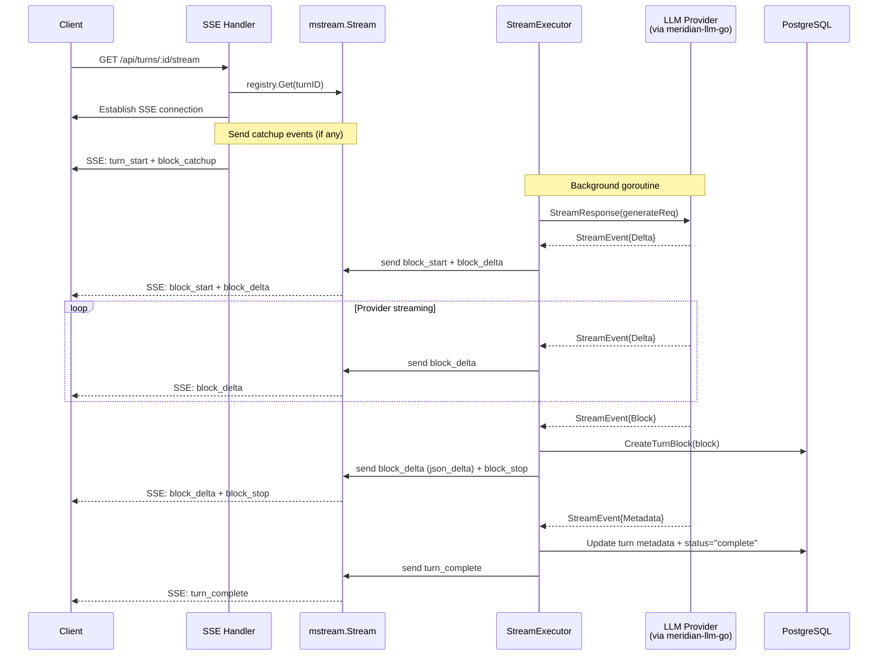
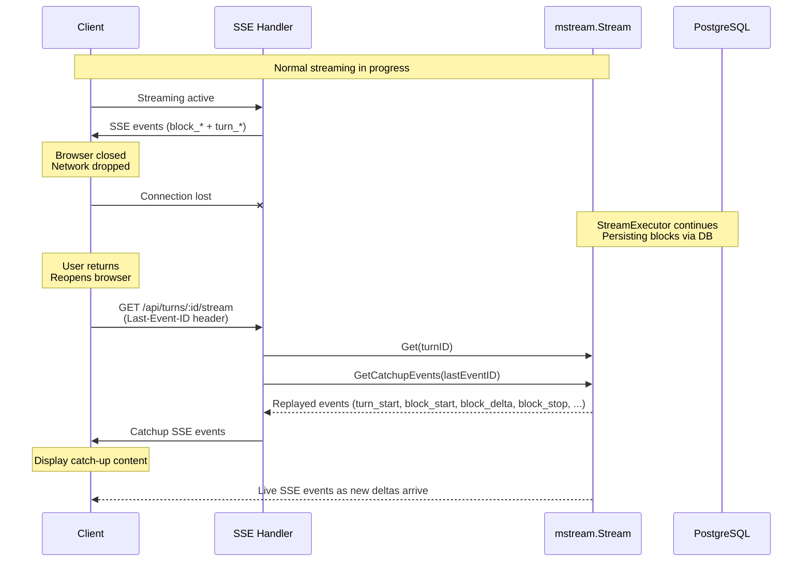

# Streaming Architecture: LLM Response Streaming & Turn Block Accumulation

**Status:** ✅ Implemented and Working
**Last Updated:** 2025-11-16

---

## Table of Contents

1. [Overview](#overview)
2. [Core Concepts](#core-concepts)
3. [Data Models](#data-models)
4. [Normal Streaming Flow](#normal-streaming-flow)
5. [Accumulation & Persistence](#accumulation--persistence)
6. [Client Reconnection](#client-reconnection)
7. [Tool Execution Flow](#tool-execution-flow)
8. [Multi-Provider Abstraction](#multi-provider-abstraction)
9. [Edge Cases & Error Handling](#edge-cases--error-handling)

---

## Overview

The streaming architecture enables real-time LLM response delivery while maintaining conversation history through a dual-layer system:

- **TurnBlockDelta**: Ephemeral streaming events (SSE) - not persisted
- **TurnBlock**: Accumulated content blocks (database) - persisted for history

This design provides:
- ✅ Real-time streaming to frontend
- ✅ Seamless client reconnection
- ✅ Provider-agnostic abstraction (Anthropic, OpenAI, etc.)
- ✅ Conversation history persistence
- ✅ Tool execution integration

---

## Core Concepts

### TurnBlockDelta (Ephemeral)

**Purpose:** Real-time streaming updates sent via SSE
**Lifetime:** Exists only during active streaming
**Storage:** In-memory only (not persisted to database)

`TurnBlockDelta` is the domain model for incremental block updates that come from the LLM library and are broadcast to SSE clients.

- Key fields:
  - `block_index`: Which block this delta belongs to (0‑indexed, matches `TurnBlock.sequence`).
  - `block_type?`: Present only on the first delta for a block (acts as `block_start` signal).
  - `delta_type`: `"text_delta"`, `"thinking_delta"`, `"signature_delta"`, `"tool_call_start"`, `"json_delta"`, `"usage_delta"`.
  - `text_delta`, `signature_delta`, `json_delta`: Payload fields depending on `delta_type`.
- Canonical definition: `backend/internal/domain/models/llm/turn_block_delta.go`.
- Canonical SSE shapes: `_docs/technical/llm/streaming/block-types-reference.md`.

### TurnBlock (Persisted)

**Purpose:** Final accumulated content stored in database
**Lifetime:** Permanent (conversation history)
**Storage:** PostgreSQL `turn_blocks` table

`TurnBlock` is the persisted, provider‑agnostic representation of a block:

- Stored in `turn_blocks` table (see migration `backend/migrations/00001_initial_schema.sql`).
- Key fields:
  - `id`, `turn_id`, `sequence` (0‑indexed order within turn).
  - `block_type`: `"text"`, `"thinking"`, `"tool_use"`, `"tool_result"`, `"image"`, `"reference"`, `"partial_reference"`, `"web_search_use"`, `"web_search_result"`.
  - `text_content`: Plain text for `text`, `thinking`, `tool_result` (optional).
  - `content` (JSONB): Type‑specific structured data.
  - `provider`, `provider_data`: Raw provider information (opaque, used for replay/debug).
  - `execution_side`: `"server"` vs `"client"` for tool blocks.
- Canonical definition: `backend/internal/domain/models/llm/turn_block.go`.

### Key Relationship

- The LLM library (`meridian-llm-go`) does **all accumulation**:
  - Provider deltas → provider‑agnostic `BlockDelta` → complete `Block` structs.
- The backend:
  - Streams `TurnBlockDelta` over SSE for **live UI**.
  - Persists complete `TurnBlock`s to PostgreSQL when the library tells us a block is complete.

---

## Data Models

### SSE Event Types

#### 1. turn_start
Signals the beginning of turn streaming.

```json
{
  "event": "turn_start",
  "data": {
    "turn_id": "uuid-abc-123",
    "model": "moonshotai/kimi-k2-thinking"
  }
}
```

#### 2. block_start
Signals the start of a new content block.

```json
{
  "event": "block_start",
  "data": {
    "turn_id": "uuid-abc-123",
    "block_index": 0,
    "block_type": "thinking"
  }
}
```

#### 3. block_delta
Incremental content update for the current block.

```json
{
  "event": "block_delta",
  "data": {
    "block_index": 0,
    "delta_type": "thinking_delta",
    "text_delta": "Let me think about"
  }
}
```

#### 4. block_stop
Signals completion of a content block.

```json
{
  "event": "block_stop",
  "data": {
    "block_index": 0
  }
}
```

#### 5. block_catchup
Sent on reconnection - contains accumulated content missed during disconnect.

```json
{
  "event": "block_catchup",
  "data": {
    "block": {
      "turn_id": "uuid-abc-123",
      "sequence": 2,
      "block_type": "text",
      "text_content": "I found several issues that need"
    }
  }
}
```

#### 6. turn_complete
Signals successful completion of turn.

```json
{
  "event": "turn_complete",
  "data": {
    "turn_id": "uuid-abc-123",
    "stop_reason": "end_turn",
    "input_tokens": 150,
    "output_tokens": 420
  }
}
```

#### 7. turn_error
Signals an error during turn execution.

```json
{
  "event": "turn_error",
  "data": {
    "turn_id": "uuid-abc-123",
    "error": "Rate limit exceeded"
  }
}
```

---

## Normal Streaming Flow



**Key points:**
- `StreamExecutor.workFunc` reads `StreamEvent`s from the LLM provider (via `meridian-llm-go`).
- Deltas (`TurnBlockDelta`) are sent as `block_start` / `block_delta` events for real‑time UI.
- Complete `TurnBlock`s are persisted to PostgreSQL, then a final `input_json_delta` (if any) and `block_stop` are sent.
- Final `StreamMetadata` updates the turn row and emits `turn_complete`.

---

## Accumulation & Persistence

**Where accumulation happens:**

- Provider‑specific streaming (`content_block_*`, etc.) is handled entirely inside `meridian-llm-go`.
- The library:
  - Normalizes vendor events to provider‑agnostic `BlockDelta` / `Block` types.
  - Accumulates per‑block text and JSON into complete `Block` structs.

**Backend responsibilities:**

- `StreamExecutor.processDelta`:
  - Detects new blocks and emits `block_start`.
  - Emits `block_delta` with `delta_type` + payload to clients.
  - Does **not** accumulate content in memory long‑term.
- `StreamExecutor.processCompleteBlock`:
  - Sets `TurnID` and persists the `TurnBlock` via `turnRepo.CreateTurnBlock`.
  - Wraps persistence in `stream.PersistAndClear(...)` so DB writes and in‑memory event buffer stay consistent for catchup.
  - After persistence, emits a final `block_delta` with `delta_type: "json_delta"` when `content` is present (e.g., `web_search_result`, tool results, etc.), followed by `block_stop`.

---

## Client Reconnection

### Scenario: Client Disconnects Mid-Stream



### Reconnection API Flow

**High-level behavior:**

- `mstream.Stream` maintains an in‑memory event buffer plus a DB‑backed catchup function:
  - Catchup function is built in `backend/internal/service/llm/streaming/mstream_adapter.go` using:
    - `TurnRepository` for reading persisted `TurnBlock`s.
    - `BlockSerializer` for converting blocks to SSE events.
- `SSEHandler.StreamTurn` (`backend/internal/handler/sse_handler.go`):
  - Reads `Last-Event-ID` from the HTTP request.
  - Calls `stream.GetCatchupEvents(lastEventID)` and replays them as SSE.
  - Registers the client with `stream.AddClient(clientID)` for live events.
  - Uses `stream.Status()` + `stream.ClearBuffer()` to clean up finished streams.

**Result:** Clients can disconnect and reconnect without losing content, with minimal custom state management in the backend.

---

## Tool Execution Flow

Tool execution is modeled entirely in terms of blocks:

- Tool invocation:
  - `tool_use` blocks for generic tools.
  - `web_search_use` blocks for provider‑hosted web search.
- Tool results:
  - `tool_result` blocks for client‑executed tools (e.g., file system helpers).
  - `web_search_result` blocks for provider‑executed web search results.
- Execution side:
  - `execution_side = "client"` for tools the consumer must execute.
  - `execution_side = "server"` for provider‑executed tools (e.g., Anthropic web search).

Streaming behavior:
- Tool‑related blocks follow the same event pattern:
  - `block_start` → `block_delta` (including `json_delta` for structured content) → `block_stop`.
- For `web_search_result`, the library:
  - Emits `tool_result_start` + `json_delta` as described in
    `_docs/technical/llm/streaming/block-types-reference.md`.

For canonical schemas and examples, see:
- LLM focus: `_docs/technical/llm/streaming/block-types-reference.md`
- Backend validation: `backend/internal/domain/models/llm/content_types.go`

---

## Multi-Provider Abstraction

Different LLM providers have different HTTP and streaming formats. The abstraction layers are:

- `meridian-llm-go`:
  - Normalizes provider streaming into provider‑agnostic `StreamEvent` (`Delta`, `Block`, `Metadata`).
  - Handles provider‑specific web search, tool calling, and content blocks.
- Backend adapters (e.g., `AnthropicAdapter`):
  - Convert `{role, blocks}` messages to provider‑specific request payloads.
  - Convert provider streaming responses to domain `TurnBlockDelta` + `TurnBlock`.
- Backend streaming (`StreamExecutor` + `mstream.Stream`):
  - Is unaware of the concrete provider.
  - Only depends on the `LLMProvider` interface from `internal/domain/services/llm`.

For details, see:
- Library architecture: `_docs/technical/llm/architecture.md`
- Backend/provider wiring: `_docs/technical/backend/llm-integration.md`

---

## Edge Cases & Error Handling

### 1. Client Disconnects During Streaming

**Behavior:**
- ✅ Backend streaming continues in the background
- ✅ Completed blocks written to database as normal
- ✅ `mstream.Stream` keeps recent events in an in‑memory buffer
- ✅ On reconnection, client receives catchup via `GetCatchupEvents` + resumes

**Implementation:** `backend/internal/handler/sse_handler.go`, `backend/internal/service/llm/streaming/mstream_adapter.go`

### 2. Multiple Clients Streaming Same Turn

**Scenario:** User opens same conversation in multiple tabs.

**Behavior:**
- ✅ Each tab maintains separate SSE connection
- ✅ All tabs receive same delta events
- ✅ Database writes happen once (by `StreamExecutor` / `TurnRepository`)
- ✅ All tabs stay synchronized

**Implementation:** `meridian-stream-go` `Registry`, wired in `backend/internal/service/llm/setup.go`

### 3. Database Write Failure

**Scenario:** TurnBlock write fails due to database error.

**Behavior:**
- ❌ Streaming pauses
- ✅ Send `turn_error` event to all clients
- ✅ Update turn status to "error"
-- ✅ Error stored on turn record for debugging

**Implementation:** `StreamExecutor.handleError` → `UpdateTurnError` + `turn_error` SSE event

### 4. LLM Provider Error

**Scenario:** Anthropic API returns error mid-stream.

**Behavior:**
- ✅ Send `turn_error` event with error details
- ✅ Update turn status to "error"
- ✅ Store error message in turn record

**SSE Event:**
```json
{
  "event": "turn_error",
  "data": {
    "turn_id": "uuid-abc",
    "error": "Rate limit exceeded",
    "code": "rate_limit_error",
    "blocks_completed": 2
  }
}
```

### 5. User Interrupts Turn

**Scenario:** User clicks "Stop" button during streaming.

**Behavior:**
- (Planned) Use context cancellation to stop provider stream
- (Planned) Update turn status to "cancelled" and stop emitting events

**Note:** Exact interrupt semantics are still evolving; see API docs for up‑to‑date behavior.

### 6. Orphaned Streaming Goroutines

**Scenario:** All clients disconnect but goroutine keeps streaming.

**Behavior:**
- ✅ Continue streaming until completion even if all clients disconnect
- ✅ Write all blocks to database
- ✅ `mstream.Registry` cleanup loop removes old streams after retention timeout

### 7. Turn Already Complete

**Scenario:** Client connects to SSE for already-completed turn.

**Behavior:**
- ✅ SSE handler checks `stream.Status()` on connect
- ✅ If finished, connection is closed after any remaining events are replayed
- ✅ Client should fetch blocks via REST (`GET /api/turns/:id` or `/blocks`)

---

## Summary

### Key Takeaways

1. **Dual-Layer Architecture**
   - TurnBlockDelta: Ephemeral streaming (SSE)
   - TurnBlock: Persisted accumulation (database)

2. **Library-Driven Accumulation**
   - LLM library builds complete Blocks
   - Backend only persists and broadcasts

3. **Seamless Reconnection**
   - `mstream.Stream` manages catchup and client fan‑out
   - Backend provides DB-backed catchup function

4. **Provider Agnostic**
   - Transform provider deltas to domain model
   - Support multiple LLM providers
   - Consistent frontend experience

5. **Tool Execution Integration**
   - Tool calls are TurnBlocks (sequence preserved)
   - Tool results also persisted
   - Full conversation history maintained

---

## Race Condition Fixes

**Status:** ✅ Fixed (2025-01-13)

Key race conditions are documented in [`_docs/technical/llm/streaming/race-conditions.md`](../streaming/race-conditions.md).

Backend streaming currently:
- Uses `mstream.Stream` for atomic persist‑and‑clear semantics.
- Relies on library‑generated event IDs (DEBUG mode) for reconnection.
- Replays full SSE events (including `block_delta` with structured content) during catchup.
