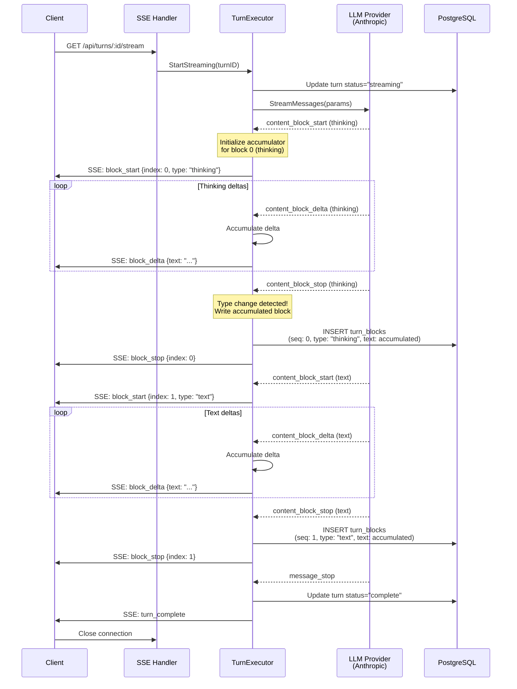
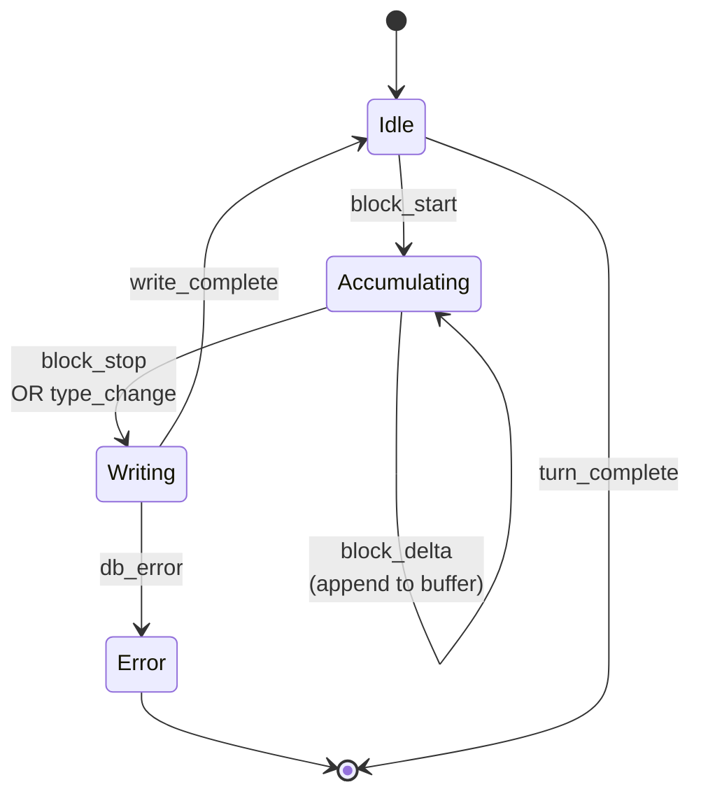
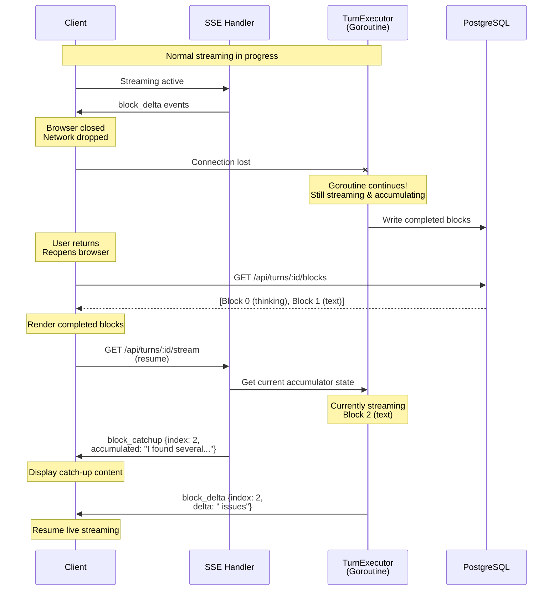
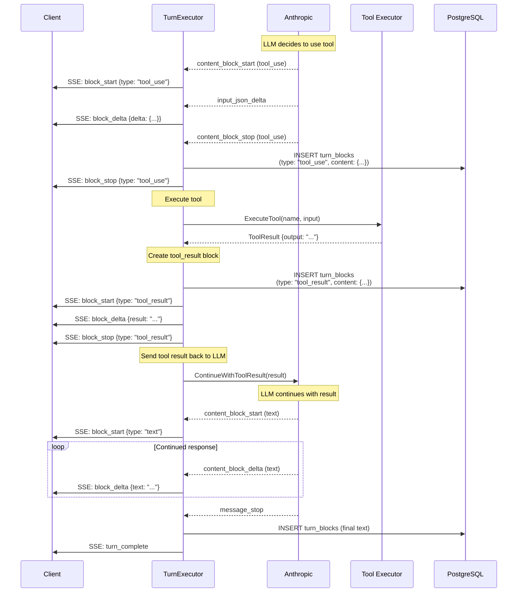

# Streaming Architecture: LLM Response Streaming & Turn Block Accumulation

**Status:** ✅ Implemented and Working
**Last Updated:** 2025-01-13

---

## Table of Contents

1. [Overview](#overview)
2. [Core Concepts](#core-concepts)
3. [Data Models](#data-models)
4. [Normal Streaming Flow](#normal-streaming-flow)
5. [Accumulation & Persistence](#accumulation--persistence)
6. [Client Reconnection](#client-reconnection)
7. [Tool Execution Flow](#tool-execution-flow)
8. [Multi-Provider Abstraction](#multi-provider-abstraction)
9. [API Endpoints](#api-endpoints)
10. [Edge Cases & Error Handling](#edge-cases--error-handling)

---

## Overview

The streaming architecture enables real-time LLM response delivery while maintaining conversation history through a dual-layer system:

- **TurnBlockDelta**: Ephemeral streaming events (SSE) - not persisted
- **TurnBlock**: Accumulated content blocks (database) - persisted for history

This design provides:
- ✅ Real-time streaming to frontend
- ✅ Seamless client reconnection
- ✅ Provider-agnostic abstraction (Anthropic, OpenAI, etc.)
- ✅ Conversation history persistence
- ✅ Tool execution integration

---

## Core Concepts

### TurnBlockDelta (Ephemeral)

**Purpose:** Real-time streaming updates sent via SSE
**Lifetime:** Exists only during active streaming
**Storage:** In-memory only (not persisted to database)

A `TurnBlockDelta` represents an incremental update to a content block:

```go
type TurnBlockDelta struct {
    TurnID     string                 `json:"turn_id"`
    BlockIndex int                    `json:"block_index"`
    BlockType  string                 `json:"block_type"` // "text", "thinking", "tool_use"
    Delta      map[string]interface{} `json:"delta"`      // Provider-specific delta data
}
```

**Example SSE Event:**
```json
{
  "event": "block_delta",
  "data": {
    "turn_id": "uuid-abc-123",
    "block_index": 0,
    "block_type": "text",
    "delta": {
      "text": "Hello"
    }
  }
}
```

### TurnBlock (Persisted)

**Purpose:** Final accumulated content stored in database
**Lifetime:** Permanent (conversation history)
**Storage:** PostgreSQL `turn_blocks` table

A `TurnBlock` represents the complete, accumulated content of a block:

```go
type TurnBlock struct {
    ID          string                 `json:"id" db:"id"`
    TurnID      string                 `json:"turn_id" db:"turn_id"`
    BlockType   string                 `json:"block_type" db:"block_type"`
    Sequence    int                    `json:"sequence" db:"sequence"`
    TextContent *string                `json:"text_content,omitempty" db:"text_content"`
    Content     map[string]interface{} `json:"content,omitempty" db:"content"`
    CreatedAt   time.Time              `json:"created_at" db:"created_at"`
}
```

**Database Record:**
```sql
id          | turn_id     | block_type | sequence | text_content              | content
------------|-------------|------------|----------|---------------------------|----------
uuid-1      | uuid-abc    | thinking   | 0        | "Let me analyze..."       | {"signature": "4k_a"}
uuid-2      | uuid-abc    | text       | 1        | "Based on the code..."    | null
uuid-3      | uuid-abc    | tool_use   | 2        | null                      | {"tool_use_id": "...", ...}
```

### Key Relationship

**Accumulation Rule:** A new `TurnBlock` is written to the database each time the block type changes during streaming.

```
Streaming:     thinking → thinking → thinking → text → text → tool_use
                     ↓                              ↓           ↓
TurnBlocks:    [Block 0: thinking]         [Block 1: text]  [Block 2: tool_use]
               (all deltas accumulated)     (accumulated)    (complete)
```

---

## Data Models

### SSE Event Types

#### 1. turn_start
Signals the beginning of turn streaming.

```json
{
  "event": "turn_start",
  "data": {
    "turn_id": "uuid-abc-123",
    "chat_id": "uuid-chat-456",
    "role": "assistant",
    "model": "claude-haiku-4-5-20251001",
    "timestamp": "2025-11-09T10:30:00Z"
  }
}
```

#### 2. block_start
Signals the start of a new content block.

```json
{
  "event": "block_start",
  "data": {
    "turn_id": "uuid-abc-123",
    "block_index": 0,
    "block_type": "thinking"
  }
}
```

#### 3. block_delta
Incremental content update for the current block.

```json
{
  "event": "block_delta",
  "data": {
    "turn_id": "uuid-abc-123",
    "block_index": 0,
    "block_type": "thinking",
    "delta": {
      "text": "Let me think about"
    }
  }
}
```

#### 4. block_stop
Signals completion of a content block.

```json
{
  "event": "block_stop",
  "data": {
    "turn_id": "uuid-abc-123",
    "block_index": 0,
    "block_type": "thinking"
  }
}
```

#### 5. block_catchup
Sent on reconnection - contains accumulated content missed during disconnect.

```json
{
  "event": "block_catchup",
  "data": {
    "turn_id": "uuid-abc-123",
    "block_index": 2,
    "block_type": "text",
    "accumulated_text": "I found several issues that need"
  }
}
```

#### 6. turn_complete
Signals successful completion of turn.

```json
{
  "event": "turn_complete",
  "data": {
    "turn_id": "uuid-abc-123",
    "status": "complete",
    "stop_reason": "end_turn",
    "input_tokens": 150,
    "output_tokens": 420,
    "total_blocks": 3
  }
}
```

#### 7. turn_error
Signals an error during turn execution.

```json
{
  "event": "turn_error",
  "data": {
    "turn_id": "uuid-abc-123",
    "error": "Rate limit exceeded",
    "code": "rate_limit_error"
  }
}
```

### TurnBlock Database Schema

```sql
CREATE TABLE turn_blocks (
    id UUID PRIMARY KEY DEFAULT uuid_generate_v4(),
    turn_id UUID NOT NULL REFERENCES turns(id) ON DELETE CASCADE,
    block_type TEXT NOT NULL CHECK (block_type IN (
        'text', 'thinking', 'tool_use', 'tool_result',
        'image', 'reference', 'partial_reference'
    )),
    sequence INT NOT NULL,
    text_content TEXT,
    content JSONB,
    created_at TIMESTAMPTZ NOT NULL DEFAULT NOW(),
    UNIQUE(turn_id, sequence)
);
```

---

## Normal Streaming Flow



---

## Accumulation & Persistence

### When TurnBlocks are Written

A `TurnBlock` is written to the database when:

1. **Block type changes** (thinking → text → tool_use)
2. **Turn completes** (write final block)
3. **Turn errors** (write partial block with error marker)

### Example Streaming Sequence

**LLM Streaming Output:**
```
thinking_delta: "Let me"
thinking_delta: " analyze"
thinking_delta: " this"
text_delta: "Based on"
text_delta: " the code"
text_delta: ", I found"
tool_use: {name: "read_file", ...}
```

**TurnBlockDelta Events (SSE):**
```javascript
{event: "block_start", data: {index: 0, type: "thinking"}}
{event: "block_delta", data: {index: 0, type: "thinking", delta: {text: "Let me"}}}
{event: "block_delta", data: {index: 0, type: "thinking", delta: {text: " analyze"}}}
{event: "block_delta", data: {index: 0, type: "thinking", delta: {text: " this"}}}
{event: "block_stop", data: {index: 0, type: "thinking"}}
// ← TurnBlock 0 written to DB: "Let me analyze this"

{event: "block_start", data: {index: 1, type: "text"}}
{event: "block_delta", data: {index: 1, type: "text", delta: {text: "Based on"}}}
{event: "block_delta", data: {index: 1, type: "text", delta: {text: " the code"}}}
{event: "block_delta", data: {index: 1, type: "text", delta: {text: ", I found"}}}
{event: "block_stop", data: {index: 1, type: "text"}}
// ← TurnBlock 1 written to DB: "Based on the code, I found"

{event: "block_start", data: {index: 2, type: "tool_use"}}
{event: "block_delta", data: {index: 2, type: "tool_use", delta: {...}}}
{event: "block_stop", data: {index: 2, type: "tool_use"}}
// ← TurnBlock 2 written to DB: tool_use block

{event: "turn_complete", data: {...}}
```

**Database After Streaming:**
```sql
SELECT * FROM turn_blocks WHERE turn_id = 'uuid-abc-123' ORDER BY sequence;

sequence | block_type | text_content
---------|------------|----------------------------------
0        | thinking   | "Let me analyze this"
1        | text       | "Based on the code, I found"
2        | tool_use   | null (content in JSONB)
```

### Accumulator State Machine



**Accumulator Logic (Pseudocode):**
```go
type BlockAccumulator struct {
    TurnID       string
    BlockIndex   int
    BlockType    string
    TextBuffer   strings.Builder
    ContentData  map[string]interface{}
}

func (a *BlockAccumulator) HandleDelta(delta TurnBlockDelta) {
    if delta.BlockType != a.BlockType {
        // Type change! Write current block
        a.WriteToDatabase()
        a.Reset(delta.BlockIndex, delta.BlockType)
    }

    // Accumulate delta
    if text, ok := delta.Delta["text"].(string); ok {
        a.TextBuffer.WriteString(text)
    }
}

func (a *BlockAccumulator) WriteToDatabase() {
    block := TurnBlock{
        TurnID:      a.TurnID,
        BlockType:   a.BlockType,
        Sequence:    a.BlockIndex,
        TextContent: a.TextBuffer.String(),
        Content:     a.ContentData,
    }

    repo.CreateTurnBlocks(ctx, []TurnBlock{block})
}
```

---

## Client Reconnection

### Scenario: Client Disconnects Mid-Stream



### Reconnection API Flow

**Step 1: Fetch Completed Blocks**
```http
GET /api/turns/abc-123/blocks

Response:
{
  "blocks": [
    {
      "id": "uuid-1",
      "sequence": 0,
      "block_type": "thinking",
      "text_content": "Let me analyze this code...",
      "created_at": "2025-11-09T10:30:01Z"
    },
    {
      "id": "uuid-2",
      "sequence": 1,
      "block_type": "text",
      "text_content": "Based on the analysis,",
      "created_at": "2025-11-09T10:30:05Z"
    }
  ],
  "turn_status": "streaming",
  "current_block_index": 2
}
```

**Step 2: Resume SSE Stream**
```http
GET /api/turns/abc-123/stream

First SSE Event (catchup):
event: block_catchup
data: {"turn_id": "abc-123", "block_index": 2, "block_type": "text", "accumulated_text": "I found several issues"}

Subsequent Events (live):
event: block_delta
data: {"turn_id": "abc-123", "block_index": 2, "block_type": "text", "delta": {"text": " that need"}}

event: block_delta
data: {"turn_id": "abc-123", "block_index": 2, "block_type": "text", "delta": {"text": " attention"}}
```

### Reconnection State Management

**TurnExecutor Tracking:**
```go
type TurnExecutorState struct {
    TurnID            string
    Status            string // "streaming", "complete", "error"
    CurrentAccumulator *BlockAccumulator
    CompletedBlocks   []TurnBlock
    SSEClients        []*SSEClient
}

func (s *TurnExecutorState) HandleReconnection(client *SSEClient) {
    // 1. Send catchup event if currently accumulating
    if s.CurrentAccumulator != nil {
        catchupEvent := TurnBlockDelta{
            TurnID:     s.TurnID,
            BlockIndex: s.CurrentAccumulator.BlockIndex,
            BlockType:  s.CurrentAccumulator.BlockType,
            Delta: map[string]interface{}{
                "accumulated_text": s.CurrentAccumulator.TextBuffer.String(),
            },
        }
        client.Send("block_catchup", catchupEvent)
    }

    // 2. Register client for future deltas
    s.SSEClients = append(s.SSEClients, client)
}
```

---

## Tool Execution Flow

### Complete Tool Call Cycle



### TurnBlock Sequence with Tools

**Example turn with tool execution:**

```sql
-- Turn ID: abc-123
-- Assistant requests tool, tool executes, assistant continues

sequence | block_type  | text_content                    | content (JSONB)
---------|-------------|----------------------------------|----------------------------------
0        | thinking    | "I need to check the file..."   | {"signature": "4k_a"}
1        | text        | "Let me read the file."         | null
2        | tool_use    | null                            | {"tool_use_id": "toolu_1", "tool_name": "read_file", "input": {"path": "..."}}
3        | tool_result | null                            | {"tool_use_id": "toolu_1", "content": "file contents..."}
4        | thinking    | "Now I can see that..."         | {"signature": "4k_a"}
5        | text        | "Based on the file, I found..." | null
```

### Multiple Tool Calls

**LLM can request multiple tools in one response:**

```sql
sequence | block_type  | text_content               | content (JSONB)
---------|-------------|----------------------------|----------------------------------
0        | text        | "Let me check both files." | null
1        | tool_use    | null                       | {"tool_name": "read_file", "input": {"path": "a.txt"}}
2        | tool_use    | null                       | {"tool_name": "read_file", "input": {"path": "b.txt"}}
3        | tool_result | null                       | {"tool_use_id": "toolu_1", "content": "a.txt contents"}
4        | tool_result | null                       | {"tool_use_id": "toolu_2", "content": "b.txt contents"}
5        | text        | "Comparing both files..."  | null
```

---

## Multi-Provider Abstraction

### Provider Delta Transformation

Different LLM providers have different streaming formats. `TurnBlockDelta` abstracts these differences.

#### Anthropic → TurnBlockDelta

```go
// Anthropic's streaming event
type ContentBlockDeltaEvent struct {
    Index int
    Delta ContentBlockDelta // text_delta, input_json_delta, thinking_delta
}

// Transform to domain model
func TransformAnthropicDelta(event ContentBlockDeltaEvent) TurnBlockDelta {
    delta := TurnBlockDelta{
        BlockIndex: event.Index,
    }

    switch d := event.Delta.AsAny().(type) {
    case anthropic.TextDelta:
        delta.BlockType = "text"
        delta.Delta = map[string]interface{}{
            "text": d.Text,
        }

    case anthropic.ThinkingDelta:
        delta.BlockType = "thinking"
        delta.Delta = map[string]interface{}{
            "text": d.Thinking,
        }

    case anthropic.InputJSONDelta:
        delta.BlockType = "tool_use"
        delta.Delta = map[string]interface{}{
            "partial_json": d.PartialJSON,
        }
    }

    return delta
}
```

#### OpenAI → TurnBlockDelta

```go
// OpenAI's streaming event
type ChatCompletionChunk struct {
    Delta struct {
        Content string // text content
        ToolCalls []struct {
            Function struct {
                Arguments string // partial JSON
            }
        }
    }
}

// Transform to domain model
func TransformOpenAIDelta(chunk ChatCompletionChunk) TurnBlockDelta {
    delta := TurnBlockDelta{}

    if chunk.Delta.Content != "" {
        delta.BlockType = "text"
        delta.Delta = map[string]interface{}{
            "text": chunk.Delta.Content,
        }
    }

    if len(chunk.Delta.ToolCalls) > 0 {
        delta.BlockType = "tool_use"
        delta.Delta = map[string]interface{}{
            "partial_json": chunk.Delta.ToolCalls[0].Function.Arguments,
        }
    }

    return delta
}
```

### Provider Interface

```go
type LLMProvider interface {
    // StreamResponse initiates streaming and returns delta channel
    StreamResponse(
        ctx context.Context,
        messages []Message,
        params map[string]interface{},
    ) (<-chan TurnBlockDelta, error)

    // Name returns provider identifier
    Name() string
}

// Usage in TurnExecutor
func (e *TurnExecutor) StreamTurn(turnID string) error {
    provider := e.getProvider() // anthropic, openai, etc.

    deltaChan, err := provider.StreamResponse(ctx, messages, params)
    if err != nil {
        return err
    }

    // Provider-agnostic accumulation
    for delta := range deltaChan {
        e.accumulator.HandleDelta(delta)
        e.broadcastToSSEClients(delta)
    }
}
```

---

## API Endpoints

### 1. Create Turn & Start Streaming

**Endpoint:** `POST /api/chats/:chatId/turns`

**Request:**
```json
{
  "prev_turn_id": "uuid-prev-turn",
  "turn_blocks": [
    {
      "block_type": "text",
      "text_content": "Hello, please analyze this code"
    }
  ]
}
```

**Response:**
```json
{
  "user_turn": {
    "id": "uuid-user-turn",
    "role": "user",
    "status": "complete",
    "turn_blocks": [...]
  },
  "assistant_turn": {
    "id": "uuid-assistant-turn",
    "role": "assistant",
    "status": "streaming"
  },
  "stream_url": "/api/turns/uuid-assistant-turn/stream"
}
```

### 2. Stream Turn Events (SSE)

**Endpoint:** `GET /api/turns/:turnId/stream`

**Headers:**
```
Content-Type: text/event-stream
Cache-Control: no-cache
Connection: keep-alive
```

**Response:** (Server-Sent Events stream)
```
event: turn_start
data: {"turn_id": "...", "model": "..."}

event: block_start
data: {"block_index": 0, "block_type": "thinking"}

event: block_delta
data: {"block_index": 0, "delta": {"text": "Let me"}}

event: block_delta
data: {"block_index": 0, "delta": {"text": " think"}}

event: block_stop
data: {"block_index": 0}

event: turn_complete
data: {"status": "complete", "output_tokens": 420}
```

### 3. Get Completed Turn Blocks

**Endpoint:** `GET /api/turns/:turnId/blocks`

**Response:**
```json
{
  "turn_id": "uuid-assistant-turn",
  "status": "streaming",
  "current_block_index": 2,
  "blocks": [
    {
      "id": "uuid-block-1",
      "sequence": 0,
      "block_type": "thinking",
      "text_content": "Let me think about this...",
      "created_at": "2025-11-09T10:30:01Z"
    },
    {
      "id": "uuid-block-2",
      "sequence": 1,
      "block_type": "text",
      "text_content": "Based on my analysis,",
      "created_at": "2025-11-09T10:30:05Z"
    }
  ]
}
```

### 4. Get Turn with Blocks

**Endpoint:** `GET /api/turns/:turnId`

**Response:**
```json
{
  "id": "uuid-assistant-turn",
  "chat_id": "uuid-chat",
  "role": "assistant",
  "status": "complete",
  "model": "claude-haiku-4-5-20251001",
  "input_tokens": 150,
  "output_tokens": 420,
  "stop_reason": "end_turn",
  "created_at": "2025-11-09T10:30:00Z",
  "completed_at": "2025-11-09T10:30:15Z",
  "turn_blocks": [
    {
      "id": "uuid-block-1",
      "sequence": 0,
      "block_type": "thinking",
      "text_content": "Let me think about this problem...",
      "created_at": "2025-11-09T10:30:01Z"
    },
    {
      "id": "uuid-block-2",
      "sequence": 1,
      "block_type": "text",
      "text_content": "Based on my analysis, here's what I found...",
      "created_at": "2025-11-09T10:30:05Z"
    }
  ]
}
```

### 5. Interrupt Turn

**Endpoint:** `POST /api/turns/:turnId/interrupt`

**Response:**
```json
{
  "turn_id": "uuid-assistant-turn",
  "status": "cancelled",
  "blocks_completed": 2,
  "message": "Turn interrupted by user"
}
```

---

## Edge Cases & Error Handling

### 1. Client Disconnects During Streaming

**Behavior:**
- ✅ Backend goroutine continues streaming & accumulating
- ✅ Completed blocks written to database as normal
- ✅ Current block remains in memory
- ✅ On reconnection, client receives catchup + resumes

**Implementation:**
```go
func (e *TurnExecutor) BroadcastDelta(delta TurnBlockDelta) {
    e.mu.Lock()
    defer e.mu.Unlock()

    // Remove disconnected clients
    activeClients := make([]*SSEClient, 0, len(e.sseClients))
    for _, client := range e.sseClients {
        if client.IsConnected() {
            client.Send("block_delta", delta)
            activeClients = append(activeClients, client)
        }
    }
    e.sseClients = activeClients
}
```

### 2. Multiple Clients Streaming Same Turn

**Scenario:** User opens same conversation in multiple tabs.

**Behavior:**
- ✅ Each tab maintains separate SSE connection
- ✅ All tabs receive same delta events
- ✅ Database writes happen once (by TurnExecutor)
- ✅ All tabs stay synchronized

**Implementation:**
```go
type TurnExecutorRegistry struct {
    executors map[string]*TurnExecutor
    mu        sync.RWMutex
}

func (r *TurnExecutorRegistry) GetOrCreateExecutor(turnID string) *TurnExecutor {
    r.mu.Lock()
    defer r.mu.Unlock()

    if executor, exists := r.executors[turnID]; exists {
        return executor // Reuse existing executor
    }

    executor := NewTurnExecutor(turnID)
    r.executors[turnID] = executor
    return executor
}
```

### 3. Database Write Failure

**Scenario:** TurnBlock write fails due to database error.

**Behavior:**
- ❌ Streaming pauses
- ✅ Retry write once (100ms delay)
- ✅ If retry fails, send `turn_error` event to all clients
- ✅ Update turn status to "error"
- ✅ Preserve accumulated content in memory for recovery

**Implementation:**
```go
func (e *TurnExecutor) WriteBlock(block TurnBlock) error {
    err := e.repo.CreateTurnBlocks(ctx, []TurnBlock{block})

    if err != nil {
        // Retry once
        time.Sleep(100 * time.Millisecond)
        err = e.repo.CreateTurnBlocks(ctx, []TurnBlock{block})

        if err != nil {
            // Send error to clients
            e.BroadcastError("database_error", err.Error())
            e.UpdateTurnStatus("error")
            return fmt.Errorf("failed to write block: %w", err)
        }
    }

    return nil
}
```

### 4. LLM Provider Error

**Scenario:** Anthropic API returns error mid-stream.

**Behavior:**
- ✅ Write accumulated block (if any)
- ✅ Send `turn_error` event with error details
- ✅ Update turn status to "error"
- ✅ Store error message in turn record

**SSE Event:**
```json
{
  "event": "turn_error",
  "data": {
    "turn_id": "uuid-abc",
    "error": "Rate limit exceeded",
    "code": "rate_limit_error",
    "blocks_completed": 2
  }
}
```

### 5. User Interrupts Turn

**Scenario:** User clicks "Stop" button during streaming.

**Behavior:**
- ✅ Cancel context to stop LLM provider stream
- ✅ Write accumulated block (partial)
- ✅ Update turn status to "cancelled"
- ✅ Send `turn_cancelled` event to all clients

**API Call:**
```http
POST /api/turns/abc-123/interrupt

Response:
{
  "turn_id": "abc-123",
  "status": "cancelled",
  "blocks_completed": 2,
  "partial_block": {
    "sequence": 2,
    "block_type": "text",
    "text_content": "I was analyzing the code and found"
  }
}
```

### 6. Orphaned Streaming Goroutines

**Scenario:** All clients disconnect but goroutine keeps streaming.

**Behavior:**
- ✅ Continue streaming until completion
- ✅ Write all blocks to database
- ✅ Clean up goroutine after turn completes
- ✅ Timeout after 5 minutes if no completion

**Implementation:**
```go
func (e *TurnExecutor) StreamWithTimeout() error {
    ctx, cancel := context.WithTimeout(context.Background(), 5*time.Minute)
    defer cancel()

    errChan := make(chan error, 1)

    go func() {
        errChan <- e.Stream(ctx)
    }()

    select {
    case err := <-errChan:
        return err
    case <-ctx.Done():
        e.UpdateTurnStatus("error")
        return fmt.Errorf("streaming timeout")
    }
}
```

### 7. Turn Already Complete

**Scenario:** Client connects to SSE for already-completed turn.

**Behavior:**
- ✅ Immediately send `turn_complete` event
- ✅ Include summary metadata
- ✅ Close SSE connection
- ✅ Client should fetch blocks via REST API

**SSE Event:**
```json
{
  "event": "turn_complete",
  "data": {
    "turn_id": "abc-123",
    "status": "complete",
    "total_blocks": 5,
    "output_tokens": 850,
    "message": "Turn already completed. Fetch blocks via GET /api/turns/:id/blocks"
  }
}
```

---

## Summary

### Key Takeaways

1. **Dual-Layer Architecture**
   - TurnBlockDelta: Ephemeral streaming (SSE)
   - TurnBlock: Persisted accumulation (database)

2. **Accumulation on Type Change**
   - New block written when `block_type` changes
   - Enables efficient storage & querying

3. **Seamless Reconnection**
   - Fetch completed blocks from DB
   - Resume SSE with catchup event
   - No duplicate data, no missed content

4. **Provider Agnostic**
   - Transform provider deltas to domain model
   - Support multiple LLM providers
   - Consistent frontend experience

5. **Tool Execution Integration**
   - Tool calls are TurnBlocks (sequence preserved)
   - Tool results also persisted
   - Full conversation history maintained

---

## Race Condition Fixes

**Status:** ✅ Fixed (2025-01-13)

Three critical race conditions were discovered and fixed:

1. **Event ID jumps** - Removed manual event ID calculation, rely on library's DEBUG mode
2. **Buffer clear race** - Added catchup coordination mutex for atomic persist-and-clear
3. **Catchup content** - Send full block content instead of markers (bandwidth efficient)

**User verification:** "IT WORKS CATCHUP WORKS TOO!"

**Details:** See [race-conditions.md](../streaming/race-conditions.md)

---

**Implementation Status:**
- ~~Implement `TurnBlockDelta` domain model~~ ✅ Done
- ~~Create SSE handler infrastructure~~ ✅ Done
- ~~Add streaming support to TurnExecutor~~ ✅ Done
- ~~Implement reconnection logic~~ ✅ Done
- ~~Add provider transformation layers~~ ✅ Done
- ~~Fix race conditions~~ ✅ Done
