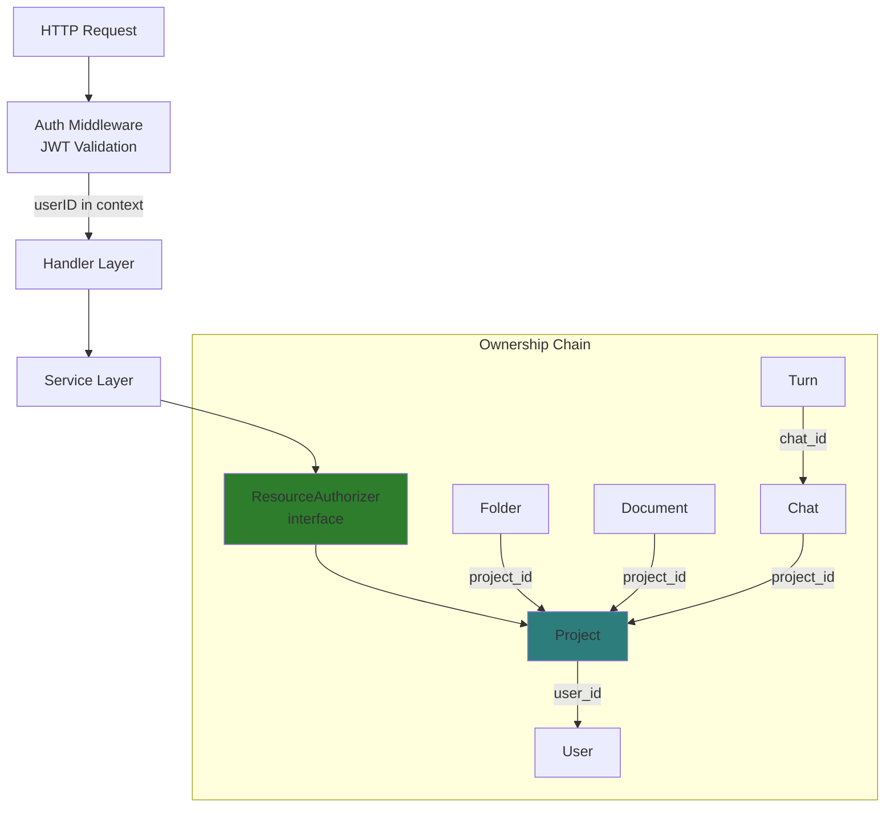

# Authorization Architecture

**Resource-level authorization for all API endpoints.**

## Overview



## ResourceAuthorizer Interface

**File:** `internal/domain/services/authorizer.go`

```go
type ResourceAuthorizer interface {
    CanAccessProject(ctx context.Context, userID, projectID string) error
    CanAccessFolder(ctx context.Context, userID, folderID string) error
    CanAccessDocument(ctx context.Context, userID, documentID string) error
    CanAccessChat(ctx context.Context, userID, chatID string) error
    CanAccessTurn(ctx context.Context, userID, turnID string) error
}
```

**Return Values:**
- `nil` - Access granted
- `domain.ErrUnauthorized` - User doesn't own the resource
- `domain.ErrNotFound` - Resource doesn't exist

---

## OwnerBasedAuthorizer Implementation

**File:** `internal/service/auth/owner_based_authorizer.go`

Simple ownership-based authorization: user owns project → owns all resources within.

### Ownership Chain

| Resource | Lookup | Chain |
|----------|--------|-------|
| Project | `projectRepo.GetByID(projectID)` | `project.UserID == userID` |
| Folder | `folderRepo.GetByIDOnly(folderID)` | `folder.ProjectID` → Project → User |
| Document | `docRepo.GetByIDOnly(documentID)` | `document.ProjectID` → Project → User |
| Chat | `chatRepo.GetChatByIDOnly(chatID)` | `chat.ProjectID` → Project → User |
| Turn | `turnRepo.GetTurnByIDOnly(turnID)` | `turn.ChatID` → Chat → Project → User |

### Dependencies

```go
type OwnerBasedAuthorizer struct {
    projectRepo docsysRepo.ProjectRepository
    folderRepo  docsysRepo.FolderRepository
    docRepo     docsysRepo.DocumentRepository
    chatRepo    llmRepo.ChatRepository
    turnRepo    llmRepo.TurnRepository
}
```

---

## Usage Pattern

### Service Layer (Recommended)

Authorization checks happen at the service layer, not handlers:

```go
func (s *documentService) GetDocument(ctx context.Context, userID, documentID string) (*Document, error) {
    // Auth check first
    if err := s.authorizer.CanAccessDocument(ctx, userID, documentID); err != nil {
        return nil, err
    }

    // Then fetch (uses GetByIDOnly - no projectID needed)
    return s.docRepo.GetByIDOnly(ctx, documentID)
}
```

**Benefits:**
- Consistent authorization across all entry points
- Services are self-contained (handlers don't need to know auth logic)
- Testable (mock authorizer in tests)

### Handler Layer (Exception)

Some handlers need direct auth checks (e.g., SSE streams):

```go
func (h *ChatHandler) StreamTurn(w http.ResponseWriter, r *http.Request) {
    turnID, ok := PathParam(w, r, "id", "Turn ID")
    if !ok {
        return
    }
    userID := httputil.GetUserID(r)

    // Direct auth check for streaming endpoint
    if err := h.authorizer.CanAccessTurn(r.Context(), userID, turnID); err != nil {
        handleError(w, err)
        return
    }
    // ... stream handling
}
```

---

## Protected Endpoints

### Full Coverage

All modifying and read operations are protected:

| Endpoint | Resource | Method |
|----------|----------|--------|
| `GET /api/projects/{id}` | Project | `CanAccessProject` |
| `GET /api/folders/{id}` | Folder | `CanAccessFolder` |
| `PATCH /api/folders/{id}` | Folder | `CanAccessFolder` |
| `DELETE /api/folders/{id}` | Folder | `CanAccessFolder` |
| `GET /api/folders/{id}/children` | Folder | `CanAccessFolder` |
| `GET /api/documents/{id}` | Document | `CanAccessDocument` |
| `PATCH /api/documents/{id}` | Document | `CanAccessDocument` |
| `DELETE /api/documents/{id}` | Document | `CanAccessDocument` |
| `GET /api/documents/search` | Project | `CanAccessProject` |
| `GET /api/projects/{id}/tree` | Project | `CanAccessProject` |
| `POST /api/import` | Project | `CanAccessProject` |
| `POST /api/import/replace` | Project | `CanAccessProject` |
| `GET /api/chats/{id}` | Chat | `CanAccessChat` |
| `PATCH /api/chats/{id}` | Chat | `CanAccessChat` |
| `DELETE /api/chats/{id}` | Chat | `CanAccessChat` |
| `GET /api/chats/{id}/turns` | Chat | `CanAccessChat` |
| `POST /api/chats/{id}/turns` | Chat | `CanAccessChat` |
| `GET /api/turns/{id}/stream` | Turn | `CanAccessTurn` |
| `GET /api/turns/{id}/path` | Turn | `CanAccessTurn` |
| `GET /api/turns/{id}/siblings` | Turn | `CanAccessTurn` |
| `POST /api/turns/{id}/interrupt` | Turn | `CanAccessTurn` |

---

## Wiring

**File:** `cmd/server/main.go`

```go
// Create authorizer
authorizer := serviceAuth.NewOwnerBasedAuthorizer(
    projectRepo, folderRepo, docRepo, chatRepo, turnRepo,
)

// Inject into services
docService := serviceDocsys.NewDocumentService(..., authorizer, logger)
folderService := serviceDocsys.NewFolderService(..., authorizer, logger)
treeService := serviceDocsys.NewTreeService(..., authorizer, logger)
importHandler := handler.NewImportHandler(importService, authorizer, logger)

// LLM services via SetupServices
llmServices, _, _ := serviceLLM.SetupServices(..., authorizer, logger)
```

---

## Future Extensibility

### RBAC (Role-Based)

```go
type RBACAuthorizer struct {
    // Same interface, different implementation
}

func (a *RBACAuthorizer) CanAccessDocument(ctx, userID, documentID string) error {
    // Check user's role on document/project
    // Check permission level (read/write/admin)
    // Return nil if allowed
}
```

### Team Permissions

When team support is added:
1. Add `team_members` table
2. Extend authorizer to check team membership
3. Same interface, enhanced implementation

---

## Related

- [JWT Validation](../auth/jwt-validation.md) - Authentication layer
- [Service Layer Architecture](../architecture/service-layer.md) - Service organization
- [Domain Errors](../errors.md) - Error types (ErrUnauthorized, ErrNotFound)
