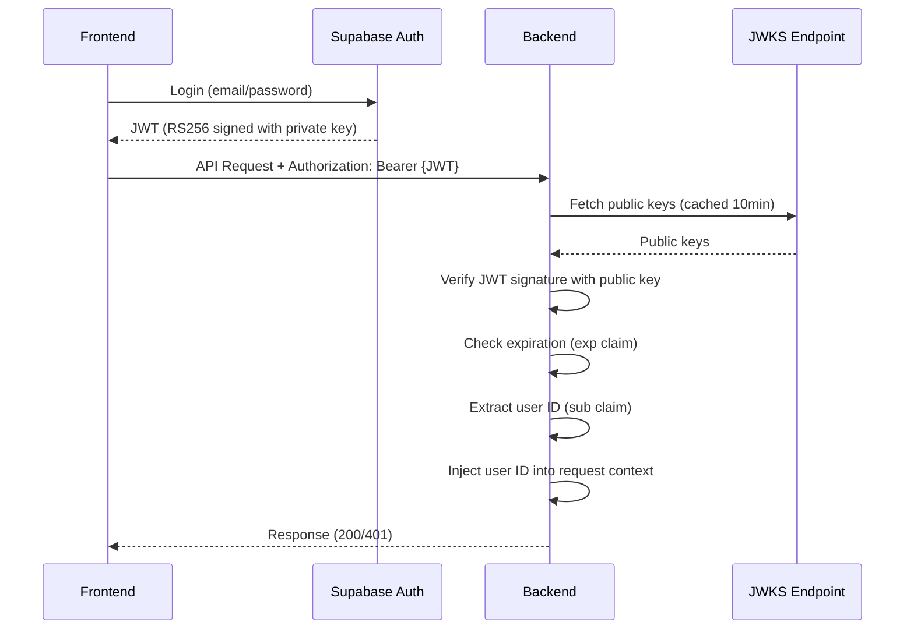
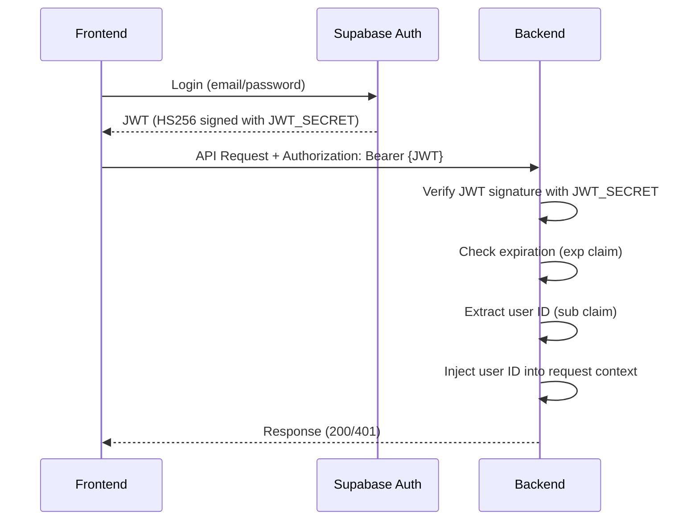
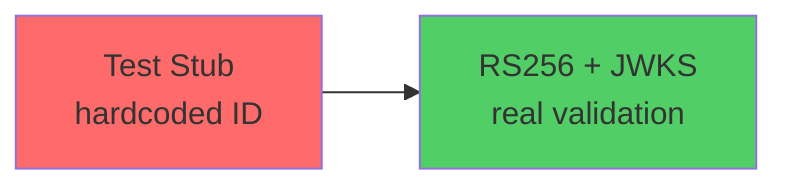

# Supabase JWT Authentication Implementation

**Purpose:** Replace test auth stubs with production-ready Supabase JWT validation.

**Context:** Backend currently uses hardcoded `TEST_USER_ID` (see `backend/internal/middleware/auth.go:9-20`). This guide covers migrating to real JWT validation while maintaining the existing middleware architecture.

---

## Decision: RS256 vs HS256

Supabase supports two JWT signing methods. Choose based on project creation date:

| Scenario | Method | Migrate By |
|----------|--------|-----------|
| Project created after May 1, 2025 | **RS256 + JWKS** | N/A |
| Project created before May 1, 2025 | HS256 + JWT_SECRET | Nov 2025 |
| Production-bound in 2025+ | **RS256 + JWKS** | N/A |
| Quick prototype/MVP | HS256 + JWT_SECRET | Nov 2025 |

**Recommendation:** Use RS256 + JWKS for new projects (more secure, future-proof, automatic key rotation).

**Check your project:**
- Supabase Dashboard → Settings → API
- If "JWKS Endpoint" exists → Use RS256
- If only "JWT Secret" exists → Use HS256 (then migrate)

---

## Architecture Flow

### RS256 + JWKS (Recommended)



**Key differences vs HS256:**
- ✅ No shared secret (more secure)
- ✅ Backend fetches public keys (can't forge tokens)
- ✅ Automatic key rotation support
- ⚡ Faster (no network call to Supabase for validation)

### HS256 + JWT_SECRET (Legacy)



**Key differences:**
- ⚠️ Shared secret (less secure)
- ⏰ Being phased out (migrate by Nov 2025)

---

## Supabase-Specific Patterns

### JWT Claims Structure

Supabase Auth includes custom claims beyond standard JWT fields:

```go
package domain

import "github.com/golang-jwt/jwt/v5"

// SupabaseClaims represents JWT claims from Supabase Auth
// Reference: https://supabase.com/docs/guides/auth/jwt-fields
type SupabaseClaims struct {
	jwt.RegisteredClaims                      // iss, sub, aud, exp, iat, nbf
	Email                string               `json:"email"`
	Phone                string               `json:"phone"`
	Role                 string               `json:"role"`        // "authenticated", "anon"
	AAL                  string               `json:"aal"`         // "aal1", "aal2"
	SessionID            string               `json:"session_id"`
	IsAnonymous          bool                 `json:"is_anonymous"`
	AppMetadata          map[string]interface{} `json:"app_metadata,omitempty"`
	UserMetadata         map[string]interface{} `json:"user_metadata,omitempty"`
}

// GetUserID returns the user ID from the sub claim
func (c *SupabaseClaims) GetUserID() string {
	return c.Subject
}
```

**Why this matters:** Supabase's claims structure differs from generic OAuth providers. Using this struct ensures type-safe access to Supabase-specific fields.

### JWKS Endpoint Construction

Supabase's JWKS endpoint follows a predictable pattern:

```go
// Auto-construct JWKS URL from Supabase URL
supabaseURL := "https://your-project.supabase.co"
jwksURL := supabaseURL + "/auth/v1/.well-known/jwks.json"
```

This allows DRY configuration - set `SUPABASE_URL` once, derive JWKS URL automatically.

---

## Implementation Checklist

### RS256 + JWKS Approach

**1. Dependencies**
```bash
cd backend
go get github.com/golang-jwt/jwt/v5
go get github.com/MicahParks/keyfunc/v3
```

**2. Configuration** (`backend/internal/config/config.go`)
- [ ] Add `SupabaseJWKSURL string` to Config struct
- [ ] Auto-construct from `SUPABASE_URL + "/auth/v1/.well-known/jwks.json"`
- [ ] Allow override via `SUPABASE_JWKS_URL` env var

**3. JWT Claims** (`backend/internal/domain/auth.go` - new file)
- [ ] Create `SupabaseClaims` struct (see above)
- [ ] Add `GetUserID()` helper method

**4. JWT Verifier** (`backend/internal/auth/jwt_verifier.go` - new package)
- [ ] Create `JWTVerifier` struct with `keyfunc.Keyfunc` field
- [ ] Implement `NewJWTVerifier(jwksURL)` with 10min refresh interval
- [ ] Implement `VerifyToken(tokenString) (*SupabaseClaims, error)`
- [ ] Implement `Close()` for cleanup
- [ ] See: https://github.com/MicahParks/keyfunc for JWKS patterns
- [ ] See: https://pkg.go.dev/github.com/golang-jwt/jwt/v5 for JWT parsing

**5. Auth Middleware** (`backend/internal/middleware/auth.go`)
- [ ] Change signature: `AuthMiddleware(jwtVerifier *auth.JWTVerifier)`
- [ ] Extract token from `Authorization: Bearer <token>` header
- [ ] Call `jwtVerifier.VerifyToken(tokenString)`
- [ ] Extract user ID: `claims.GetUserID()`
- [ ] Inject into context: `httputil.WithUserID(r, userID)`
- [ ] Return 401 for missing/invalid tokens

**6. Server Initialization** (`backend/cmd/server/main.go`)
- [ ] Import `meridian/internal/auth`
- [ ] Create `jwtVerifier, err := auth.NewJWTVerifier(cfg.SupabaseJWKSURL)`
- [ ] Pass to middleware: `middleware.AuthMiddleware(jwtVerifier)`
- [ ] Add `defer jwtVerifier.Close()` for cleanup

**7. Environment Variables** (`backend/.env`)
```bash
SUPABASE_URL=https://your-project.supabase.co
# SUPABASE_JWKS_URL auto-constructed (override if needed)
```

### HS256 + JWT_SECRET Approach (Legacy)

Same as above, except:

**1. Dependencies**
```bash
go get github.com/golang-jwt/jwt/v5  # Only need this
```

**2. Configuration**
- [ ] Add `SupabaseJWTSecret string` to Config
- [ ] Load from `SUPABASE_JWT_SECRET` env var

**3. Auth Middleware**
- [ ] Change signature: `AuthMiddleware(jwtSecret string)`
- [ ] Parse with: `jwt.ParseWithClaims(token, &SupabaseClaims{}, func(token) { return []byte(jwtSecret), nil })`
- [ ] Validate signing method is HMAC (prevent algorithm confusion attack)

**4. Environment Variables**
```bash
# Get from: Supabase Dashboard → Settings → API → JWT Secret
SUPABASE_JWT_SECRET=your-jwt-secret-here
```

---

## Testing Strategy

### Test Cases

| Test Case | Expected Result | How to Test |
|-----------|----------------|-------------|
| No Authorization header | 401 Unauthorized | `curl http://localhost:8080/api/documents` |
| Wrong header format | 401 Unauthorized | `curl -H "Authorization: token123" ...` |
| Invalid signature | 401 Unauthorized | Use JWT from different Supabase project |
| Expired token | 401 Unauthorized | Use token > 1 hour old |
| Valid token | User ID extracted, 200 OK | Login via frontend, get token, test |
| Multiple users | Correct user ID per token | Test with 2+ Supabase users |

### Manual Testing Flow

1. **Get a real token:**
   - Login via frontend (uses Supabase Auth)
   - Extract JWT from localStorage or network tab
   - Or use `supabase-js` client to generate token

2. **Test with curl:**
   ```bash
   export TOKEN="eyJhbGci..."
   curl -v -H "Authorization: Bearer $TOKEN" http://localhost:8080/api/documents
   ```

3. **Verify logs:**
   - Check backend logs for extracted user ID
   - Confirm it matches Supabase Auth user

### Unit Testing

Create `backend/internal/middleware/auth_test.go`:
- Test missing Authorization header → 401
- Test invalid format (no "Bearer") → 401
- Test expired token → 401
- Test valid token → user ID in context

For valid token tests, use test JWT from https://jwt.io or mock JWKS endpoint.

---

## Security Considerations

### Critical Checks

| Vulnerability | Mitigation | Where |
|---------------|-----------|-------|
| Algorithm confusion attack | Validate signing method (HMAC or RSA) | Middleware parsing |
| Token replay | Use HTTPS + short expiration (1hr default) | Infrastructure |
| Secret leakage | Never commit secrets, use env vars | `.gitignore` + Railway secrets |
| Missing validation | Always check `token.Valid` after parsing | Middleware |
| XSS token theft | Frontend: httpOnly cookies (if possible) | Frontend config |

### Best Practices

1. **Always use HTTPS in production** - JWTs in HTTP headers are vulnerable to interception
2. **Validate signing algorithm explicitly** - Prevents attacker from changing algorithm
3. **Keep tokens short-lived** - Supabase default is 1 hour (configurable)
4. **Never log full tokens** - Log user ID only, not token content
5. **Generic error messages** - Don't reveal token validation details in 401 responses

---

## Migration Path

### Current State → RS256



**Deployment checklist:**
- [ ] Add `SUPABASE_JWKS_URL` to production env vars (Railway)
- [ ] Verify JWKS endpoint accessible: `curl https://your-project.supabase.co/auth/v1/.well-known/jwks.json`
- [ ] Deploy backend with new auth code
- [ ] Ensure frontend sends `Authorization: Bearer <token>` header
- [ ] Test login flow end-to-end
- [ ] Monitor logs for auth failures
- [ ] Remove test user middleware code after validation

### Rollback Plan

If issues occur:
```bash
git revert <auth-commit>
# Or temporarily: USE_REAL_AUTH=false (if you add feature flag)
```

---

## Reference Links

### Supabase Documentation
- **JWT Overview:** https://supabase.com/docs/guides/auth/jwts
- **JWT Claims:** https://supabase.com/docs/guides/auth/jwt-fields
- **Signing Keys (RS256):** https://supabase.com/docs/guides/auth/signing-keys
- **Server-Side Auth:** https://supabase.com/docs/guides/auth/server-side

### Go Libraries
- **golang-jwt/jwt (v5):** https://pkg.go.dev/github.com/golang-jwt/jwt/v5
- **MicahParks/keyfunc (JWKS):** https://github.com/MicahParks/keyfunc

### Security
- **OWASP JWT Security:** https://cheatsheetseries.owasp.org/cheatsheets/JSON_Web_Token_for_Java_Cheat_Sheet.html
- **Algorithm Confusion Attack:** https://auth0.com/blog/critical-vulnerabilities-in-json-web-token-libraries/

### Supabase 2025 Changes
- **API Keys Migration:** https://github.com/orgs/supabase/discussions/29260
- **RS256 Announcement:** https://dev.to/kvetoslavnovak/supabase-auth-itroduces-asymmetric-jwts-4i4e

---

## Troubleshooting

### Common Errors

| Error | Cause | Fix |
|-------|-------|-----|
| `failed to create JWKS: connection refused` | JWKS URL unreachable | Check `SUPABASE_URL`, verify network access |
| `unexpected signing method: HS256` | Project uses HS256, code expects RS256 | Use HS256 implementation instead |
| `token is expired` | Token older than 1 hour | Frontend: implement token refresh |
| `sub claim not found` | Token not from Supabase | Verify token source, check Auth integration |

### Debug Commands

```bash
# Verify JWKS endpoint
curl https://your-project.supabase.co/auth/v1/.well-known/jwks.json

# Decode token (install: https://github.com/mike-engel/jwt-cli)
jwt decode <token>

# Or use jwt.io in browser
```

---

## Additional Resources

For comprehensive reference with full implementation code, see: `REFERENCE-supabase-jwt-full.md`
