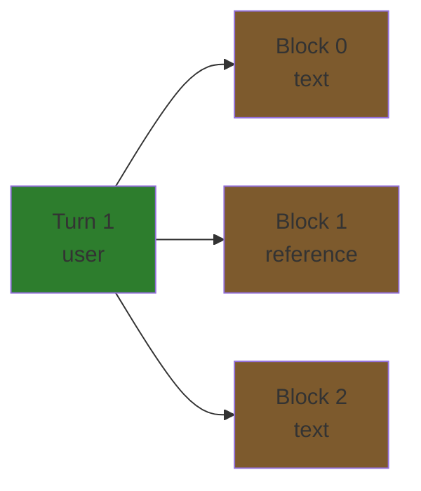
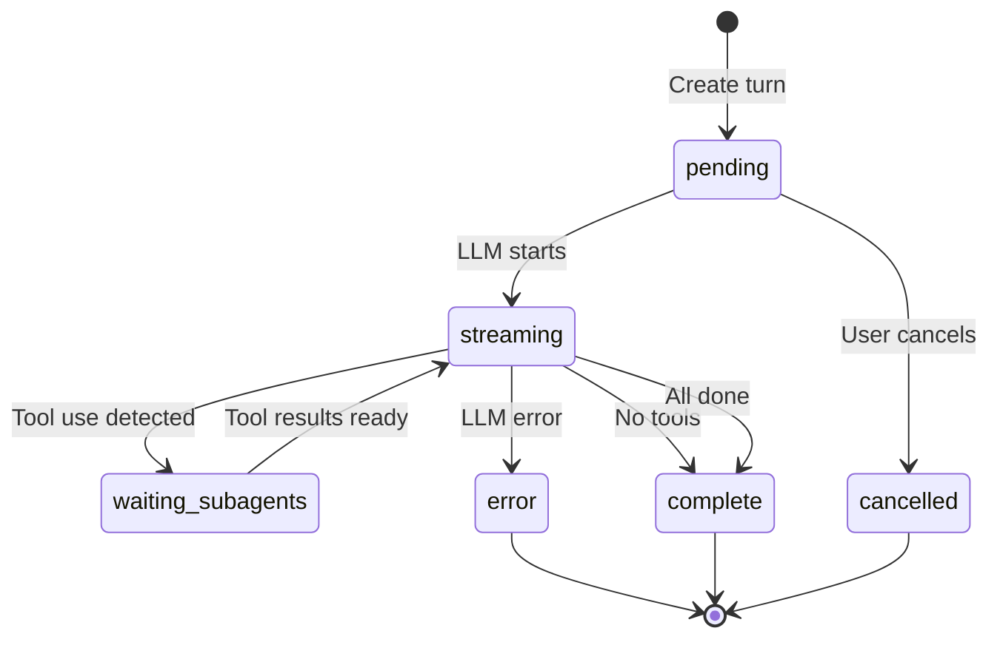
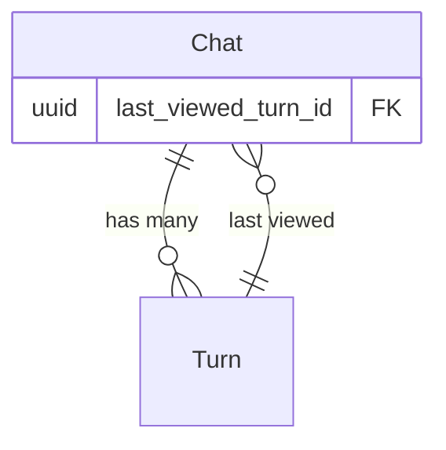

# Chat System Overview

Multi-turn LLM conversations with branching support and unified JSONB content blocks.

## Core Concepts

### Tree Structure

Conversations form a **tree** via `prev_turn_id` self-referencing, enabling branching:

```mermaid
graph TD
    T1[Turn 1: user<br/>"Write a story"]
    T2[Turn 2: assistant<br/>"Once upon a time..."]
    T3a[Turn 3a: user<br/>"Make it darker"]
    T3b[Turn 3b: user<br/>"Add more humor"]
    T4a[Turn 4a: assistant<br/>"The night grew cold..."]
    T4b[Turn 4b: assistant<br/>"A chicken walked into..."]

    T1 --> T2
    T2 --> T3a
    T2 -.branch.-> T3b
    T3a --> T4a
    T3b --> T4b

    style T1 fill:#2d7d2d
    style T2 fill:#7d2d5a
    style T3a fill:#2d7d2d
    style T3b fill:#2d7d2d
    style T4a fill:#7d2d5a
    style T4b fill:#7d2d5a
```

**Key points:**
- Root turns: `prev_turn_id IS NULL`
- Each turn references exactly one previous turn (or null)
- Multiple turns can reference the same `prev_turn_id` (branching)
- Deleting a turn deletes entire downstream branch (CASCADE)

### Turn Roles

| Role | Created By | Contains |
|------|-----------|----------|
| `user` | Client | User message with optional document references |
| `assistant` | Backend | LLM response with thinking blocks and tool use |

### Content Blocks

Turns contain **ordered content blocks** (0-indexed sequence):



**Block types:**
- **User:** text, image, reference, partial_reference, tool_result
- **Assistant:** text, thinking, tool_use

See [content-blocks.md](content-blocks.md) for JSONB schemas.

## Status Lifecycle



| Status | Description |
|--------|-------------|
| `pending` | Turn created, waiting for LLM |
| `streaming` | LLM generating response |
| `waiting_subagents` | Waiting for tool execution results |
| `complete` | Turn finished successfully |
| `cancelled` | User cancelled generation |
| `error` | LLM or system error occurred |

## Token Tracking

Tokens tracked at **turn level** (not block level):

```go
type Turn struct {
    Model        *string  // "claude-3-5-sonnet-20241022"
    InputTokens  *int     // Context sent to LLM
    OutputTokens *int     // LLM generated tokens
}
```

**Why turn-level?**
- Single LLM invocation per turn
- Aggregated cost tracking
- Simpler analytics

## Navigation

`last_viewed_turn_id` in Chat enables UI state persistence:



When user switches chats, frontend can restore to last viewed turn in conversation tree.

## Reference System

Content blocks can reference documents:

**Full document:**
```json
{
  "block_type": "reference",
  "content": {
    "ref_id": "doc-uuid",
    "ref_type": "document",
    "version_timestamp": "2025-01-15T10:30:00Z"
  }
}
```

**Text selection:**
```json
{
  "block_type": "partial_reference",
  "content": {
    "ref_id": "doc-uuid",
    "ref_type": "document",
    "selection_start": 100,
    "selection_end": 500
  }
}
```

Backend fetches document content and includes in LLM context.

## Database Schema

See [database/schema.md](../database/schema.md#chat-system) for:
- Table structures
- Foreign keys
- Indexes
- Constraints

## Implementation Status

- ✅ Schema migrations
- ✅ Domain models
- ✅ JSONB validation
- ✅ Repository layer
- ✅ Service layer (partial)
- ❌ HTTP handlers (CRUD)
- ❌ LLM integration
- ❌ Tool execution
- ❌ Streaming support

## References

- [Content Blocks](content-blocks.md) - JSONB schemas
- [Database Schema](../database/schema.md#chat-system) - Table details
- Domain models: `internal/domain/models/llm/`
- Validation: `internal/domain/models/llm/content_types.go`
