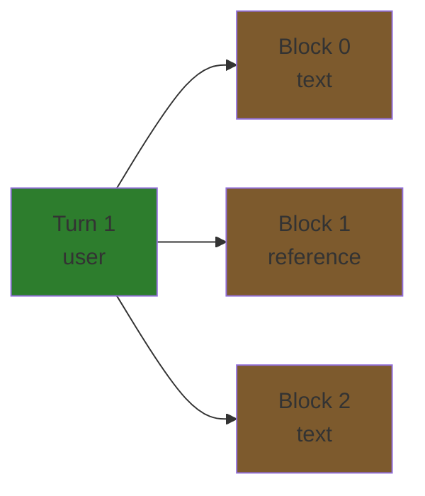
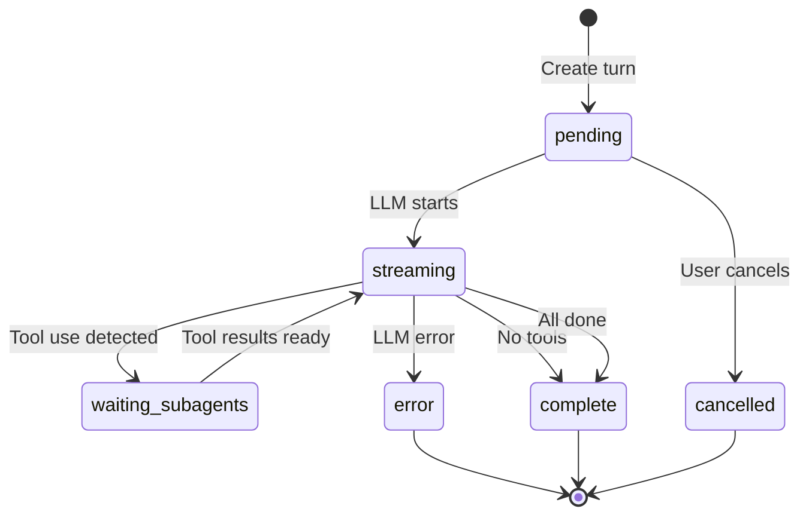
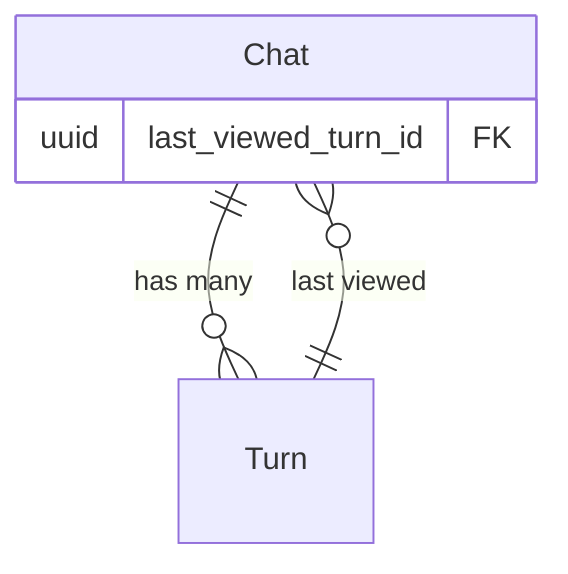

# Chat System Overview

Multi-turn LLM conversations with branching support and unified JSONB turn blocks.

## Core Concepts

### Tree Structure

Conversations form a **tree** via `prev_turn_id` self-referencing, enabling branching:

```mermaid
graph TD
    T1[Turn 1: user<br/>"Write a story"]
    T2[Turn 2: assistant<br/>"Once upon a time..."]
    T3a[Turn 3a: user<br/>"Make it darker"]
    T3b[Turn 3b: user<br/>"Add more humor"]
    T4a[Turn 4a: assistant<br/>"The night grew cold..."]
    T4b[Turn 4b: assistant<br/>"A chicken walked into..."]

    T1 --> T2
    T2 --> T3a
    T2 -.branch.-> T3b
    T3a --> T4a
    T3b --> T4b

    style T1 fill:#2d7d2d
    style T2 fill:#7d2d5a
    style T3a fill:#2d7d2d
    style T3b fill:#2d7d2d
    style T4a fill:#7d2d5a
    style T4b fill:#7d2d5a
```

**Key points:**
- Root turns: `prev_turn_id IS NULL`
- Each turn references exactly one previous turn (or null)
- Multiple turns can reference the same `prev_turn_id` (branching)
- Deleting a turn deletes entire downstream branch (CASCADE)

### Turn Roles

| Role | Created By | Contains |
|------|-----------|----------|
| `user` | Client | User message with optional document references |
| `assistant` | Backend | LLM response with thinking blocks and tool use |

### Turn Blocks

Turns contain **ordered turn blocks** (0-indexed sequence):



**Block types:**
- **User:** text, image, reference, partial_reference, tool_result
- **Assistant:** text, thinking, tool_use

See [turn-blocks.md](turn-blocks.md) for JSONB schemas.

## Status Lifecycle



| Status | Description |
|--------|-------------|
| `pending` | Turn created, waiting for LLM |
| `streaming` | LLM generating response |
| `waiting_subagents` | Waiting for tool execution results |
| `complete` | Turn finished successfully |
| `cancelled` | User cancelled generation |
| `error` | LLM or system error occurred |

## Token Tracking

Tokens tracked at **turn level** (not block level):

```go
type Turn struct {
    Model        *string  // "moonshotai/kimi-k2-thinking"
    InputTokens  *int     // Context sent to LLM
    OutputTokens *int     // LLM generated tokens
}
```

**Why turn-level?**
- Single LLM invocation per turn
- Aggregated cost tracking
- Simpler analytics

## Navigation

`last_viewed_turn_id` in Chat enables UI state persistence:



When user switches chats, frontend can restore to last viewed turn in conversation tree.

## Reference System

Content blocks can reference documents:

**Full document:**
```json
{
  "block_type": "reference",
  "content": {
    "ref_id": "doc-uuid",
    "ref_type": "document",
    "version_timestamp": "2025-01-15T10:30:00Z"
  }
}
```

**Text selection:**
```json
{
  "block_type": "partial_reference",
  "content": {
    "ref_id": "doc-uuid",
    "ref_type": "document",
    "selection_start": 100,
    "selection_end": 500
  }
}
```

Backend fetches document content and includes in LLM context.

---

## Pagination

For large conversations (1000+ turns), the system provides efficient pagination:

### Two-Endpoint Strategy

**Tree Endpoint** (`GET /api/chats/:id/tree`)
- Returns lightweight structure (IDs + prev_turn_id only)
- Used for cache validation
- ~2KB for 1000 turns, <100ms response time

**Pagination Endpoint** (`GET /api/chats/:id/turns`)
- Returns full Turn objects with nested blocks
- Direction modes: `before` (history), `after` (future), `both` (context window)
- Defaults to `last_viewed_turn_id` if no starting point specified

### Direction Modes

- **`before`** - Follow prev_turn_id chain backwards (scroll up, load history)
- **`after`** - Follow children forward, pick most recent on branches (scroll down)
- **`both`** - Split limit 25%/75% (before/after) for initial context window

### ConversationService

Pagination is handled by ConversationService (one of 3 focused LLM services):

```go
conversationService.GetPaginatedTurns(
    ctx,
    chatID,
    userID,
    fromTurnID,  // Optional, defaults to last_viewed_turn_id
    limit,       // Max 200, default 50
    direction,   // "before", "after", or "both"
)
```

**See:** [Backend Pagination Guide](pagination.md) for implementation details
**Frontend:** `_docs/technical/frontend/chat-pagination-guide.md`

---

## Database Schema

See [database/schema.md](../database/schema.md#chat-system) for:
- Table structures
- Foreign keys
- Indexes
- Constraints

## Implementation Status

**Core Features:**
- ✅ Schema migrations
- ✅ Domain models (Chat, Turn, TurnBlock)
- ✅ JSONB validation for all turn block types
- ✅ Repository layer (PostgreSQL)
- ✅ Service layer refactored into 3 focused services (SOLID compliance)
  - ChatService - Chat session CRUD
  - ConversationService - History & navigation
  - StreamingService - Turn creation & streaming
- ✅ HTTP handlers (complete CRUD)
- ✅ Chat creation, retrieval, update, deletion
- ✅ Turn creation and retrieval
- ✅ Content block support (text, thinking, tool_use, tool_result, image, reference, partial_reference)
- ✅ Turn tree navigation (get path, get siblings)
- ✅ Pagination (tree endpoint + direction-based turn loading)
- ✅ Request parameters (temperature, thinking, top-k, top-p, model, stop_sequences)
- ✅ Soft delete with cascade

**LLM Integration:**
- ✅ Provider abstraction layer (`LLMProvider` interface)
- ✅ Provider registry (dynamic provider selection)
- ✅ Anthropic Claude provider (fully implemented)
  - Models: claude-haiku-4-5, claude-sonnet-4-5, claude-opus-4-5
  - Extended thinking support (low/medium/high budgets)
  - Token tracking (input/output)
  - Request/response metadata
- ✅ Response generation pipeline
- ❌ Streaming infrastructure (async with goroutines) - **In Progress**
- ❌ SSE endpoints for real-time updates
- ❌ Tool execution
- ❌ OpenAI provider
- ❌ Google Gemini provider

**Testing:**
- ✅ Complete Insomnia test collection (29 requests across 6 groups)
- ✅ All CRUD operations tested
- ✅ Content block variations tested
- ✅ Parameter validation tested
- ✅ Integration tests (full workflows)

**Current Limitation:** LLM calls are synchronous (blocking HTTP response). Streaming infrastructure (Task 5) in development to enable async execution and SSE streaming.

## References

- [Turn Blocks](turn-blocks.md) - JSONB schemas
- [Database Schema](../database/schema.md#chat-system) - Table details
- Domain models: `internal/domain/models/llm/`
- Validation: `internal/domain/models/llm/content_types.go`
