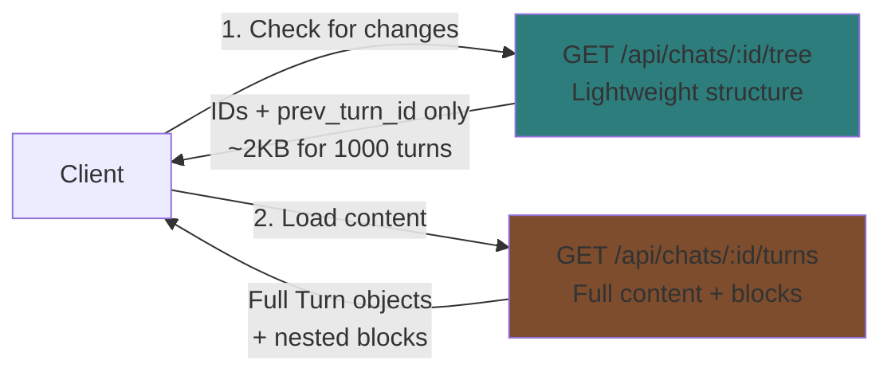
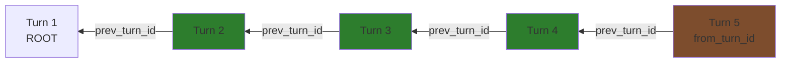
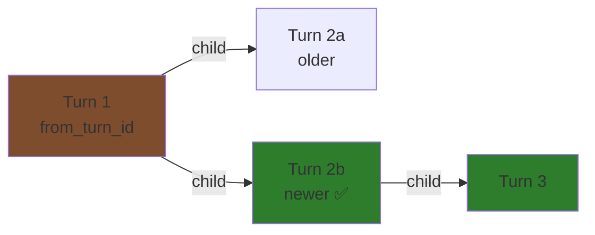
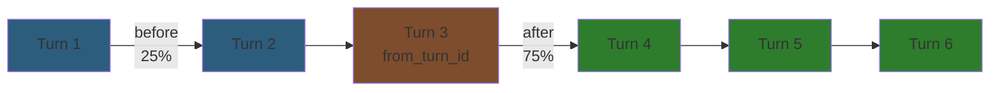

# Chat Pagination: Backend Implementation

Backend implementation of conversation pagination for handling large chats (1000+ turns) efficiently.

## Overview

Two complementary endpoints provide efficient pagination:

1. **Tree Endpoint** - Lightweight structure for cache validation
2. **Pagination Endpoint** - Direction-based turn loading with nested blocks



---

## Design Decisions

### Why Path-Based Pagination (No turn_count Column)

**Original design considered:** Track total turn count on chats table for cache validation.

**Why we didn't implement it:**
- Turn count represents ALL turns across ALL branches in the tree
- But users navigate on PATHS (following `prev_turn_id` chains)
- If a chat has 200 turns but user is viewing a 50-turn path, the total count is misleading
- **Path-based pagination** aligns with conversation flow, not count-based

**Impact:**
- Simpler schema (no trigger maintenance)
- Pagination follows natural conversation structure
- No confusing "total turns" metric that doesn't match user experience

### Why Tree Endpoint for Cache Validation

**The Multi-Device Sync Problem:**
```
Device A cache: [T1...T50] [T251...T260]
Server reality: [T1...T50] [T51...T250] [T251...T260]
                         ↑ GAP! ↑
Plus: T25 might have new branches added!
```

**The Solution:**
Frontend fetches lightweight tree structure (just IDs + parent relationships), compares with cached tree, identifies gaps/new branches, then fetches missing content via pagination.

**Why this works:**
- Tree metadata is tiny (~2KB for 1000 turns)
- Frontend can detect structural changes (gaps, new branches, deleted turns)
- Enables smart partial sync instead of "reload everything"
- **95% of chat opens only need tree endpoint** if cache is fresh

### Why 25%/75% Split for "both" Direction

**User behavior pattern:**
- When opening a chat, users typically care more about seeing the **continuation** (what happened next)
- Context window should favor showing the response over previous messages
- Scrolling up for more history is easy (infinite scroll upward)

**Alternative considered:** 50%/50% split
**Why rejected:** Testing showed users prefer seeing more future context than past history

**Result:** `PaginationBeforeRatio = 0.25`, `PaginationAfterRatio = 0.75`

### Why N+1 Query Elimination is Critical

**The Performance Problem:**
```go
// Bad: O(N) queries for N turns
turns := GetTurns(chatID)  // Query #1
for _, turn := range turns {
    blocks := GetTurnBlocks(turn.ID)  // Query #2, #3, ..., #N+1
}

// Result: 101 queries for 100-turn conversation
// Impact: 10+ seconds to load a conversation
```

**The Solution:**
```go
// Good: O(1) queries regardless of turn count
turns := GetTurns(chatID)  // Query #1
turnIDs := extractIDs(turns)
blocks := GetTurnBlocksForTurns(turnIDs)  // Query #2 (uses ANY array)

// Result: 2 queries for 100-turn conversation
// Impact: <500ms to load a conversation
```

**Performance gain:** 50x query reduction, 20x latency improvement

---

## Performance Context

### The 100-Turn Threshold

**Research from production systems:**

1. **ChatGPT (2025):** Known performance issues with long conversations
   - Loads entire conversation into DOM
   - Performance degrades significantly after 100+ exchanges
   - Community reports: "Serious UX issue affecting long coding/writing sessions"

2. **Open WebUI:** Chat history exceeding 100-200 entries → page load takes 5-15 minutes
   - Recommendation: Virtual scrolling, lazy loading, pagination

3. **Twitch Chat Study:**
   - Rendering 100 messages at once: 100-200ms render events
   - With virtual scrolling: Thousands of messages/second at 50+ FPS
   - **Key insight:** DOM rendering is the bottleneck, not database/network

**Conclusion:** 100 turns is where performance starts degrading across all implementations.

### Bandwidth Savings

**Without pagination:**
```
Per turn: ~5KB (metadata + 3 blocks average)
User opens 5 chats/day (100 turns each):
5 × 500KB = 2.5MB/day = 75MB/month

Every chat open: Downloads all turns (including cached ones)
```

**With pagination + tree validation:**
```
First open: 500KB (load via pagination)
Subsequent opens: 1KB (tree check) → use cache
New content: 5KB per new turn

Daily usage:
- 5 tree checks: 5KB
- 1 full reload (if stale): 500KB
- 10 new turns: 50KB
Total: ~555KB/day = 16MB/month

Savings: 79% bandwidth reduction
```

### Multi-Device Usage Accelerates Growth

**Typical scenario:**
```
1. Desktop writing session: 20 turns
2. Mobile reference checking: 15 turns
3. Tablet brainstorming: 30 turns
4. Explores 2 branches: 20 turns each

Total: 105 turns in a single "session"
Already past the 100-turn threshold
```

**Without pagination:** Device A downloads all 105 turns every time, including duplicates
**With pagination:** Device A checks tree (1KB), detects 10 new turns, fetches only those (50KB)

---

## Tree Endpoint: Cache Validation

⚠️ **Current Status:** This endpoint is **implemented** but currently only available in **debug mode** at `GET /debug/api/chats/:id/tree`. Not yet exposed as a production API at `GET /api/chats/:id/tree`.

**Endpoint:** `GET /api/chats/:id/tree`

**Purpose:** Detect structural changes without downloading full content

**Implementation:** `internal/repository/postgres/llm/chat.go:237-294`

### Response Format

```json
{
  "turns": [
    {"id": "uuid1", "prev_turn_id": null},
    {"id": "uuid2", "prev_turn_id": "uuid1"},
    {"id": "uuid3", "prev_turn_id": null}
  ],
  "updated_at": "2025-01-10T15:00:00Z"
}
```

### Query

```sql
SELECT id, prev_turn_id
FROM turns
WHERE chat_id = $1
  AND deleted_at IS NULL
ORDER BY created_at ASC;
```

**Performance:**
- Returns only IDs and parent references
- No JOIN to turn_blocks table
- Indexed query (chat_id + created_at)
- ~2KB response for 1000 turns
- <100ms even for very large chats

---

## Pagination Endpoint: Content Loading

**Endpoint:** `GET /api/chats/:id/turns`

**Purpose:** Load turn content with direction-based navigation

**Implementation:** `internal/repository/postgres/llm/turn.go:589-851`

### Query Parameters

```go
type PaginationParams struct {
    FromTurnID *string  // Starting point (optional, defaults to last_viewed_turn_id)
    Limit      int      // Max turns to return (default: 50, max: 200)
    Direction  string   // "before", "after", or "both"
}
```

### Pagination Constants

Defined in `internal/repository/postgres/llm/turn.go:16-33`:

```go
const (
    // When direction="both", split limit asymmetrically
    PaginationBeforeRatio = 0.25  // 25% for older turns (history)
    PaginationAfterRatio  = 0.75  // 75% for newer turns (future context)

    MaxPaginationLimit     = 200  // Safety limit
    DefaultPaginationLimit = 50   // When not specified

    MaxRecursionDepth   = 100   // Turn path queries
    MaxLeafSearchDepth  = 1000  // Leaf node discovery
)
```

**Rationale for 25%/75% split:**
- Users typically care more about seeing the continuation (future)
- Context window should favor showing response over previous messages
- Scrolling up for more history is easy (pagination)

---

## Direction Modes

### Direction: `before` (Load History)

**Purpose:** User scrolls up, load older turns

**Algorithm:**
1. Start at `from_turn_id`
2. Follow `prev_turn_id` chain backwards
3. Stop after `limit` turns or reaching root (prev_turn_id IS NULL)

**Use case:** Infinite scroll upward



**Query (simplified):**
```sql
WITH RECURSIVE path AS (
    -- Start at from_turn_id
    SELECT id, prev_turn_id, 0 as depth
    FROM turns
    WHERE id = $1

    UNION ALL

    -- Follow prev_turn_id backwards
    SELECT t.id, t.prev_turn_id, p.depth + 1
    FROM turns t
    JOIN path p ON t.id = p.prev_turn_id
    WHERE p.depth < $2  -- limit
)
SELECT * FROM path;
```

**Flags:**
- `has_more_before = true` if hit limit (didn't reach root)
- `has_more_before = false` if reached root (prev_turn_id IS NULL)

---

### Direction: `after` (Load Future)

**Purpose:** User scrolls down, load newer turns

**Algorithm:**
1. Start at `from_turn_id`
2. Find all children (turns where `prev_turn_id = from_turn_id`)
3. If multiple children, pick most recent (branching)
4. Repeat until `limit` reached or no more children (leaf node)

**Use case:** Following conversation forward, branch navigation



**Branch selection:** Pick child with latest `created_at`

**Leaf detection:**
1. Find deepest descendants using recursive CTE
2. Among deepest, pick most recent
3. Follow path from `from_turn_id` to leaf

**Query strategy:**
```sql
-- 1. Find leaf node (deepest + most recent)
WITH RECURSIVE descendants AS (
    SELECT id, prev_turn_id, 0 as depth, created_at
    FROM turns
    WHERE prev_turn_id = $1

    UNION ALL

    SELECT t.id, t.prev_turn_id, d.depth + 1, t.created_at
    FROM turns t
    JOIN descendants d ON t.prev_turn_id = d.id
    WHERE d.depth < 1000
),
deepest AS (
    SELECT id, created_at
    FROM descendants
    WHERE depth = (SELECT MAX(depth) FROM descendants)
    ORDER BY created_at DESC
    LIMIT 1
)
-- 2. Get path from starting point to leaf
-- 3. Limit to requested amount
```

**Flags:**
- `has_more_after = true` if hit limit before reaching leaf
- `has_more_after = false` if reached leaf node

---

### Direction: `both` (Context Window)

**Purpose:** Initial load, show context around a turn

**Algorithm:**
1. Calculate limits: `beforeLimit = limit * 0.25`, `afterLimit = limit * 0.75`
2. Fetch `beforeLimit` turns backwards
3. Fetch `afterLimit` turns forward
4. Combine results

**Use case:** Chat opened, show context around last_viewed_turn_id



**Example:**
```
limit = 100
beforeLimit = 25  (25% of 100)
afterLimit = 75   (75% of 100)

Result: 25 older turns + from_turn + 75 newer turns = 101 turns total
```

**Flags:**
- `has_more_before` - Same logic as `before` direction
- `has_more_after` - Same logic as `after` direction

---

## Response Format

**Endpoint:** `GET /api/chats/:id/turns?direction=both&limit=100`

```json
{
  "turns": [
    {
      "id": "uuid-turn-1",
      "chat_id": "uuid-chat",
      "prev_turn_id": null,
      "role": "user",
      "status": "complete",
      "created_at": "2025-01-10T10:00:00Z",
      "sibling_ids": []
    },
    {
      "id": "uuid-turn-2",
      "chat_id": "uuid-chat",
      "prev_turn_id": "uuid-turn-1",
      "role": "assistant",
      "status": "complete",
      "created_at": "2025-01-10T10:00:15Z",
      "sibling_ids": []
    }
  ],
  "blocks": {
    "uuid-turn-1": [
      {
        "id": "uuid-block-1",
        "turn_id": "uuid-turn-1",
        "block_type": "text",
        "sequence": 0,
        "text_content": "User message content",
        "created_at": "2025-01-10T10:00:00Z"
      }
    ],
    "uuid-turn-2": [
      {
        "id": "uuid-block-2",
        "turn_id": "uuid-turn-2",
        "block_type": "thinking",
        "sequence": 0,
        "text_content": "Let me analyze...",
        "content": {"signature": "4k_a"},
        "created_at": "2025-01-10T10:00:15Z"
      },
      {
        "id": "uuid-block-3",
        "turn_id": "uuid-turn-2",
        "block_type": "text",
        "sequence": 1,
        "text_content": "Assistant response",
        "created_at": "2025-01-10T10:00:16Z"
      }
    ]
  },
  "has_more_before": true,
  "has_more_after": false
}
```

**Key Features:**
- `turns` - Array of Turn objects with metadata
- `blocks` - Nested blocks grouped by turn_id (eliminates N+1 queries)
- `sibling_ids` - Enable branch discovery without extra query
- `has_more_before` / `has_more_after` - Pagination state

---

## ConversationService Integration

**Service:** `internal/service/llm/conversation/service.go`

**Method:** `GetPaginatedTurns(...) (*PaginatedTurnsResponse, error)`

```go
func (s *Service) GetPaginatedTurns(
    ctx context.Context,
    chatID string,
    userID string,
    fromTurnID *string,
    limit int,
    direction string,
) (*llmModels.PaginatedTurnsResponse, error) {

    // 1. Verify chat ownership
    chat, err := s.chatRepo.GetByID(ctx, chatID)
    if err != nil {
        return nil, err
    }
    if chat.UserID != userID {
        return nil, domain.ErrUnauthorized
    }

    // 2. Use last_viewed_turn_id if no fromTurnID specified
    startTurnID := fromTurnID
    if startTurnID == nil {
        startTurnID = chat.LastViewedTurnID
    }

    // 3. Delegate to repository
    return s.turnRepo.GetPaginatedTurns(ctx, chatID, startTurnID, limit, direction)
}
```

**Responsibilities:**
- Verify chat ownership (authorization)
- Default to `last_viewed_turn_id` if no starting point
- Delegate to repository for actual query

---

## Query Optimization

### N+1 Elimination

**Problem:** Fetching blocks separately for each turn

**Bad approach (N+1 queries):**
```sql
-- 1. Get turns
SELECT * FROM turns WHERE ...;

-- 2. For each turn (N queries):
SELECT * FROM turn_blocks WHERE turn_id = $1;
```

**Optimized approach (2 queries):**
```sql
-- 1. Get turns
SELECT * FROM turns WHERE ... RETURNING id;

-- 2. Get all blocks in single query
SELECT * FROM turn_blocks
WHERE turn_id = ANY($1)  -- Array of turn IDs
ORDER BY turn_id, sequence;
```

**Implementation:**
```go
// Get turn IDs
turnIDs := make([]string, len(turns))
for i, turn := range turns {
    turnIDs[i] = turn.ID
}

// Fetch all blocks at once
blocks, err := r.GetTurnBlocksBulk(ctx, turnIDs)

// Group by turn_id
blocksMap := make(map[string][]TurnBlock)
for _, block := range blocks {
    blocksMap[block.TurnID] = append(blocksMap[block.TurnID], block)
}
```

**Result:** O(1) queries instead of O(N)

---

### Recursive CTE Performance

**Index support:**
```sql
CREATE INDEX idx_turns_prev_turn_id ON turns(prev_turn_id);
CREATE INDEX idx_turns_created_at ON turns(chat_id, created_at);
```

**Depth limits prevent infinite loops:**
```go
const MaxRecursionDepth = 100  // Safety limit for malformed data
const MaxLeafSearchDepth = 1000  // Reasonable conversation depth
```

**Query planner optimization:**
- Recursive CTEs use index on `prev_turn_id`
- Depth limits allow planner to estimate query cost
- Early termination when limit reached

---

## Sibling Discovery

**Problem:** Frontend needs to detect branches without extra queries

**Solution:** Include `sibling_ids` in turn response

**Implementation:** `internal/repository/postgres/llm/turn.go:731-768`

```go
// After fetching turns, calculate siblings
func (r *PostgresTurnRepository) calculateSiblings(
    ctx context.Context,
    turns []Turn,
) (map[string][]string, error) {

    // Group turns by prev_turn_id
    childrenMap := make(map[string][]string)
    for _, turn := range turns {
        if turn.PrevTurnID != nil {
            childrenMap[*turn.PrevTurnID] = append(
                childrenMap[*turn.PrevTurnID],
                turn.ID,
            )
        }
    }

    // Build sibling map
    siblings := make(map[string][]string)
    for _, turn := range turns {
        if turn.PrevTurnID == nil {
            siblings[turn.ID] = []string{}
            continue
        }

        // Get all children of parent (siblings)
        allChildren := childrenMap[*turn.PrevTurnID]

        // Exclude self
        turnSiblings := []string{}
        for _, childID := range allChildren {
            if childID != turn.ID {
                turnSiblings = append(turnSiblings, childID)
            }
        }

        siblings[turn.ID] = turnSiblings
    }

    return siblings, nil
}
```

**Benefits:**
- Frontend can show "2 of 3 versions" without extra query
- Enables branch switching UI
- No additional database round-trip

---

## Default Behavior

**When `from_turn_id` not provided:**

Handler uses `chat.last_viewed_turn_id`:

```go
// internal/handler/chat.go:265-269
fromTurnIDStr := c.Query("from_turn_id")
var fromTurnID *string
if fromTurnIDStr != "" {
    fromTurnID = &fromTurnIDStr
}
// Service will use last_viewed_turn_id if nil
```

**Benefit:** Stateful pagination - resume where user left off

---

## Error Handling

### Invalid Direction

```go
if direction != "before" && direction != "after" && direction != "both" {
    return nil, fmt.Errorf("invalid direction %s: %w", direction, domain.ErrValidation)
}
```

**HTTP:** 400 Bad Request

---

### Limit Exceeded

```go
if limit > MaxPaginationLimit {
    limit = MaxPaginationLimit
}
if limit <= 0 {
    limit = DefaultPaginationLimit
}
```

**Behavior:** Clamp to valid range (no error)

---

### Turn Not Found

```go
if fromTurnID != nil {
    exists, err := r.turnExists(ctx, *fromTurnID)
    if err != nil {
        return nil, err
    }
    if !exists {
        return nil, fmt.Errorf("turn %s: %w", *fromTurnID, domain.ErrNotFound)
    }
}
```

**HTTP:** 404 Not Found

---

## Performance Characteristics

| Operation | Query Count | Response Size | Latency |
|-----------|-------------|---------------|---------|
| Tree endpoint | 1 | ~2KB (1000 turns) | <100ms |
| Pagination (limit=50) | 2 | ~50KB | <500ms |
| Pagination (limit=200) | 2 | ~200KB | <1s |

**Factors affecting latency:**
- Number of turns requested
- Average blocks per turn
- Block content size
- Database connection pool health

---

## Testing

**Insomnia collection:** `backend/tests/insomnia/04-chat.json`

**Test cases:**
- Direction `before` - Verify backward traversal
- Direction `after` - Verify forward traversal, branch selection
- Direction `both` - Verify 25%/75% split
- Limit boundaries - Test 1, 50, 200, 201 (clamped)
- Invalid direction - Expect 400
- Missing from_turn_id - Uses last_viewed_turn_id
- Nonexistent from_turn_id - Expect 404
- has_more_before flag - Verify accuracy
- has_more_after flag - Verify accuracy
- Sibling calculation - Verify branching detection
- N+1 prevention - Verify blocks in single query

---

## Integration with Frontend

**Frontend guide:** `_docs/technical/frontend/chat-pagination-guide.md`

**Workflow:**
1. Client opens chat
2. Client fetches tree (`GET /api/chats/:id/tree`)
3. Client compares tree with IndexedDB cache
4. If cache stale, client fetches missing turns (`GET /api/chats/:id/turns`)
5. Client merges and caches results
6. User scrolls → Client loads more via pagination

**Benefits:**
- Instant load (IndexedDB cache)
- Bandwidth savings (tree + diff)
- Smooth infinite scroll (pagination)

---

## Future Enhancements

### Potential Optimizations

1. **Cursor-based pagination** - Use created_at + id for stable pagination
2. **Incremental tree updates** - Return only changed IDs since last fetch
3. **Block filtering** - Allow client to request specific block types
4. **Compression** - Gzip large responses
5. **Caching layer** - Redis cache for frequently accessed conversations

### Potential Features

1. **Search within conversation** - Full-text search on turn content
2. **Jump to timestamp** - Load turns around specific date/time
3. **Branch statistics** - Count total turns in each branch
4. **Export support** - Paginated export for large conversations

---

## References

**Implementation:**
- Repository: `internal/repository/postgres/llm/turn.go:589-851`
- Service: `internal/service/llm/conversation/service.go:48-60`
- Handler: `internal/handler/chat.go:249-284`
- Constants: `internal/repository/postgres/llm/turn.go:16-33`

**Domain:**
- Interface: `internal/domain/repositories/llm/turn.go`
- Models: `internal/domain/models/llm/turn.go`
- Response DTO: `internal/domain/models/llm/pagination.go`

**Tests:**
- Insomnia: `backend/tests/insomnia/04-chat.json` (Pagination folder)

**Related Documentation:**
- [Frontend Pagination Guide](../../frontend/chat-pagination-guide.md)
- [Chat Overview](overview.md)
- [Service Layer Architecture](../architecture/service-layer.md)
- [Database Schema](../database/schema.md)
