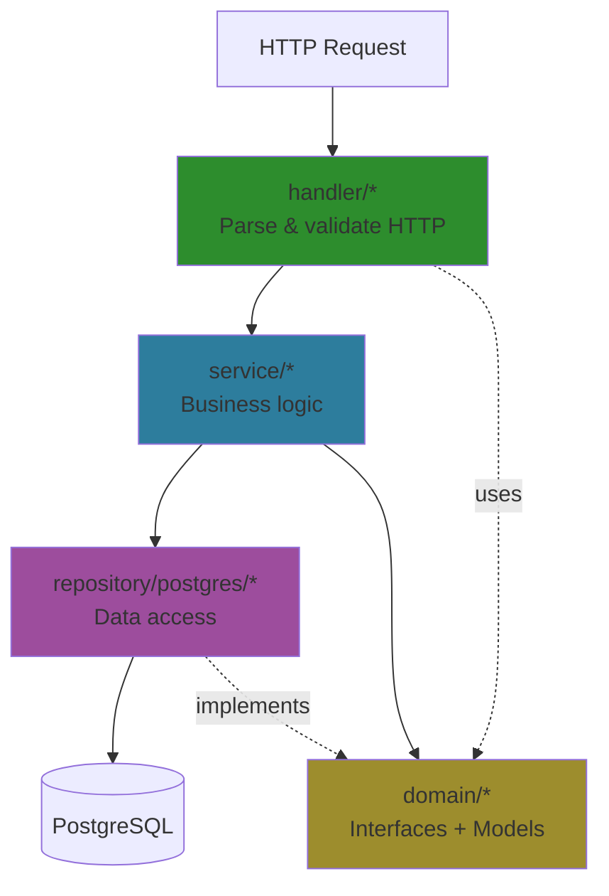
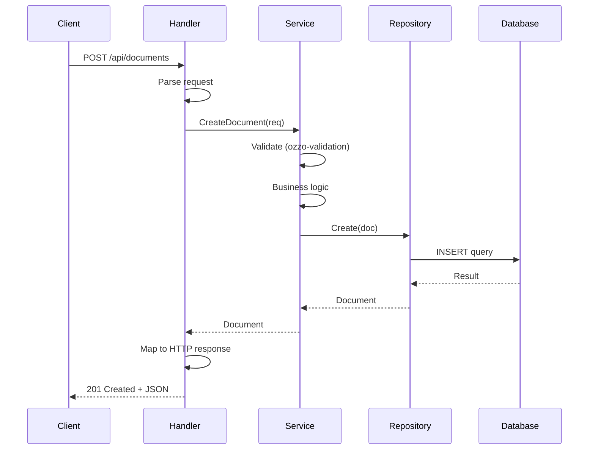
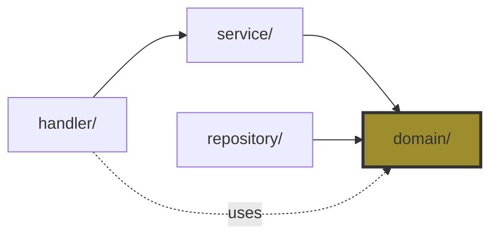

# Clean Architecture Guide

Backend follows Handler → Service → Repository pattern with dependency inversion.

## Layer Responsibilities

**Handler** (`internal/handler/`): HTTP concerns only
- Parse requests, call services, map errors to HTTP status codes
- Example: `internal/handler/document.go`

**Service** (`internal/service/`): Business logic
- Validation, authorization, orchestration, transactions
- Example: `internal/service/document.go:43-111` (CreateDocument)

**Repository** (`internal/repository/postgres/`): Data access
- SQL queries only, no business logic
- Example: `internal/repository/postgres/document.go`

**Domain** (`internal/domain/`): Interfaces & models
- Services depend on interfaces, not implementations
- Enables testing with mocks, easy to swap databases

## Current Architecture



## Request Flow Example



## Dependency Flow

Dependencies point **inward** toward domain:



**Key principle:** Service depends on `DocumentRepository` **interface** (domain), not `PostgresDocumentRepository` **implementation** (repository).

## Adding New Features

### Decision Tree

Where does X belong?

- **HTTP concerns** (parsing, status codes, headers) → `handler/`
- **Business rules** (validation, authorization, orchestration) → `service/`
- **Data access** (SQL queries, DB operations) → `repository/`

### Pattern

1. Define interface in `domain/repositories/` or `domain/services/`
2. Implement repository in `repository/postgres/`
3. Implement service in `service/`
4. Add handler in `handler/`
5. Wire up in `cmd/server/main.go`

**Examples:**
- Rate limiting → Middleware (cross-cutting concern)
- Document versioning → Service (business logic)
- Full-text search → Repository (data access)
- WebSocket endpoint → Handler (HTTP concern)

### Example: Adding Comments

```go
// 1. Domain interface
type CommentRepository interface {
    Create(ctx context.Context, comment *Comment) error
    GetByID(ctx context.Context, id string) (*Comment, error)
}

// 2. Repository implementation (repository/postgres/comment.go)
func (r *PostgresCommentRepository) Create(ctx context.Context, comment *Comment) error {
    // SQL query only
}

// 3. Service implementation (service/comment.go)
func (s *commentService) CreateComment(ctx context.Context, req *CreateCommentRequest) (*Comment, error) {
    // Validation, authorization, business logic
    // Calls repository
}

// 4. Handler (handler/comment.go)
func (h *CommentHandler) CreateComment(c *fiber.Ctx) error {
    // Parse request, call service, return response
}

// 5. Wire up (cmd/server/main.go)
commentRepo := postgres.NewCommentRepository(config)
commentService := service.NewCommentService(commentRepo)
commentHandler := handler.NewCommentHandler(commentService)
api.Post("/comments", commentHandler.CreateComment)
```

See existing code for complete examples.

## Technical Details

**Database:** pgx v5 (native JSONB support, better performance)

**Validation:** ozzo-validation in service layer

**Error Handling:** Sentinel errors (`internal/domain/errors.go`) with `errors.Is`
- Repositories return domain errors (e.g., `domain.ErrNotFound`)
- Handlers map to HTTP status codes (e.g., 404 Not Found)

**Transactions:** Service layer manages transactions via `TransactionManager`

See `internal/repository/postgres/connection.go` for transaction pattern.

## References

- Domain errors: `internal/domain/errors.go`
- Repository interfaces: `internal/domain/repositories/`
- Service interfaces: `internal/domain/services/`
- Models: `internal/domain/models/`
