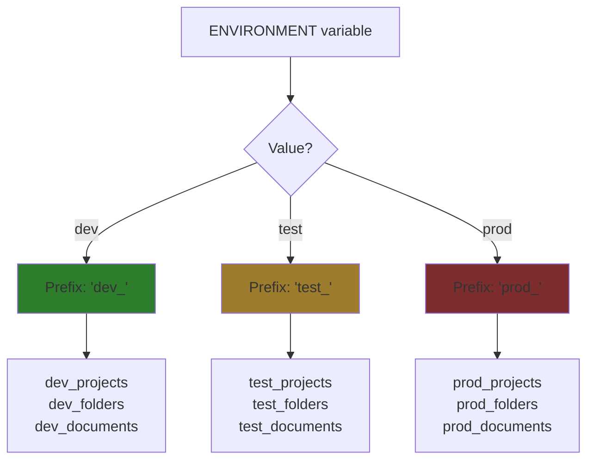

# Database Connections

## Problem

Supabase provides two connection types. Using the wrong one causes "prepared statement already exists" errors.

## Connection Types

| Type | Port | For | Auto-Configuration |
|------|------|-----|-------------------|
| Pooled (PgBouncer) | 6543 | Development | Simple protocol (no prepared statements) |
| Direct | 5432 | Production | Prepared statements (better performance) |

### Pooled Connection (Port 6543)

Uses Supabase's PgBouncer connection pooler. Works from any IP, but PgBouncer doesn't support prepared statements in transaction mode.

**When to use:** Development (laptop, CI/CD without static IP)

**Connection string:**
```
postgresql://...@...pooler.supabase.com:6543/postgres
```

**Auto-configuration:** Port 6543 is automatically detected and configures `QueryExecModeSimpleProtocol` to disable prepared statements.

**Explicit override (optional):**
```
postgresql://...@...pooler.supabase.com:6543/postgres?default_query_exec_mode=simple_protocol
```

### Direct Connection (Port 5432)

Bypasses PgBouncer, connects directly to PostgreSQL. Requires IP whitelisting but supports full PostgreSQL features.

**When to use:** Production (Railway, Vercel with static IP)

**Connection string:**
```
postgresql://...@db.your-project.supabase.co:5432/postgres
```

## Setup

**Development** (`.env`):
```env
# Simple - auto-detected
SUPABASE_DB_URL=postgresql://...pooler.supabase.com:6543/postgres

# Or explicit (optional)
SUPABASE_DB_URL=postgresql://...pooler.supabase.com:6543/postgres?default_query_exec_mode=simple_protocol
```

**Production** (Railway/Vercel):
1. Get static IP of your deployment
2. Whitelist IP in Supabase: Dashboard → Database → Database settings → Add IP
3. Use port 5432 connection string (auto-uses prepared statements)

## Environment-Based Table Names

Tables use environment-specific prefixes to isolate dev/test/prod data in the same database.

### How It Works



### Dynamic Table Names in Code

Our code uses `fmt.Sprintf` for dynamic table names:
```go
query := fmt.Sprintf("SELECT * FROM %s WHERE id = $1", tables.Documents)
```

This works with prepared statements because:
- `fmt.Sprintf` runs **before** database sees the query
- Each environment gets different SQL → different prepared statements
- `dev_documents` and `test_documents` have separate statement caches

**Implementation:** `internal/repository/postgres/connection.go:15-27`

**Example:**
```go
// Environment: dev
tables.Documents = "dev_documents"
query = "SELECT * FROM dev_documents WHERE id = $1"  // Statement cache: dev_documents_select

// Environment: test
tables.Documents = "test_documents"
query = "SELECT * FROM test_documents WHERE id = $1"  // Statement cache: test_documents_select
// No conflict!
```

See `internal/repository/postgres/document.go:29-33` for usage examples.

## Troubleshooting

**Error:** `prepared statement "stmtcache_xxx" already exists`

**Causes:**
1. Using port 6543 without auto-detection working (check `connection.go`)
2. Explicitly overriding to use prepared statements with PgBouncer
3. Cached prepared statements on Supabase (requires project restart)

**Fixes:**
1. Ensure connection uses port 6543 (auto-configures simple protocol)
2. Or explicitly add: `?default_query_exec_mode=simple_protocol`
3. If error persists after config fix, restart Supabase project in dashboard

See `internal/repository/postgres/connection.go` for hybrid auto-detection logic.

## References

Implementation: `internal/repository/postgres/connection.go`
Environment setup: `backend/ENVIRONMENTS.md`
Supabase docs: https://supabase.com/docs/guides/database/connection-pooling
