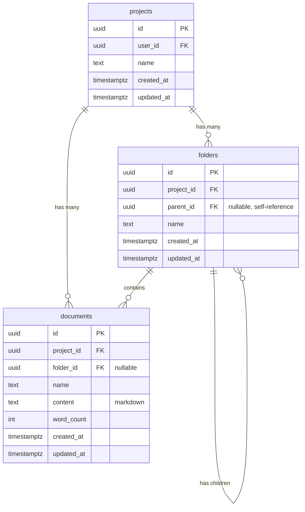

# Database Schema

Complete PostgreSQL database schema for Meridian.

## Entity Relationship Diagram



## Tables

### `projects`

Top-level container for all user content.

**Columns:**
- `id` (UUID, PK) - Auto-generated
- `user_id` (UUID, FK) - Owner (not enforced in Phase 1)
- `name` (TEXT) - Project name
- `created_at` (TIMESTAMPTZ) - Creation timestamp
- `updated_at` (TIMESTAMPTZ) - Last update timestamp

**Constraints:**
- Primary key on `id`

**Deletion Behavior:**
- CASCADE to folders
- RESTRICT on documents (must delete documents first to prevent accidental data loss)

### `folders`

Hierarchical folder structure using adjacency list pattern.

**Columns:**
- `id` (UUID, PK) - Auto-generated
- `project_id` (UUID, FK) - Parent project
- `parent_id` (UUID, FK, nullable) - Parent folder (NULL = root level)
- `name` (TEXT) - Folder name (no slashes allowed)
- `created_at` (TIMESTAMPTZ) - Creation timestamp
- `updated_at` (TIMESTAMPTZ) - Last update timestamp

**Constraints:**
- `UNIQUE(project_id, parent_id, name)` - No duplicate names at same level
- `UNIQUE(project_id, name) WHERE parent_id IS NULL` - No duplicate root-level names
- `parent_id` references `folders(id)` - Self-referencing hierarchy

**Deletion Behavior:**
- CASCADE when parent folder deleted
- CASCADE when project deleted

**Indexes:**
- `idx_folders_project_parent` on `(project_id, parent_id)` - Fast hierarchy queries
- `idx_folders_root_unique` on `(project_id, name) WHERE parent_id IS NULL` - Root uniqueness

### `documents`

Content documents (leaf nodes in tree).

**Columns:**
- `id` (UUID, PK) - Auto-generated
- `project_id` (UUID, FK) - Parent project
- `folder_id` (UUID, FK, nullable) - Parent folder (NULL = root level)
- `name` (TEXT) - Document name (slashes allowed for artistic freedom)
- `content` (TEXT) - Markdown content (canonical storage format)
- `word_count` (INTEGER) - Computed from markdown
- `created_at` (TIMESTAMPTZ) - Creation timestamp
- `updated_at` (TIMESTAMPTZ) - Last update timestamp

**Constraints:**
- `UNIQUE(project_id, folder_id, name)` - No duplicate names in same folder

**Deletion Behavior:**
- SET NULL when folder deleted (document moves to root)
- RESTRICT when project deleted (must delete documents first)

**Indexes:**
- `idx_documents_project_id` on `project_id` - Fast project queries
- `idx_documents_project_folder` on `(project_id, folder_id)` - Fast folder queries

## Content Storage

**Format:** Markdown (TEXT)

Documents store content as plain markdown. The frontend editor (TipTap) handles conversion between its internal representation and markdown at the API boundary.

**Why markdown?**
- Single source of truth
- Used for word counting
- Future: full-text search
- Human-readable backups
- Import/export compatibility

## Dynamic Table Names

Tables use environment-specific prefixes:

| Environment | Prefix | Example |
|-------------|--------|---------|
| dev | `dev_` | `dev_projects`, `dev_folders`, `dev_documents` |
| test | `test_` | `test_projects`, `test_folders`, `test_documents` |
| prod | `prod_` | `prod_projects`, `prod_folders`, `prod_documents` |

**Configured via:** `ENVIRONMENT` environment variable

**Implementation:** See `internal/repository/postgres/connection.go:15-27`

**Code usage:**
```go
// ✅ Correct
query := fmt.Sprintf("SELECT * FROM %s WHERE id = $1", db.Tables.Documents)

// ❌ Wrong
query := "SELECT * FROM documents WHERE id = $1"
```

## Folder Hierarchy

### Adjacency List Pattern

Folders use a self-referencing `parent_id` foreign key.

**Example data:**
```sql
-- Root folders (parent_id = NULL)
INSERT INTO dev_folders VALUES ('uuid-1', 'project-1', NULL, 'Characters');
INSERT INTO dev_folders VALUES ('uuid-2', 'project-1', NULL, 'World');

-- Child folder
INSERT INTO dev_folders VALUES ('uuid-3', 'project-1', 'uuid-1', 'Heroes');
```

**Hierarchy:**
```
project-1/
├── Characters/ (uuid-1, parent_id=NULL)
│   └── Heroes/ (uuid-3, parent_id=uuid-1)
└── World/ (uuid-2, parent_id=NULL)
```

### Circular Reference Prevention

Backend validates folder moves to prevent cycles:

**Example:** Cannot move "Characters" into "Characters/Heroes"

**Implementation:** `internal/service/folder.go:updateFolder()`

## Path Computation

Paths are **computed** (not stored) by traversing the folder hierarchy.

**Example:**
- Document: `name="Aria"`, `folder_id=uuid-3`
- Folder uuid-3: `name="Heroes"`, `parent_id=uuid-1`
- Folder uuid-1: `name="Characters"`, `parent_id=NULL`
- **Computed path:** `"Characters/Heroes/Aria"`

**Implementation:** `internal/service/tree.go:buildPath()`

**Why computed?**
- Single source of truth (folder hierarchy)
- Renaming folders updates all paths automatically
- No sync issues

## Uniqueness Rules

### Projects
- No enforced uniqueness (user can have multiple projects with same name)

### Folders
- `UNIQUE(project_id, parent_id, name)` - No duplicate names at same level
- Different levels can have same name (e.g., root "Notes" and "Characters/Notes")

### Documents
- `UNIQUE(project_id, folder_id, name)` - No duplicate names in same folder
- Same name allowed in different folders

**Example valid structure:**
```
project-1/
├── Notes.md              (folder_id=NULL, name="Notes")
├── Characters/
│   └── Notes.md          (folder_id=uuid-1, name="Notes")
```

## Foreign Key Behavior Summary

| Parent | Child | FK Column | ON DELETE |
|--------|-------|-----------|-----------|
| projects | folders | project_id | CASCADE |
| projects | documents | project_id | RESTRICT |
| folders (parent) | folders (child) | parent_id | CASCADE |
| folders | documents | folder_id | SET NULL |

**Rationale:**
- CASCADE for folders: Deleting parent folder deletes children (structural cleanup)
- RESTRICT for documents: Prevent accidental data loss (must explicitly delete documents)
- SET NULL for document folders: Deleting folder moves documents to root (preserve content)

## Setup

**File:** `backend/schema.sql`

**Run once in Supabase SQL Editor:**
```bash
# Copy contents of backend/schema.sql
# Paste into Supabase Dashboard → SQL Editor → Run
```

**Creates:**
- All tables with indexes and constraints
- Test project (id: `00000000-0000-0000-0000-000000000002`)

**Environment-specific:**
- Dev setup creates `dev_*` tables
- For test/prod, copy schema and change prefix

## Migrations

**Phase 1:** No migration system. Schema is stable.

**Future:** Consider migration tool (e.g., golang-migrate, goose) when schema evolves.

## References

- Connection setup: [database/connections.md](connections.md)
- Seeding test data: [database/seeding.md](seeding.md)
- Schema file: `backend/schema.sql`
