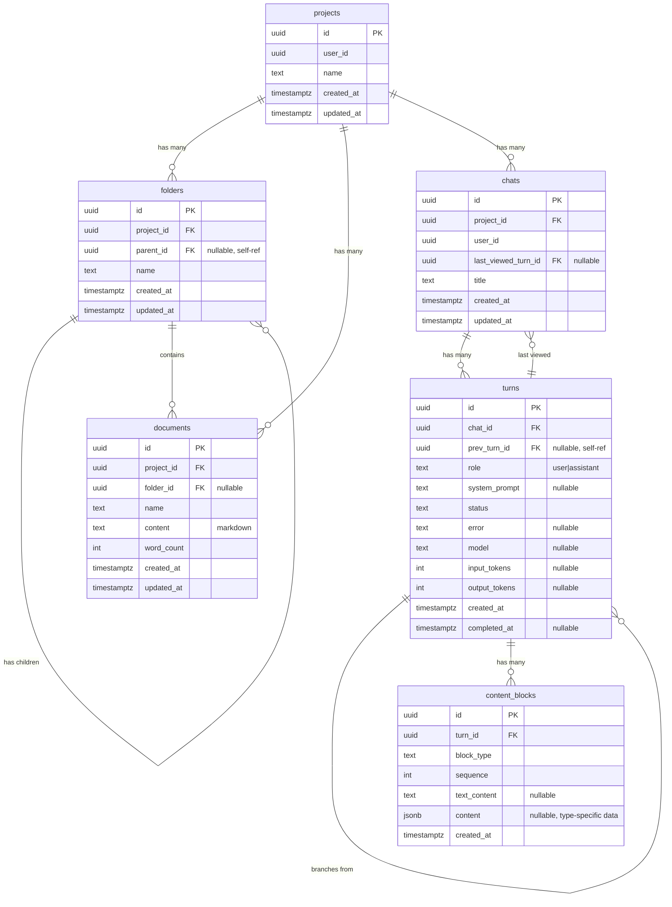
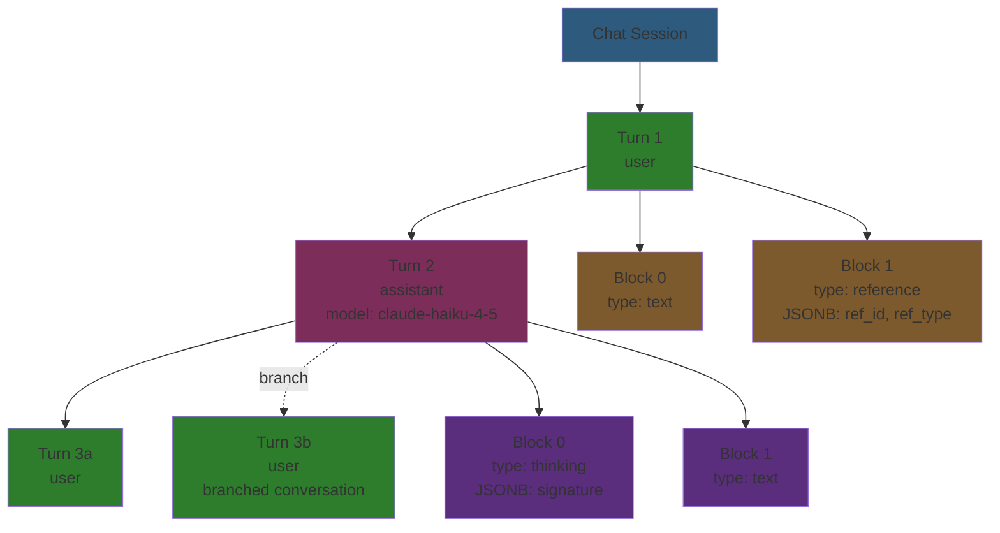

# Database Schema

Complete PostgreSQL database schema for Meridian: file management + LLM chat system.

## System Overview

**Note:** Both `folders` and `documents` include a computed `path` field in API responses (not stored in database). This field contains the full hierarchical path including the entity's own name (e.g., "World Building/Locations/Cities"). See [API Contracts](../api/contracts.md#path-computation) for details.



## File System

Hierarchical file organization with folders and markdown content.

### Tables

#### `projects`

Top-level container for all user content (documents + chats).

**Columns:**
- `id` (UUID, PK) - Auto-generated
- `user_id` (UUID) - Owner (not enforced as FK in Phase 1)
- `name` (TEXT) - Project name
- `created_at`, `updated_at` (TIMESTAMPTZ) - Timestamps
- `deleted_at` (TIMESTAMPTZ, nullable) - Soft delete timestamp

**Constraints:**
- `UNIQUE(user_id, name)` - No duplicate project names per user

**Deletion Behavior:**
- CASCADE to folders and chats
- RESTRICT on documents (must delete documents first)

#### `folders`

Hierarchical folder structure using adjacency list pattern (self-referencing tree).

**API Naming Note:** The database column is named `parent_id`, but the API exposes this field as `folder_id` for consistency with document references. Both folders and documents use `folder_id` in the API: folders reference their parent folder, documents reference their containing folder.

**Columns:**
- `id` (UUID, PK) - Auto-generated
- `project_id` (UUID, FK → projects) - Parent project
- `parent_id` (UUID, FK → folders, nullable) - Parent folder (NULL = root level)
- `name` (TEXT) - Folder name (no slashes allowed)
- `created_at`, `updated_at` (TIMESTAMPTZ) - Timestamps
- `deleted_at` (TIMESTAMPTZ, nullable) - Soft delete timestamp

**Constraints:**
- `UNIQUE(project_id, parent_id, name)` - No duplicate names at same level
- Self-referencing FK prevents orphaned folders (CASCADE on parent delete)

**Deletion Behavior:**
- CASCADE when parent folder or project deleted
- Backend validates against circular references (can't move folder into its own descendant)

**Indexes:**
- `idx_folders_project_parent` on `(project_id, parent_id)` - Fast hierarchy traversal
- `idx_folders_root_unique` on `(project_id, name) WHERE parent_id IS NULL` - Root uniqueness

#### `documents`

Content documents (leaf nodes in hierarchy). Store markdown content.

**Columns:**
- `id` (UUID, PK) - Auto-generated
- `project_id` (UUID, FK → projects) - Parent project
- `folder_id` (UUID, FK → folders, nullable) - Parent folder (NULL = root level)
- `name` (TEXT) - Document name (no slashes allowed, filesystem semantics)
- `content` (TEXT) - Markdown content (canonical storage format)
- `word_count` (INTEGER) - Computed from markdown on create/update
- `created_at`, `updated_at` (TIMESTAMPTZ) - Timestamps
- `deleted_at` (TIMESTAMPTZ, nullable) - Soft delete timestamp

**Constraints:**
- `UNIQUE(project_id, folder_id, name)` - No duplicate names in same folder

**Deletion Behavior:**
- SET NULL when folder deleted (document moves to root, preserves content)
- RESTRICT when project deleted (must delete documents first)

**Indexes:**
- `idx_documents_project_id` on `project_id` - Fast project queries
- `idx_documents_project_folder` on `(project_id, folder_id)` - Fast folder queries
- `idx_documents_root_unique` on `(project_id, name) WHERE folder_id IS NULL` - Root uniqueness

### Content Storage

**Format:** Markdown (TEXT)

Documents store content as plain markdown. Frontend editor (TipTap) converts to/from markdown at API boundary.

**Why markdown?**
- Single source of truth
- Word counting, search indexing
- Human-readable backups
- Import/export compatibility

### Path Computation

Paths are **computed** (not stored) by traversing folder hierarchy using recursive CTE.

**Why computed?**
- Single source of truth (folder names)
- Renaming folders updates all paths automatically
- No synchronization issues

**Implementation:** See `internal/service/docsystem/tree.go` and `internal/repository/postgres/docsystem/document.go:GetPath()`

### Folder Hierarchy

Uses **adjacency list pattern**: each folder has a `parent_id` pointing to its parent.

**Root folders:** `parent_id IS NULL`
**Nested folders:** `parent_id = <parent-folder-id>`

**Circular prevention:** Backend validates folder moves. See `internal/service/docsystem/folder.go:validateNoCircularReference()`

## Chat System

LLM-powered chat sessions with tree-structured conversations and unified JSONB content blocks.



### Tables

#### `chats`

Chat sessions scoped to projects.

**Columns:**
- `id` (UUID, PK) - Auto-generated
- `project_id` (UUID, FK → projects) - Parent project
- `user_id` (UUID) - Owner
- `title` (TEXT) - Chat title
- `last_viewed_turn_id` (UUID, FK → turns, nullable) - Last turn viewed by user (for UI navigation)
- `created_at`, `updated_at` (TIMESTAMPTZ) - Timestamps
- `deleted_at` (TIMESTAMPTZ, nullable) - Soft delete timestamp

**Deletion Behavior:**
- CASCADE when project deleted
- CASCADE to all turns (and transitively to content_blocks)
- SET NULL on last_viewed_turn_id when referenced turn deleted

**Indexes:**
- `idx_chats_project` on `project_id` - Fast project queries
- `idx_chats_user` on `user_id` - Fast user queries
- `idx_chats_last_viewed` on `last_viewed_turn_id` - Fast navigation queries

#### `turns`

Conversation tree structure. Each turn is either a user message or assistant response.

**Columns:**
- `id` (UUID, PK) - Auto-generated
- `chat_id` (UUID, FK → chats) - Parent chat session
- `prev_turn_id` (UUID, FK → turns, nullable) - Previous turn in conversation (NULL = first turn)
- `role` (TEXT) - `'user'` or `'assistant'`
- `system_prompt` (TEXT, nullable) - System instructions for this turn
- `status` (TEXT) - One of: `'pending'`, `'streaming'`, `'waiting_subagents'`, `'complete'`, `'cancelled'`, `'error'`
- `error` (TEXT, nullable) - Error message if status = `'error'`
- `model` (TEXT, nullable) - LLM model identifier (e.g., `'claude-haiku-4-5-20251001'`) for assistant turns
- `input_tokens` (INT, nullable) - Token count for input context
- `output_tokens` (INT, nullable) - Token count for generated output
- `created_at` (TIMESTAMPTZ) - Turn creation time
- `completed_at` (TIMESTAMPTZ, nullable) - Turn completion time

**Constraints:**
- CHECK: `role IN ('user', 'assistant')`
- CHECK: `status IN ('pending', 'streaming', 'waiting_subagents', 'complete', 'cancelled', 'error')`
- Self-referencing FK enables tree structure (branching conversations)

**Deletion Behavior:**
- CASCADE when prev turn or chat deleted
- CASCADE to child turns (deletes entire conversation branch)
- CASCADE to content_blocks

**Indexes:**
- `idx_turns_chat` on `chat_id` - Fast chat queries
- `idx_turns_prev` on `prev_turn_id` - Fast tree traversal

#### `content_blocks`

Unified multimodal content for both user and assistant turns. Uses JSONB for type-specific structured data.

**Columns:**
- `id` (UUID, PK) - Auto-generated
- `turn_id` (UUID, FK → turns) - Parent turn
- `block_type` (TEXT) - One of: `'text'`, `'thinking'`, `'tool_use'`, `'tool_result'`, `'image'`, `'reference'`, `'partial_reference'`
- `sequence` (INT) - Order within turn (0-indexed)
- `text_content` (TEXT, nullable) - Plain text content (for text, thinking, tool_result blocks)
- `content` (JSONB, nullable) - Type-specific structured data (see schemas below)
- `created_at` (TIMESTAMPTZ) - Block creation time

**Block Types:**
- **User blocks:** text, image, reference, partial_reference, tool_result
- **Assistant blocks:** text, thinking, tool_use
- **Both:** text (different purposes)

**JSONB Content Schemas:**

| Block Type | text_content | content (JSONB) | Example |
|------------|--------------|-----------------|---------|
| `text` | Plain text | `null` | User message or assistant response text |
| `thinking` | Reasoning text | `{"signature": "4k_a"}` (optional) | Claude's internal reasoning |
| `tool_use` | `null` | `{"tool_use_id": "toolu_...", "tool_name": "...", "input": {...}}` | LLM tool invocation |
| `tool_result` | Result text | `{"tool_use_id": "toolu_...", "is_error": false}` | Tool execution result |
| `image` | `null` | `{"url": "...", "mime_type": "...", "alt_text": "..."}` | Image attachment |
| `reference` | `null` | `{"ref_id": "...", "ref_type": "document\|image\|s3_document", "version_timestamp": "...", "selection_start": 0, "selection_end": 100}` | Document reference |
| `partial_reference` | `null` | `{"ref_id": "...", "ref_type": "document", "selection_start": 0, "selection_end": 100}` | Text selection reference |

**Constraints:**
- CHECK: `block_type IN ('text', 'thinking', 'tool_use', 'tool_result', 'image', 'reference', 'partial_reference')`
- UNIQUE: `(turn_id, sequence)` - Prevents duplicate sequences within a turn

**Deletion Behavior:**
- CASCADE when turn deleted

**Indexes:**
- `idx_content_blocks_turn_sequence` on `(turn_id, sequence)` - Fast ordered retrieval
- `idx_content_blocks_turn_type` on `(turn_id, block_type)` - Filter blocks by type
- `idx_content_blocks_content_gin` (GIN) on `content` - Fast JSONB queries

**Validation:** Type-specific JSONB schemas validated in application layer. See `internal/domain/models/llm/content_types.go`

### Turn Tree Structure

Turns use a **linked-list tree** via `prev_turn_id` self-reference, enabling:

**Branching conversations:**
```
Turn 1 (user: "Write a story")
  └─ Turn 2 (assistant: "Once upon a time...")
      ├─ Turn 3a (user: "Make it darker")
      └─ Turn 3b (user: "Add more humor")  ← Branch from Turn 2
```

Each branch can continue independently. This allows users to explore alternative conversation paths.

**Root turns:** `prev_turn_id IS NULL` (first message in chat)
**Nested turns:** `prev_turn_id = <previous-turn-id>`

### Content Block Sequencing

Content blocks are **ordered within a turn** using the `sequence` field (0-indexed).

**Example user message with reference:**
```
Turn ID: abc-123
  └─ Block 0: type=text, text_content="Please review this:"
  └─ Block 1: type=reference, content={"ref_id": "xyz-456", "ref_type": "document"}
  └─ Block 2: type=text, text_content="What do you think?"
```

**Example assistant response with thinking:**
```
Turn ID: def-456
  └─ Block 0: type=thinking, text_content="User wants analysis...", content={"signature": "4k_a"}
  └─ Block 1: type=text, text_content="This document demonstrates..."
```

This preserves the exact order of multimodal content for LLM processing and display.

### Reference System

Content blocks can **reference documents** using the JSONB `content` field:

**Full document reference (`reference`):**
```json
{
  "ref_id": "uuid-of-document",
  "ref_type": "document",
  "version_timestamp": "2025-01-15T10:30:00Z"
}
```

**Text selection reference (`partial_reference`):**
```json
{
  "ref_id": "uuid-of-document",
  "ref_type": "document",
  "selection_start": 100,
  "selection_end": 500
}
```

**Use cases:**
- `'reference'` - Full document reference ("Review this entire document")
- `'partial_reference'` - Text selection ("Review lines 10-50")

This enables context-aware chat where LLM can access document content.

## Cross-System Features

### Dynamic Table Names

Tables use environment-specific prefixes to enable multiple environments in same database:

| Environment | Prefix | Example |
|-------------|--------|---------|
| dev | `dev_` | `dev_projects`, `dev_chats` |
| test | `test_` | `test_projects`, `test_chats` |
| prod | `prod_` | `prod_projects`, `prod_chats` |

**Configured via:** `ENVIRONMENT` environment variable
**Implementation:** See `internal/repository/postgres/connection.go`

**Code usage:**
```go
// ✅ Correct
query := fmt.Sprintf("SELECT * FROM %s WHERE id = $1", db.Tables.Documents)

// ❌ Wrong
query := "SELECT * FROM documents WHERE id = $1"
```

### Uniqueness Rules

**Projects:**
- `UNIQUE(user_id, name)` - No duplicate project names per user

**Folders:**
- `UNIQUE(project_id, parent_id, name)` - No duplicate names at same level
- Different levels can have same name (e.g., root `"Notes"` and `"Characters/Notes"`)

**Documents:**
- `UNIQUE(project_id, folder_id, name)` - No duplicate names in same folder
- Same name allowed in different folders

### Soft Delete System

Primary resources (projects, folders, documents, chats) support soft deletion via `deleted_at` timestamp.

**Behavior:**
- Soft-deleted resources return 404 (treated as non-existent)
- Create operations validate parents aren't soft-deleted (service layer validators)
- Soft-delete does NOT cascade to children
- Hard delete (row removal) uses database CASCADE rules

**Implementation:** See `internal/service/docsystem/validation.go` and `internal/service/llm/validation.go`

## Indexes

### File System

| Index | Columns | Type | Purpose |
|-------|---------|------|---------|
| `idx_projects_user_name` | `(user_id, name)` | UNIQUE | Enforce unique project names per user |
| `idx_folders_project_parent` | `(project_id, parent_id)` | BTREE | Fast hierarchy traversal |
| `idx_folders_root_unique` | `(project_id, name) WHERE parent_id IS NULL` | UNIQUE PARTIAL | Root-level folder uniqueness |
| `idx_documents_project_id` | `project_id` | BTREE | Fast project document queries |
| `idx_documents_project_folder` | `(project_id, folder_id)` | BTREE | Fast folder document queries |
| `idx_documents_root_unique` | `(project_id, name) WHERE folder_id IS NULL` | UNIQUE PARTIAL | Root-level document uniqueness |

### Chat System

| Index | Columns | Type | Purpose |
|-------|---------|------|---------|
| `idx_chats_project` | `project_id` | BTREE | Fast project chat queries |
| `idx_chats_user` | `user_id` | BTREE | Fast user chat queries |
| `idx_chats_last_viewed` | `last_viewed_turn_id` | BTREE | Fast navigation queries |
| `idx_turns_chat` | `chat_id` | BTREE | Fast chat turn queries |
| `idx_turns_prev` | `prev_turn_id` | BTREE | Fast tree traversal |
| `idx_content_blocks_turn_sequence` | `(turn_id, sequence)` | BTREE | Fast ordered block retrieval |
| `idx_content_blocks_turn_type` | `(turn_id, block_type)` | BTREE | Filter blocks by type |
| `idx_content_blocks_content_gin` | `content` | GIN | Fast JSONB queries |

## Foreign Key Behavior Summary

### File System

| Parent | Child | FK Column | ON DELETE |
|--------|-------|-----------|-----------|
| projects | folders | project_id | CASCADE |
| projects | documents | project_id | RESTRICT |
| folders (parent) | folders (child) | parent_id | CASCADE |
| folders | documents | folder_id | SET NULL |

**Rationale:**
- CASCADE for folders: Structural cleanup (deleting parent folder deletes children)
- RESTRICT for documents: Prevent accidental data loss (must explicitly delete documents first)
- SET NULL for document folders: Preserve content (deleting folder moves documents to root)

### Chat System

| Parent | Child | FK Column | ON DELETE |
|--------|-------|-----------|-----------|
| projects | chats | project_id | CASCADE |
| chats | turns | chat_id | CASCADE |
| turns (prev) | turns (child) | prev_turn_id | CASCADE |
| turns | chats | last_viewed_turn_id | SET NULL |
| turns | content_blocks | turn_id | CASCADE |

**Rationale:**
- All CASCADE: Chat data is transient/ephemeral (no accidental data loss concerns)
- Deleting a turn deletes entire conversation branch
- SET NULL for last_viewed_turn_id: Chat persists even if last viewed turn is deleted

## Setup

Schema managed via **migrations** (not static SQL file).

**Migration file:** `backend/migrations/00001_initial_schema.sql`
**Migration tool:** goose
**Environment:** Uses `ENVIRONMENT` variable for table prefixes

See `backend/CLAUDE.md` for development setup and `make seed-fresh` for test data seeding.

## References

- Connection setup: [connections.md](connections.md)
- Migration file: `backend/migrations/00001_initial_schema.sql`
- Table name configuration: `internal/repository/postgres/connection.go`
- Content validation: `internal/domain/models/llm/content_types.go`
