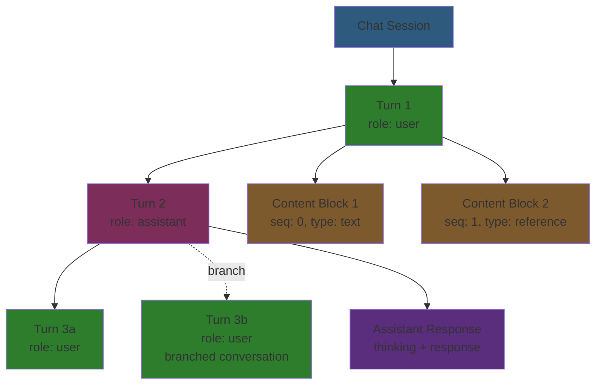

# Database Schema

Complete PostgreSQL database schema for Meridian: file management + LLM chat system.

## System Overview

```mermaid
erDiagram
    projects ||--o{ folders : "has many"
    projects ||--o{ documents : "has many"
    projects ||--o{ chats : "has many"
    folders ||--o{ folders : "has children"
    folders ||--o{ documents : "contains"
    chats ||--o{ turns : "has many"
    turns ||--o{ turns : "branches from"
    turns ||--o{ content_blocks : "has many"
    turns ||--o| assistant_responses : "has one"

    projects {
        uuid id PK
        uuid user_id
        text name
        timestamptz created_at
        timestamptz updated_at
    }

    folders {
        uuid id PK
        uuid project_id FK
        uuid parent_id FK "nullable, self-ref"
        text name
        timestamptz created_at
        timestamptz updated_at
    }

    documents {
        uuid id PK
        uuid project_id FK
        uuid folder_id FK "nullable"
        text name
        text content "markdown"
        int word_count
        timestamptz created_at
        timestamptz updated_at
    }

    chats {
        uuid id PK
        uuid project_id FK
        uuid user_id
        text title "nullable"
        timestamptz created_at
        timestamptz updated_at
    }

    turns {
        uuid id PK
        uuid chat_id FK
        uuid parent_id FK "nullable, self-ref"
        text role "user|assistant"
        text system_prompt "nullable"
        text status
        text error "nullable"
        timestamptz created_at
        timestamptz completed_at "nullable"
    }

    content_blocks {
        uuid id PK
        uuid turn_id FK
        text block_type
        int sequence
        text text_content "nullable"
        timestamptz version_timestamp "nullable"
        uuid ref_id "nullable"
        text ref_type "nullable"
        text image_url "nullable"
        text image_mime_type "nullable"
        int selection_start "nullable"
        int selection_end "nullable"
        timestamptz created_at
    }

    assistant_responses {
        uuid turn_id PK_FK
        text thinking "nullable"
        text response "nullable"
        int token_count "nullable"
        text model "nullable"
        timestamptz created_at
        timestamptz updated_at
    }
```

## File System

Hierarchical file organization with folders and markdown content.

### Tables

#### `projects`

Top-level container for all user content (documents + chats).

**Columns:**
- `id` (UUID, PK) - Auto-generated
- `user_id` (UUID) - Owner (not enforced as FK in Phase 1)
- `name` (TEXT) - Project name
- `created_at`, `updated_at` (TIMESTAMPTZ) - Timestamps

**Constraints:**
- `UNIQUE(user_id, name)` - No duplicate project names per user

**Deletion Behavior:**
- CASCADE to folders and chats
- RESTRICT on documents (must delete documents first)

#### `folders`

Hierarchical folder structure using adjacency list pattern (self-referencing tree).

**API Naming Note:** The database column is named `parent_id`, but the API exposes this field as `folder_id` for consistency with document references. Both folders and documents use `folder_id` in the API: folders reference their parent folder, documents reference their containing folder.

**Columns:**
- `id` (UUID, PK) - Auto-generated
- `project_id` (UUID, FK → projects) - Parent project
- `parent_id` (UUID, FK → folders, nullable) - Parent folder (NULL = root level)
- `name` (TEXT) - Folder name (no slashes allowed)
- `created_at`, `updated_at` (TIMESTAMPTZ) - Timestamps

**Constraints:**
- `UNIQUE(project_id, parent_id, name)` - No duplicate names at same level
- Self-referencing FK prevents orphaned folders (CASCADE on parent delete)

**Deletion Behavior:**
- CASCADE when parent folder or project deleted
- Backend validates against circular references (can't move folder into its own descendant)

**Indexes:**
- `idx_folders_project_parent` on `(project_id, parent_id)` - Fast hierarchy traversal
- `idx_folders_root_unique` on `(project_id, name) WHERE parent_id IS NULL` - Root uniqueness

#### `documents`

Content documents (leaf nodes in hierarchy). Store markdown content.

**Columns:**
- `id` (UUID, PK) - Auto-generated
- `project_id` (UUID, FK → projects) - Parent project
- `folder_id` (UUID, FK → folders, nullable) - Parent folder (NULL = root level)
- `name` (TEXT) - Document name (no slashes allowed, filesystem semantics)
- `content` (TEXT) - Markdown content (canonical storage format)
- `word_count` (INTEGER) - Computed from markdown on create/update
- `created_at`, `updated_at` (TIMESTAMPTZ) - Timestamps

**Constraints:**
- `UNIQUE(project_id, folder_id, name)` - No duplicate names in same folder

**Deletion Behavior:**
- SET NULL when folder deleted (document moves to root, preserves content)
- RESTRICT when project deleted (must delete documents first)

**Indexes:**
- `idx_documents_project_id` on `project_id` - Fast project queries
- `idx_documents_project_folder` on `(project_id, folder_id)` - Fast folder queries
- `idx_documents_root_unique` on `(project_id, name) WHERE folder_id IS NULL` - Root uniqueness

### Content Storage

**Format:** Markdown (TEXT)

Documents store content as plain markdown. Frontend editor (TipTap) converts to/from markdown at API boundary.

**Why markdown?**
- Single source of truth
- Word counting, search indexing
- Human-readable backups
- Import/export compatibility

### Path Computation

Paths are **computed** (not stored) by traversing folder hierarchy using recursive CTE.

**Why computed?**
- Single source of truth (folder names)
- Renaming folders updates all paths automatically
- No synchronization issues

**Implementation:** See `internal/service/docsystem/tree.go` and `internal/repository/postgres/docsystem/document.go:GetPath()`

### Folder Hierarchy

Uses **adjacency list pattern**: each folder has a `parent_id` pointing to its parent.

**Root folders:** `parent_id IS NULL`
**Nested folders:** `parent_id = <parent-folder-id>`

**Circular prevention:** Backend validates folder moves. See `internal/service/docsystem/folder.go:validateNoCircularReference()`

## Chat System

LLM-powered chat sessions with tree-structured conversations and multimodal input.



### Tables

#### `chats`

Chat sessions scoped to projects.

**Columns:**
- `id` (UUID, PK) - Auto-generated
- `project_id` (UUID, FK → projects) - Parent project
- `user_id` (UUID) - Owner
- `title` (TEXT, nullable) - Chat title (optional, can be auto-generated)
- `created_at`, `updated_at` (TIMESTAMPTZ) - Timestamps

**Deletion Behavior:**
- CASCADE when project deleted
- CASCADE to all turns (and transitively to content_blocks + assistant_responses)

**Indexes:**
- `idx_chats_project` on `project_id` - Fast project queries
- `idx_chats_user` on `user_id` - Fast user queries

#### `turns`

Conversation tree structure. Each turn is either a user message or assistant response.

**Columns:**
- `id` (UUID, PK) - Auto-generated
- `chat_id` (UUID, FK → chats) - Parent chat session
- `parent_id` (UUID, FK → turns, nullable) - Parent turn (NULL = first turn in conversation)
- `role` (TEXT) - `'user'` or `'assistant'`
- `system_prompt` (TEXT, nullable) - System instructions for this turn
- `status` (TEXT) - One of: `'pending'`, `'streaming'`, `'waiting_subagents'`, `'complete'`, `'cancelled'`, `'error'`
- `error` (TEXT, nullable) - Error message if status = `'error'`
- `created_at` (TIMESTAMPTZ) - Turn creation time
- `completed_at` (TIMESTAMPTZ, nullable) - Turn completion time

**Constraints:**
- CHECK: `role IN ('user', 'assistant')`
- CHECK: `status IN ('pending', 'streaming', 'waiting_subagents', 'complete', 'cancelled', 'error')`
- Self-referencing FK enables tree structure (branching conversations)

**Deletion Behavior:**
- CASCADE when parent turn or chat deleted
- CASCADE to child turns (deletes entire conversation branch)
- CASCADE to content_blocks and assistant_responses

**Indexes:**
- `idx_turns_chat` on `chat_id` - Fast chat queries
- `idx_turns_parent` on `parent_id` - Fast tree traversal

#### `content_blocks`

Multimodal user input (text, images, document references). Ordered by sequence.

**Columns:**
- `id` (UUID, PK) - Auto-generated
- `turn_id` (UUID, FK → turns) - Parent turn
- `block_type` (TEXT) - One of: `'text'`, `'image'`, `'reference'`, `'partial_reference'`
- `sequence` (INT) - Order within turn (0-indexed)
- `text_content` (TEXT, nullable) - Text content (for type = `'text'`)
- `version_timestamp` (TIMESTAMPTZ, nullable) - Document snapshot timestamp (for references)
- `ref_id` (UUID, nullable) - Referenced document/image ID
- `ref_type` (TEXT, nullable) - One of: `'document'`, `'image'`, `'s3_document'`
- `image_url` (TEXT, nullable) - Image URL (for type = `'image'`)
- `image_mime_type` (TEXT, nullable) - Image MIME type
- `selection_start`, `selection_end` (INT, nullable) - Text selection range (for partial references)
- `created_at` (TIMESTAMPTZ) - Block creation time

**Constraints:**
- CHECK: `block_type IN ('text', 'image', 'reference', 'partial_reference')`
- CHECK: `ref_type IN ('document', 'image', 's3_document')`

**Deletion Behavior:**
- CASCADE when turn deleted

**Indexes:**
- `idx_content_blocks_turn_seq` on `(turn_id, sequence)` - Fast ordered retrieval
- `idx_content_blocks_ref` on `ref_id WHERE ref_id IS NOT NULL` - Fast reference lookups

#### `assistant_responses`

AI-generated responses cached for each assistant turn. One-to-one with turns.

**Columns:**
- `turn_id` (UUID, PK/FK → turns) - Parent turn (also primary key)
- `thinking` (TEXT, nullable) - Internal reasoning (e.g., Claude's `<thinking>` blocks)
- `response` (TEXT, nullable) - Final response text
- `token_count` (INT, nullable) - Total tokens used
- `model` (TEXT, nullable) - Model identifier (e.g., `'claude-sonnet-4'`)
- `created_at`, `updated_at` (TIMESTAMPTZ) - Timestamps

**Deletion Behavior:**
- CASCADE when turn deleted

**No additional indexes:** PK on `turn_id` is sufficient for lookups

### Turn Tree Structure

Turns use a **parent-child tree** via `parent_id` self-reference, enabling:

**Branching conversations:**
```
Turn 1 (user: "Write a story")
  └─ Turn 2 (assistant: "Once upon a time...")
      ├─ Turn 3a (user: "Make it darker")
      └─ Turn 3b (user: "Add more humor")  ← Branch from Turn 2
```

Each branch can continue independently. This allows users to explore alternative conversation paths.

**Root turns:** `parent_id IS NULL` (first message in chat)
**Nested turns:** `parent_id = <parent-turn-id>`

### Content Block Sequencing

Content blocks are **ordered within a turn** using the `sequence` field (0-indexed).

**Example user message:**
```
Turn ID: abc-123
  └─ Content Block 0: text "Please review this:"
  └─ Content Block 1: reference (doc ID: xyz-456)
  └─ Content Block 2: text "What do you think?"
```

This preserves the exact order of multimodal input for LLM processing.

### Reference System

Content blocks can **reference documents** using:
- `ref_id` - Document UUID
- `ref_type` - `'document'`
- `version_timestamp` - Optional snapshot timestamp (future: versioning)
- `selection_start`, `selection_end` - Optional text selection range

**Use cases:**
- `'reference'` - Full document reference ("Review this entire document")
- `'partial_reference'` - Text selection ("Review lines 10-50")

This enables context-aware chat where LLM can access document content.

## Cross-System Features

### Dynamic Table Names

Tables use environment-specific prefixes to enable multiple environments in same database:

| Environment | Prefix | Example |
|-------------|--------|---------|
| dev | `dev_` | `dev_projects`, `dev_chats` |
| test | `test_` | `test_projects`, `test_chats` |
| prod | `prod_` | `prod_projects`, `prod_chats` |

**Configured via:** `ENVIRONMENT` environment variable
**Implementation:** See `internal/repository/postgres/connection.go`

**Code usage:**
```go
// ✅ Correct
query := fmt.Sprintf("SELECT * FROM %s WHERE id = $1", db.Tables.Documents)

// ❌ Wrong
query := "SELECT * FROM documents WHERE id = $1"
```

### Uniqueness Rules

**Projects:**
- `UNIQUE(user_id, name)` - No duplicate project names per user

**Folders:**
- `UNIQUE(project_id, parent_id, name)` - No duplicate names at same level
- Different levels can have same name (e.g., root `"Notes"` and `"Characters/Notes"`)

**Documents:**
- `UNIQUE(project_id, folder_id, name)` - No duplicate names in same folder
- Same name allowed in different folders

## Indexes

### File System

| Index | Columns | Type | Purpose |
|-------|---------|------|---------|
| `idx_projects_user_name` | `(user_id, name)` | UNIQUE | Enforce unique project names per user |
| `idx_folders_project_parent` | `(project_id, parent_id)` | BTREE | Fast hierarchy traversal |
| `idx_folders_root_unique` | `(project_id, name) WHERE parent_id IS NULL` | UNIQUE PARTIAL | Root-level folder uniqueness |
| `idx_documents_project_id` | `project_id` | BTREE | Fast project document queries |
| `idx_documents_project_folder` | `(project_id, folder_id)` | BTREE | Fast folder document queries |
| `idx_documents_root_unique` | `(project_id, name) WHERE folder_id IS NULL` | UNIQUE PARTIAL | Root-level document uniqueness |

### Chat System

| Index | Columns | Type | Purpose |
|-------|---------|------|---------|
| `idx_chats_project` | `project_id` | BTREE | Fast project chat queries |
| `idx_chats_user` | `user_id` | BTREE | Fast user chat queries |
| `idx_turns_chat` | `chat_id` | BTREE | Fast chat turn queries |
| `idx_turns_parent` | `parent_id` | BTREE | Fast tree traversal |
| `idx_content_blocks_turn_seq` | `(turn_id, sequence)` | BTREE | Fast ordered block retrieval |
| `idx_content_blocks_ref` | `ref_id WHERE ref_id IS NOT NULL` | BTREE PARTIAL | Fast reference lookups |

## Foreign Key Behavior Summary

### File System

| Parent | Child | FK Column | ON DELETE |
|--------|-------|-----------|-----------|
| projects | folders | project_id | CASCADE |
| projects | documents | project_id | RESTRICT |
| folders (parent) | folders (child) | parent_id | CASCADE |
| folders | documents | folder_id | SET NULL |

**Rationale:**
- CASCADE for folders: Structural cleanup (deleting parent folder deletes children)
- RESTRICT for documents: Prevent accidental data loss (must explicitly delete documents first)
- SET NULL for document folders: Preserve content (deleting folder moves documents to root)

### Chat System

| Parent | Child | FK Column | ON DELETE |
|--------|-------|-----------|-----------|
| projects | chats | project_id | CASCADE |
| chats | turns | chat_id | CASCADE |
| turns (parent) | turns (child) | parent_id | CASCADE |
| turns | content_blocks | turn_id | CASCADE |
| turns | assistant_responses | turn_id | CASCADE |

**Rationale:**
- All CASCADE: Chat data is transient/ephemeral (no accidental data loss concerns)
- Deleting a turn deletes entire conversation branch

## Setup

Schema managed via **migrations** (not static SQL file).

**Migration file:** `backend/migrations/00001_initial_schema.sql`
**Migration tool:** goose
**Environment:** Uses `ENVIRONMENT` variable for table prefixes

See `backend/CLAUDE.md` for development setup and `_docs/technical/backend/database/seeding.md` for test data.

## References

- Connection setup: [connections.md](connections.md)
- Seeding test data: [seeding.md](seeding.md)
- Migration file: `backend/migrations/00001_initial_schema.sql`
- Table name configuration: `internal/repository/postgres/connection.go`
