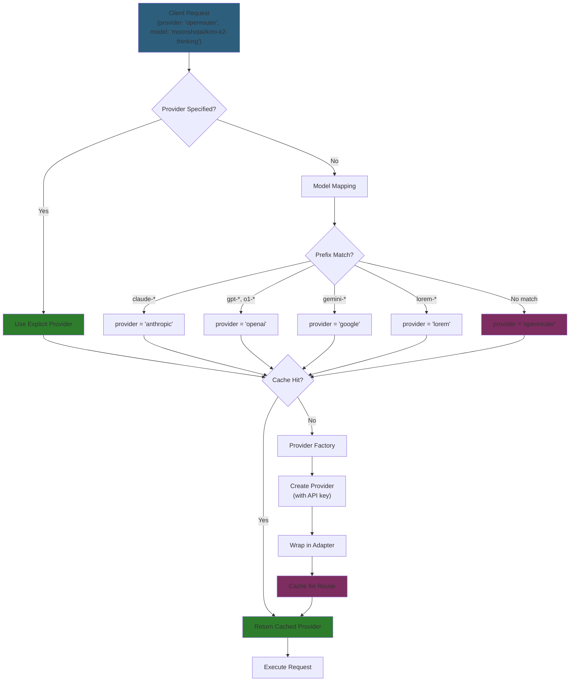

# Provider Routing

## Problem

Backend needs to route LLM requests to the correct provider (Anthropic, OpenRouter, OpenAI, etc.) based on client-specified parameters.

## Solution

Separate provider and model fields with smart defaults: Extract → Infer → Create → Cache

## Request Format

**Separate Fields:** Client sends provider and model as distinct parameters

| request_params | Provider Used | Model Sent to Provider | Notes |
|----------------|---------------|------------------------|-------|
| `{model: "claude-haiku-4-5"}` | `anthropic` | `claude-haiku-4-5` | Inferred from `claude-` prefix |
| `{model: "gpt-4o"}` | `openai` | `gpt-4o` | Inferred from `gpt-` prefix |
| `{model: "gemini-2.0-flash"}` | `google` | `gemini-2.0-flash` | Inferred from `gemini-` prefix |
| `{model: "moonshotai/kimi-k2"}` | `openrouter` | `moonshotai/kimi-k2` | No prefix match → defaults to OpenRouter |
| `{provider: "openrouter", model: "anthropic/claude-sonnet-4-5"}` | `openrouter` | `anthropic/claude-sonnet-4-5` | Explicit provider override |

**Implementation:** `backend/internal/domain/models/llm/model_mapping.go:10-41`

## Provider Factory

Creates provider instances with API keys from environment variables.

**Supported Providers:** Anthropic, OpenRouter, OpenAI, Google, Lorem (testing)

**Implementation:** `backend/internal/service/llm/provider_factory.go`

## Registry

Caches provider instances per provider name to avoid recreating clients.

**Thread-safe:** Uses `sync.RWMutex` for concurrent access

**Implementation:** `backend/internal/service/llm/registry.go:27-80`

## Model Mapping

Smart defaults infer provider from model name prefixes when provider not specified.

**Mappings:**
- `claude-*` → anthropic
- `gpt-*`, `o1-*`, `text-*`, `davinci-*` → openai
- `gemini-*` → google
- `lorem-*` → lorem (testing)
- **No match** → openrouter (universal fallback)

**Implementation:** `backend/internal/domain/models/llm/model_mapping.go:10-41`

## References

- **Model mapping:** `backend/internal/domain/models/llm/model_mapping.go`
- **Provider factory:** `backend/internal/service/llm/provider_factory.go`
- **Registry:** `backend/internal/service/llm/registry.go`
- **Request extraction:** `backend/internal/service/llm/streaming/service.go:96-130`

## See Also

- [LLM Integration Guide](llm-integration.md) - Complete backend integration patterns
- [Environment Gating](environment-gating.md) - Tool restrictions
