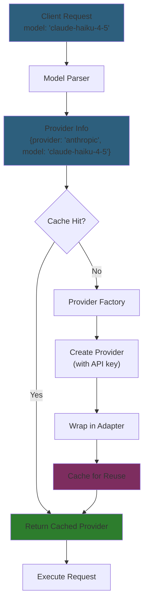

# Provider Routing

## Problem

Backend needs to route model strings like `"claude-haiku-4-5"` or `"openrouter/anthropic/claude-sonnet"` to the correct LLM provider.

## Solution

Three-step pattern: Parse → Create → Cache

## Model Parsing

**Format:** `[provider/]model`

| Input | Provider | Model | Notes |
|-------|----------|-------|-------|
| `claude-haiku-4-5` | `anthropic` | `claude-haiku-4-5` | Inferred from prefix |
| `gpt-4o` | `openai` | `gpt-4o` | Inferred from prefix |
| `openrouter/anthropic/claude` | `openrouter` | `anthropic/claude` | Explicit provider |
| `bedrock/claude-haiku` | `bedrock` | `claude-haiku` | Explicit provider |

**Implementation:** `backend/internal/service/llm/model_parser.go:14-42`

## Provider Factory

Creates provider instances with API keys from environment variables.

**Current:** Anthropic only
**Planned:** OpenAI, Gemini, OpenRouter, Bedrock

**Implementation:** `backend/internal/service/llm/provider_factory.go:10-34`

## Registry

Caches provider instances per provider name to avoid recreating clients.

**Thread-safe:** Uses `sync.RWMutex` for concurrent access

**Implementation:** `backend/internal/service/llm/registry.go:15-80`

## References

- **Model parser:** `backend/internal/service/llm/model_parser.go`
- **Provider factory:** `backend/internal/service/llm/provider_factory.go`
- **Registry:** `backend/internal/service/llm/registry.go`
- **Setup:** `backend/internal/service/llm/setup.go:20-49`
- **Tests:** `backend/internal/service/llm/model_parser_test.go` (17 tests)

## See Also

- [LLM Integration Guide](llm-integration.md) - Complete backend integration patterns
- [Environment Gating](environment-gating.md) - Tool restrictions
- [Phase 2 Handoff](../../hidden/handoffs/phase-2-completion.md) - Implementation summary
