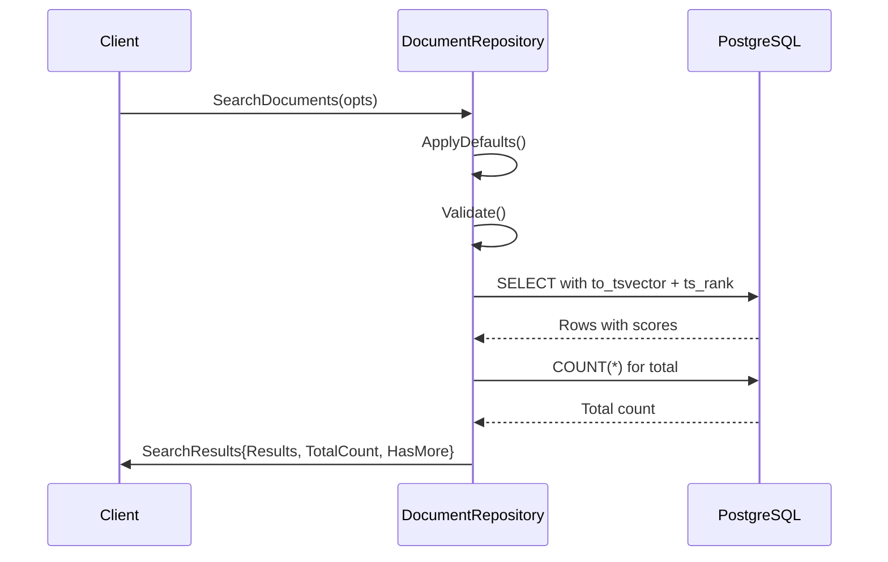

# Search Architecture

This document describes Meridian's document search architecture, designed for extensibility from full-text search to semantic/vector search.

## Current Implementation: Full-Text Search (FTS)

### Overview

PostgreSQL full-text search with configurable language support, relevance ranking, and pagination.

**Strategy**: `SearchStrategyFullText`



### Domain Models

**SearchOptions** - Configures search behavior
```go
type SearchOptions struct {
    Query     string           // Search query (required)
    ProjectID string           // Optional: scope to project (empty string = search all projects)
    Fields    []SearchField    // Which fields to search (default: [name, content])
    Limit     int              // Page size (default: 20, max: 100)
    Offset    int              // Skip N results (default: 0)
    Language  string           // FTS language config (default: "english")
    Strategy  SearchStrategy   // Algorithm selector (default: fulltext)
    FolderID  *string          // Optional: filter by folder
}
```

**SearchResults** - Returns matches with metadata
```go
type SearchResults struct {
    Results    []SearchResult   // Documents + scores
    TotalCount int              // Total matches (all pages)
    HasMore    bool             // More results available?
    Offset     int              // Current page offset
    Limit      int              // Current page size
    Strategy   SearchStrategy   // Algorithm used
}

type SearchResult struct {
    Document docsystem.Document  // Full document data
    Score    float64             // Relevance score (ts_rank)
    Metadata map[string]interface{}  // Strategy-specific info
}
```

### PostgreSQL Implementation

**Query Structure (Multi-Field Search):**

Search supports configurable fields (`name`, `content`) with weighted ranking:

```sql
-- Example: Searching both name and content fields
SELECT id, project_id, folder_id, name, content, word_count, created_at, updated_at,
       (ts_rank(to_tsvector($1, name), plainto_tsquery($1, $2)) * 2.0 +
        ts_rank(to_tsvector($1, content), plainto_tsquery($1, $2))) AS rank_score
FROM documents
WHERE deleted_at IS NULL
  AND (to_tsvector($1, name) @@ plainto_tsquery($1, $2) OR
       to_tsvector($1, content) @@ plainto_tsquery($1, $2))
ORDER BY rank_score DESC
LIMIT $3 OFFSET $4
```

**Field Weighting:**
- **Name matches**: 2.0x multiplier (title matches ranked higher)
- **Content matches**: 1.0x multiplier (normal weight)
- **Combined scoring**: Rank scores are added together

**Dynamic Query Building:**
- WHERE clause uses `OR` to match any selected field
- Rank expression adds weighted scores from each field
- Fields parameter controls which fields are searched (defaults to both)

**Components:**
- `to_tsvector(language, field)` - Converts text to searchable tokens
- `plainto_tsquery(language, query)` - Converts user query to search format
- `@@` operator - Full-text match
- `ts_rank()` - Relevance scoring (higher = better match)

**Indexes:**

Four GIN (Generalized Inverted Index) indexes support fast full-text search across both document content and names:

```sql
-- Content field indexes
CREATE INDEX idx_documents_content_fts_simple
ON documents USING gin(to_tsvector('simple', content))
WHERE deleted_at IS NULL;

CREATE INDEX idx_documents_content_fts_english
ON documents USING gin(to_tsvector('english', content))
WHERE deleted_at IS NULL;

-- Name field indexes (for title search)
CREATE INDEX idx_documents_name_fts_simple
ON documents USING gin(to_tsvector('simple', name))
WHERE deleted_at IS NULL;

CREATE INDEX idx_documents_name_fts_english
ON documents USING gin(to_tsvector('english', name))
WHERE deleted_at IS NULL;
```

**Index Strategy:**
- **`simple` indexes**: Language-agnostic, no stemming (exact word matching)
- **`english` indexes**: English-optimized with stemming ("running" matches "run")
- **Partial indexes**: `WHERE deleted_at IS NULL` excludes soft-deleted documents for better performance
- **Automatic selection**: PostgreSQL's query planner selects the appropriate index based on language parameter and search fields

### Multi-Language Support

**Supported Languages:**
- English, Spanish, French, German, Italian, Portuguese, Russian
- Dutch, Norwegian, Swedish, Danish, Finnish, Hungarian
- Romanian, Turkish

**Configuration:**
```go
opts := &SearchOptions{
    Query:    "búsqueda",
    Language: "spanish",  // Uses Spanish stemming and stop words
}
```

**How It Works:**
- **Stemming**: "corriendo" → "corr" (matches "correr", "corrió")
- **Stop words**: Ignores "el", "la", "de", etc.
- **Better ranking**: Language-aware relevance scoring

### Usage Example

```go
// Basic search
opts := &docsystem.SearchOptions{
    Query:     "dragon knight battle",
    ProjectID: projectID,
}
results, err := repo.SearchDocuments(ctx, opts)

// With pagination and language
opts := &docsystem.SearchOptions{
    Query:     "dragón batalla",
    ProjectID: projectID,
    Limit:     50,
    Offset:    100,
    Language:  "spanish",
}
results, err := repo.SearchDocuments(ctx, opts)

// Filter by folder
folderID := "folder-uuid"
opts := &docsystem.SearchOptions{
    Query:     "character development",
    ProjectID: projectID,
    FolderID:  &folderID,
}
results, err := repo.SearchDocuments(ctx, opts)
```

---

## Future Directions

The search architecture supports extensibility for advanced search strategies. For detailed implementation plans, see:

- **[Vector Search](../../future/ideas/search/vector-search.md)** - Semantic search using pgvector embeddings
- **[Hybrid Search](../../future/ideas/search/hybrid-search.md)** - Combining FTS + vector with Reciprocal Rank Fusion (RRF)

These strategies use the same `SearchOptions` interface and extend the existing repository pattern.

---

## Performance Tuning

### FTS Optimization

**Index Selection:**
- Use language-specific indexes for better performance
- `simple` index works for all languages but no stemming
- Create indexes for frequently used languages

**Query Optimization:**
```sql
-- Good: Uses index
WHERE to_tsvector('english', content) @@ plainto_tsquery('english', $1)

-- Bad: Cannot use index (function on left side of WHERE)
WHERE content LIKE '%dragon%'
```

**Verify Index Usage:**
```sql
EXPLAIN ANALYZE
SELECT * FROM documents
WHERE to_tsvector('english', content) @@ plainto_tsquery('english', 'dragon');

-- Should show: "Bitmap Index Scan using idx_documents_fts_english"
-- Should NOT show: "Seq Scan"
```

---

## Extension Points

The search architecture is designed for easy extension:

### Adding New Strategies

1. **Define constant:**
   ```go
   const SearchStrategyCustom SearchStrategy = "custom"
   ```

2. **Implement search method:**
   ```go
   func (r *PostgresDocumentRepository) customSearch(ctx context.Context, opts *SearchOptions) (*SearchResults, error) {
       // Implementation
   }
   ```

3. **Add to router:**
   ```go
   func (r *PostgresDocumentRepository) SearchDocuments(ctx context.Context, opts *SearchOptions) (*SearchResults, error) {
       switch opts.Strategy {
       case SearchStrategyFullText:
           return r.fullTextSearch(ctx, opts)
       case SearchStrategyCustom:
           return r.customSearch(ctx, opts)
       }
   }
   ```

### Adding Search Parameters

Extend `SearchOptions` without breaking existing code:
```go
type SearchOptions struct {
    // Existing fields...

    // New fields (optional, with defaults)
    MinScore      float64  // Minimum relevance threshold
    IncludeFields []string // Which fields to return
    Fuzzy         bool     // Enable fuzzy matching
}
```

### Adding Reranking Models

Replace RRF with ML-based reranking:
```go
// internal/service/reranking/reranker.go
type Reranker interface {
    Rerank(ctx context.Context, query string, results []SearchResult) ([]SearchResult, error)
}

// Cohere Rerank API
type CohereReranker struct {
    client *cohere.Client
}

func (r *CohereReranker) Rerank(ctx context.Context, query string, results []SearchResult) ([]SearchResult, error) {
    // Use Cohere Rerank API to reorder results
    // Better accuracy than RRF for semantic queries
}
```

---

## Related Documentation

- PostgreSQL Full-Text Search: https://www.postgresql.org/docs/current/textsearch.html
- pgvector Documentation: https://github.com/pgvector/pgvector
- RRF Paper: https://plg.uwaterloo.ca/~gvcormac/cormacksigir09-rrf.pdf
- `backend/internal/domain/models/docsystem/search.go` - Domain models
- `backend/internal/repository/postgres/docsystem/document.go` - Implementation
- `backend/migrations/00004_add_document_search_index.sql` - Database indexes
