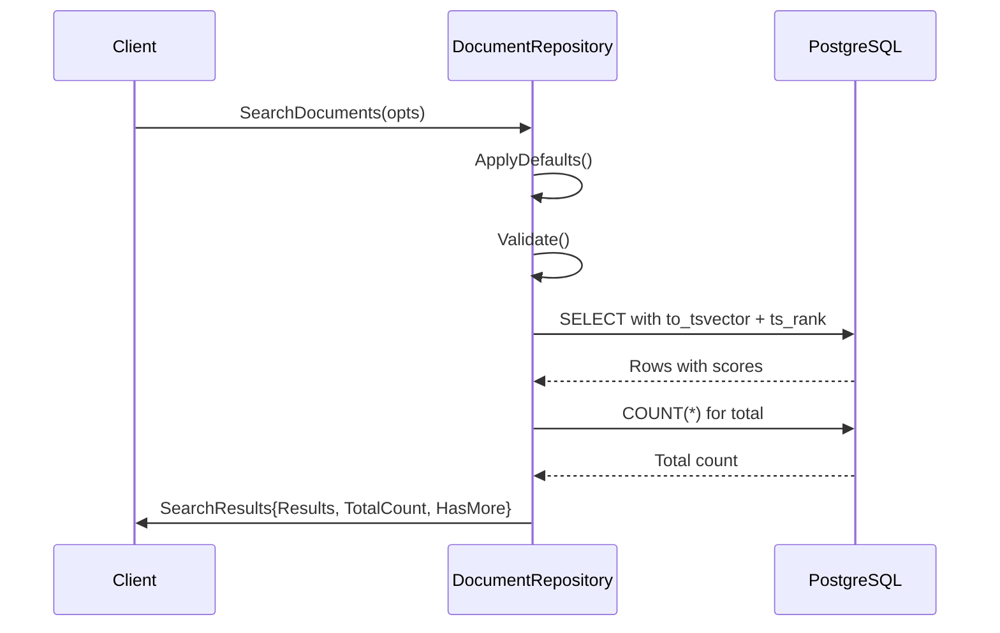
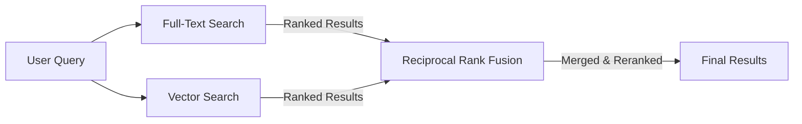

# Search Architecture

This document describes Meridian's document search architecture, designed for extensibility from full-text search to semantic/vector search.

## Current Implementation: Full-Text Search (FTS)

### Overview

PostgreSQL full-text search with configurable language support, relevance ranking, and pagination.

**Strategy**: `SearchStrategyFullText`



### Domain Models

**SearchOptions** - Configures search behavior
```go
type SearchOptions struct {
    Query     string           // Search query (required)
    ProjectID string           // Scope to project (required)
    Limit     int              // Page size (default: 20, max: 100)
    Offset    int              // Skip N results (default: 0)
    Language  string           // FTS language config (default: "english")
    Strategy  SearchStrategy   // Algorithm selector (default: fulltext)
    FolderID  *string          // Optional: filter by folder
}
```

**SearchResults** - Returns matches with metadata
```go
type SearchResults struct {
    Results    []SearchResult   // Documents + scores
    TotalCount int              // Total matches (all pages)
    HasMore    bool             // More results available?
    Offset     int              // Current page offset
    Limit      int              // Current page size
    Strategy   SearchStrategy   // Algorithm used
}

type SearchResult struct {
    Document docsystem.Document  // Full document data
    Score    float64             // Relevance score (ts_rank)
    Metadata map[string]interface{}  // Strategy-specific info
}
```

### PostgreSQL Implementation

**Query Structure:**
```sql
SELECT id, project_id, folder_id, name, content, word_count, created_at, updated_at,
       ts_rank(to_tsvector($1, content), plainto_tsquery($1, $2)) AS rank_score
FROM documents
WHERE project_id = $3
  AND deleted_at IS NULL
  AND to_tsvector($1, content) @@ plainto_tsquery($1, $2)
ORDER BY rank_score DESC
LIMIT $4 OFFSET $5
```

**Components:**
- `to_tsvector(language, content)` - Converts text to searchable tokens
- `plainto_tsquery(language, query)` - Converts user query to search format
- `@@` operator - Full-text match
- `ts_rank()` - Relevance scoring (higher = better match)

**Indexes:**
```sql
-- Language-agnostic (no stemming)
CREATE INDEX idx_documents_fts_simple
ON documents USING gin(to_tsvector('simple', content));

-- English-optimized (with stemming)
CREATE INDEX idx_documents_fts_english
ON documents USING gin(to_tsvector('english', content));
```

PostgreSQL's query planner automatically selects the appropriate index based on the language parameter.

### Multi-Language Support

**Supported Languages:**
- English, Spanish, French, German, Italian, Portuguese, Russian
- Dutch, Norwegian, Swedish, Danish, Finnish, Hungarian
- Romanian, Turkish

**Configuration:**
```go
opts := &SearchOptions{
    Query:    "búsqueda",
    Language: "spanish",  // Uses Spanish stemming and stop words
}
```

**How It Works:**
- **Stemming**: "corriendo" → "corr" (matches "correr", "corrió")
- **Stop words**: Ignores "el", "la", "de", etc.
- **Better ranking**: Language-aware relevance scoring

### Usage Example

```go
// Basic search
opts := &docsystem.SearchOptions{
    Query:     "dragon knight battle",
    ProjectID: projectID,
}
results, err := repo.SearchDocuments(ctx, opts)

// With pagination and language
opts := &docsystem.SearchOptions{
    Query:     "dragón batalla",
    ProjectID: projectID,
    Limit:     50,
    Offset:    100,
    Language:  "spanish",
}
results, err := repo.SearchDocuments(ctx, opts)

// Filter by folder
folderID := "folder-uuid"
opts := &docsystem.SearchOptions{
    Query:     "character development",
    ProjectID: projectID,
    FolderID:  &folderID,
}
results, err := repo.SearchDocuments(ctx, opts)
```

---

## Future: Vector Search (Semantic)

**Status:** Not yet implemented
**Strategy:** `SearchStrategyVector`

### Prerequisites

1. **Enable pgvector extension:**
   ```sql
   CREATE EXTENSION IF NOT EXISTS vector;
   ```

2. **Add embedding column:**
   ```sql
   ALTER TABLE documents ADD COLUMN embedding vector(1536);
   ```

3. **Create vector index:**
   ```sql
   -- IVFFlat (faster indexing, good for large datasets)
   CREATE INDEX idx_documents_embedding
   ON documents USING ivfflat (embedding vector_cosine_ops)
   WITH (lists = 100);

   -- HNSW (better accuracy, slower indexing)
   CREATE INDEX idx_documents_embedding_hnsw
   ON documents USING hnsw (embedding vector_cosine_ops)
   WITH (m = 16, ef_construction = 64);
   ```

### Implementation Plan

**1. Add Embedding Generation Service:**
```go
// internal/service/embeddings/generator.go
type EmbeddingGenerator interface {
    Generate(ctx context.Context, text string) ([]float64, error)
}

// OpenAI implementation
type OpenAIEmbeddings struct {
    client *openai.Client
}

func (e *OpenAIEmbeddings) Generate(ctx context.Context, text string) ([]float64, error) {
    resp, err := e.client.CreateEmbeddings(ctx, openai.EmbeddingRequest{
        Model: "text-embedding-ada-002",  // 1536 dimensions
        Input: text,
    })
    return resp.Data[0].Embedding, err
}
```

**2. Generate Embeddings on Document Create/Update:**
```go
func (s *DocumentService) CreateDocument(ctx context.Context, doc *Document) error {
    // Generate embedding
    embedding, err := s.embeddingGen.Generate(ctx, doc.Content)
    if err != nil {
        // Log warning, but don't fail document creation
        s.logger.Warn("failed to generate embedding", "error", err)
    } else {
        doc.Embedding = embedding
    }

    return s.repo.Create(ctx, doc)
}
```

**3. Implement Vector Search:**
```go
func (r *PostgresDocumentRepository) vectorSearch(ctx context.Context, opts *SearchOptions) (*SearchResults, error) {
    // Generate query embedding
    queryEmbedding, err := r.embeddingGen.Generate(ctx, opts.Query)
    if err != nil {
        return nil, fmt.Errorf("generate query embedding: %w", err)
    }

    // Vector similarity search
    query := fmt.Sprintf(`
        SELECT id, project_id, folder_id, name, content, word_count, created_at, updated_at,
               1 - (embedding <=> $1) AS similarity_score
        FROM %s
        WHERE project_id = $2
          AND deleted_at IS NULL
          AND embedding IS NOT NULL
        ORDER BY embedding <=> $1
        LIMIT $3 OFFSET $4
    `, r.tables.Documents)

    // embedding <=> $1 is cosine distance (lower = more similar)
    // 1 - distance = similarity score (higher = more similar)

    rows, err := executor.Query(ctx, query, queryEmbedding, opts.ProjectID, opts.Limit, opts.Offset)
    // ... scan results
}
```

### Vector Search Configuration

```go
// Usage
opts := &SearchOptions{
    Query:     "epic battle scene with magical elements",
    ProjectID: projectID,
    Strategy:  SearchStrategyVector,  // Use semantic search
}
results, err := repo.SearchDocuments(ctx, opts)
```

**Advantages:**
- Finds semantically similar content (synonyms, paraphrases)
- Language-independent (works across languages)
- Handles conceptual queries ("sad ending" finds "tragic conclusion")

**Disadvantages:**
- Requires embedding generation (API cost + latency)
- Higher storage cost (1536 floats per document)
- Slower than FTS for exact keyword matching

---

## Future: Hybrid Search (FTS + Vector + Reranking)

**Status:** Not yet implemented
**Strategy:** `SearchStrategyHybrid`

### Approach: Reciprocal Rank Fusion (RRF)

Combines FTS and vector search results using rank-based merging.



### Implementation

**1. Execute Both Searches in Parallel:**
```go
func (r *PostgresDocumentRepository) hybridSearch(ctx context.Context, opts *SearchOptions) (*SearchResults, error) {
    // Execute FTS and vector search concurrently
    var ftsResults, vectorResults *SearchResults
    var ftsErr, vectorErr error

    var wg sync.WaitGroup
    wg.Add(2)

    go func() {
        defer wg.Done()
        ftsResults, ftsErr = r.fullTextSearch(ctx, opts)
    }()

    go func() {
        defer wg.Done()
        vectorResults, vectorErr = r.vectorSearch(ctx, opts)
    }()

    wg.Wait()

    if ftsErr != nil {
        return nil, fmt.Errorf("fts search failed: %w", ftsErr)
    }
    if vectorErr != nil {
        return nil, fmt.Errorf("vector search failed: %w", vectorErr)
    }

    // Merge using RRF
    merged := r.reciprocalRankFusion(ftsResults, vectorResults, 60)
    return merged, nil
}
```

**2. Reciprocal Rank Fusion Algorithm:**
```go
// RRF Score = Σ (1 / (k + rank))
// k = constant (typically 60)
// Lower rank = higher score
func (r *PostgresDocumentRepository) reciprocalRankFusion(
    ftsResults, vectorResults *SearchResults,
    k int,
) *SearchResults {
    scores := make(map[string]float64)

    // Add FTS scores
    for i, result := range ftsResults.Results {
        rank := i + 1
        scores[result.Document.ID] += 1.0 / float64(k+rank)
    }

    // Add vector scores
    for i, result := range vectorResults.Results {
        rank := i + 1
        scores[result.Document.ID] += 1.0 / float64(k+rank)
    }

    // Sort by combined score
    var merged []SearchResult
    for docID, score := range scores {
        // Find document in either result set
        doc := findDocument(docID, ftsResults, vectorResults)
        merged = append(merged, SearchResult{
            Document: doc,
            Score:    score,
            Metadata: map[string]interface{}{
                "rrf_score": score,
                "strategy":  "hybrid",
            },
        })
    }

    sort.Slice(merged, func(i, j int) bool {
        return merged[i].Score > merged[j].Score
    })

    return &SearchResults{
        Results:  merged[:min(len(merged), opts.Limit)],
        Strategy: SearchStrategyHybrid,
    }
}
```

### When to Use Hybrid Search

**Best for:**
- General user queries (mix of keywords and concepts)
- Balancing precision (FTS) and recall (vector)
- Handling typos and synonyms while preserving exact matches

**Not ideal for:**
- Pure keyword searches → use FTS (faster)
- Pure semantic searches → use vector (better conceptual matching)
- High-frequency queries → higher cost (2x searches + merging)

---

## Performance Tuning

### FTS Optimization

**Index Selection:**
- Use language-specific indexes for better performance
- `simple` index works for all languages but no stemming
- Create indexes for frequently used languages

**Query Optimization:**
```sql
-- Good: Uses index
WHERE to_tsvector('english', content) @@ plainto_tsquery('english', $1)

-- Bad: Cannot use index (function on left side of WHERE)
WHERE content LIKE '%dragon%'
```

**Verify Index Usage:**
```sql
EXPLAIN ANALYZE
SELECT * FROM documents
WHERE to_tsvector('english', content) @@ plainto_tsquery('english', 'dragon');

-- Should show: "Bitmap Index Scan using idx_documents_fts_english"
-- Should NOT show: "Seq Scan"
```

### Vector Search Optimization

**Index Tuning (IVFFlat):**
```sql
-- lists = sqrt(total_documents)
-- For 10,000 docs: lists = 100
-- For 100,000 docs: lists = 316
CREATE INDEX idx_documents_embedding
ON documents USING ivfflat (embedding vector_cosine_ops)
WITH (lists = 316);
```

**Index Tuning (HNSW):**
```sql
-- m = 16 (default, good for most cases)
-- ef_construction = 64-128 (higher = better accuracy, slower build)
CREATE INDEX idx_documents_embedding_hnsw
ON documents USING hnsw (embedding vector_cosine_ops)
WITH (m = 16, ef_construction = 128);
```

**Query-Time Parameters:**
```sql
-- Increase search quality (at cost of speed)
SET ivfflat.probes = 10;  -- Default: 1
SET hnsw.ef_search = 40;  -- Default: 40
```

---

## Extension Points

The search architecture is designed for easy extension:

### Adding New Strategies

1. **Define constant:**
   ```go
   const SearchStrategyCustom SearchStrategy = "custom"
   ```

2. **Implement search method:**
   ```go
   func (r *PostgresDocumentRepository) customSearch(ctx context.Context, opts *SearchOptions) (*SearchResults, error) {
       // Implementation
   }
   ```

3. **Add to router:**
   ```go
   func (r *PostgresDocumentRepository) SearchDocuments(ctx context.Context, opts *SearchOptions) (*SearchResults, error) {
       switch opts.Strategy {
       case SearchStrategyFullText:
           return r.fullTextSearch(ctx, opts)
       case SearchStrategyCustom:
           return r.customSearch(ctx, opts)
       }
   }
   ```

### Adding Search Parameters

Extend `SearchOptions` without breaking existing code:
```go
type SearchOptions struct {
    // Existing fields...

    // New fields (optional, with defaults)
    MinScore      float64  // Minimum relevance threshold
    IncludeFields []string // Which fields to return
    Fuzzy         bool     // Enable fuzzy matching
}
```

### Adding Reranking Models

Replace RRF with ML-based reranking:
```go
// internal/service/reranking/reranker.go
type Reranker interface {
    Rerank(ctx context.Context, query string, results []SearchResult) ([]SearchResult, error)
}

// Cohere Rerank API
type CohereReranker struct {
    client *cohere.Client
}

func (r *CohereReranker) Rerank(ctx context.Context, query string, results []SearchResult) ([]SearchResult, error) {
    // Use Cohere Rerank API to reorder results
    // Better accuracy than RRF for semantic queries
}
```

---

## Related Documentation

- PostgreSQL Full-Text Search: https://www.postgresql.org/docs/current/textsearch.html
- pgvector Documentation: https://github.com/pgvector/pgvector
- RRF Paper: https://plg.uwaterloo.ca/~gvcormac/cormacksigir09-rrf.pdf
- `backend/internal/domain/models/docsystem/search.go` - Domain models
- `backend/internal/repository/postgres/docsystem/document.go` - Implementation
- `backend/migrations/00004_add_document_search_index.sql` - Database indexes
