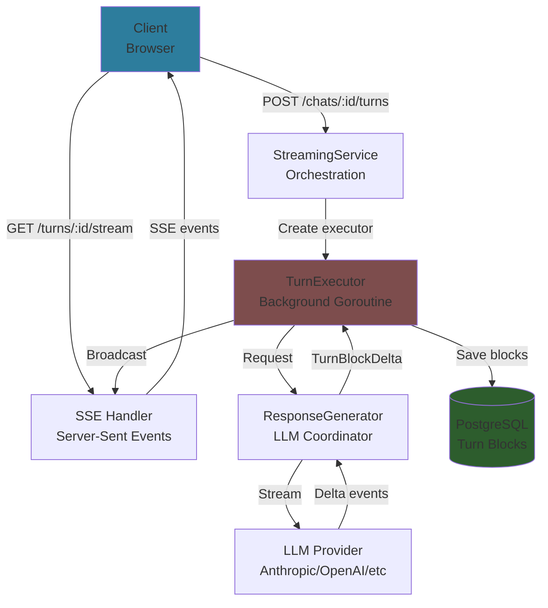

# Streaming System

Real-time LLM response delivery via Server-Sent Events (SSE) with turn block accumulation.

## Quick Links

**First time?** → [Streaming Architecture](../architecture/streaming-architecture.md)
**API integration?** → [API Endpoints](api-endpoints.md)
**Tool calling?** → [Tool Execution](tool-execution.md)
**Troubleshooting?** → [Edge Cases](edge-cases.md)

---

## System Overview



---

## Key Concepts

### TurnBlockDelta vs TurnBlock

**TurnBlockDelta** (Ephemeral)
- Real-time streaming updates
- Sent via SSE to clients
- **Not persisted** to database
- Exists only during active streaming

**TurnBlock** (Persisted)
- Accumulated complete content
- Stored in PostgreSQL
- Permanent conversation history
- Retrieved via REST API

### Accumulation Rule

**Write to database when block type changes:**

```
Streaming:     thinking → thinking → thinking → text → text → tool_use
                     ↓                              ↓           ↓
TurnBlocks:    [Block 0: thinking]         [Block 1: text]  [Block 2: tool_use]
               (all deltas accumulated)     (accumulated)    (complete)
```

---

## Documentation

### Core Concepts

**[Streaming Architecture](../architecture/streaming-architecture.md)** (~600 lines)
- Overview of streaming system
- TurnBlockDelta vs TurnBlock explained
- Data models (SSE event types)
- Normal streaming flow diagrams
- Accumulation & persistence logic
- Client reconnection strategy
- Multi-provider abstraction

**When to read:** Understanding core streaming concepts, architecture overview

---

### Specialized Topics

**[Tool Execution](tool-execution.md)** (~180 lines)
- Complete tool call cycle
- TurnBlock sequence with tools
- Multiple tool calls handling
- Tool result propagation

**When to read:** Implementing tool calling, debugging tool execution

---

**[API Endpoints](api-endpoints.md)** (~200 lines)
- SSE endpoint details
- Event types reference
- Request/response examples
- Integration guide

**When to read:** Frontend integration, API contracts

---

**[Edge Cases](edge-cases.md)** (~200 lines)
- Client disconnects
- Database write failures
- LLM provider errors
- User interrupts
- Orphaned goroutines
- Turn already complete

**When to read:** Error handling, production debugging

---

## Flow Summary

### Creating a Turn (User Sends Message)

1. **Client** → POST `/api/chats/:id/turns` with user message
2. **StreamingService** creates user turn + assistant turn (status="pending")
3. **TurnExecutor** starts in background goroutine
4. **ResponseGenerator** calls LLM provider
5. **Provider** streams delta events
6. **Executor** accumulates deltas, broadcasts via SSE
7. **Executor** writes completed blocks to database
8. **Client** receives real-time updates via SSE

### Streaming Events (SSE)

1. **Client** → GET `/api/turns/:id/stream`
2. **SSE Handler** registers client with TurnExecutor
3. **Executor** sends catchup events (if reconnecting)
4. **Executor** broadcasts live delta events
5. **Executor** sends turn_complete event
6. **Connection** closes gracefully

---

## Implementation Files

**Service Layer:**
- `internal/service/llm/streaming/service.go` - StreamingService (orchestration)
- `internal/service/llm/streaming/executor.go` - TurnExecutor (background goroutine)
- `internal/service/llm/streaming/accumulator.go` - Block accumulation logic
- `internal/service/llm/streaming/registry.go` - Active executor tracking
- `internal/service/llm/streaming/response_generator.go` - LLM coordination

**Handlers:**
- `internal/handler/chat.go:346-350` - StreamTurn endpoint
- `internal/handler/sse_handler.go` - SSE connection handling

**Models:**
- `internal/domain/models/llm/turn_block_delta.go` - Delta events
- `internal/domain/models/llm/turn_block.go` - Persisted blocks

---

## Quick Reference

### SSE Event Types

- `turn_start` - Turn begins
- `block_start` - New block starts
- `block_delta` - Content delta
- `block_stop` - Block complete
- `block_catchup` - Reconnection catchup
- `turn_complete` - Turn finished
- `turn_error` - Error occurred

### Status Lifecycle

```
pending → streaming → complete
        ↓           ↓
    cancelled    error
```

---

## Related Documentation

- [Service Layer Architecture](../architecture/service-layer.md) - 3-service split
- [Chat Domain Model](../chat/overview.md) - Turn and block concepts
- [LLM Providers](../chat/llm-providers.md) - Provider abstraction
- [API Contracts](../api/contracts.md) - HTTP endpoints
