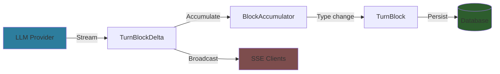

# Block Types & Event Types Reference

Quick reference for all TurnBlock types, TurnBlockDelta types, and SSE event types in the streaming system.

## TurnBlock Types (Persisted)

Block types stored in the database. Each turn consists of one or more blocks.

| Type | Used By | Content (JSONB) | Text Content | Purpose |
|------|---------|-----------------|--------------|---------|
| `text` | User, Assistant | `null` | Required | Regular text content |
| `thinking` | Assistant | `{"signature": "4k_a"}` (optional) | Required | Extended thinking/reasoning |
| `tool_use` | Assistant | Tool metadata (see below) | `null` | Function/tool call |
| `tool_result` | User | Result metadata (see below) | Optional | Tool execution result |
| `image` | User | Image metadata (see below) | Optional | Image content |
| `reference` | User | Reference metadata (see below) | `null` | Full document reference |
| `partial_reference` | User | Partial ref metadata (see below) | `null` | Document selection reference |

---

## Delta Types (Streaming)

Delta types sent during real-time streaming. These accumulate into TurnBlocks.

| Delta Type | Accumulates Into | Fields | Purpose |
|------------|------------------|--------|---------|
| `text_delta` | text block | `text_delta` | Incremental text content |
| `thinking_delta` | thinking block | `text_delta` | Incremental thinking/reasoning |
| `signature_delta` | thinking block | `signature_delta` | Cryptographic signature (Extended Thinking) |
| `tool_call_start` | tool_use block | `tool_call_id`, `tool_call_name` | Tool call metadata |
| `input_json_delta` | tool_use block | `input_json_delta` | Incremental tool input JSON |
| `usage_delta` | Turn metadata | `input_tokens`, `output_tokens`, `thinking_tokens` | Token usage updates |

**Accumulation rule:** Write TurnBlock to database when block type changes or turn completes.

---

## SSE Event Types

Server-Sent Events broadcast during streaming. See [api-endpoints.md](api-endpoints.md) for complete details.

| Event Type | Payload | When Sent |
|------------|---------|-----------|
| `turn_start` | `{turn_id, model}` | Turn streaming begins |
| `block_start` | `{block_index, block_type?}` | New block starts |
| `block_delta` | `{block_index, delta_type, ...}` | Incremental content arrives |
| `block_stop` | `{block_index}` | Block complete |
| `block_catchup` | `{block: TurnBlock}` | Reconnection replay (full block) |
| `turn_complete` | `{turn_id, stop_reason, usage}` | Turn finished successfully |
| `turn_error` | `{turn_id, error}` | Turn encountered error |

---

## Delta → Block Lifecycle



**Flow:**
1. LLM provider streams deltas (e.g., Anthropic `content_block_delta`)
2. Transformed to `TurnBlockDelta` (domain model)
3. Broadcast via SSE to all connected clients (real-time UI updates)
4. `BlockAccumulator` accumulates in memory (text appended, metadata collected)
5. When block type changes → accumulated content becomes `TurnBlock` → persist to database
6. On turn complete → write final block

---

## Content Structure Details

### text Block

```json
{
  "block_type": "text",
  "text_content": "Hello, world!",
  "content": null
}
```

**Fields:**
- `text_content`: The actual text (required)
- `content`: Always `null` for text blocks

---

### thinking Block

```json
{
  "block_type": "thinking",
  "text_content": "Let me think about this problem...",
  "content": {
    "signature": "4k_a"
  }
}
```

**Fields:**
- `text_content`: The thinking/reasoning text (required)
- `content.signature`: Cryptographic signature for Extended Thinking (optional)

**Extended Thinking:** When signature present, indicates LLM used extended thinking mode (more compute, deeper reasoning).

---

### tool_use Block

```json
{
  "block_type": "tool_use",
  "text_content": null,
  "content": {
    "tool_use_id": "toolu_abc123",
    "tool_name": "get_weather",
    "input": {
      "location": "San Francisco",
      "unit": "celsius"
    }
  }
}
```

**Fields:**
- `content.tool_use_id`: Unique identifier for this tool call
- `content.tool_name`: Name of the tool being called
- `content.input`: Tool input parameters (object)
- `text_content`: Always `null`

---

### tool_result Block

```json
{
  "block_type": "tool_result",
  "text_content": "Temperature: 18°C, Conditions: Partly cloudy",
  "content": {
    "tool_use_id": "toolu_abc123",
    "is_error": false
  }
}
```

**Fields:**
- `content.tool_use_id`: Matches the tool_use block this responds to
- `content.is_error`: Whether execution failed (boolean)
- `text_content`: Tool output (optional, can be empty string)

---

### image Block

```json
{
  "block_type": "image",
  "text_content": null,
  "content": {
    "url": "https://example.com/image.jpg",
    "mime_type": "image/jpeg",
    "alt_text": "A beautiful sunset"
  }
}
```

**Fields:**
- `content.url`: Image URL (required)
- `content.mime_type`: MIME type (e.g., `image/jpeg`, `image/png`)
- `content.alt_text`: Alternative text description (optional)
- `text_content`: Always `null`

---

### reference Block

```json
{
  "block_type": "reference",
  "text_content": null,
  "content": {
    "ref_id": "doc_123",
    "ref_type": "document",
    "version_timestamp": 1705123456789,
    "selection_start": null,
    "selection_end": null
  }
}
```

**Fields:**
- `content.ref_id`: Referenced document/folder ID
- `content.ref_type`: Type of reference (`document`, `folder`)
- `content.version_timestamp`: Timestamp of referenced version (for version tracking)
- `content.selection_start`: Always `null` (full document reference)
- `content.selection_end`: Always `null`
- `text_content`: Always `null`

**Purpose:** User includes entire document as context for LLM.

---

### partial_reference Block

```json
{
  "block_type": "partial_reference",
  "text_content": null,
  "content": {
    "ref_id": "doc_123",
    "ref_type": "document",
    "version_timestamp": 1705123456789,
    "selection_start": 150,
    "selection_end": 450
  }
}
```

**Fields:**
- Same as `reference`, but with selection range:
- `content.selection_start`: Character offset start (required)
- `content.selection_end`: Character offset end (required)

**Purpose:** User highlights specific portion of document to reference.

---

## Validation Rules

All block types undergo validation before persistence:

- **Block type:** Must be one of the 7 defined constants
- **Role validation:** User vs Assistant block type restrictions enforced
- **Content structure:** JSONB validated against schemas above
- **Text content:** Required for text/thinking, optional for tool_result, null for others

**Implementation:** `backend/internal/domain/models/llm/content_types.go`

---

## Meridian Extensions

Meridian backend extends the generic `meridian-llm-go` library with custom block types:

| meridian-llm-go | Meridian Backend | Reason |
|-----------------|------------------|--------|
| `document` | `reference` + `partial_reference` | Versioned references, selection support |
| Generic provider types | Extended with Meridian-specific semantics | Context management, version tracking |

**Why separate types:**
- `meridian-llm-go`: Provider-agnostic (Anthropic, OpenAI, Gemini, etc.)
- Meridian backend: Application-specific (versioned document references, partial selections)

**Conversion:** Provider `document` blocks are transformed to `reference`/`partial_reference` blocks in the service layer.

---

## See Also

- [Streaming Architecture](../architecture/streaming-architecture.md) - Complete system overview
- [API Endpoints](api-endpoints.md) - HTTP and SSE endpoint details
- [Tool Execution](tool-execution.md) - Tool call flow and multi-turn handling
- [Content Types Code](../../../../backend/internal/domain/models/llm/content_types.go) - Validation logic
