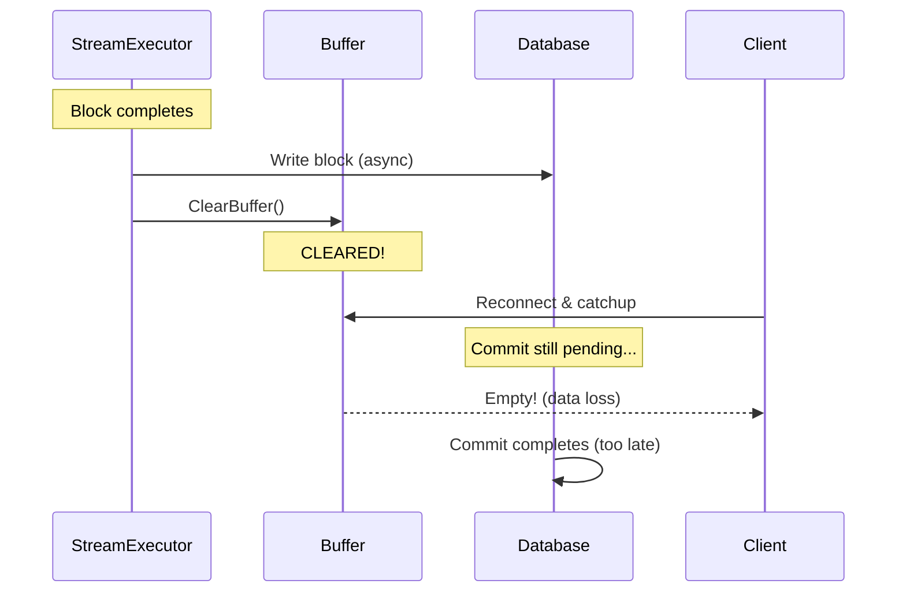
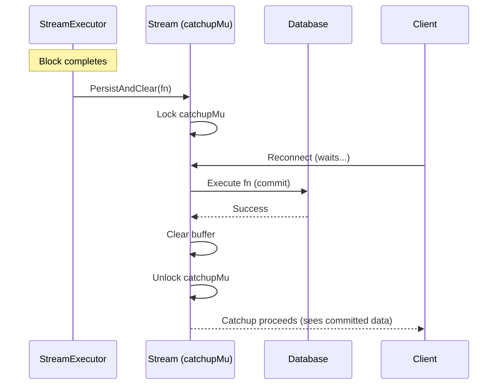

# Race Condition Fixes: Buffer Clearing & Catchup Coordination

---
detail: comprehensive
audience: developer
date: 2025-01-13
status: ✅ Implemented
---

## Overview

Three race conditions were discovered and fixed in the streaming architecture:

1. **Event ID jumps** (event-2 → event-23)
2. **Buffer clear race** (events lost during reconnection)
3. **Event ID calculation mismatches**

**User verification:** "IT WORKS CATCHUP WORKS TOO! THANKS CLAUDE!"

---

## The Core Problem

### Buffer Clear Race Condition

**Timeline (Before Fix):**



**Result:** Client reconnecting during DB write sees neither buffer nor database - **data loss**.

### Timeline (After Fix)



**Result:** Catchup waits for atomic persist-and-clear - **no data loss**.

---

## Library Changes (meridian-stream-go)

### 1. Catchup Coordination Mutex

**Implementation:** See `meridian-stream-go/stream.go:85-110`

**What it does:** Prevents races between catchup queries and buffer operations

**Key insight:** Database query + buffer read are now atomic under single mutex

**Before/After comparison:**

```go
// ❌ BEFORE: Race possible
func (s *Stream) GetCatchupEvents() []Event {
    dbEvents := s.catchupFunc()      // ← DB query
    // Race window here! Buffer could be cleared
    bufferEvents := s.buffer.GetAll() // ← Buffer read
    return append(dbEvents, bufferEvents...)
}

// ✅ AFTER: Atomic operation
func (s *Stream) GetCatchupEvents() []Event {
    s.catchupMu.Lock()
    defer s.catchupMu.Unlock()

    dbEvents := s.catchupFunc()
    bufferEvents := s.buffer.GetAll()
    return append(dbEvents, bufferEvents...)
}
```

### 2. DEBUG Mode for Event IDs

**Configuration:** `DEBUG=true` in `.env`

**Why:** Event IDs useful for debugging, but unnecessary overhead in production

```bash
# Development: Enable event IDs
DEBUG=true   # → "1", "2", "3"...

# Production: Disable event IDs
DEBUG=false  # → No IDs (block sequence provides ordering)
```

**Implementation:** See `meridian-stream-go/stream.go:NewStream()` for event ID generation

### 3. Atomic PersistAndClear

**API:**
```go
// ✅ Use this pattern
stream.PersistAndClear(func(events []mstream.Event) error {
    return db.SaveBlock(events)  // Buffer cleared ONLY if this succeeds
})
```

**Implementation:** See `meridian-stream-go/stream.go:PersistAndClear()`

**Guarantees:**
- Buffer cleared only if persist succeeds
- Catchup waits for persist to complete
- No race between DB write and buffer clear

---

## Backend Changes (meridian/backend)

### 1. Fixed Atomic Buffer Clear

**File:** `internal/service/llm/streaming/mstream_adapter.go:164`

**Before (Race Condition):**
```go
if flushedBlock != nil {
    se.sendEvent(send, SSEEventBlockStop, ...)
    se.stream.ClearBuffer()  // ❌ Bypasses catchup mutex!
}
```

**After (Atomic with Coordination):**
```go
if flushedBlock != nil {
    se.sendEvent(send, SSEEventBlockStop, ...)

    // ✅ Atomic persist-and-clear
    err := se.stream.PersistAndClear(func(events []mstream.Event) error {
        return nil  // Already persisted by accumulator
    })
}
```

### 2. Rewrote Catchup to Send Full Block Content

**File:** `internal/service/llm/streaming/catchup.go`

**Before:** Sent only `block_start` + `block_stop` markers (no content)

**After:** Sends complete block content as single delta

**Why:**
- Bandwidth efficient (one event per block vs hundreds of deltas)
- Faster reconnection (client instantly sees completed content)
- Simpler client logic (same event structure)

**Implementation:** See `internal/service/llm/streaming/catchup.go:buildCatchupFunc()`

### 3. Removed Manual Event ID Generation

**Before:** `calculateStartingSequence()` computed event IDs at executor creation time

**Problem:** Database state could change between calculation and catchup → ID mismatches

**After:** Removed `calculateStartingSequence()`, rely on library's DEBUG mode

**Result:** No more event ID jumps or mismatches

---

## Configuration

### Enable DEBUG Mode

**File:** `backend/.env`
```bash
# Development
DEBUG=true

# Production
DEBUG=false
```

**Implementation:** See `backend/internal/config/config.go` for config loading

**Default behavior:**
- `dev`/`test` environments: DEBUG=true (event IDs enabled)
- `prod` environment: DEBUG=false (event IDs disabled)

---

## Verification

### Test Results

- ✅ Multi-block streaming works
- ✅ Catchup returns full block content
- ✅ No event ID jumps in DEBUG mode
- ✅ No race conditions with concurrent connections
- ✅ Database writes succeed consistently

### User Confirmation

> "IT WORKS CATCHUP WORKS TOO! THANKS CLAUDE!"

---

## Related Documentation

- Architecture overview: [streaming-architecture.md](../architecture/streaming-architecture.md)
- Library documentation: `meridian-stream-go/README.md`
- API endpoints: [api-endpoints.md](./api-endpoints.md)
