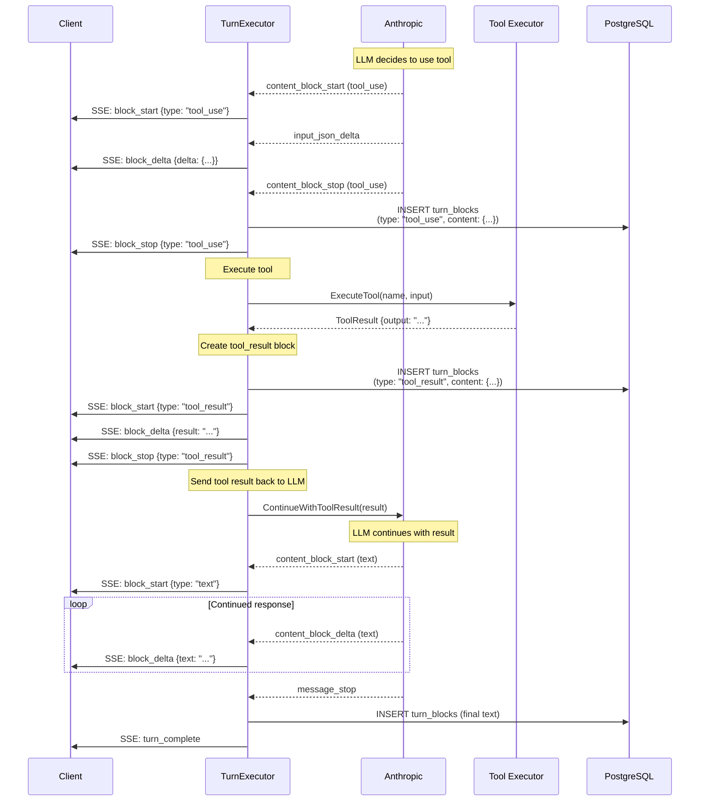

# Tool Execution Flow

How LLM tool calling works in the streaming system.

## Complete Tool Call Cycle



---

## TurnBlock Sequence with Tools

**Example turn with tool execution:**

```sql
-- Turn ID: abc-123
-- Assistant requests tool, tool executes, assistant continues

sequence | block_type  | text_content                    | content (JSONB)
---------|-------------|----------------------------------|----------------------------------
0        | thinking    | "I need to check the file..."   | {"signature": "4k_a"}
1        | text        | "Let me read the file."         | null
2        | tool_use    | null                            | {"tool_use_id": "toolu_1", "tool_name": "read_file", "input": {"path": "..."}}
3        | tool_result | null                            | {"tool_use_id": "toolu_1", "content": "file contents..."}
4        | thinking    | "Now I can see that..."         | {"signature": "4k_a"}
5        | text        | "Based on the file, I found..." | null
```

---

## Multiple Tool Calls

**LLM can request multiple tools in one response:**

```sql
sequence | block_type  | text_content               | content (JSONB)
---------|-------------|----------------------------|----------------------------------
0        | text        | "Let me check both files." | null
1        | tool_use    | null                       | {"tool_name": "read_file", "input": {"path": "a.txt"}}
2        | tool_use    | null                       | {"tool_name": "read_file", "input": {"path": "b.txt"}}
3        | tool_result | null                       | {"tool_use_id": "toolu_1", "content": "a.txt contents"}
4        | tool_result | null                       | {"tool_use_id": "toolu_2", "content": "b.txt contents"}
5        | text        | "Comparing both files..."  | null
```

---

## Tool Execution Phases

### 1. LLM Requests Tool

Provider streams `tool_use` block:
```json
{
  "block_type": "tool_use",
  "content": {
    "tool_use_id": "toolu_abc123",
    "tool_name": "read_file",
    "input": {
      "path": "/path/to/file.txt"
    }
  }
}
```

### 2. Executor Persists Tool Request

Write `tool_use` block to database when `content_block_stop` received.

### 3. Executor Calls Tool

```go
func (e *TurnExecutor) ExecuteTool(toolName string, input map[string]interface{}) (*ToolResult, error) {
    tool := e.toolRegistry.GetTool(toolName)
    if tool == nil {
        return nil, fmt.Errorf("tool %s not found", toolName)
    }

    result, err := tool.Execute(input)
    if err != nil {
        return &ToolResult{
            Error: err.Error(),
        }, nil
    }

    return result, nil
}
```

### 4. Executor Creates tool_result Block

```json
{
  "block_type": "tool_result",
  "content": {
    "tool_use_id": "toolu_abc123",
    "content": "File content here...",
    "is_error": false
  }
}
```

### 5. Executor Continues LLM Stream

Send tool result back to provider, LLM continues with result in context.

---

## Tool Result Propagation

**Flow:**
1. LLM requests tool
2. Executor executes tool synchronously
3. Tool result added to message history
4. LLM receives result and continues response

**Message history after tool execution:**
```json
[
  {"role": "user", "content": "Read file.txt"},
  {"role": "assistant", "content": [
    {"type": "text", "text": "Let me read the file."},
    {"type": "tool_use", "id": "toolu_1", "name": "read_file", "input": {...}}
  ]},
  {"role": "user", "content": [
    {"type": "tool_result", "tool_use_id": "toolu_1", "content": "file contents"}
  ]},
  {"role": "assistant", "content": [
    {"type": "text", "text": "Based on the file..."}
  ]}
]
```

---

## Error Handling

### Tool Execution Fails

```go
// Tool returns error
result := &ToolResult{
    ToolUseID: toolUseID,
    Content:   "",
    IsError:   true,
    Error:     "File not found: /path/to/file.txt",
}

// Still create tool_result block
block := TurnBlock{
    BlockType: "tool_result",
    Content: map[string]interface{}{
        "tool_use_id": result.ToolUseID,
        "is_error":    true,
        "content":     result.Error,
    },
}
```

LLM receives error and can adjust response.

### Tool Timeout

```go
ctx, cancel := context.WithTimeout(context.Background(), 30*time.Second)
defer cancel()

result, err := tool.ExecuteWithContext(ctx, input)
if err != nil {
    if ctx.Err() == context.DeadlineExceeded {
        return &ToolResult{
            IsError: true,
            Error:   "Tool execution timed out after 30s",
        }, nil
    }
    return nil, err
}
```

---

## References

**Implementation:**
- Tool executor: `internal/service/llm/streaming/executor.go` (tool execution logic)
- Tool registry: `internal/service/llm/tools/registry.go` (planned)

**Related:**
- [Streaming Architecture](../architecture/streaming-architecture.md)
- [Turn Blocks](../chat/turn-blocks.md)
- [API Endpoints](api-endpoints.md)
