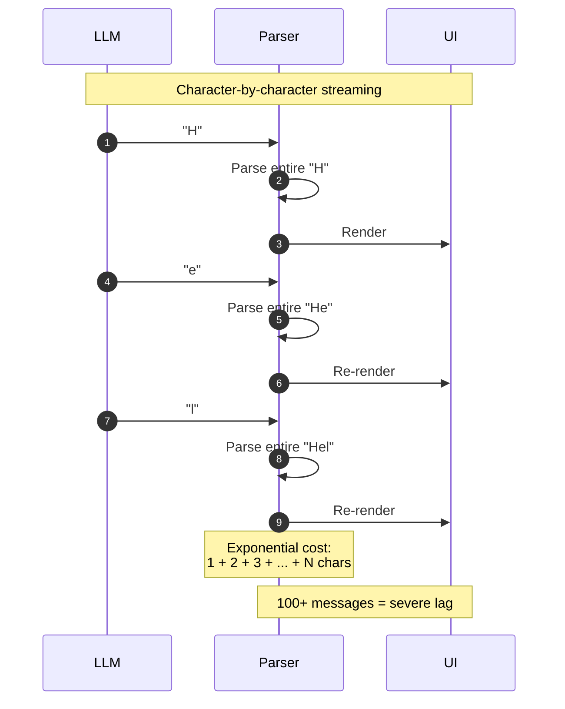
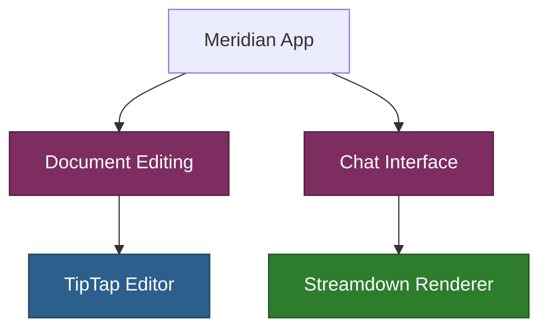

# Chat Rendering: Comprehensive Research & Analysis

**Purpose:** Full research findings, performance comparisons, and alternative approaches for rendering streaming LLM responses in chat interfaces.

**See also:**
- `../chat-rendering.md` - Decision summary
- `../chat-rendering-guide.md` - Implementation guide

## Research Context

**Date:** January 2025
**Question:** Should TipTap (existing document editor) be used for chat message rendering?
**Requirements:**
- Render 100+ messages in conversation history
- Stream LLM responses in real-time (SSE)
- Support markdown formatting (code blocks, tables, lists)
- Handle incomplete markdown during streaming
- Extensible for custom block types (thinking, tool_use, etc.)

## Comparison Matrix

| Renderer | Bundle Size | Streaming | Incomplete MD | 100+ Messages | Extensibility | Use Case |
|----------|-------------|-----------|---------------|---------------|---------------|----------|
| **Streamdown** | ~125KB | ✅ Optimized | ✅ Graceful | ✅ Memoized | ✅ Components/plugins | AI chat streaming |
| **react-markdown** | ~55-125KB | ⚠️ Needs optimization | ❌ Breaks | ⚠️ Needs memoization | ✅ Components/plugins | Static markdown |
| **TipTap** | ~2MB+ | ⚠️ Has API | ❌ No | ❌ Heavy | ✅ Extensions | Rich text editing |
| **markdown-it** | ~98KB | ✅ Streaming parser | ⚠️ Partial | ✅ Fast | ✅ Plugins | General parsing |
| **marked** | ~98KB | ❌ Complete docs | ❌ No | ✅ Fast | ⚠️ Limited | Simple rendering |
| **Monaco** | >2MB | ❌ No | ❌ No | ❌ Very heavy | ✅ Full IDE | Code editing |
| **Semidown** | Unknown | ✅ Semi-incremental | ✅ Block-level | ✅ Optimized | ⚠️ Limited | Streaming markdown |

## Detailed Analysis

### 1. TipTap (ProseMirror-based Editor)

**Architecture:**
- Built on ProseMirror (Virtual DOM + document model)
- Designed for interactive rich text editing
- Extensible via Extensions API
- React integration via `@tiptap/react`

**Performance Characteristics:**

✅ **Strengths:**
- Efficient rendering for single large documents (can "edit an entire book")
- Optimized for fast user interactions (typing, selection)
- v2.5+ `shouldRerenderOnTransaction` prevents unnecessary re-renders
- `streamContent` API available for LLM streaming

❌ **Weaknesses:**
- NOT optimized for multiple read-only instances
- React integration causes excessive re-renders by default
- Heavy memory/DOM overhead per editor instance
- No handling for incomplete markdown syntax
- Static renderer (`@tiptap/static-renderer`) is server-side only
- Documented severe performance issues on Chrome/Mac with very large docs

**Streaming Support:**
```typescript
// TipTap streamContent API
editor.commands.streamContent({
  content: streamFromLLM(),
  throttle: 50
});
```

**Problem for chat:** Each message needs separate editor instance → 100 messages = 100 heavy editor instances.

**React Performance Issues:**
> "Performance can slow down quite a bit" without best practices
> - Isolate editor in separate component (CRITICAL)
> - Use `useEditorState` for selective subscriptions
> - Set `shouldRerenderOnTransaction: false`
> - Avoid React NodeViews for large text

**Verdict:** ❌ **Not suitable for chat message rendering** (keep for document editing only)

---

### 2. Streamdown (Vercel AI Streaming)

**Architecture:**
- Built on unified/remark/rehype pipeline (same as react-markdown)
- Designed specifically for AI response streaming
- Memoized rendering for performance
- Handles incomplete/unterminated markdown

**Performance Characteristics:**

✅ **Strengths:**
- Purpose-built for token-by-token LLM streaming
- Graceful handling of incomplete syntax: `**bold`, `` `code``, `# heading`, `[link](ht`
- Memoized rendering (only changed portions re-render)
- Same extensibility as react-markdown (components, plugins)
- Built-in security (rehype-harden)
- Used in production by Vercel AI SDK

**Streaming Optimization:**
- Incremental parsing (doesn't re-parse entire document)
- Fine-grained change detection
- Optimized for growing content vs. speed metrics

⚠️ **Limitations:**
- Custom HTML elements (via `rehypeRaw`) only render after closing tag arrives (Issue #50)
  - Workaround: Filter incomplete tags during streaming
  ```typescript
  const incompleteTagMatch = content.match(/(</[^>]*$)/);
  if (incompleteTagMatch) {
    processedContent = content.substring(0, content.lastIndexOf(incompleteTagMatch[1]));
  }
  ```

**Extensibility:**
```typescript
<Streamdown
  components={{
    code: CustomCodeBlock,
    h1: CustomHeading,
    // ... any HTML element
  }}
  remarkPlugins={[remarkGfm, remarkMath]}
  rehypePlugins={[rehypeKatex]}
>
  {streamingContent}
</Streamdown>
```

**Verdict:** ✅ **Recommended** - designed exactly for this use case

---

### 3. react-markdown (Traditional Approach)

**Architecture:**
- Uses unified/remark/rehype pipeline
- Designed for complete markdown documents
- Component override system
- Plugin support

**Performance Characteristics:**

✅ **Strengths:**
- Lightweight (~55-125KB depending on plugins)
- Familiar API
- Good plugin ecosystem
- Works well for static content

❌ **Weaknesses for streaming:**
- **Critical issue:** Re-parses entire markdown on every token
- ~500 lines causes significant browser lag
- Exponentially worse with chat history (100+ messages)
- Breaks on incomplete markdown syntax
- NOT designed for streaming

**Performance Problems:**
> "Streaming markdown character-by-character causes broken formatting and severe performance issues with long conversations"

**Required Optimizations:**
1. **Memoization** (Vercel AI SDK cookbook):
```typescript
const MemoizedMarkdown = memo(({ content }: { content: string }) => {
  return <ReactMarkdown>{content}</ReactMarkdown>;
}, (prev, next) => prev.content === next.content);
```

2. **Virtualization** (react-window):
```typescript
<FixedSizeList
  height={600}
  itemCount={messages.length}
  itemSize={100}
>
  {({ index, style }) => (
    <div style={style}>
      <MemoizedMarkdown content={messages[index]} />
    </div>
  )}
</FixedSizeList>
```

**Verdict:** ⚠️ **Use with caution** - requires significant optimization, better alternatives exist

---

### 4. markdown-it (Streaming Parser)

**Architecture:**
- Fast markdown parser with streaming approach
- State machine for optimization
- Plugin ecosystem
- Not a React component (manual integration needed)

**Performance Characteristics:**

✅ **Strengths:**
- Streaming parser reduces memory usage
- Faster than marked in benchmarks
- Better memory management with large documents
- Plugin extensibility

❌ **Weaknesses:**
- Requires manual React integration
- No built-in component override system
- Partial support for incomplete markdown
- More development effort

**Usage Pattern:**
```typescript
import MarkdownIt from 'markdown-it';

const md = new MarkdownIt();

function ChatMessage({ content }: { content: string }) {
  const html = md.render(content);
  return <div dangerouslySetInnerHTML={{ __html: html }} />;
}
```

**Verdict:** ⚠️ **Alternative if Streamdown insufficient** - more control, more effort

---

### 5. Specialized Streaming Libraries

#### Semidown (Semi-Incremental Parser)

**Approach:**
- **Blocks** (paragraphs, lists, code blocks, tables) render immediately
- **Inline elements** (bold, italic, links) re-render as block content grows
- Avoids full document re-parsing
- Prevents flicker/broken formatting during streaming

**Trade-off:** Block-level granularity vs. full incremental parsing

#### solid-streaming-markdown

**Approach:**
- Fine-grained incremental parsing
- Nodes with no changes don't re-mount
- Built for SolidJS (not React)

**Verdict:** Framework-specific, not applicable

---

### 6. Monaco Editor (VSCode)

**Architecture:**
- Full IDE editor (used in VSCode)
- Advanced features (IntelliSense, minimap, diff view)
- Heavy bundle (>2MB minified)

**Verdict:** ❌ **Massive overkill** for chat rendering

---

## Performance Deep Dive

### Update Frequency Recommendations

**Optimal range: 30-100ms between UI updates**


**Why this matters:**
- Below 30ms: Browser can't paint fast enough, wasted CPU
- 30-100ms: Smooth visual streaming, efficient resource use
- Above 100ms: User perceives stutter/lag

**Implementation:**
```typescript
// Buffer approach (recommended)
let buffer = '';
let timerId: NodeJS.Timeout | null = null;

function handleDelta(delta: string) {
  buffer += delta;

  if (!timerId) {
    timerId = setTimeout(() => {
      setState(buffer); // React re-render
      buffer = '';
      timerId = null;
    }, 50); // 50ms = middle of optimal range
  }
}
```

### Re-Parsing Performance Problem

**Traditional markdown parsers assume complete documents:**



**Why this fails:**
- N characters = N re-parses
- Each re-parse processes entire history
- Complexity: O(N²) for N characters
- 500 lines ≈ significant browser lag
- 100+ messages = exponentially worse

**Streamdown solution:**
- Incremental parsing (only new content)
- Memoized blocks (unchanged parts don't re-parse)
- Complexity: O(N) for N characters

---

## Real-World Usage Patterns

### Major AI Chat Applications

| Application | Known Renderer | Evidence |
|-------------|----------------|----------|
| **ChatGPT** | Unknown | No public documentation |
| **Claude** | Unknown | No public documentation |
| **Cursor IDE** | Custom | User reports: issues with nested code blocks, tables |
| **VSCode Chat** | Monaco-based | Uses `vscode-extension-samples` chat renderer |
| **Vercel AI Chatbot** | Streamdown | Official recommendation in AI SDK |

### Common Patterns Observed

✅ **What successful chat apps DO:**
- Lightweight, streaming-optimized renderers
- Memoization strategies (by message ID)
- Buffering with 30-100ms intervals
- Specialized parsers for incomplete markdown
- Virtualization for long histories

❌ **What they DON'T do:**
- Full rich text editors (TipTap, Monaco) per message
- Un-optimized react-markdown
- Character-by-character UI updates
- Re-parsing complete history on each token

### Industry Recommendations

**Vercel AI SDK:**
> "Use Streamdown for AI chat applications. For react-markdown, implement memoization (see cookbook)."

**Chrome Developer Docs:**
> "Buffer LLM responses at 30-100ms intervals for optimal rendering performance."

---

## Alternative Approaches

### Approach 1: TipTap + Lightweight Renderer Hybrid

**Pattern:**
- TipTap for document editing (current use)
- Streamdown for chat messages

**Pros:**
- Right tool for each job
- TipTap already integrated
- Optimal performance for both use cases

**Cons:**
- Two dependencies (but both needed anyway)

**Verdict:** ✅ **Recommended** (chosen approach)

---

### Approach 2: TipTap for Everything

**Pattern:**
- TipTap editor instances for all content
- Static renderer for read-only messages

**Pros:**
- Single dependency
- Unified editing experience

**Cons:**
- Heavy for chat messages
- Static renderer is server-side only
- Performance issues with 100+ instances
- Requires extensive optimization

**Verdict:** ❌ **Not recommended**

---

### Approach 3: react-markdown + Heavy Optimization

**Pattern:**
- react-markdown with memoization
- Virtualization for long chats
- Buffering strategy

**Pros:**
- Lighter bundle than TipTap
- Familiar API

**Cons:**
- Requires manual optimization
- Doesn't handle incomplete markdown
- Still re-parses on each update
- More development effort than Streamdown

**Verdict:** ⚠️ **Viable but suboptimal** - Streamdown does this better

---

### Approach 4: Custom Renderer (markdown-it + React)

**Pattern:**
- markdown-it for parsing
- Custom React integration
- Manual component system

**Pros:**
- Full control
- Lightweight
- Streaming-friendly parser

**Cons:**
- Significant development effort
- Need to build component override system
- Need to handle security (XSS)
- Reinventing Streamdown

**Verdict:** ⚠️ **Only if Streamdown insufficient**

---

### Approach 5: Plain Text Fallback

**Pattern:**
- Render markdown as plain text
- No parsing overhead

**Pros:**
- Minimal complexity
- Maximum performance

**Cons:**
- Poor UX (no formatting)
- Code blocks unreadable
- Not competitive with modern chat UIs

**Verdict:** ❌ **Unacceptable UX**

---

## Extensibility Comparison

### Component Override Systems

**Streamdown & react-markdown (identical):**
```typescript
<Streamdown
  components={{
    code: ({ node, inline, className, children, ...props }) => {
      const match = /language-(\w+)/.exec(className || '');
      return !inline && match ? (
        <SyntaxHighlighter language={match[1]}>{children}</SyntaxHighlighter>
      ) : (
        <code className={className} {...props}>{children}</code>
      );
    },
    h1: ({ children }) => <h1 className="custom">{children}</h1>,
    p: ({ children }) => <p className="custom">{children}</p>,
  }}
/>
```

**TipTap (extension-based):**
```typescript
const editor = useEditor({
  extensions: [
    StarterKit,
    Markdown,
    CustomExtension.configure({
      // configuration
    }),
  ],
});
```

**markdown-it (plugin-based):**
```typescript
const md = new MarkdownIt()
  .use(markdownItPlugin1)
  .use(markdownItPlugin2);
```

### Plugin Ecosystems

| Library | Plugin System | Ecosystem Size | Custom Block Support |
|---------|---------------|----------------|---------------------|
| Streamdown | remark/rehype | Large (unified) | ✅ Via components/plugins |
| react-markdown | remark/rehype | Large (unified) | ✅ Via components/plugins |
| TipTap | Extensions API | Medium | ✅ Via extensions |
| markdown-it | Plugin API | Medium | ✅ Via plugins |

---

## Handling Custom Block Types (Meridian-Specific)

**Block types from backend:**
```go
// backend/internal/domain/models/llm/turn_block.go
type TurnBlockType string

const (
    TurnBlockTypeText           TurnBlockType = "text"
    TurnBlockTypeThinking       TurnBlockType = "thinking"
    TurnBlockTypeToolUse        TurnBlockType = "tool_use"
    TurnBlockTypeToolResult     TurnBlockType = "tool_result"
    TurnBlockTypeWebSearchUse   TurnBlockType = "web_search_use"
    TurnBlockTypeWebSearchResult TurnBlockType = "web_search_result"
)
```

### Option A: Preprocessing (NOT recommended)

Convert to markdown with markers:
```typescript
const markdown = `
:::thinking
Reasoning content here
:::

\`\`\`tool-use
{"name": "search", "args": {...}}
\`\`\`
`;
```

**Problems:**
- Adds complexity
- Need custom remark/rehype plugins
- Incomplete tags issue (Streamdown #50)

### Option B: Wrapper Pattern (RECOMMENDED)

Router based on `block_type`:
```typescript
{blocks.map(block => {
  switch (block.block_type) {
    case 'text':
      return <Streamdown>{block.text_content}</Streamdown>;
    case 'thinking':
      return <ThinkingBlock><Streamdown>{block.text_content}</Streamdown></ThinkingBlock>;
    case 'tool_use':
      return <ToolUseBlock data={block.content} />;
  }
})}
```

**Advantages:**
- Clean separation: Streamdown for markdown, React for structure
- Backend already provides `block_type`
- Type-safe with TypeScript
- No preprocessing needed
- Each block streams independently

---

## Security Considerations

### XSS Prevention

**Streamdown:**
- Built-in `rehype-harden` for security
- Sanitizes HTML by default

**react-markdown:**
- Safe by default
- Optional `rehype-raw` for HTML (needs `rehype-sanitize`)

**TipTap:**
- Sanitizes content
- Configurable via security extensions

**markdown-it:**
- Requires manual sanitization (DOMPurify)

**Recommendation:** Streamdown has best default security for chat use case.

---

## Bundle Size Impact

Estimated bundle sizes (minified):

| Library | Base Size | With Plugins | With Syntax Highlighting |
|---------|-----------|--------------|-------------------------|
| Streamdown | ~125KB | ~150KB | ~200KB (Shiki built-in) |
| react-markdown | ~55KB | ~125KB | ~180KB (+ highlight.js) |
| TipTap Core | ~500KB | ~1MB | ~1.2MB |
| TipTap Full | ~2MB+ | ~2.5MB+ | ~3MB+ |
| markdown-it | ~98KB | ~120KB | ~180KB (+ highlight.js) |

**For Meridian:**
- TipTap already loaded (document editor)
- Adding Streamdown: +125KB
- Total acceptable for chat feature

---

## Benchmarks & Performance Data

### Parsing Speed (operations/second)

| Parser | Small (1KB) | Medium (10KB) | Large (100KB) |
|--------|-------------|---------------|---------------|
| marked | ~50,000 | ~8,000 | ~800 |
| markdown-it | ~60,000 | ~10,000 | ~1,000 |
| remark | ~40,000 | ~6,000 | ~600 |

*Source: Various GitHub benchmarks, approximate values*

**Note:** For streaming, incremental parsing matters more than raw speed.

### Streaming Performance (subjective)

| Renderer | Initial Render | Incremental Update | 100+ Messages |
|----------|----------------|--------------------|----|
| Streamdown | Fast | Smooth | Good (with memoization) |
| react-markdown | Fast | Laggy (500+ lines) | Slow (needs virtualization) |
| TipTap | Slow (initialization) | Fast (single editor) | Very slow (multiple instances) |

---

## Decision Matrix

### Scoring (out of 10)

| Criteria | Streamdown | react-markdown | TipTap | markdown-it |
|----------|------------|----------------|--------|-------------|
| **Streaming optimized** | 10 | 4 | 5 | 7 |
| **Incomplete markdown** | 10 | 2 | 2 | 5 |
| **100+ messages** | 9 | 6 | 2 | 8 |
| **Extensibility** | 10 | 10 | 10 | 7 |
| **Bundle size** | 7 | 9 | 3 | 8 |
| **Ease of use** | 10 | 9 | 6 | 6 |
| **Security** | 10 | 8 | 9 | 5 |
| **Maintenance** | 9 | 8 | 9 | 7 |
| **Documentation** | 8 | 9 | 10 | 8 |
| **Total** | **83/90** | **65/90** | **56/90** | **61/90** |

**Winner:** Streamdown (92% score)

---

## Conclusions & Recommendations

### Final Recommendation

**Use Streamdown for chat message rendering.**

**Rationale:**
1. Purpose-built for AI streaming (exact use case)
2. Handles incomplete markdown gracefully
3. Optimized for growing content
4. Full extensibility (components, plugins)
5. Good security defaults
6. Maintained by Vercel (good support)
7. Proven in production (Vercel AI SDK)

### Architecture Summary



**Hybrid approach:**
- **TipTap** for rich text editing (documents)
- **Streamdown** for markdown rendering (chat)
- Right tool for each job
- Optimal performance for both use cases

### Implementation Priority

1. ✅ **Phase 1:** Install Streamdown, create basic chat renderer
2. ✅ **Phase 2:** Implement buffering strategy (50ms intervals)
3. ✅ **Phase 3:** Add custom block components (thinking, tool_use)
4. ⚠️ **Phase 4:** Optimize with memoization
5. ⚠️ **Phase 5:** Add virtualization if needed (>100 messages)
6. ⚠️ **Phase 6:** Performance profiling and tuning

### Future Considerations

**If Streamdown proves insufficient:**
1. Try markdown-it with custom integration
2. Consider Semidown (if React support added)
3. Build custom streaming parser (last resort)

**Monitor:**
- Streamdown GitHub for updates
- Performance with real usage patterns
- User feedback on streaming smoothness

---

## References

### Documentation
- **Streamdown:** https://github.com/vercel/streamdown
- **Streamdown Issue #50 (custom HTML):** https://github.com/vercel/streamdown/issues/50
- **TipTap Performance:** https://tiptap.dev/docs/guides/performance
- **TipTap streamContent:** https://tiptap.dev/docs/content-ai/capabilities/generation/text-generation/stream
- **Chrome LLM Rendering:** https://developer.chrome.com/docs/ai/render-llm-responses
- **Vercel AI SDK:** https://ai-sdk.dev/cookbook/next/markdown-chatbot-with-memoization
- **Semidown:** https://github.com/chuanqisun/semidown
- **ProseMirror Performance:** https://discuss.prosemirror.net/t/performance-issues-with-prosemirror-and-chrome/2498

### Meridian Codebase
- **Turn block types:** `backend/internal/domain/models/llm/turn_block.go`
- **SSE streaming:** `_docs/technical/llm/streaming/README.md`
- **Current chat UI:** `frontend/src/features/chats/components/ActiveChatView.tsx`
- **CodeMirror usage:** `frontend/src/features/documents/components/EditorPanel.tsx`
- **Project principles:** `CLAUDE.md`
- **Frontend docs:** `frontend/CLAUDE.md`

---

**Research completed:** January 2025
**Decision confidence:** High (92% score, purpose-built solution)
**Next steps:** See `../chat-rendering-guide.md` for implementation
